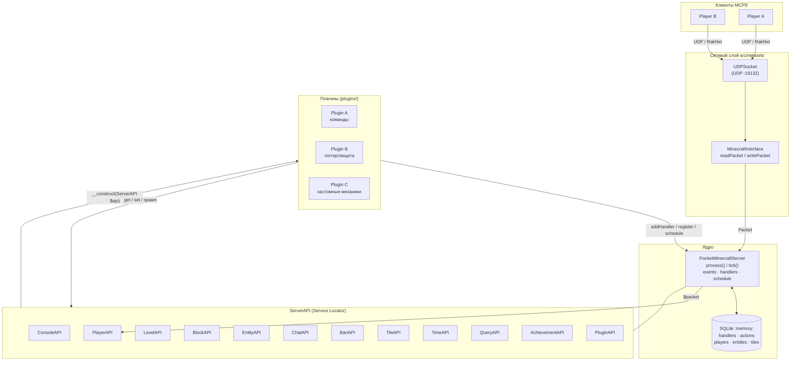
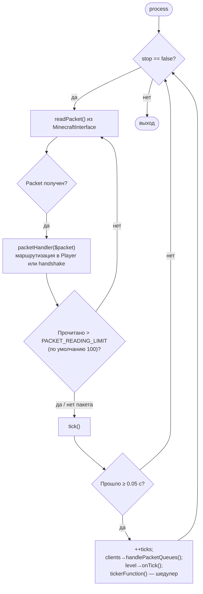
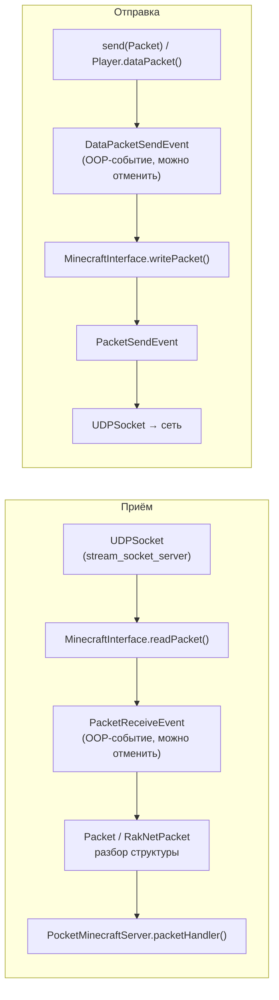
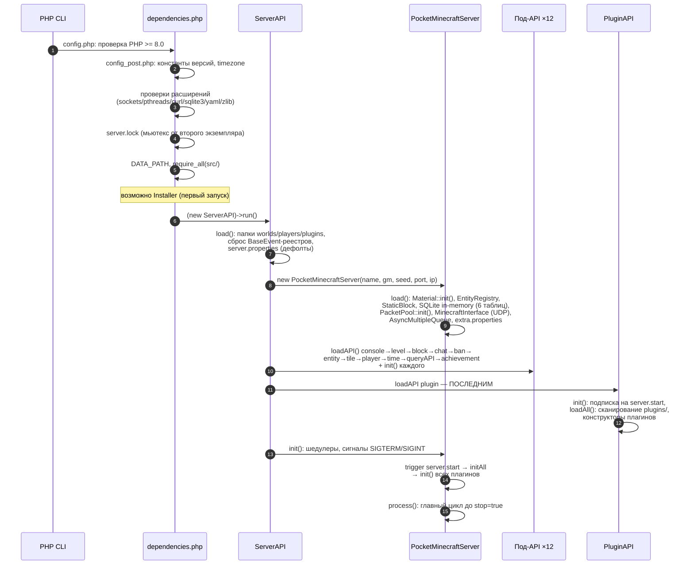
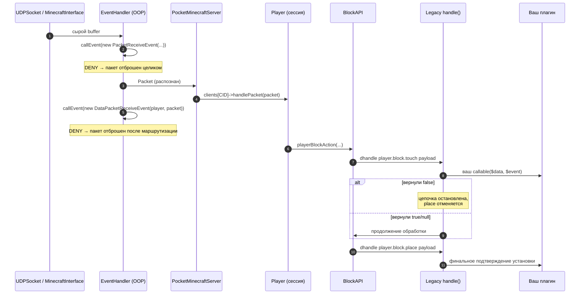
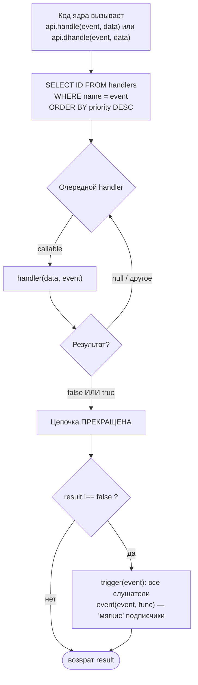
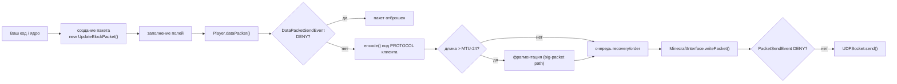
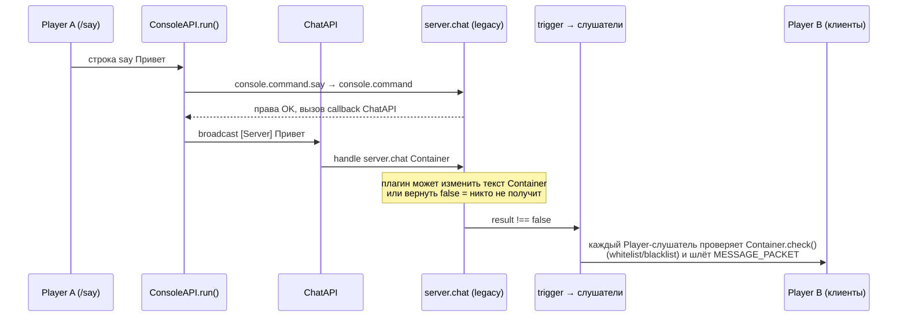
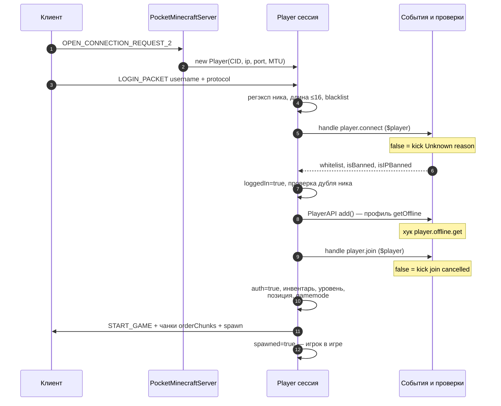

?# WorldPECore Plugin API

# Часть 1 — Введение и Архитектура

> **Ядро:** WorldPECore (codename **WorldPE**)
> **Целевой клиент:** Minecraft: Pocket Edition `v0.8.1 alpha` (протокол 0.3.0–0.8.1 при включённом мультипротоколе)
> **Версия Plugin API:** `12.2`
> **Требуемая среда:** PHP ≥ 8.0, CLI SAPI
> **Лицензия ядра:** LGPL v3

## Содержание части

- [1. Обзор системы](#1-обзор-системы)
  - [1.1. Что такое WorldPECore](#11-что-такое-worldpecore)
  - [1.2. Ключевые характеристики](#12-ключевые-характеристики)
  - [1.3. Роль плагинов в экосистеме](#13-роль-плагинов-в-экосистеме)
  - [1.4. Что ядро умеет «из коробки»](#14-что-ядро-умеет-из-коробки)
- [2. Архитектура ядра](#2-архитектура-ядра)
  - [2.1. Компонентная диаграмма](#21-компонентная-диаграмма)
  - [2.2. ServerAPI — Service Locator](#22-serverapi--service-locator)
  - [2.3. Главный цикл сервера (Tick Loop)](#23-главный-цикл-сервера-tick-loop)
  - [2.4. Сетевой стек: UDP и RakNet](#24-сетевой-стек-udp-и-raknet)
  - [2.5. Хранилище внутреннего состояния (SQLite)](#25-хранилище-внутреннего-состояния-sqlite)
  - [2.6. Многопоточность и асинхронные операции](#26-многопоточность-и-асинхронные-операции)
  - [2.7. Порядок запуска сервера (Boot Sequence)](#27-порядок-запуска-сервера-boot-sequence)
- [3. Поток данных (Data Flow)](#3-поток-данных-data-flow)
  - [3.1. Путь входящего пакета](#31-путь-входящего-пакета)
  - [3.2. Распространение события](#32-распространение-события)
  - [3.3. Исходящие пакеты и чат](#33-путь-исходящего-пакета-и-жизненный-цикл-сообщения-чата)
  - [3.4. Жизненный цикл сессии игрока](#34-жизненный-цикл-сессии-игрока)
  - [3.5. Handshake RakNet](#35-handshake-raknet-что-происходит-до-playerconnect)
  - [3.6. Практикум: установка блока по коду](#36-практикум-проследить-установку-блока-по-коду)
- [4. Терминология и навигация по коду](#4-основные-концепции-и-терминология)
- [5. Карта исходников `src/`](#5-карта-исходников-src)
- [6. Требования, DEBUG и константы](#6-системные-требования-и-глобальные-константы)

---

## 1. Обзор системы

### 1.1. Что такое WorldPECore

**WorldPECore** — это монолитное однопоточное серверное ядро для Minecraft: Pocket Edition, построенное на архитектуре классического PocketMine-MP (эпоха Alpha) и расширенное современными возможностями (поддержка PHP 8.x, Discord-webhook логгер, мультипротокол, система освещения чанков).

Ядро предоставляет полный цикл работы сервера:

| Подсистема | Ответственный код | Назначение |
|---|---|---|
| Сеть | `src/network/` (`UDPSocket`, `MinecraftInterface`, `Packet`, RakNet-классы) | Приём/отправка UDP-датаграмм, разбор RakNet-обёрток |
| Игровые сессии | `src/Player.php` | Один объект `Player` на подключённого клиента (CID) |
| Миры | `src/world/Level.php`, `PMFLevel` | Чанки, блоки, свет, время суток, спавн |
| Сущности | `src/entity/Entity.php` + иерархия | Мобы, предметы, вагонетки, стрелы |
| Материалы | `src/material/Block.php`, `Item.php` | Реестр блоков и предметов (`Material::init()`) |
| Генерация мира | `src/world/generator/` | FLAT / DEFAULT / VANILLA генераторы, популяторы |
| Плагины | `src/API/PluginAPI.php`, `src/plugin/` | Загрузка, инициализация, конфигурация плагинов |
| События | `PocketMinecraftServer::handle()/trigger()` + `src/event/` | Двойная событийная система (см. Часть 4) |

Публичная точка входа для разработчика плагина — объект **`ServerAPI`**, передаваемый в конструктор каждого плагина.

### 1.2. Ключевые характеристики

```text
MAJOR_VERSION            = <версия ядра, см. src/config_post.php>
CODENAME                 = "WorldPE"
CURRENT_MINECRAFT_VERSION= "v0.8.1 alpha"
CURRENT_API_VERSION      = "12.2"
CURRENT_PHP_VERSION      = "8.0"
```

*Определены в `src/config_post.php`. Значение `CURRENT_API_VERSION` используется `PluginAPI` для проверки поля `apiversion` метаданных плагина.*

Особенности архитектуры, о которых важно знать заранее:

1. **Однопоточность игровой логики.** Весь игровой код (плагины, события, миры) выполняется в главном потоке PHP. Единственные побочные потоки — `AsyncMultipleQueue` (cURL) и RCON.
2. **SQLite in-memory как реестр обработчиков.** Таблица `handlers` хранит подписки legacy-событий; выборка делается prepared statement'ом на каждый вызов `handle()` (см. §2.5).
3. **Две сосуществующие событийные системы**: строковые «хуки» старого образца (`player.block.place`) и ООП-события нового образца (`DataPacketReceiveEvent`). Обе доступны плагинам одновременно.
4. **Отсутствие автозагрузки классов.** Ядро грузится через явные `require_once` (`src/dependencies.php` → `require_all()`); плагины загружаются `PluginAPI` вручную.
5. **Мультипротокол.** При `multiprotocol=true` подключаются клиенты 0.3.0–0.8.1 — `$player->getProtocol()` различает их; ручные пакеты должны учитывать минимальную версию.
6. **Несколько миров поддерживаются** (`LevelAPI::loadLevel/generateLevel`) с переходами игроков между ними; дефолтный мир задаётся `level-name`.
7. **Достижения встроены** (`AchievementAPI`, команда `/achievements`) и хранятся в профиле игрока.

#### 1.2.1. Ограничения целевой платформы (MCPE 0.8.x)

Знание рамок клиента избавляет от нереализуемых идей:

| Ограничение | Значение/следствие |
|---|---|
| Инвентарь выживания | 36 слотов (`PLAYER_SURVIVAL_SLOTS`); хотбар настраивается 5–9 (`/hotbar`) |
| Creative-инвентарь | 112 слотов (`PLAYER_CREATIVE_SLOTS`), реестр `BlockAPI::$creative` |
| GUI | нет экранов настроек/инвентарных вкладок — интерфейсы строят на сундуках и табличках |
| Протокол | без off-hand, без оффлайн-режимов авторизации; ник `[a-zA-Z0-9_]{1,16}` |
| Мир | фиксированная высота чанка 128 (Y 0–127), формат PMF |

### 1.3. Роль плагинов в экосистеме

Плагины — единственный санкционированный способ расширения сервера. Они:

- регистрируют консольные команды (`ConsoleAPI::register()`);
- подписываются на игровые события (блоки, игроки, сущности, пакеты);
- создают собственные тайлы (сундуки, печки), сущности и уровни через соответствующие API;
- получают приватную папку конфигурации `plugins/<Name>/`.

Плагины получают доступ ко всем перечисленным подсистемам через единый фасад `ServerAPI` — от регистрации команд до низкоуровневого перехвата сетевых пакетов. Типичные сценарии: защита территорий, экономика, кастомные верстаки и порталы, логгеры действий игроков, мини-игры.

### 1.4. Что ядро умеет «из коробки»

Плагину не нужно переизобретать базовые команды — их уже регистрируют сервисы. Полный проверенный список:

| Сервис | Команды | Примечания |
|---|---|---|
| ConsoleAPI | `help`/`?`, `status` (алиас `tps`), `difficulty <0-3>`, `stop`, `defaultgamemode <mode>` | help/status в whitelist |
| PlayerAPI | `spawnpoint [player] [x y z]`, `hotbar <5-9>`, `spawn`, `ping [player]`, `gamemode <m> [player]`, `tp [from] <to/x y z>`, `kill|suicide [player]`, `list`, `loc [player]` | ping/loc чужого игрока — только OP; tp поддерживает `w:мир` и `~координаты` |
| ChatAPI | `say`, `me`, `tell`/`msg`, `reply`/`r` | tell/reply запоминают пары собеседников (`ChatAPI::$lastTells`) |
| BanAPI | `sudo <player> <cmd…>`, `op/deop`, `kick <p> [reason]`, `ban add/remove/list/reload`, `banip …`, `whitelist on/off/add/remove/list/reload` | sudo исполняет команду от имени игрока |
| LevelAPI | `setwspawn`, `save-all`, `save-on/off`, `seed [world]` | save-all уведомляет игроков о лагах |
| TimeAPI | `time check/set/add/day/night/sunset/sunrise [value] [w:<world>]` | set принимает имя фазы или число |
| EntityAPI | `summon|spawnmob <mob> [amount] [baby]`, `despawn all/mobs/objects/items/fallings/minecarts`, `entcnt` | мобы: chicken/cow/pig/sheep/zombie/creeper/skeleton/spider/pigman или числовой type 10–36 |
| BlockAPI | `give <player> <item[:damage]> [amount]`, `setblock <x y z> [level] <block[:damage]>`, `id` | координаты поддерживают `~`; item задаётся именем-строкой через `BlockAPI::fromString()` |
| AchievementAPI | `/achievements` | список достижений игроку |

Значит, типичный плагин добавляет *новые* команды, а не дублирует эти. Конфликт имён при `register()` молча перезапишет встроенную обработку — избегайте коллизий.

---

## 2. Архитектура ядра


### 2.1. Компонентная диаграмма



**Ключевые связи:**

- Каждый подключившийся клиент получает экземпляр `Player` (`$server->clients[CID]`), который маршрутизирует свои пакеты.
- Все под-API создаются внутри `ServerAPI::load()` и доступны через свойства (`$api->player`, `$api->level`, …).
- Плагин получает ссылку на `ServerAPI` в конструкторе и дальше работает только через неё.

### 2.2. ServerAPI — Service Locator

`src/API/ServerAPI.php` — фасад всего ядра. Он не содержит игровой логики, а только:

1. читает `server.properties` (`getProperty()` / `setProperty()`);
2. создаёт `PocketMinecraftServer`;
3. инстанцирует под-API в фиксированном порядке и вызывает у них `init()`;

```php
// Фрагмент ServerAPI::load() — порядок инициализации важен:
$this->loadAPI("console", "ConsoleAPI");
$this->loadAPI("level",   "LevelAPI");
$this->loadAPI("block",   "BlockAPI");
$this->loadAPI("chat",    "ChatAPI");
$this->loadAPI("ban",     "BanAPI");
$this->loadAPI("entity",  "EntityAPI");
$this->loadAPI("tile",    "TileAPI");
$this->loadAPI("player",  "PlayerAPI");
$this->loadAPI("time",    "TimeAPI");
$this->loadAPI("queryAPI","QueryAPI");
$this->loadAPI("achievement", "AchievementAPI");
// ...у всех вызывается init(), и только затем:
$this->loadAPI("plugin", "PluginAPI"); // ← плагины грузятся последними
$this->plugin->init();
```

Статический метод `ServerAPI::request()` возвращает текущий `PocketMinecraftServer` из любой точки кода — это стандартный способ получить ядро там, где нет доступа к `$api`.

#### 2.2.1. Расширение: собственный сервис через loadAPI()

`ServerAPI::loadAPI(string $name, string $class, string|false $dir = false)` — публичный механизм. Плагин может зарегистрировать свой «сервис» так же, как ядро:

```php
// src/API/ — стандартная папка поиска; можно указать свою:
$this->api->loadAPI("economy", "MyEconomy", $this->api->plugin->configPath($this));

// после этого во всех плагинах доступно:
$money = ServerAPI::request()->economy->get($player->iusername);
```

Семантика: если свойство уже занято — `false`; класс не найден в памяти — подключается `<dir>/<class>.php`; успешный объект добавляется в `apiList` и получит `init()` при следующем цикле инициализации. Так устроены «подключаемые» API ядра — и так же к нему подключаются библиотеки-плагины (EconomyAPI и т.п.).
> ⚠️ **Замечание по порядку.** `PluginAPI` создаётся *после* всех остальных API, поэтому в конструкторе плагина гарантированно доступны все сервисы. Однако `init()` других плагинов ещё не выполнен — взаимозависимости плагинов оформляются через интерфейс `OtherPluginRequirement` (Часть 2, §2.7).

### 2.3. Главный цикл сервера (Tick Loop)

Игровой цикл реализован в `PocketMinecraftServer::process()` (`src/PocketMinecraftServer.php`). Целевая частота тика — **20 TPS** (один тик = 50 мс, контроль по `$this->lastTick <= $time - 0.05`).

Поддерживаются три режима (`ticking-mode` в `server.properties`):

| Режим | Константа | Поведение |
|---|---|---|
| `legacy` *(по умолчанию)* | `TICK_LEGACY = 0` | `usleep()` между опросами сокета; низкая загрузка CPU, нестабильный TPS на Windows (~16) |
| `nodelay` | `TICK_F20TPS = 1` | Без пауз; максимум TPS за счёт 100% CPU |
| `netwait` | `TICK_NETWAIT = 2` | Неиспользованное время тика тратится на ожидание пакетов |



Что происходит внутри одного тика:

1. **Обработка очередей пакетов клиентов** — `$client->handlePacketQueues()`.
2. **Тик миров** — `Level::onTick($server, $time)` для каждой загруженной карты: рост, освещение, время суток, спавн мобов.
3. **Шедулер** — `tickerFunction()` выбирает из таблицы SQLite `actions` записи, у которых `last <= now - interval`, вызывает их колбэки и удаляет неповторяющиеся. Именно здесь исполняются задачи, поставленные через `schedule()`.

TPS измеряется по кольцевому буферу последних 40 тиков (`PocketMinecraftServer::getTPS()`); при TPS < 12 в консоль пишется предупреждение *"Can't keep up!"*.

#### 2.3.1. Анатомия одного тика

Последовательность внутри `tick()` (после проверки «прошло ≥ 0.05 c»):

1. `++$ticks` — глобальный счётчик; запись времени в `tickMeasure[]` (кольцо на 40 значений).
2. Раз в **1200** тиков — уборка `customTimes/customTimes` (антифлуд пингов в MOTD).
3. Для каждой сессии: `$client->handlePacketQueues()` — разбор накопленных игровых пакетов (`Player::handleDataPacket`), отправка очередей движений/данных.
4. Для каждого загруженного мира: `Level::onTick($server, $time)` — внутри: время суток (`checkTime` → рассылка `SET_TIME`), игровая логика (`checkThings`: огонь, падающий гравий и пр.), спавн/деспавн мобов (`MobSpawner::handle`, лимит `mobs-amount`), обновления света при `enable-light-updates`.
5. `tickerFunction($time)` — шедулер: SELECT из таблицы `actions`, вызов колбэков, снятие неповторяющихся.

Отдельно от этого потока живёт `BlockAPI::blockUpdateTick()` (шедулер каждые 2 тика у ядра — фактически каждый тик): исполняет таблицу `blockUpdates`.

> 💡 Отсюда видно, где «дешёвое» место для плагинных задач: чем реже событие, тем безопаснее тяжёлая логика. Самое дорогое — `handlePacketQueues` (каждый пакет каждого игрока).

> 💡 **Следствие для плагинов:** любой тяжёлый код в хендлере события или шедулере напрямую замедляет все 20 TPS сервера. Выносите долгие операции в асинхронные механизмы (§2.6).

### 2.4. Сетевой стек: UDP и RakNet



- До установления сессии ядро само обрабатывает RakNet-handshake (`UNCONNECTED_PING`, `OPEN_CONNECTION_REQUEST_1/2`) — см. `packetHandler()`.
- Для неаутентифицированных пакетов вызывается хук `server.noauthpacket.<pid>` — плагин может вернуть `false` и заблокировать дальнейшую обработку.
- После создания сессии (`new Player(...)`) все датаграммы клиента направляются в `Player::handlePacket()`.

### 2.5. Хранилище внутреннего состояния (SQLite)

`PocketMinecraftServer::startDatabase()` открывает **in-memory базу SQLite3**, которая служит быстрым индексом для внутренних подсистем:

| Таблица | Назначение |
|---|---|
| `players` | Соответствие CID ↔ EID ↔ имя ↔ ip:port |
| `entities` | Позиция/здоровье сущностей (кэш для быстрых запросов) |
| `tiles` | Координаты тайлов (сундуков, печек, табличек) |
| `actions` | Задачи шедулера: `interval`, `last`, `repeat` |
| `handlers` | Подписчики legacy-событий: имя события + приоритет |
| `blockUpdates` | Отложенные обновления блоков — исполняет `BlockAPI::blockUpdateTick()` |

Prepared statements (`$this->preparedSQL`) используются в горячих путях: выборка обработчиков в `handle()`, выборка задач в `tickerFunction()`, позиционирование сущностей.

| Prepared statement | SQL-суть | Вызывается из |
|---|---|---|
| `selectHandlers` | `SELECT DISTINCT ID FROM handlers WHERE name=:name ORDER BY priority DESC` | `handle()` — каждое событие |
| `selectActions` | `SELECT ID,code,repeat FROM actions WHERE last<=(:time-interval)` | `tickerFunction()` — каждый тик |
| `updateAction` | `UPDATE actions SET last=:time WHERE ID=:id` | там же |
| `entity->setPosition` | UPDATE координат сущности | движение |
| `entity->setLevel` | UPDATE уровня сущности | переходы миров |
| `player->deleteCID/getEq/getLike` | удаление/поиск игроков | вход/выход, `PlayerAPI::get()` |

Чтение конфига ядра из плагина:

```php
$extra = ServerAPI::request()->extraprops;          // extra.properties
if($extra->get("enable-explosions")){ /* ... */ }

$props = $this->api->getProperty("spawn-protection"); // server.properties
```

> 📌 **Практический вывод:** подписка через `addHandler()` переживает вызовы `handle()`, потому что реестр живёт в БД, а callable'ы — в массиве `$this->handlers`. Снять обработчик события по одному **нельзя** — публичного API для этого нет; доступна только отписка «мягких» слушателей через `deleteEvent($id)`. Планируйте подписки как постоянные на всё время жизни плагина.

### 2.6. Многопоточность и асинхронные операции

#### 2.6.0. Внутренние шедулеры ядра

Ядро само живёт на том же `schedule()`, что и плагины — полезно знать их интервалы (не конфликтуйте по имени колбэков в логах):

| Интервал | Колбэк | Назначение |
|---|---|---|
| 1 тик | `BlockAPI::blockUpdateTick` | исполнение запланированных обновлений блоков |
| 2 тика | `ConsoleAPI::handle` | вычитка строк из консольного потока |
| 20 тиков | `asyncOperationChecker` | разбор ответов cURL-воркера, вызов ваших колбэков |
| 30 тиков | `titleTick` | сброс счётчиков трафика (только с ANSI-консолью) |
| 300 тиков | `checkTicks` | предупреждение «Can't keep up!» при TPS < 12 |
| 1200 тиков | `checkMemory` | точка памяти для графика утечек |

Инициализация сервисов тоже несёт побочные эффекты — таблица «кто что регистрирует»:

| Сервис | Побочный эффект `init()` |
|---|---|
| ConsoleAPI | команды help/status/difficulty/stop/defaultgamemode + алиас tps + whitelist |
| LevelAPI | регистрация своих команд; миры грузятся отдельно (`loadLevel`) |
| BlockAPI | шедулер обновлений блоков + команды give/setblock/id |
| ChatAPI | say/me/tell/reply (+алиасы msg/r) |
| BanAPI | **4 хендлера приоритета 1**: console.command, player.block.break/place, player.flying |
| EntityAPI | summon/despawn/entcnt |
| TileAPI | — (реестр пассивный) |
| PlayerAPI | хендлер `player.death` приоритета 1 + свои команды |
| TimeAPI | команда time |
| QueryAPI/QueryHandler | query-сокет при `enable-query` |
| AchievementAPI | команда achievements |
| PluginAPI | подписка `event("server.start", initAll)` + загрузка плагинов |

| Механизм | Код | Когда использовать |
|---|---|---|
| `AsyncMultipleQueue` | `src/utils/AsyncMultipleQueue.php` | Воркер-поток, выполняющий cURL GET/POST вне главного потока |
| `asyncOperation(ASYNC_CURL_GET/POST, $data, callable)` | `PocketMinecraftServer` | Постановка HTTP-запроса; результат придёт в колбэк на следующем тике + событие `async.curl.get` |
| `Async` (pthreads) | `ServerAPI::async(callable, params)` | Одноразовый поток с произвольным кодом |
| RCON-потоки | `src/network/RCON.php` | Только если включён `enable-rcon` |

Если PHP собран без pthreads или задан флаг сборки `NO_THREADS`, асинхронные механизмы деградируют так:

| Механизм | Поведение без потоков |
|---|---|
| `asyncOperation()` | возвращает `false`, колбэк не вызывается |
| `$api->async()` | создаёт `DummyAsync` — заглушку |
| Консольный ввод | синхронный путь (`ConsoleLoop` не создаётся) |
| RCON | не запускается |

Плагину достаточно проверять возврат `false` — сервер продолжает работу в один поток.

#### 2.6.1. Проводной формат очереди AsyncMultipleQueue

Главный поток и воркер обмениваются бинарными строками (`$input` / `$output`). Формат записи:

```text
Запрос (main → worker):
[Int32 ID][Int16 type] + payload типа

ASYNC_CURL_GET payload:
[Int16 lenUrl][url][Int16 timeout=10][Int16 lenHeaders][headers-json]

ASYNC_CURL_POST payload:
[Int16 lenUrl][url][Int16 timeout]
[Int16 count]{ [Int16 lenKey][key][Int32 lenValue][value] }×count

Ответ (worker → main):
[Int32 ID][Int16 type][Int32 lenBody][body]
```

Чтение/запись — `Utils::readShort/readInt/writeInt/writeShort`. Колбэк вызывается главным потоком при разборе ответа; параллельно летит событие `async.curl.get`. Знание формата позволяет читать/писать очередь вручную, но новые *типы операций* добавить без правки ядра нельзя: их разбор зашит `switch`-ем в двух местах (`asyncOperation()` и воркер) и публичной точки расширения у воркера нет.


### 2.7. Порядок запуска сервера (Boot Sequence)

Понимание последовательности запуска объясняет, *почему* в конструкторе плагина доступно меньше, чем в `init()`.



Ключевые шаги в терминах кода:

| Шаг | Метод | Что важно для плагиниста |
|---|---|---|
| 0 | `config_post.php` | автоопределение timezone (на Windows — через реестр), `gc_enable()`, `FILE_PATH` |
| 1 | `src/config.php` | PHP < 8.0 — немедленный выход |
| 2 | `src/dependencies.php` | Отсутствующее расширение или чужой `server.lock` — выход; здесь же определяется `DATA_PATH` |
| 3 | `ServerAPI::load()` | Дефолты `server.properties` применяются **до** создания ядра; `get_declared_classes()` сбрасывает все OOP-события |
| 4 | `PocketMinecraftServer::__construct/load()` | Реестры материалов и сущностей готовы к моменту загрузки плагинов |
| 5 | `loadAPI(...)` × 11 | Каждый сервис успевает зарегистрировать свои команды (`help`, `time`, `ban`…) |
| 5b | `Installer` (первый запуск) | интерактивный мастер, если `server.properties` не существует и нет `--no-wizard` |
| 6 | `PluginAPI` | Ваши конструкторы выполняются здесь |
| 7 | `PocketMinecraftServer::init()` | Внутренние шедулеры (`titleTick`, `checkTicks`, `checkMemory`, `asyncOperationChecker`), обработчики сигналов, `SOURCE_SHA1SUM` уже вычислен в dependencies |
| 8 | `trigger("server.start", microtime(true))` | Ваши `init()` |
| 9 | `process()` | Бесконечный цикл; выход по `$stop` |

---

## 3. Поток данных (Data Flow)

### 3.1. Путь входящего пакета

Последовательность ниже показывает путь игрового пакета от сетевой карты до плагина (на примере установки блока):




Два уровня перехвата дают разные степени контроля:

- **OOP-пакетные события** (`PacketReceiveEvent`, `DataPacketReceiveEvent`) работают на уровне *сырых датаграмм* — можно отменить или изменить любой пакет.
- **Legacy-хуки** (`player.block.*`) работают на уровне *игровых действий* — приходят уже разобранные данные: игрок, блок, предмет.

Различайте два класса датаграмм в сетевом слое: `Packet` — обёртка сырого UDP (буфер + ip/port), а `RakNetDataPacket` — уже распознанный игровой пакет с типизированными полями и `encode()/decode()`. События `Packet*` получают первое, `DataPacket*` — второе.

### 3.2. Распространение события

Legacy-механизм состоит из трёх ступеней, и понимание их порядка критично:



**Правила, которые нужно запомнить:**

1. **Хендлеры** (`addHandler`) могут *запрещать*: возврат `false` останавливает всю цепочку и отменяет действие. Возврат `true` подтверждает и тоже прекращает обход (дальнейшие хендлеры не вызываются).
2. **Слушатели** (`event()`) вызываются *после* хендлеров через `trigger()` и ничего не решают — они лишь уведомляются (например, `Player` слушает `entity.motion` для рассылки движений).
3. Приоритет задаётся числом; сортировка `ORDER BY priority DESC` — **больший приоритет выполняется раньше**. Внутри ядра критичные проверки (BanAPI) используют приоритет `1`, а типичные плагины — `15`.

Мини-трассировка для закрепления — два плагина на `player.join`:

```text
PluginLogger (addHandler, prio 15)  → пишет в БД «вошёл X»   return null
WelcomeMsg   (addHandler, prio 5)   → sendChat приветствия    return null
→ цепочка дошла до конца (все null) → trigger("player.join")
→ слушатель event("player.join") ядра... (если бы был)

Если WelcomeMsg вернёт false:
→ цепочка прервана, trigger НЕ выполнен,
  НО логгер(15) уже успел отработать раньше по приоритету.
```

OOP-события устроены иначе: приоритеты берутся из `EventPriority` (константы `LOWEST=5 … MONITOR=0`, выполняются в порядке убывания числа), а отмена производится через `setCancelled()` у объекта события. Полное описание — в Части 4.

### 3.3. Путь исходящего пакета и жизненный цикл сообщения чата

Исходящий путь зеркальный, но с важной деталью: **каждая** отправка игрового пакета проходит через отменяемое OOP-событие.



Полный цикл одного сообщения чата — пример сквозного прохождения обеих событийных систем:



Отсюда практическое правило: **фильтрация чата делается в `server.chat`** (одна точка для всех источников: `/say`, `/me`, `broadcast()`), а не в перехвате `MESSAGE_PACKET`.

### 3.4. Жизненный цикл сессии игрока

Самый насыщенный событиями сценарий — вход игрока. Знание точной последовательности объясняет, какие данные уже доступны в каждом хендлере:



Доступность данных по хендлерам:

| Точка | `$entity` | `$auth` | Профиль `$data` | Можно кикать |
|---|---|---|---|---|
| `player.connect` | false | false | нет | да (`false`) |
| `player.join` | false→создаётся далее | false | **да** | да (`false`) |
| после спавна | Entity | true | да | через `close()` |
| `player.quit` | ещё жив | true | да (сохранится после) | — |

Выход зеркален: `close(reason)` → `player.quit` → `save()` профиля → DisconnectPacket → освобождение чанков → `PlayerAPI::remove()` (сохранение offline, удаление аватара, SQL) → broadcast «left the game».

Пошагово на выходе:

1. `$p->close($reason)` — защита от двойного вызова через `$connected`.
2. Отписка всех event-ID сессии (`$this->evid`).
3. Если игрок был авторизован: хук **`player.quit`** → `save()`.
4. Клиенту — сообщение о кике и `DisconnectPacket`; буферы обнуляются.
5. `level->freeAllChunks()`, `loggedIn=false`, очистка очередей/окон/инвентаря.
6. `PlayerAPI::remove(CID)`: `close()`-повтор защищён, offline-сохранение, SQL DELETE, `entity->remove()` аватара, чистка `$level->players`.
7. Broadcast «_X_ left the game!» (если был spawned).


### 3.5. Handshake RakNet: что происходит до `player.connect`

| Пакет | Направление | Логика ядра (`packetHandler()`) |
|---|---|---|
| `UNCONNECTED_PING(_OPEN_CONNECTIONS)` | клиент → сервер | Ответ `UNCONNECTED_PONG`: serverID + MOTD-строка `MCCPP;Demo;<name> [online/max] <бегущая строка description>`; при `$server->invisible=true` — урезанный ответ |
| `OPEN_CONNECTION_REQUEST_1` | клиент → сервер | Неверная структура → `INCOMPATIBLE_PROTOCOL_VERSION`; верная → `OPEN_CONNECTION_REPLY_1` с MTU из длины запроса |
| `OPEN_CONNECTION_REQUEST_2` | клиент → сервер | Лимиты: `maxClients+32`, ≤8 клиентов с одного IP; MTU клампится в [512..2048]; создаётся сессия `new Player(...)` |

```php
// Точные клампы из packetHandler():
if($packet->mtuSize > 2048)  $packet->mtuSize = 2048;
if($packet->mtuSize <= 512)  $packet->mtuSize = 512;
// лимит сессий с одного адреса:
foreach($this->clients as $session){ if($session->ip === $packet->ip && ++$sameIP >= 8) break; }
```

До создания сессии каждый пакет проходит хук `server.noauthpacket.<pid>` — возврат `false` из хендлера прерывает штатную обработку (точка расширения для собственных протокольных обработчиков).

### 3.6. Практикум: проследить установку блока по коду

Маршрут чтения ядра для одного действия — лучший способ выучить архитектуру:

| Шаг | Файл::метод | Что происходит |
|---|---|---|
| 1 | `Player::handleDataPacket` | пришёл `PLACE_BLOCK_PACKET` → базовые проверки сессии |
| 2 | там же | вызов `BlockAPI::playerBlockAction(...)` |
| 3 | `BlockAPI::playerBlockAction` | `dhandle("player.block.touch", [type=place,…])` |
| 4 | `PocketMinecraftServer::handle` | SQL-выборка хендлеров, обход по приоритетам |
| 5 | ваши плагины | `guard()/logger()` и т.п.; возможный `false` |
| 6 | `BlockAPI` | `player.block.place.invalid` → `.bypass` → `.spawn` (BanAPI prio 1) |
| 7 | целевой блок | `$block->place(...)` / `onActivate(...)` |
| 8 | `Level::setBlock` | запись в чанк, обновление света (`updateLight*`) |
| 9 | `Level` | `updateNeighborsAt` → физика соседей |
| 10 | рассылка | `addBlockToSendQueue` → `UPDATE_BLOCK_PACKET` всем в радиусе |

Прочитайте эти 10 точек подряд один раз — и любая задача про блоки станет предсказуемой. Аналогичные маршруты: подбор предмета (Entity::environmentUpdate → player.pickup → TAKE_ITEM_ENTITY_PACKET), вход игрока (§3.5).

---

## 4. Основные концепции и терминология


| Термин | Определение | Где в коде |
|---|---|---|
| **Tick** | Минимальный шаг симуляции, 50 мс (20 TPS). Время в шедулере задаётся в *тиках*: `schedule(20, ...)` = раз в секунду | `PocketMinecraftServer::tick()` |
| **CID (Client ID)** | Идентификатор сессии игрока: `crc32(ip.port) ^ crc32(port.ip.BOOTUP_RANDOM)` | `PocketMinecraftServer::clientID()` |
| **EID (Entity ID)** | Числовой идентификатор сущности, выдаётся счётчиком `eidCnt` | `EntityAPI::getNextEID()` |
| **Handler** | Подписчик legacy-события с правом вето. Регистрируется `ServerAPI::addHandler(name, callable, priority)` | `handlers` (SQLite) |
| **Listener (event)** | «Мягкий» подписчик через `ServerAPI::event()`; получает уведомление, но не может отменить | `$server->events[]` |
| **BaseEvent** | Класс ООП-события со статическим реестром обработчиков; отмена через `CancellableEvent` | `src/BaseEvent.php` |
| **Priority** | Целое число порядка вызова. Legacy: больше = раньше (1…15+). OOP: константы `EventPriority` (5=LOWEST … 0=MONITOR, больше = раньше) | `src/event/EventPriority.php` |
| **Plugin Identifier** | Ключ плагина: `sha1(name) XOR sha1(author) XOR nonce(сессии)` — стабилен в пределах одного запуска сервера | `PluginAPI::getIdentifier()` |
| **Tile** | Блок-контейнер с состоянием (сундук, печь, табличка). Наследники `Tile`, реестр — `TileAPI` | `src/world/Tile.php` |
| **Level** | Экземпляр мира. Хранится в `$api->level->levels[name]`; дефолтный — `$api->level->getDefault()` | `src/world/Level.php` |
| **DATA_PATH** | Корневая папка данных сервера (миры, игроки, `plugins/`). По умолчанию совпадает с папкой ядра; переопределяется аргументом `--data-path` | `src/dependencies.php` |
| **Payload** | Ассоциативный массив или объект, передаваемый обработчику первым аргументом. Состав описан для каждого события в Части 4 | — |
| **PHAR / PMF** | Форматы упаковки плагинов. PHAR требует `plugin.cfg` с секциями `classLoader`, `CLClass`, `mainFile` | `src/plugin/phar/PharUtils.php` |
| **Container** | Обёртка сообщения чата: payload + whitelist/blacklist адресатов; объект передаётся по цепочке `server.chat` | `src/utils/Container.php` |
| **windowid** | Локальный для игрока номер открытого окна контейнера (`$player->windows[id]`); 0x78 зарезервирован под окно брони | `src/Player.php` |
| **StaticBlock** | Статический реестр свойств блоков (твёрдость, прозрачность, bbox) без создания объектов | `src/material/` |
| **Material** | Класс-реестр материалов блоков (вода, лава, лёд…), инициализируется до плагинов | `Material::init()` |
| **PMF** | Бинарный формат карт и плагинов эпохи PocketMine Alpha (заголовок + gzip-секции) | `src/pmf/` |
| **Query / RCON** | Побочные протоколы администрирования: GameSpy4-статистика и удалённая консоль | `network/query/`, `network/RCON.php` |
| **AsyncMultipleQueue** | Воркер-поток cURL; бинарный протокол обмена с главным потоком через `$input/$output` строки | `src/utils/AsyncMultipleQueue.php` |
| **Creative registry** | Массив `BlockAPI::$creative` — эталонный creative-инвентарь, выдаётся игрокам в режиме 1 | `BlockAPI.php` |
| **PacketPool** | Реестр классов пакетов по pid; инициализируется до плагинов (`PacketPool::init()`) | `network/Packet.php` |
| **QueryHandler** | Обработчик GameSpy4-запросов; создаётся при `enable-query=true` | `network/query/` |
| **ARQ / recovery queue** | Очереди надёжной доставки RakNet на сессии; их длины видны в `/ping` для OP | `src/Player.php` |
| **EID-счётчик** | Единая последовательность `$api->entity->getNextEID()` — не переиспользуйте свои ID | `EntityAPI` |

### 4.1. Навигация: «где в ядре происходит X»

| Хочу понять/изменить | Идти в |
|---|---|
| Правила установки/ломания блока, дроп предметов | `BlockAPI::playerBlockAction/playerBlockBreak` |
| Скорость ломания и античит | `PocketMinecraftServer::$BLOCK_BREAKING_PROGRESS`, `Player::handleDataPacket` (PLAYER_ACTION) |
| Что видит игрок при входе (пакеты входа) | `Player::handleDataPacket` ветка LOGIN → `processLogin`; выдача инвентаря там же |
| Движение и античит позиции | `Entity::updateMovement()` — хук `entity.move` |
| Рассылка движений другим игрокам | `Player::$entityMovementQueue` + `sendEntityMovementUpdateQueue()` |
| Открытие инвентарей/сундуков | `Tile::openInventory()`, окна `$player->windows` |
| Рецепты верстака | `recipes/CraftingRecipes.php` (статическая таблица) |
| Спавн мобов и деспавн | `world/MobSpawner.php`, флаги `despawn-mobs` |
| Свет и его обновления | `Level::updateLight*()`, флаг `enable-light-updates` |
| Поиск пути мобов | `astarnavigator/TileNavigator.php` (A*) |
| Генерация мира | `world/generator/*` (FLAT/DEFAULT/VANILLA) |
| Достижения игроков | профили `players/*.yml` ключ `achievements` + `AchievementAPI` |
| Discord-интеграция | `PocketMinecraftServer::send2Discord()` |
| Где хранятся рецепты | `recipes/CraftingRecipes.php` (статический массив) |
| Автотесты ядра | `src/tests/ServerSuiteTest.php` (мини-харнесс `testCase`) |
| Поиск пути мобов | `astarnavigator/TileNavigator.php` |

---

## 5. Карта исходников `src/`

Знание этой карты избавляет от блужданий по коду:

```text
src/
├── config.php / config_post.php   # Проверка PHP >= 8.0, константы версий, timezone, SOURCE_SHA1SUM
├── dependencies.php               # Проверка расширений, server.lock, require_all() всей кодовой базы
├── functions.php                  # Глобальные функции: console(), arg(), nullsafe(), logg()...
├── PocketMinecraftServer.php      # ЯДРО: цикл, события legacy, шедулер, Discord, error dump
├── Player.php                     # Сессия игрока: пакеты, окна инвентаря, движение, чанк-раусинг (~4000 строк)
├── BaseEvent.php                  # Базовый класс ООП-событий (register/unregister/cancel)
├── Deprecation.php                # Карта устаревших событий -> замен
├── API/                           # ServerAPI и 12 сервисов (см. Часть 3)
│   ├── ServerAPI.php              #   фасад + getProperty/loadAPI/schedule-делегаты
│   ├── PluginAPI.php              #   загрузчик плагинов (+RequiredPluginEntry в конце файла)
│   └── *.php                      #   остальные сервисы — по классу в файле
├── plugin/
│   ├── Plugin.php                 # Интерфейс плагина (единственное обязательное API)
│   ├── DummyPlugin.php            # Заглушка для class=none
│   ├── OtherPluginRequirement.php # Интерфейс объявления зависимостей
│   └── phar/
│       ├── IClassLoader.php       # interface { loadAll($pharPath); }
│       └── PharUtils.php          # Парсер plugin.cfg для .phar
├── event/                         # ООП-события
│   ├── BaseEvent-наследники:      #   ServerEvent, PluginEvent
│   ├── EventHandler.php           #   callEvent(): обход приоритетов
│   ├── EventPriority.php          #   LOWEST..MONITOR
│   ├── CancellableEvent.php       #   маркер-интерфейс
│   └── server/Packet*Event.php    #   4 пакетных события
├── world/                         # Level, Tile, Position, Explosion, MobSpawner
│   └── generator/                 # WorldGenerator + FLAT/VANILLA/Temporal, biome/, populator/
├── entity/                        # Entity, Living, Creature, Animal (+Ageable/Breedable/Rideable)
│   └── object/                    # Arrow, Minecart, PrimedTNT, Painting...
├── material/                      # Block, Item, StaticBlock, Material; block//item/-подпапки
├── network/
│   ├── UDPSocket.php              # stream_socket_server + send/receive
│   ├── MinecraftInterface.php     # Packet <-> RakNet, PacketSend/ReceiveEvent
│   ├── Packet.php / RakNet*       # обёртки датаграмм, PacketPool::init()
│   ├── protocol/                  # ProtocolInfo + ~60 классов пакетов
│   ├── query/QueryHandler.php     # GameSpy4
│   └── RCON.php                   # удалённая консоль (pthreads)
├── pmf/                           # PMF.php базовый + PMFLevel + PMFPlugin
├── recipes/CraftingRecipes.php    # статическая таблица рецептов
├── astarnavigator/                # поиск пути для мобов
├── utils/                         # Config, TextFormat, NBT, Random*, AsyncMultipleQueue,
│                                  # Container, Utils, UPnP, StopMessageThread, LightUtils
└── constants/                     # ItemIDs, BlockIDs, EntityIDs, GeneralConstants
```

**Порядок чтения ядра для быстрого старта** (от простого к сложному):

1. `plugin/Plugin.php` → `DummyPlugin.php` — весь обязательный контракт.
2. `API/PluginAPI.php` — как вас грузят (метаданные, initAll).
3. `API/ConsoleAPI.php` — механика команд.
4. `PocketMinecraftServer.php` — `handle/trigger/event/schedule` (событийное ядро).
5. `BaseEvent.php` + `event/EventHandler.php` — вторая система.
6. `Player.php` — по мере необходимости: `handleDataPacket` как карта протокола.

---

## 6. Системные требования и глобальные константы

### 6.1. Требования к окружению

| Требование | Значение | Источник проверки |
|---|---|---|
| PHP | ≥ 8.0.0 | `src/config.php` |
| SAPI | CLI (web-запуск запрещён) | `src/dependencies.php` |
| Расширения | `sockets`, `pthreads ≥ 0.1.0`, `curl`, `sqlite3`, `yaml`, `zlib` | `src/dependencies.php` |
| Права FS | Чтение/запись `DATA_PATH/server.lock` (мьютекс против второго экземпляра) | `src/dependencies.php` |

### 6.2. Уровни логирования (DEBUG)

Глобальный `DEBUG` (ключ `debug` в server.properties) управляет и `console()`, и `logg()`:

| DEBUG | Что видно |
|---|---|
| `0` | только критичное (`level=0`): ошибки SQL, `[SEVERE]`, фатальные сообщения |
| `1` *(дефолт)* | стандартные `[INFO]/[WARNING]/[ERROR]` плагинов и ядра |
| `2` | `+ [NOTICE]`, автосейв-сообщения, часть отладки сессий |
| `3+` | `+ [INTERNAL]/[DEBUG]`: регистрация API/хендлеров, трассировка пакетов |

Рекомендация: информационные сообщения плагина — `level=1`; диагностические — `3`, чтобы не засорять продакшн-консоль.

### 6.3. Константы, доступные плагину

| Константа | Тип | Описание |
|---|---|---|
| `DATA_PATH` | string | Корень данных (со слешем). Здесь лежат `worlds/`, `players/`, `plugins/`, `extra.properties` |
| `FILE_PATH` | string | Папка установки ядра |
| `CURRENT_API_VERSION` | `"12.2"` | Сверяется с полем `apiversion` вашего плагина |
| `MAJOR_VERSION`, `CODENAME` | string | Версия ядра и кодовое имя |
| `CURRENT_MINECRAFT_VERSION` | string | Поддерживаемая версия клиента |
| `DEBUG` | int | Уровень детализации логов (`debug` в server.properties) |
| `CONFIG_YAML`, `CONFIG_PROPERTIES`, `CONFIG_DETECT` | int | Типы конфигов для `utils\Config` |
| `SURVIVAL`, `CREATIVE`, `ADVENTURE`, `VIEW` | int | Игровые режимы |
| `ASYNC_CURL_GET`, `ASYNC_CURL_POST` | int | Типы асинхронных операций |
| `FORMAT_GREEN`, `FORMAT_AQUA`, `FORMAT_RESET`… | string | ANSI-коды цвета консоли (альтернатива — `utils\TextFormat`) |
| `SURVIVAL=0`, `CREATIVE=1`, `ADVENTURE=2`, `VIEW=SPECTATOR=3` | int | Игровые режимы (`GeneralConstants.php`). Бит `& 0x01` отличает выживание/творчество во всём коде ядра |
| `SIDE_DOWN=0 … SIDE_XPOS=5` | int | Нумерация граней блока (параметр `$face` в блок-событиях) |
| `PLAYER_SURVIVAL_SLOTS=36`, `PLAYER_CREATIVE_SLOTS=112` | int | Размеры инвентаря |
| `BLOCK_UPDATE_NORMAL/RANDOM/SCHEDULED/WEAK/TOUCH` | int | Типы обновлений блока (1–5) для BlockAPI |
| `ENTITY_PLAYER/ENTITY_ITEM/ENTITY_MOB/…` | string/int | Классы сущностей для `getRadius($class)` и сравнений `$e->class` (`EntityIDs.php`) |
| `TimeAPI::$phases` | array | `day/sunset/night/sunrise` ⇒ тики — единственный источник фаз, не дублируйте числа |

Любой ключ `server.properties` переопределяется без правки файла:

```bash
./pocketmine-mp.php --server-port=20000 --max-players=50 --debug=3
# приоритет: CLI > server.properties > дефолты ядра
```

Полный перечень идентификаторов блоков/предметов — `src/constants/ItemIDs.php`, `src/constants/BlockIDs.php`; ID сущностей — `EntityIDs.php`. Константы определяются через `define()` и доступны глобально.

---

## Что дальше

➡️ **Часть 2 — Plugin Lifecycle & Quickstart**: интерфейс `Plugin`, формат метаданных, жизненный цикл с диаграммой, минимальный boilerplate и типовые паттерны.
