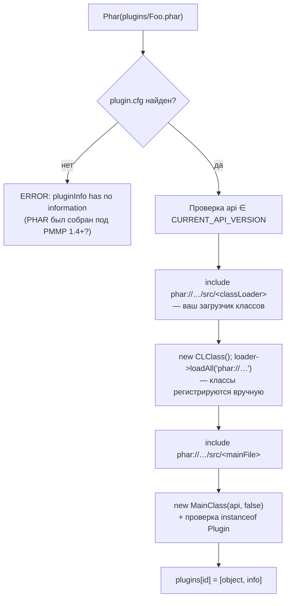
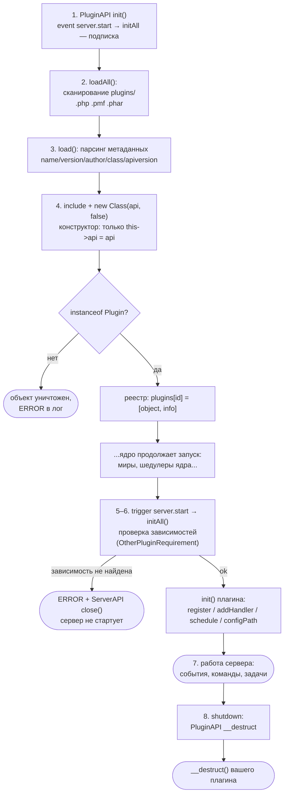
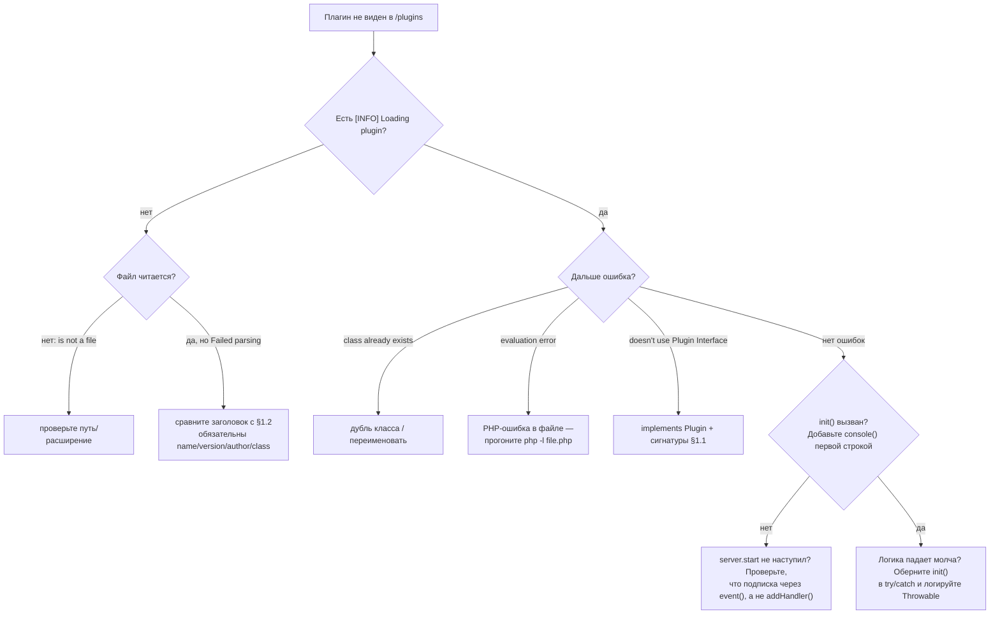
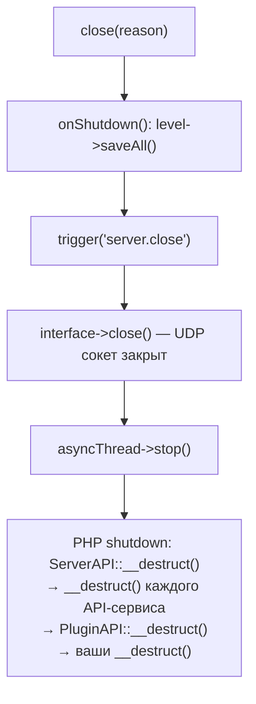

# WorldPECore Plugin API

# Часть 2 — Жизненный цикл плагина и Быстрый старт

> **Предварительные требования:** прочтите [Часть 1 — Введение и Архитектура](01-introduction.md).
> Все примеры кода написаны специально для этой документации и проверены по исходникам ядра.

---

## Содержание части

- [1. Анатомия плагина](#1-анатомия-плагина)
  - [1.1. Контракт: интерфейс `Plugin`](#11-контракт-интерфейс-plugin)
  - [1.2. Метаданные заголовка](#12-метаданные-заголовка)
  - [1.3. Требования к классу](#13-требования-к-классу)
- [2. Форматы дистрибуции](#2-форматы-дистрибуции)
  - [2.1. Одиночный `.php`](#21-одиночный-php)
  - [2.2. Устаревший формат `.pmf`](#22-устаревший-формат-pmf)
  - [2.3. Архив `.phar`](#23-архив-phar)
- [3. Жизненный цикл плагина](#3-жизненный-цикл-плагина)
  - [3.1. Диаграмма жизненного цикла](#31-диаграмма-жизненного-цикла)
  - [3.2. Конструктор против `init()`](#32-конструктор-против-init)
  - [3.3. Завершение работы и деструктор](#33-завершение-работы-и-деструктор)
- [4. Быстрый старт: минимальный boilerplate](#4-быстрый-старт-минимальный-boilerplate)
- [5. Типовые паттерны](#5-типовые-паттерны)
  - [5.1. Паттерн «Команда + расписание»](#51-паттерн-команда--расписание)
  - [5.2. Паттерн «Блоки, пакеты, конфиг»](#52-паттерн-блоки-пакеты-конфиг)
  - [5.3. Паттерн «Собственная база данных»](#53-паттерн-собственная-база-данных)
- [6. Конфигурация плагина](#6-конфигурация-плагина)
  - [6.1. Приватная папка: `configPath()`](#61-приватная-папка-configpath)
  - [6.2. Автогенерация: `createConfig()`](#62-автогенерация-createconfig)
  - [6.3. Класс `utils\Config`: форматы и методы](#63-класс-utilsconfig-форматы-и-методы)
- [7. Зависимости между плагинами](#7-зависимости-между-плагинами)
- [8. Чеклист публикации](#8-чеклист-публикации)

---

## 1. Анатомия плагина

### 1.1. Контракт: интерфейс `Plugin`

Полное определение интерфейса — файл `src/plugin/Plugin.php`:

```php
interface Plugin{

    public function __construct(ServerAPI $api, $server = false);

    public function init();
}
```

Контракт предельно мал, но оба метода **обязательны**:

| Метод | Когда вызывается | Назначение |
|---|---|---|
| `__construct(ServerAPI $api, $server = false)` | В момент загрузки файла ядром (`PluginAPI::load()` / `loadAll()`) | Сохранить ссылку на API. Логика здесь недопустима — см. §3.2 |
| `init()` | После события `server.start`, для всех плагинов подряд (`PluginAPI::initAll()`) | Основная инициализация: регистрация команд, хендлеров, задач |
| `__destruct()` *(опционально)* | При завершении работы сервера (`PluginAPI::__destruct`) | Освобождение ресурсов (закрытие БД, файлов) |

Класс также может реализовать второй интерфейс ядра:

```php
// src/plugin/OtherPluginRequirement.php
interface OtherPluginRequirement{
    public function getRequiredPlugins(); // array of RequiredPluginEntry
}
```

### 1.2. Метаданные заголовка

Для одиночного PHP-файла ядро читает метаданные из комментария **до первого `*/`** файла. Парсер (`PluginAPI::load()`, регулярное выражение `([a-zA-Z0-9\-_]*)=([^\r\n]*)`) требует строгий формат:

```php
<?php
/*
__PocketMine Plugin__
name=MyPlugin
description=Что делает плагин
version=1.0
author=YourName
class=MyPlugin
apiversion=12.1
*/
```

| Поле | Обязательное | Тип | Описание |
|---|---|---|---|
| `name` | ✅ | string | Отображаемое имя. Используется в идентификаторе и пути конфигов |
| `version` | ✅ | string | Версия плагина (свободная строка) |
| `author` | ✅ | string | Автор. Входит в идентификатор плагина |
| `class` | ✅ | string | Имя главного класса. Специальное значение `none` — плагин без кода (создаётся `DummyPlugin`). Ядро приводит значение к нижнему регистру при сравнении существующих классов |
| `description` | ❌ | string | Описание. Парсится и хранится в `$info["description"]`, но ни одна команда ядра (`plugins`, `version`) его не отображает — используйте для собственных нужд |
| `apiversion` | ❌ | string / CSV | Совместимые версии API через запятую, например `12.1,12.2`. При несовпадении с `CURRENT_API_VERSION` (`12.2`) сервер пишет предупреждение и **продолжает загрузку** |

Правила разбора значений:

- Строки `on/off`, `true/false`, `yes/no` (в любом регистре) автоматически приводятся к `bool` — это касается **любого** поля, включая `name` и `class`! Поэтому `class=true` превратит поле в булево и сломает загрузку.
- Всё до закрывающего `*/` считается метаданными; код после него исполняется как обычный PHP.
- Если отсутствует любое из обязательных полей или нет совпадений регулярного выражения — загрузка прерывается с ошибкой `[ERROR] Failed parsing of <file>`.
- `apiversion` разбирается как CSV: `explode(",", ...)` + `floatval` для сравнения — пишите версии без мусора (`12.2`, а не `v12.2 `).
- Пробелы вокруг значений не обрезаются в legacy-парсере — держите формат `key=value` без лишних пробелов после `=`.

#### Примеры корректных заголовков

Минимальный (только обязательное):

```php
/*
__PocketMine Plugin__
name=Tiny
version=0.1
author=Dev
class=Tiny
*/
```

Расширенный (с совместимостью сразу двух версий API):

```php
/*
__PocketMine Plugin__
name=Shop
description=Магазин предметов
version=2.4.1
author=DevTeam
class=ShopPlugin
apiversion=12.1,12.2
*/
```

### 1.3. Требования к классу

1. Главный класс обязан реализовать `Plugin`. Иначе объект уничтожается, а в консоль выводится:
   `[ERROR] Plugin "<name>" doesn't use the Plugin Interface`.
2. Конструктор обязан принимать `(ServerAPI $api, $server = false)` — ядро вызывает его именно так: `new $className($this->server->api, false)`.
3. Имя класса должно быть уникальным в рамках процесса: если класс уже объявлен, загрузка падает с `[ERROR] Failed loading plugin: class exists`.
4. Пространства имён поддерживаются только в PHAR-плагинах (см. §2.3).

### 1.4. Сообщения об ошибках загрузки

Точный справочник — что пишет ядро при каждой проблеме (`PluginAPI::load()/loadAll()`):

| Сообщение в консоли | Причина | Как исправить |
|---|---|---|
| `[ERROR] <file> is not a file` | путь — ссылка/каталог/не существует | проверьте имя файла в `plugins/` |
| `[ERROR] Failed parsing of <file>` | нет `key=value` строк до `*/`, либо отсутствует одно из полей `name/version/class/author` | сверьте заголовок с шаблоном §1.2 |
| `[INFO] Loading plugin "X" … by Y` | успех парсинга (не ошибка) | — |
| `[ERROR] Failed loading plugin: class already exists` | класс с именем `class=` уже объявлен (дубль файла или конфликт) | переименуйте класс |
| `[ERROR] Failed loading <name>: evaluation error` | PHP-ошибка при `include` файла / `eval` PMF-кода | смотрите трейс выше по логу |
| `[WARNING] Plugin "X" may not be compatible with the API (...)! It can crash or corrupt the server!` | `apiversion` не содержит `12.2` | обновите поле; загрузка продолжается |
| `[ERROR] Plugin "X" doesn't use the Plugin Interface` | класс не реализует `Plugin`; объект уничтожается | добавьте `implements Plugin` |
| `[WARNING] API is not the same as Core(...) `(PHAR) | аналог apiversion-проверки для `plugin.cfg` | обновите `api=` |
| `[ERROR] Failed to load PHAR plugin from ...: pluginInfo has no information(PHAR was made for PMMP 1.4+?)` | внутри `.phar` нет `plugin.cfg` | соберите архив по §2.3 |
| `[ERROR] Plugin "X" needed by "Y" is not found.` → **остановка сервера** | не выполнена зависимость `OtherPluginRequirement` | установите зависимость |

Диагностический алгоритм «плагин не появился в `/plugins`»: ищите первое сообщение выше в логе запуска → исправляйте → перезапуск.


`PluginAPI` сканирует папку `DATA_PATH/plugins/` и распознаёт три формата по расширению.

### 2.1. Одиночный `.php`

Самый простой формат — один файл с метаданными (§1.2). Подходит для небольших плагинов; все реальные примеры этого репозитория распространяются именно так. Файл подключается через `include`, после чего инстанцируется класс из поля `class`.

### 2.2. Устаревший формат `.pmf`

`PMFPlugin` (`src/pmf/PMFPlugin.php`) — бинарный контейнер PocketMine эпохи Alpha (версия формата `PMF_CURRENT_PLUGIN_VERSION = 0x02`):

```text
[заголовок PMF][name][version][author][apiversion][class][identifier]
[gzip(deflate)-сжатая секция extra][gzip-сжатый PHP-код плагина]
```

Метаданные извлекаются методом `getPluginInfo()`, код исполняется через `eval()`. Формат сохранён ради обратной совместимости; **для новых плагинов использовать не рекомендуется**.

### 2.3. Архив `.phar`

PHAR — формат «современных» плагинов (упаковщик PMMP 1.4+). Загрузчик `PluginAPI::loadAll()` ожидает внутри архива файл **`plugin.cfg`** со следующими ключами:

```ini
name=MyPlugin
description=Custom Crafting system
version=3.1.4
author=ArkQuark
mainFile=IWmain.php
api=12.2
classLoader=src/loader.php
```

Процесс загрузки PHAR:



Особенности:

- `CLClass` вычисляется из пути `classLoader` заменой `/` на `\` (`PharUtils::getNameSpaceClass()`) — то есть загрузчик должен быть классом в пространстве имён, повторяющем структуру каталогов.
- Реестр классов ядра реализуется вашим классом, реализующим `IClassLoader` (`src/plugin/phar/IClassLoader.php`): метод `loadAll($pharPath)` обязан выполнить все нужные `require_once`.
- Пространства имён разрешены, поскольку главный класс извлекается тем же преобразованием пути (`mainFile=src/Npc/Main.php` → класс `Npc\Main`).

- `CLClass` вычисляется из пути `classLoader` заменой `/` на `\` (`PharUtils::getNameSpaceClass()`) — то есть загрузчик должен быть классом в пространстве имён, повторяющем структуру каталогов.
- Реестр классов ядра реализуется вашим классом, реализующим `IClassLoader` (`src/plugin/phar/IClassLoader.php`, единственный метод):

```php
interface IClassLoader{
    public function loadAll($pharPath);
}
```

- Пространства имён разрешены, поскольку главный класс извлекается тем же преобразованием пути (`mainFile=src/Npc/Main.php` → класс `Npc\Main`).

#### Полный пример сборки PHAR

Структура исходников:

```text
build-src/
├── plugin.cfg
└── src/
    ├── loader.php          # класс MyPlugin\Loader
    └── Npc/
        └── Main.php        # класс MyPlugin\Npc\Main implements Plugin
```

`plugin.cfg`:

```ini
name=NpcPlugin
description=NPC спавн и управление
version=1.0.0
author=YourName
mainFile=src/Npc/Main.php
api=12.2
classLoader=src/loader.php
```

`src/loader.php`:

```php
<?php
namespace MyPlugin;

class Loader implements \IClassLoader{
    public function loadAll($pharPath){
        // $pharPath = "phar://<файл>.phar/"
        require_once($pharPath . "src/Npc/Main.php");
        // подключите все нужные классы явно — автозагрузчика нет
    }
}
```

Скрипт сборки (`build-phar.php`, запускать тем же PHP):

```php
<?php
$out = __DIR__ . "/NpcPlugin.phar";
@unlink($out);
$phar = new Phar($out);
$phar->buildFromDirectory(__DIR__ . "/build-src");
// файл plugin.cfg должен лежать в КОРНЕ архива:
$phar->addFile(__DIR__ . "/plugin.cfg", "plugin.cfg");
echo "Built: $out\n";
```

Проверка перед публикацией: положите `.phar` в `plugins/`, перезапустите сервер; в логе должны появиться `[INFO] Loading PHAR plugin "NpcPlugin" 1.0.0 by YourName` без предупреждений API.

Частые проблемы сборки:

| Симптом | Причина |
|---|---|
| `pluginInfo has no information` | `plugin.cfg` не в корне архива или ключи названы иначе (регистр важен) |
| Класс не найден после загрузки | `loadAll()` не подключил файл, либо путь в `mainFile` не совпадает с реальным (`src/…`) |
| Фатал на `new $pluginName(...)` | `mainFile=src/Npc/Main.php` требует класс `\Npc\Main` — пространство имён = каталоги |
| Соседние плагины не видят ваши классы | классы загружены только внутри phar-потока — дублируйте публичные классы через отдельный `.php`-плагин-API |

---

## 3. Жизненный цикл плагина

---

## 3. Жизненный цикл плагина


### 3.1. Диаграмма жизненного цикла



Этапы в терминах кода:

| Этап | Метод ядра | Что происходит |
|---|---|---|
| 1. Регистрация | `PluginAPI::init()` | Подписывает `initAll()` на `server.start`; запускает `loadAll()` |
| 2. Сканирование | `loadAll()` | Обход `plugins/`; `.php`/`.pmf` → `load()`, `.phar` → inline-логика |
| 3. Парсинг | `load($file)` | Разбор метаданных, `include`, проверка `instanceof Plugin`, проверка `apiversion` |
| 4. Инстанцирование | `new $class($api, false)` | Конструктор. Объект кладётся в реестр `plugins[identifier] = [object, info]` |
| 5. Проверка зависимостей | `initAll()` | Для `OtherPluginRequirement`: отсутствие зависимости **останавливает сервер** (`ServerAPI::request()->close()`) |
| 6. Инициализация | `initAll()` → `$p[0]->init()` | Регистрация всей логики плагина |
| 7. Работа | события/команды/шедулер | Основной срок жизни |
| 8. Выгрузка | `PluginAPI::__destruct()` | Вызов `__destruct()` каждого плагина |

> ⚠️ Известная особенность: между этапом 4 и этапом 6 проходит весь остальной запуск сервера (миры, игроки-«нулевые» объекты). В комментарии ядра прямо сказано: *«ARGHHH!!! Plugin loading randomly fails!!»* — не полагайтесь в конструкторе ни на что, кроме `$api`.

### 3.2. Конструктор против `init()`

| Допустимо в `__construct` | Допустимо в `init()` |
|---|---|
| `$this->api = $api;` | `$api->console->register(...)` — команды |
| Инициализация простых полей | `$api->addHandler(...)` / `BaseEvent::register(...)` — подписки |
| — | `$api->schedule(...)` — задачи |
| — | `$api->plugin->configPath()/createConfig()` — файлы |
| — | Работа с уровнями, сущностями, тайлами |

Причина: конструкторы плагинов исполняются из `PluginAPI::loadAll()`, а `PluginAPI` создаётся **последним** сервисом внутри `ServerAPI::load()` — к этому моменту все остальные API уже инстанцированы, их `init()` выполнен, команды `plugins`/`version` зарегистрированы. Однако `init()` других плагинов ещё не вызывался, а миры могут быть не загружены. В комментарии ядра прямо сказано: *«ARGHHH!!! Plugin loading randomly fails!!»* — поэтому единственное безопасное действие в конструкторе — `$this->api = $api`.

#### Матрица доступности на этапах

| Ресурс | `__construct` | `init()` | работа | `__destruct` |
|---|---|---|---|---|
| `$this->api` (все 12 сервисов) | ✅ | ✅ | ✅ | ⚠️ сервисы ещё живы |
| Команды (`console->register`) | ⚠️ технически можно | ✅ | ✅ | ❌ |
| Хендлеры / OOP-события | ❌ не имеет смысла | ✅ | ✅ | ❌ |
| Миры (`level->getDefault()`, `get()`) | ⚠️ дефолт может отсутствовать при первом старте | ✅ (после `server.start`) | ✅ | ⚠️ уже сохранены/закрыты |
| Игроки онлайн | ❌ никого нет | ⚠️ обычно нет | ✅ | ❌ |
| Файлы в `configPath($this)` | ❌ реестр ещё не заполнен | ✅ | ✅ | ✅ |
| Шедулер `schedule()` | ❌ цикл не запущен | ✅ | ✅ | ❌ задача не выполнится |

Правило-минимум: конструктор = присвоение ссылки; всё остальное — `init()`.

### 3.3. Завершение работы и деструктор

Ядро вызывает `__destruct()` плагина явно из `PluginAPI::__destruct()`:

```php
// src/API/PluginAPI.php
public function __destruct(){
    foreach($this->plugins as $p){
        if(method_exists($p[0], "__destruct")) $p[0]->__destruct();
    }
}
```

Рекомендации:

- Закрывайте соединения SQLite/файлы, останавливайте внешние процессы.
- **Не** выполняйте игровую логику — уровни уже могут быть сохранены/выгружены.
- Помните, что деструктор вызывается вручную, поэтому он может сработать дважды при ошибках выгрузки (ядро само страхуется от этого предупреждением `PluginAPI::$plugins is null`).

---

## 4. Быстрый старт: минимальный boilerplate

Готовый каркас — скопируйте в `plugins/MyFirst/MyFirst.php`:

```php
<?php
/*
__PocketMine Plugin__
name=MyFirst
description=Мой первый плагин
version=0.0.1
author=YourName
class=MyFirst
apiversion=12.2          ← текущий API ядра; предупреждение, если отличается
*/

class MyFirst implements Plugin{                    // 1. контракт Plugin

    private $api;

    public function __construct(ServerAPI $api, $server = false){
        $this->api = $api;                          // 2. ТОЛЬКО сохраняем ссылку
    }

    public function init(){                         // 3. вся логика — здесь
        // Команда /hello: callback получит ($cmd, $params, $issuer, $alias)
        $this->api->console->register("hello", "Сказать привет", [$this, "cmdHello"]);
        // Разрешить команду всем игрокам (иначе — только консоль/OP):
        $this->api->ban->cmdWhitelist("hello");

        // Хук события: false из хендлера отменит действие
        $this->api->addHandler("player.join", [$this, "onJoin"], 15);

        // Повторяющаяся задача каждые 20 тиков (1 сек):
        $this->api->schedule(20, [$this, "onTick"], [], true);
    }

    public function cmdHello($cmd, $params, $issuer, $alias){
        return "Привет, мир!\n";                    // текст вернётся исполнителю
    }

    public function onJoin($data){                  // $data === объект Player
        if($data instanceof Player && !$data->op){
            $this->api->chat->broadcast("Добро пожаловать, " . $data->iusername . "!");
        }
        // return false; — заблокировало бы дальнейшую обработку события
    }

    public function onTick($data, $event){
        // периодическая логика
    }

    public function __destruct(){
        // освобождение ресурсов
    }
}
```

После перезапуска сервера проверьте установку командой `pl` (алиас `plugins`) — плагин должен появиться в списке вместе с версией и автором.

#### 4.1. Итерация 2: доводим boilerplate до рабочего плагина

Расширим `MyFirst` до «приветственного плагина» с конфигом, шедулером и корректным завершением:

```php
<?php
/*
__PocketMine Plugin__
name=MyFirst
description=Приветствия и автообъявления
version=0.2.0
author=YourName
class=MyFirst
apiversion=12.2
*/

class MyFirst implements Plugin{
    private $api, $cfg;
    private $adIndex = 0;

    public function __construct(ServerAPI $api, $server = false){
        $this->api = $api;
    }

    public function init(){
        // --- конфиг с комментариями ---
        $path = $this->api->plugin->configPath($this);
        $this->cfg = new Config($path."config.yml", CONFIG_YAML, [
            "welcome" => "Добро пожаловать на сервер!",
            "ads" => ["Голосуй за сервер!", "Правила: /help"],
            "ad-interval-seconds" => 60,
        ]);

        // --- события ---
        $this->api->addHandler("player.join", [$this, "onJoin"], 15);
        ServerAPI::request()->event("server.start", [$this, "onStart"]);

        // --- задача: автообъявления ---
        $sec = (int) $this->cfg->get("ad-interval-seconds", 60);
        if($sec > 0){
            $this->api->schedule($sec * 20, [$this, "showAd"], [], true);
        }
    }

    public function onStart($time){ /* мир готов — можно работать с уровнями */ }

    public function onJoin($player){
        if(!$player instanceof Player) return null;
        $player->sendChat(FORMAT_GREEN . $this->cfg->get("welcome"));
    }

    public function showAd(){
        $ads = (array) $this->cfg->get("ads");
        if(count($ads) === 0) return;
        $this->api->chat->broadcast(FORMAT_YELLOW . $ads[$this->adIndex++ % count($ads)]);
    }

    public function __destruct(){
        // ресурсы не держим — нечего закрывать
    }
}
```

Что демонстрирует итерация: чтение конфига в `init()` (не в конструкторе!), подписка на trigger-событие через `event()`, циклический шедулер с внутренним состоянием, форматирование через `FORMAT_*`.

#### 4.2. Реакция на остановку сервера

```php
public function init(){
    ServerAPI::request()->event("server.close", [$this, "onClose"]);
}
public function onClose($reason){
    // последний шанс что-то сохранить; миры уже сохранены ядром
    file_put_contents($this->api->plugin->configPath($this)."last-run.txt",
        date(DATE_ATOM)." причина: ".$reason);
}
```

Порядок при остановке: `close()` → сохранение миров → `trigger("server.close")` → закрытие сокета → разрушение API → ваши `__destruct()`. В `server.close` чат ещё работает (`send()`), в `__destruct()` — уже нет.


---

## 5. Типовые паттерны

Ниже — три канонических каркаса, покрывающих большинство задач плагина. Код написан для этой документации и использует только публичное API ядра.

### 5.1. Паттерн «Команда + расписание»

Регистрация команды и периодической задачи — базовый каркас любого сервисного плагина (очистка, бэкапы, автообъявления):

```php
class MyService implements Plugin {

    public function __construct(ServerAPI $api, $server = false) {
        $this->api = $api;
    }

    public function init() {
        // 1) команда /cleanup: обработчик получит ($cmd, $params, $issuer, $alias)
        $this->api->console->register("cleanup",
            "Запустить очистку вручную", [$this, "commandCleanup"]);

        // 2) задача каждые 6000 тиков (5 минут), repeat=true
        $this->api->schedule(6000, [$this, "tickCleanup"], [], true);
    }

    public function commandCleanup($cmd, $params, $issuer, $alias){
        $this->tickCleanup();
        // $issuer бывает Player'ом, а бывает консолью/RCON — проверяйте тип!
        return "[MyService] Очистка запущена.\n";   // текст уйдёт исполнителю
    }

    public function tickCleanup($data = [], $event = "server.schedule"){
        foreach($this->api->entity->getAll() as $eid => $e){ /* ... */ }
    }
}
```

Ключевые правила паттерна:

- Интервал шедулера задаётся **в тиках**: `20 тиков = 1 секунда`.
- `$issuer` полиморфен (`Player` | строка `"console"` | RCON-сессия) — всегда проверяйте `instanceof Player` перед обращением к игровым методам.
- Колбэк задачи получает `(array $data, string $eventName)`; возврат `false` снимает задачу даже если она повторяющаяся.
- Тяжёлая работа (архивация, сетевые запросы к внешним сервисам) не должна выполняться в главном потоке: выносите её в отдельный процесс или в асинхронные механизмы ядра (`asyncOperation()`).

### 5.2. Паттерн «Блоки, пакеты, конфиг»

Взаимодействие с игровыми действиями через legacy-хуки + низкоуровневый перехват пакетов через ООП-события:

```php
public function init(){
    $this->path = $this->api->plugin->configPath($this);      // приватная папка
    $cfg = new Config($this->path."config.yml", CONFIG_YAML,
                      ["protected-levels" => ["world"]]);     // значения по умолчанию

    $this->api->addHandler("player.block.touch",              // любое касание блока:
        [$this, "onBlockTouch"]);                             // type=break|place|activate

    DataPacketReceiveEvent::register(                         // НОВЫЙ стиль:
        [$this, "onPacket"], EventPriority::NORMAL);          // сырой пакет от клиента
}

// Legacy-хук: payload — массив
public function onBlockTouch($data){
    if(in_array($data["player"]->level->getName(),
                (array) $this->cfg->get("protected-levels"))){
        return false;   // вето: цепочка прервана, действие отменено
    }
}

// ООП-подписчик: payload — объект события
public function onPacket(DataPacketReceiveEvent $event){
    $player = $event->getPlayer();
    $pk     = $event->getPacket();
    if($pk->pid() === ProtocolInfo::USE_ITEM_PACKET /* пример */){
        // разбор пакета; для отмены: $event->setCancelled()
    }
}
```

Ключевые правила паттерна:

- Две системы событий свободно смешиваются: хуки — для игровых действий, `BaseEvent`-классы — для сырых датаграмм.
- Полезная нагрузка различается принципиально: у legacy-хуков это массив (`$data["player"]`, `$data["target"]`), у ООП-событий — объект с геттерами (`$event->getPlayer()`).
- Хендлер, возвращающий `false`, отменяет действие; наблюдатель, который ничего не решает, обязан возвращать `null`.
- Открытые игроку контейнеры доступны через `$player->windows[$windowid]`: значение — объект `Tile` открытого контейнера (или не-Tile для системных окон); карта очищается при получении `CONTAINER_CLOSE_PACKET` и при выходе игрока (`Player::close()`).

### 5.3. Паттерн «Собственная база данных»

Хранение данных плагина в SQLite внутри его приватной папки:

```php
private $db;

public function init(){
    // Приватная папка создаётся автоматически: DATA_PATH/plugins/MyPlugin/
    $path = $this->api->plugin->configPath($this)."data.db";
    $isNew = !file_exists($path);

    $this->db = new SQLite3($path);
    if($isNew){
        $this->db->query("CREATE TABLE logs (
            id INTEGER PRIMARY KEY, name TEXT, action NUMERIC,
            x NUMERIC, y NUMERIC, z NUMERIC, time TEXT);");
    }
    // Для записи логов важна скорость, а не надёжность при сбое:
    $this->db->query("PRAGMA journal_mode = OFF;");
    $this->db->query("PRAGMA synchronous = OFF;");

    $this->api->addHandler("player.block.break", [$this, "logBreak"], 15);
}

public function logBreak($data){
    $st = $this->db->prepare("INSERT INTO logs VALUES (NULL, ?, ?, ?, ?, ?, ?);");
    $t = $data["target"];
    $st->bindValue(1, $data["player"]->iusername, SQLITE3_TEXT);
    $st->bindValue(2, "break", SQLITE3_TEXT);
    $st->bindValue(3, $t->x, SQLITE3_FLOAT);
    $st->bindValue(4, $t->y, SQLITE3_FLOAT);
    $st->bindValue(5, $t->z, SQLITE3_FLOAT);
    $st->bindValue(6, date(DATE_ATOM), SQLITE3_TEXT);
    $st->execute();
}

public function __destruct(){
    if(isset($this->db)) $this->db->close();   // освобождаем ресурс при выгрузке
}
```

Ключевые правила паттерна:

- `configPath($this)` — единственный корректный способ получить приватную папку (создаётся автоматически).
- Приоритет `15` ставят наблюдатели-логгеры: они выполняются раньше прочих и **никогда** не возвращают `false`, чтобы не ломать игру.
- Всегда используйте prepared statements: строки из payload приходят от игроков и могут содержать SQL-инъекции.
- Закрывайте соединение в `__destruct()`.

### 5.4. Паттерн «GUI на сундуке» (кастомное меню)

Классическая задача MCPE 0.8.x — интерфейсы без клиентских GUI: используется реальный сундук-тайл как сетка кнопок.

```php
public function openMenu(Player $p){
    $pos = $p->entity->round();
    // сундук над головой игрока — вне досягаемости кликов по миру
    $tile = $this->api->tile->add($p->level, "Chest", $pos->x, $pos->y + 3, $pos->z);
    $this->menus[$p->iusername] = $tile;

    $items = [
        11 => BlockAPI::getItem(Item::DIAMOND_SWORD),  // «PvP»
        13 => BlockAPI::getBlock(Block::GRASS)->getBlock(), // «Выживание»
        15 => BlockAPI::getItem(Item::COMPASS),        // «Спавн»
    ];
    foreach($items as $slot => $item){
        $tile->setSlot($slot, $item);                  // каждое setSlot → tile.container.slot
    }
    $tile->openInventory($p);                          // окно откроется у клиента
}

// Клик по слоту ловим через legacy-хук:
public function onSlot($data){
    if($data["tile"] !== ($this->menus[$data["player"]->iusername] ?? null)) return null;
    $this->api->schedule(10, [$data["player"], "close"], ""); // закрыть окно через полсекунды
    switch($data["slot"]){
        case 11: /* PvP */ break;
        case 13: /* Survival */ break;
        case 15: $data["player"]->teleport(ServerAPI::request()->spawn); break;
    }
    return false;   // отменяем фактический перенос предмета в инвентарь
}
```

Обязательные гигиенические меры паттерна:

- храните соответствие игрок → тайл и удаляйте его при `player.quit` и при закрытии окна (`CONTAINER_CLOSE_PACKET` через `DataPacketReceiveEvent` — см. Часть 4 §4);
- после закрытия окна верните блок/уберите тайл (`$tile->close()`), иначе в мире останется «невидимый сундук»;
- возврат `false` из хендлера `tile.container.slot` не убирает визуально предмет — синхронизируйте слот вручную `$player->sendInventory()` или повторным `setSlot`.

### 5.5. Паттерн «Арена в отдельном мире»

```php
const ARENA = "arena1";

public function ensureArena(){
    if(!$this->api->level->levelExists(self::ARENA)){
        $this->api->level->generateLevel(self::ARENA, 12345, "FLAT");
    }
    if($this->api->level->get(self::ARENA) === false){
        $this->api->level->loadLevel(self::ARENA);
    }
}

public function joinArena(Player $p){
    $lv = $this->api->level->get(self::ARENA);
    $safe = $lv->getSafeSpawn(false);
    $p->teleport(new Position($safe->x, $safe->y, $safe->z, $lv));
}

public function resetArena(){
    $lv = $this->api->level->get(self::ARENA);
    if(!$lv) return;
    // выкинуть игроков
    foreach($lv->players as $p){ $p->teleport(ServerAPI::request()->spawn); }
    // подчистить сущности и тайлы матча
    foreach($this->api->entity->getAll($lv) as $e){ if(!$e->isPlayer()) $e->close(); }
    foreach($this->api->tile->getAll($lv) as $t){ $t->close(); }
}
```

Правила: генерируйте мир заранее (генерация тяжёлая — не в обработчике входа); не выгружайте арену, пока в ней есть `$lv->players`; для «чистого» респавна арены снимайте снапшот чанков через `Level::getMiniChunk()/getOrderedMiniChunk()` до матча и восстанавливайте `setMiniChunk()` после — формат данных внутренний, используйте парно (снимок → восстановление) без ручного разбора.

### 5.6. Паттерн «Задача с состоянием» (обратный отсчёт)

Шедулер ядра передаёт только `(data, eventName)` — счётчик держите в свойствах объекта:

```php
private $countdown = [];

public function startCountdown(string $key, int $seconds, callable $onZero){
    $this->countdown[$key] = ["left" => $seconds, "cb" => $onZero];
}

public function init(){ $this->api->schedule(20, [$this, "tickCountdowns"], [], true); }

public function tickCountdowns(){
    foreach($this->countdown as $k => &$cd){
        if(--$cd["left"] > 0){
            $this->api->chat->broadcast("$k: {$cd["left"]}…");
            continue;
        }
        ($cd["cb"])();
        unset($this->countdown[$k]);
        return false === null ? null : null; // задача повторяется всегда
    }
}
```

Альтернатива без постоянной задачи: ставить одноразовый `schedule(N, cb)` на каждый шаг цепочки — так делает ядро при кике (`BanAPI::kick` ставит `schedule(60, [$player,"close"], $reason)`).

### 5.7. Паттерн «Команда с подкомандами»

Единая точка входа + диспетчер — самый читаемый способ держать десяток подкоманд:

```php
public function init(){
    $this->api->console->register("warp", "<set|del|go> [имя]", [$this, "cmdWarp"]);
    $this->api->ban->cmdWhitelist("warp");
}

public function cmdWarp($cmd, array $args, $issuer, $alias){
    if(!($issuer instanceof Player)) return "Только в игре.\n";
    $sub = strtolower($args[0] ?? "");

    switch($sub){
        case "set":
            if(!$this->api->ban->isOp($issuer->iusername)) return "Только OP.\n";
            $name = strtolower($args[1] ?? "");
            if($name === "") return "/$cmd set <name>\n";
            $this->warps[$name] = $issuer->entity->round(); // Position
            return "Варпа $name создана.\n";

        case "del":
            /* ... */ break;

        case "go":
            $name = strtolower($args[1] ?? "");
            $pos = $this->warps[$name] ?? false;
            if($pos === false) return "Нет такой варпы.\n";
            $issuer->teleport($pos);
            return "Телепорт...\n";

        default:
            return "Использование: /$cmd <set|del|go> [name]\n";
    }
    return "\n";
}
```

Обратите внимание: справка возвращается как строка — она уйдёт и консоли, и игроку; права проверяются внутри (команда в whitelist, но `set/del` — только OP).

### 5.8. Паттерн «Собственные события между модулями плагина»

Legacy-механизм не ограничен встроенными именами: `handle()`/`trigger()` работают с любой строкой. Это удобный внутренний bus для крупных плагинов:

```php
const MY_EV_JOB_DONE = "myplugin.job.done";

// Публикация из глубины кода (например, из задачи шедулера):
private function finishJob(string $who){
    $payload = ["who" => $who, "at" => microtime(true)];
    $this->api->dhandle(self::MY_EV_JOB_DONE, $payload);
}

// Подписка другого модуля того же плагина:
public function init(){
    $this->api->addHandler(self::MY_EV_JOB_DONE, [$this->stats, "onJobDone"]);
}
```

Правила именования: префиксуйте собственные события (`myplugin.`), чтобы никогда не пересечься с будущими событиями ядра; payload делайте массивом с документированными ключами. Для trigger-only уведомлений используйте пару `event()`/`trigger()` — они дешевле (без SQL-выборки приоритетов).


---

## 6. Конфигурация плагина

### 6.1. Приватная папка: `configPath()`

```php
public function configPath(Plugin $plugin)  // → string путь со слешем на конце
```

- Возвращает `DATA_PATH/plugins/<Name>/` (имя — из метаданных, без транслитерации).
- Каталог создаётся рекурсивно с правами `0777`, путь дополнительно записывается в метаданные плагина (`info["path"]`).
- ⚠️ Известный дефект: метод вычисляет `getIdentifier()` **до** проверки результата `get()`, поэтому вызов для незарегистрированного плагина приводит к фатальной ошибке PHP (обращение к индексу `false`), а не к возврату `false`. Вызывайте только для `$this` после загрузки плагина ядром.

### 6.2. Автогенерация: `createConfig()`

```php
public function createConfig(Plugin $plugin, array $default = [])  // → string|false
```

Создаёт `<configPath>/config.yml` с значениями по умолчанию (`CONFIG_YAML`) и немедленно сохраняет его. Возвращает **путь к папке** (не к файлу!) либо `false`, если плагин не найден в реестре. Дальше читайте файл сами: `new Config($path."config.yml")`.

Вспомогательные методы того же класса:

```php
PluginAPI::readYAML($file)        // → mixed; парсинг YAML с фиксацией некавычённых ключей
PluginAPI::writeYAML($file, $data)// → int|false; запись YAML (UTF-8)
```

### 6.3. Класс `utils\Config`: форматы и методы

`Config` (`src/utils/Config.php`) — универсальное хранилище настроек. Формат определяется расширением файла или явной константой:

| Константа | Расширения | Примечание |
|---|---|---|
| `CONFIG_DETECT` | — | По умолчанию: определить по расширению |
| `CONFIG_PROPERTIES` | `.properties`, `.cnf`, `.conf`, `.config` | Плоский `key=value` (использует ядро для server.properties) |
| `CONFIG_JSON` | `.json`, `.js` | |
| `CONFIG_YAML` | `.yml`, `.yaml` | Требует расширение yaml; поддержка комментариев ядра |
| `CONFIG_SERIALIZED` | `.sl` | `serialize()`/`unserialize()` |
| `CONFIG_LIST` | `.txt`, `.list` | Одна строка — один элемент |

Основные методы (полный справочник — Часть 3):

```php
$cfg = new Config($file, CONFIG_PROPERTIES, $defaultArray, &$correct, $comments);
$cfg->get($k, $default = false)   // чтение
$cfg->set($k, $v)                 // запись в память
$cfg->getAll()                    // весь массив
$cfg->exists($k)                  // наличие ключа
$cfg->remove($k)                  // удаление ключа
$cfg->save()                      // запись на диск
$cfg->reload()                    // перечитать с диска
```

Конструктор сразу применяет `$defaultArray` для отсутствующих ключей (аналог `fillDefaults` из `PluginAPI`), поэтому паттерн «создал → прочитал → получил дефолты» работает без ручного сохранения.

#### 6.3.1. Полный рабочий пример: конфиг с комментариями и перезагрузкой

```php
private $cfg;

public function init(){
    $path = $this->api->plugin->configPath($this);
    $this->cfg = new Config($path."config.yml", CONFIG_YAML, [
        "max-homes"      => 3,
        "teleport-delay" => 5,
        "blocked-worlds" => [],
    ], $correct, [
        // комментарии попадут в файл над соответствующими ключами:
        "max-homes"      => ["Сколько точек дома может ставить игрок"],
        "teleport-delay" => ["Задержка телепорта в секундах", "0 — мгновенно"],
    ]);
    if($correct === false){
        console("[MyPlugin] config.yml повреждён, используются дефолты");
    }

    $this->api->console->register("myreload", "", [$this, "cmdReload"]);
}

public function cmdReload($cmd, $params, $issuer, $alias){
    $this->cfg->reload();
    return "max-homes=" . var_export($this->cfg->get("max-homes"), true) . "\n";
}
```

Нюансы форматов:

- **CONFIG_PROPERTIES** — только скаляры `key=value`; вложенные массивы не поддерживаются форматом.
- **CONFIG_YAML**: `readYAML()` ядра предварительно кавычит «голые» ключи регэкспом, но значения с двоеточиями всё равно заключайте в кавычки.
- Дефолты достраиваются рекурсивно: новый ключ в коде автоматически дополнит старые файлы пользователей (запись — при `save()`/`createConfig()`).
- Пятый параметр конструктора по ссылке (`$correct`) — `false`, если файл не удалось разобрать.

---

## 7. Зависимости между плагинами

Если плагин B требует наличия плагина A:

```php
class MyPlugin implements Plugin, OtherPluginRequirement {

    public function getRequiredPlugins(): array{
        // version=false => подходит любая версия
        return [new RequiredPluginEntry("EconomyAPI"),
                new RequiredPluginEntry("WorldGuard", "1.2.3")];
    }
}

// src/API/PluginAPI.php (класс рядом с PluginAPI):
class RequiredPluginEntry{
    public $pluginName;
    public $version;
    public function __construct($name, $version = false){ /* ... */ }
}
```

Проверка выполняется в `PluginAPI::initAll()` **перед** вызовом всех `init()`:

| Ситуация | Реакция ядра |
|---|---|
| Зависимость отсутствует | `[ERROR] Plugin "X" needed by "Y" is not found.` → **сервер закрывается** (`ServerAPI::request()->close()`) |
| Версия не совпадает (и `version !== false`) | `[WARNING] ... is incorrect version.` — загрузка продолжается |

Ограничения механизма: сравнение версий точное строковое (`in_array($required->version, $versions)`), диапазонов и операторов (`>=`, `~`) нет; порядок загрузки плагинов алфавитно-файловый и от зависимостей не зависит, поэтому в конструкторе нельзя рассчитывать на классы зависимости — обращайтесь к ним только из `init()`, когда все плагины уже загружены.

#### 7.1. Мягкая интеграция без жёсткой зависимости

Если зависимость желательна, но не обязательна (опциональная экономика), проверяйте наличие в рантайме:

```php
public function init(){
    $eco = null;
    foreach($this->api->plugin->getList() as $info){
        if(strtolower($info["name"]) === "economyapi"){ $eco = true; break; }
    }
    $this->hasEco = $eco !== null;

    // вызовы чужого кода — только через проверки:
}

private function pay(Player $p, int $amount){
    if(!$this->hasEco) return true; // фича деградирует тихо
    // безопасный вызов: объект плагина лежит в реестре
    foreach($this->api->plugin->getAll() as [$obj, $info]){
        if(strtolower($info["name"]) === "economyapi"
           && method_exists($obj, "pay")){
            return $obj->pay($p->iusername, $amount) !== false;
        }
    }
    return false;
}
```

Такой стиль (`method_exists` + реестр `getAll()`) не роняет сервер при отсутствии соседа и не требует интерфейса.


---

## 8. Чеклист публикации

- [ ] Метаданные содержат `name`, `version`, `author`, `class`, `apiversion=12.2`
- [ ] Класс реализует `Plugin`; сигнатура конструктора точно `(ServerAPI $api, $server = false)`
- [ ] Вся логика — в `init()`; конструктор пуст, кроме `$this->api = $api`
- [ ] Каждой команде — `console->register()` + при необходимости `ban->cmdWhitelist()`
- [ ] Хендлеры не возвращают `true/false` без намерения остановить цепочку
- [ ] Файлы плагина пишутся только в `configPath($this)`
- [ ] `__destruct()` освобождает ресурсы и ничего не сохраняет в миры
- [ ] Проверено на чистом сервере: `php` в `plugins/`, отсутствие ошибок `[ERROR] Failed parsing/loading`

### 8.1. Диагностика «плагин не работает»

Последовательность локализации проблемы:



Полезные приёмы:

- `php -l plugins/My.php` — синтаксическая проверка без запуска сервера.
- Первой строкой `init()` ставьте `console("[MyPlugin] init ok", true, true, 0);` — уровень `0` гарантирует вывод даже на проде.
- Временно поднимите `debug=3` в `server.properties`: увидите `[INTERNAL] Attached ... to event ...` для каждой своей подписки.

---

## 9. Известные особенности ядра (из кода)

Список неочевидных фактов, которые стоит держать в голове:

1. **`PluginAPI::configPath()`** обращается к метаданным до проверки регистрации — фатал на «чужом» объекте (§6.1).
2. **Хендлеры нельзя снять** — проектируйте подписки постоянными; слушатели снимаются `deleteEvent($id)`.
3. **Задачи шедулера нельзя снять по ID** — только возвратом `false` из самой задачи.
4. **`description` из метаданных нигде не отображается** ядром.
5. **Порядок `initAll()` = порядок загрузки файлов** (как вернёт `dir()`), зависимости не сортируются.
6. При остановке ядра `PluginAPI::__destruct()` вызывает ваш `__destruct()` вручную и страхуется от повторного вызова.
7. Комментарий ядра *«ARGHHH!!! Plugin loading randomly fails!!»* около вызова `$p[0]->init()` — напоминание, что падение чужого `init()` может каскадно прервать запуск остальных плагинов: оборачивайте собственную логику в try/catch.

### 9.1. Порядок разрушения при остановке

Точная последовательность (полезно понимать, что ещё доступно в вашем деструкторе):



Выводы: в `__destruct()` недоступны сеть и чат; файловые операции допустимы; обращение к `$this->api->level` может отдать уже разрушенный сервис — не используйте.
- [ ] Для PHAR: `plugin.cfg` содержит `mainFile`, `classLoader`, `api`; загрузчик реализует `IClassLoader`

---

⬅️ [Часть 1 — Введение и Архитектура](01-introduction.md) | ➡️ **Часть 3 — Core API Reference** (следующий раздел)
