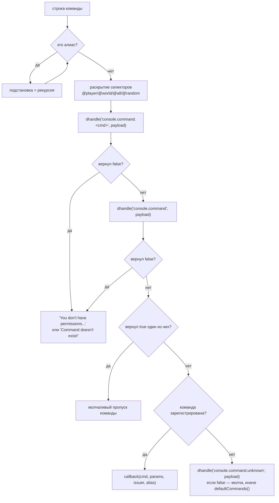

# WorldPECore Plugin API

# Часть 3 — Core API Reference

> Справочник публичных интерфейсов ядра **WorldPECore** (Plugin API `12.2`).
> Все сигнатуры и типы возврата приведены **точно по исходному коду**.
> Соглашение ядра об ошибках: методы сообщают о неудаче значением `false`/`null` и записью в консоль, исключения не выбрасываются (перехватывается только `TypeError` внутри шедулера).

## Содержание части

**Фасад и ядро**
- [3.1. ServerAPI](#31-serverapi)
- [3.2. PocketMinecraftServer](#32-pocketminecraftserver)

**Сервисы (`$api->…`)**
- [3.3. PluginAPI](#33-pluginapi) · [3.4. ConsoleAPI](#34-consoleapi) · [3.5. ChatAPI](#35-chatapi)
- [3.6. PlayerAPI](#36-playerapi) · [3.7. LevelAPI](#37-levelapi) · [3.8. BlockAPI](#38-blockapi)
- [3.9. EntityAPI](#39-entityapi) · [3.10. TileAPI](#310-tileapi) · [3.11. BanAPI](#311-banapi)
- [3.12. TimeAPI](#312-timeapi) · [3.13. AchievementAPI](#313-achievementapi) · [3.14. QueryAPI](#314-queryapi)

**Игровые объекты**
- [3.15. Level](#315-level) · [3.16. Player](#316-player) · [3.17. Entity](#317-entity)
- [3.18. Block и Item](#318-block-и-item)

**Утилиты и сеть**
- [3.19. Config](#319-config) · [3.20. TextFormat и глобальные функции](#320-textformat-и-глобальные-функции)
- [3.21. Пакеты: RakNetDataPacket и ProtocolInfo](#321-пакеты-raknetdatapacket-и-protocolinfo)

---

## 3.1. ServerAPI

**Файл:** `src/API/ServerAPI.php` · **Доступ:** передаётся в конструктор плагина; статический геттер — из любого места.

### Свойства-сервисы

| Свойство | Класс | Назначение |
|---|---|---|
| `$console` | ConsoleAPI | Команды консоли/игроков |
| `$level` | LevelAPI | Загрузка/выгрузка миров |
| `$block` | BlockAPI | Ломание/установка блоков, обновления |
| `$chat` | ChatAPI | Чат и broadcast |
| `$ban` | BanAPI | Баны, OP, whitelist, права команд |
| `$entity` | EntityAPI | Реестр сущностей |
| `$tile` | TileAPI | Реестр тайлов |
| `$player` | PlayerAPI | Реестр игроков, offline-данные |
| `$time` | TimeAPI | Время суток |
| `$queryAPI` | QueryAPI | Данные Query-протокола |
| `$achievement` | AchievementAPI | Достижения |
| `$plugin` | PluginAPI | Плагины |

### Методы

#### `request(): PocketMinecraftServer` *(static)*
Возвращает текущий экземпляр ядра. До завершения загрузки — `false`.

```php
$server = ServerAPI::request();
$online = count($server->clients);
```

#### `getProperty(string $name, mixed $default = false): mixed`
Читает свойство из `server.properties`. Приоритет источников: аргумент командной строки → файл → `$default`. Строки `on/off/true/false/yes/no` приводятся к `bool`; ключи `gamemode`, `max-players`, `server-port`, `debug`, `difficulty`, `time-per-second` — к `int`.

#### `setProperty(string $name, mixed $value, bool $save = true): void`
Записывает свойство; при `$save = true` сохраняет файл и повторно применяет настройки (`loadProperties()`).

#### `getProperties(): array`
Весь массив настроек. ⚠️ Не логируйте целиком — внутри есть `rcon.password`.

#### Делегаты к ядру

| Метод ServerAPI | Эквивалент ядра (§3.2) |
|---|---|
| `schedule($t, $c, $d, $r = false, $e = "server.schedule")` | `schedule()` |
| `addHandler($e, $c, $p = 5)` | `addHandler()` |
| `handle($e, &$d)` / `dhandle($e, $d)` | `handle()` |
| `trigger($e, $d)` / `event($e, callable)` / `deleteEvent($id)` | одноимённые |
| `asyncOperation($type, $data, $callable = null)` | `asyncOperation()` |

⚠️ `ServerAPI::handle()` принимает payload **по ссылке** — хендлеры могут мутировать данные для последующих обработчиков.

#### `async(callable $callable, array $params = [], bool $remove = false): int|Async`
Создаёт pthreads-задачу `Async` (`src/utils/AsyncMultipleQueue.php`). По умолчанию возвращает целочисленный ID; при `$remove = true` — сам объект.
#### `getAsync(int $id): Async|false`
Извлекает задачу по ID (повторный вызов вернёт `false`).

#### `autoSave(): void` / `getList(): object[]`
Сохранение всех миров; список загруженных API-объектов в порядке инициализации.

---

## 3.2. PocketMinecraftServer

**Файл:** `src/PocketMinecraftServer.php` · **Доступ:** `ServerAPI::request()`.

### Публичные поля

| Поле | Тип | Описание |
|---|---|---|
| `$clients` | Player[] | Активные сессии по CID (включая ещё не авторизованных) |
| `$schedule` | array[] | Колбэки шедулера `[callback, data, eventName]` по ID |
| `$gamemode`, `$difficulty`, `$maxClients`, `$motd`, `$name`, `$port`, `$whitelist`, `$description` | mixed | Настройки сервера (обновляются `ServerAPI::loadProperties()`) |
| `$spawn` | Position\|false | Точка спавна дефолтного мира |
| `$stop` | bool | Флаг остановки главного цикла |
| `$saveEnabled` | bool | Разрешение сохранения миров (команды `save-on/off`) |
| `$extraprops` | Config | Настройки `extra.properties` |
| `$database` | SQLite3 | In-memory БД (Часть 1 §2.5) |
| `$ticks` | int | Счётчик тиков |
| `$seed`, `$serverID`, `$serverip`, `$invisible` | mixed | Идентификация сервера |

Статические флаги: `$KEEP_CHUNKS_LOADED`, `$PACKET_READING_LIMIT = 100`, `$BLOCK_BREAKING_PROGRESS = 0.8`, `$ENABLE_LIGHT_UPDATES`, `$MULTIPROTOCOL`, `$SAVE_PLAYER_DATA`. Значения берутся из конфигов при старте; изменение в рантайме работает, но поведение не гарантировано.

### Методы жизненного цикла

#### `close(string $reason = "server stop"): void`
Корректная остановка: `onShutdown()` (сохранение миров), сообщение чата/Discord, `trigger("server.close", $reason)`, закрытие сокета и async-потока. Вызывается также по SIGTERM/SIGINT/SIGHUP и через `register_shutdown_function`.

#### `onShutdown(): void`
Только сохранение миров (`$this->api->level->saveAll()`).

#### `getTPS(): float`
Средний TPS по кольцевому буферу последних 40 тиков; `0`, если данных мало.

#### `checkTicks(): void`
Предупреждение *«Can't keep up!»* при TPS < 12 (выполняется по внутреннему шедулеру).

#### `debugInfo(bool $console = false): array`
Снимок диагностики: ключи `tps`, `memory_usage`, `memory_peak_usage`, `entities`, `players`, `events`, `handlers`, `actions`, `garbage`. Перед возвратом массив прогоняется через хук **`server.debug`**. При `$console = true` печатает сводку в консоль.

#### `send2Discord(string $msg): void`
Асинхронный Discord-webhook (если включён в `extra.properties`). Символ `@` вырезается из текста; при опции `discord-ru-smiles` кириллические Ы/Ь/Ъ/Ё заменяются эмодзи.

### События и планирование

#### `addHandler(string $event, callable $callable, int $priority = 5): int|false`
Регистрирует обработчик legacy-события. Запись дублируется в SQLite-таблице `handlers` (кавычки в имени экранируются ядром). Возвращает уникальный ID либо `false` для невалидного callable. Устаревшие имена событий дают `[ERROR] ... has been deprecated`, но регистрацию выполняют. Снятие обработчика API не предусмотрено.

```php
$this->api->addHandler("player.block.place", [$this, "onPlace"], 5);
```

#### `handle(string $event, &$data): mixed`
Полный проход события: выборка обработчиков из БД (`ORDER BY priority DESC`) → вызов до первого возврата `true` или `false` → затем `trigger()` (только если результат не `false`). Возвращает результат последнего вызова либо `null`.
#### `dhandle(string $event, mixed $data): mixed`
То же с передачей по значению.
#### `trigger(string $event, mixed $data = "")`
Вызывает только «слушателей», добавленных `event()`. Некаллибельные записи молча удаляются.
#### `event(string $event, callable $func): int|false`
Регистрация слушателя-уведомления; возвращает ID для `deleteEvent(int $id)`.

#### `schedule(int $ticks, callable $callback, array $data = [], bool $repeat = false, string $eventName = "server.schedule"): int|false`

| Параметр | Тип | Описание |
|---|---|---|
| `$ticks` | int | Задержка в тиках (20 = 1 сек) |
| `$callback` | callable | Получит `($data, $eventName)` |
| `$data` | array | Данные для колбэка |
| `$repeat` | bool | Повторять; задача снимается при возврате `false` из колбэка |
| `$eventName` | string | Метка второго аргумента колбэка |

Возвращает ID задачи либо `false`. Публичного метода снятия задачи нет — снимайте задачу возвратом `false` из её же колбэка.

```php
// Раз в 5 секунд:
$this->api->schedule(100, function($data, $ev){
    foreach(ServerAPI::request()->clients as $p){ /* ... */ }
}, [], true);
```

### Прочее

#### `query(string $sql, bool $fetch = false): SQLite3Result|array|null`
Прямой SQL к внутренней БД. Ошибки пишутся в консоль (`[ERROR] [SQL Error]`), исключения не бросаются.

#### `clientID(string $ip, int $port): int` *(static)*
CID сессии: `crc32(ip.port) ^ crc32(port.ip.BOOTUP_RANDOM)`. Так находят `Player`: `$server->clients[$cid] ?? null`.

#### `asyncOperation(int $type, array $data, ?callable $callable = null): int|false`
Асинхронный HTTP вне главного потока:

| `$type` | Ключи `$data` | Колбэк получит |
|---|---|---|
| `ASYNC_CURL_GET` | `url`; опц. `timeout` (сек, деф. 10); опц. `headers` (массив) | `($result["response"], $type, $ID)` — тело ответа строкой |
| `ASYNC_CURL_POST` | `url`; опц. `timeout`; `data` (ассоц. поля формы) | аналогично |

При `NO_THREADS` или неизвестном типе — `false`. Результат также возбуждает событие `async.curl.get`.

#### `setType(string $type = "normal"): void`
Тип query-ответа: `normal|demo` → `MCCPP;Demo;`, `minecon` → `MCCPP;MINECON;`.

---

## 3.3. PluginAPI

**Файл:** `src/API/PluginAPI.php` · **Доступ:** `$this->api->plugin`
Реестр: `$plugins[identifier] = [$object, $info]`; после первого обращения к конфигам в `$info` появляется ключ `path`.

| Метод | Сигнатура → возврат | Описание |
|---|---|---|
| `getList` | `getList(): array` | Массив `$info` всех плагинов |
| `getAll` | `getAll(): array` | Сырой реестр `[id => [object, info]]` |
| `get` | `get(Plugin\|string $identifier): array\|false` | Запись по объекту или идентификатору |
| `pluginsPath` | `pluginsPath(): string` | `DATA_PATH/plugins/` (создаёт) |
| `configPath` | `configPath(Plugin $p): string` | Приватная папка плагина (см. предостережение в Части 2 §6.1) |
| `createConfig` | `createConfig(Plugin $p, array $default = []): string\|false` | Создаёт `config.yml`; возвращает путь папки; `false` если плагин не зарегистрирован |
| `readYAML` | `readYAML(string $file): mixed` | Парсинг YAML (авто-кавычение ключей регэкспом) |
| `writeYAML` | `writeYAML(string $file, array $data): int\|false` | Запись YAML UTF-8 |
| `load` | `load(string $file): bool` | Загрузка `.php`/`.pmf` |
| `initAll` | `initAll(): void` | Проверка зависимостей + `init()` всех плагинов |
| `getIdentifier` | `getIdentifier(string $name, string $author): binary(20)` | sha1(name) XOR sha1(author) XOR nonce сессии |

```php
foreach($this->api->plugin->getList() as $info){
    console($info["name"] . " v" . $info["version"] . " by " . $info["author"]);
}
```

**`RequiredPluginEntry`**: `__construct(string $name, string|false $version = false)` — элемент списка зависимостей (Часть 2 §7).

---

## 3.4. ConsoleAPI

**Файл:** `src/API/ConsoleAPI.php` · **Доступ:** `$this->api->console`

#### `register(string $cmd, string $help, callable $callback): void|false`
Регистрация команды (приводится к нижнему регистру; help попадает в `/help`). Callback получает:

| Аргумент | Тип | Значение |
|---|---|---|
| `$cmd` | string | Имя команды после раскрытия алиасов |
| `$params` | array | Аргументы строки (разбиты по пробелу; пустые отброшены) |
| `$issuer` | Player\|string\|RCONSession | Исполнитель: объект игрока, `"console"` или RCON-сессия |
| `$alias` | string\|false | Использованный алиас |

Повторная регистрация того же имени **перезаписывает** обработчик. Строковый возврат выводится исполнителю (принято завершать `\n`); для игрока он дублируется через `sendChat()`.

#### Полный конвейер исполнения (`run()`)



Поддерживаемые селекторы параметров: `@player|@u|@username` — ник исполнителя; `@world|@w` — имя мира исполнителя; `@all|@a` — раскрыть на всех игроков (**только OP**); `@random|@r` — случайный игрок; экранирование селектора — двойной `@@`.

#### `alias(string $alias, string $cmd): true`
Алиас; поддерживает встроенные аргументы подстановки: `$this->api->console->alias("mypos1", "mypos 1");`

#### `cmdWhitelist(string $cmd): void`
Разрешает команду всем игрокам (запись в массив `BanAPI::$cmdWhitelist`). Фактическая проверка прав выполняется хендлером BanAPI приоритета 1 на событии `console.command`.

#### `run(string $line = "", string $issuer = "console", string|false $alias = false): string`
Программное исполнение строки команды со всем конвейером выше:

```php
$this->api->console->run("say Перезапуск через минуту", "console");
```

Встроенные команды (`defaultCommands`): `help`/`?`, `status` (алиас `tps`), `difficulty <0-3>`, `stop`, `defaultgamemode <mode>`.

| Команда | Поведение по коду |
|---|---|
| `help [page\|cmd]` | печатает реестр `$help`; текст справки — второй аргумент вашего `register()` |
| `status` | TPS, память, счётчики entities/events/handlers/actions/garbage (как `debugInfo(true)`) |
| `difficulty <0-3>` | меняет `$server->difficulty` на лету |
| `stop` | завершение сервера |
| `defaultgamemode <mode>` | имена: `survival/s/c`, `creative/c`, `adventure/a`, `view/viewer/spectator/v` или число |

---

## 3.5. ChatAPI

**Файл:** `src/API/ChatAPI.php` · **Доступ:** `$this->api->chat`

#### `broadcast(string $message): void`
Всем игрокам + консоль + Discord-webhook (если включён).

```php
$this->api->chat->broadcast(FORMAT_YELLOW . "Перезапуск!");
```

#### `send(Player|string|false $owner, string $text, array|false $whitelist = false, array|false $blacklist = false)`
Базовая доставка:

| `$owner` | Эффект |
|---|---|
| `Player` | Сообщение игроку + эхо в консоль от его имени |
| `string` | Как будто отправил указанный ник |
| `false` | Broadcast от системы (`message.player = ""`) |

`$whitelist`/`$blacklist` — списки адресатов (объекты `Player` или ники). Сообщение оборачивается в `Container` и проходит хук **`server.chat`**: хендлер может мутировать контейнер; возврат `false` блокирует доставку всем игрокам.

#### `sendTo(string $owner, string $text, Player|string $player): void`
Личное сообщение одному адресату (обёртка над `send()` с whitelist).

Команды сервиса: `say`, `tell`/`me` (последние запоминают пары собеседников в `ChatAPI::$lastTells`).

#### Встроенные команды в деталях

| Команда | Семантика |
|---|---|
| `say <msg>` | broadcast с префиксом `[Server]` (или `[<Issuer>]` для RCON); при `disable-emojis-in-chat` эмодзи запрещены |
| `me <action>` | broadcast вида `* Nick action`; те же ограничения на эмодзи |
| `tell <player> <msg>` (алиас `msg`) | личное сообщение через `sendTo(false, "… whispers to you: …", $target)`; адресат `"server"/"console"/"rcon"` превращается в Console; себе писать нельзя |
| `reply <msg>` (алиас `r`) | ответ последнему собеседнику из `$lastTells[ник]`; офлайн — отказ |

Все четыре команды в whitelist (доступны игрокам без OP). Каждое сообщение проходит хук `server.chat` (см. Часть 4 §2.1) — фильтры плагинов применяются автоматически.

**Класс `Container`** (`src/utils/Container.php`) полностью:

```php
class Container{
    public function __construct($payload = "", $whitelist = false, $blacklist = false);
    public function get();          // → array payload ["player" => ..., "message" => ...]
    public function check($target); // → bool: проходит ли цель фильтры
    public function __toString();   // payload как строка
}
```

`check()` строгий: сравнение `in_array(..., true)` — кладите в whitelist/blacklist те же типы, что приходят в рассылке (объекты `Player` либо строки ников).

**`Container`** (`src/utils/Container.php`): `__construct(array $payload, $whitelist = false, $blacklist = false)`; методы `get()` — текст сообщения, `check($target)` — проходит ли цель фильтры, `__toString()`.

---

## 3.6. PlayerAPI

**Файл:** `src/API/PlayerAPI.php` · **Доступ:** `$this->api->player`

| Метод | Сигнатура → возврат | Описание |
|---|---|---|
| `get` | `get(string $name, bool $alike = true, bool $multiple = false): Player\|Player[]\|false` | Поиск по SQL-реестру `players`: точное совпадение (case-insensitive), затем `LIKE name%` при `$alike`. При `$multiple = true` — все совпавшие |
| `getAll` | `getAll(?Level $level = null): Player[]` | Все онлайн (`$server->clients`) или игроки конкретного мира (`$level->players`) |
| `getByEID` | `getByEID(int $eid): Player\|false` | Игрок по EID аватара (SQL-lookup ip:port → CID) |
| `online` | `online(): string[]` | ⚠️ Возвращает **массив никнеймов авторизованных игроков** (`$p->auth === true`), а не число. Количество — `count($this->api->player->online())` |
| `add` | `add(int $CID): void` | Загрузка offline-профиля в сессию (gamemode, уровень, позиция); используется ядром при входе |
| `remove` | `remove(int $CID): void` | Закрытие сессии: `close()`, сохранение профиля, удаление аватара-Entity, очистка SQL-записи |
| `getOffline` | `getOffline(string $name, bool $create = true): Config` | Профиль офлайн-игрока `players/<ник>.yml` (CONFIG_YAML). Структура по умолчанию: `caseusername`, `position{level,x,y,z}`, `spawn{…}`, `inventory[36][id,meta,count]`, `armor[4][id,meta]`, `hotbar`, `gamemode`, `health`, `achievements`, `slot-count`, `bed-position`. Проходит хук `player.offline.get`; новый профиль немедленно сохраняется |
| `saveOffline` | `saveOffline(Config $data): void` | Сохранение профиля; проходит хук `player.offline.save`; игнорируется при `SAVE_PLAYER_DATA = false` |
| `teleport` | `teleport(&$name, &$target): bool` | Команда `/tp`: параметры — строки по ссылке; `$target` может быть `"w:<мир>"`. Имена нормализуются к точным никам |
| `tppos` | `tppos(&$name, &$x, &$y, &$z): bool` | `/tp` по координатам; поддерживает относительные `~`/`~N` |
| `broadcastPacket` | `broadcastPacket(array $players, RakNetDataPacket $packet): void` | Отправляет клон пакета каждому игроку списка |
| `spawnAllPlayers` / `spawnToAllPlayers` | `(Player $player): void` | Взаимный показ игроков друг другу при входе |
| `decodeProtocol` | `(static) decodeProtocol(string $ip, int $port): int\|null` | Протокол клиента по адресу (мультипротокол) |

#### Встроенные команды сервиса (из `commandHandler()`)

| Команда | Семантика |
|---|---|
| `/spawnpoint [player] [x y z]` | точка возрождения; без координат — позиция исполнителя |
| `/hotbar <5-9>` | размер хотбара или просмотр текущего (`$issuer->slotCount`) |
| `/spawn` | телепорт к `$server->spawn` |
| `/ping [player]` | пинг, потери %, KB/s, чанки 0–256; чужой ping (и очереди ARQ/RQ) — только OP |
| `/gamemode <mode> [player]` / `[player] <mode>` | имена `survival/s/c`, `creative`, `adventure/a`, `view/viewer/spectator/v` |
| `/tp [from] <to>` · `<x y z>` | делегаты `teleport()/tppos()`: поддержка `w:мир` и относительных `~N` |
| `/kill [player]` · `/suicide` | форс-урон: `$entity->harm(PHP_INT_MAX, "console", true)` |
| `/list` | `online/maxPlayers:` и ники через запятую |
| `/loc [player]` | X/Y/Z (+чанк), мир, направление компаса, яркость |

```php
$p = $this->api->player->get($nick);
if($p !== false){
    $p->teleport(new Vector3(128, 20, 128));
}

// Экономика для офлайн-игроков:
$off = $this->api->player->getOffline("Notch");
if($off !== false && $off->exists("money")){
    $off->set("money", $off->get("money") + 100);
    $this->api->player->saveOffline($off);
}
```

---

## 3.7. LevelAPI

**Файл:** `src/API/LevelAPI.php` · **Доступ:** `$this->api->level`

| Метод | Сигнатура → возврат | Описание |
|---|---|---|
| `getDefault` | `getDefault(): Level` | Основной мир (`level-name`) |
| `get` | `get(string $name): Level\|false` | Загруженный мир по имени |
| `getAll` | `getAll(): Level[]` | Все загруженные миры `[name => Level]` |
| `loadLevel` | `loadLevel(string $name): bool\|Level` | Загрузка мира формата PMF с диска |
| `generateLevel` | `generateLevel(string $name, int\|false $seed = false, string\|false $generator = false): bool` | Генерация нового мира; тип `"FLAT"` / `"DEFAULT"` / `"VANILLA"` (при `false` — из `level-type`) |
| `unloadLevel` | `unloadLevel(Level $level, bool $force = false): void` | Выгрузка; `$force` игнорирует наличие игроков |
| `saveAll` | `saveAll(): void` | Сохранить все миры |
| `levelExists` | `levelExists(string $name): bool` | Есть ли мир на диске |
| `getSpawn` | `getSpawn(): Position\|false` | Спавн дефолтного мира |
| `loadMap` | `loadMap(): void` | Загрузка карт `maps/*.png` |

Встроенные команды сервиса: `setwspawn`, `save-all`, `save-on`, `save-off`, `seed [world]`.

```php
if(!$this->api->level->levelExists("arena")){
    $this->api->level->generateLevel("arena", time(), "FLAT");
}
$this->api->level->loadLevel("arena");
$arena = $this->api->level->get("arena");
```

---

## 3.8. BlockAPI

**Файл:** `src/API/BlockAPI.php` · **Доступ:** `$this->api->block`

#### `getItem(int $id, int $meta = 0, int $count = 1): Item` *(static)*
Фабрика предметов (используется всем ядром вместо `new Item`).

#### Конвейеры игровых действий

| Метод | Сигнатура → возврат | Описание |
|---|---|---|
| `playerBlockBreak` | `playerBlockBreak(Player $player, Vector3 $vector): bool` | Полный конвейер ломания: хуки `player.block.touch(type=break)` → `player.block.break(.bypass/.invalid/.spawn)` → дроп предметов → обновление соседей |
| `playerBlockAction` | `playerBlockAction(Player $p, Vector3 $vector, int $face, float $fx, float $fy, float $fz): bool` | Конвейер ПКМ: `touch(type=place)` → активация блока (`onActivate`, хук `player.block.activate`) либо установка (`place(.bypass/.invalid/.spawn)`) |

#### Обновления блоков

| Метод | Сигнатура → возврат | Описание |
|---|---|---|
| `blockUpdate` | `blockUpdate(Position $pos, int $type = BLOCK_UPDATE_NORMAL)` | Немедленное обновление (рост/физика) |
| `blockUpdateAround` | `blockUpdateAround(Position $pos, int $type = BLOCK_UPDATE_NORMAL, int\|false $delay = false)` | Обновить 6 соседей |
| `scheduleBlockUpdateXYZ` | `scheduleBlockUpdateXYZ(Level $level, int $x, int $y, int $z, int $type = BLOCK_UPDATE_SCHEDULED, int\|false $delay = false): bool` | Отложенное обновление (таблица `blockUpdates`) |
| `scheduleBlockUpdate` | `scheduleBlockUpdate(Position $pos, int $delay, int $type = BLOCK_UPDATE_SCHEDULED): bool` | То же через Position; задержка в тиках |
| `removeAllBlockUpdates` | `removeAllBlockUpdates(Level $level): void` | Отменить обновления мира |
| `nextRandomUpdate` | `nextRandomUpdate(Position $pos): bool` | Случайный тик (рост растений) |

Типы обновлений (`GeneralConstants.php`): `BLOCK_UPDATE_NORMAL=1`, `_RANDOM=2`, `_SCHEDULED=3`, `_WEAK=4`, `_TOUCH=5`.

```php
// Отложенное обновление через 40 тиков:
$this->api->block->scheduleBlockUpdate(new Position($x, $y, $z, $level), 40);
```

Встроенные команды: `/give <player> <item[:damage]> [amount]`, `/setblock <x y z> [level] <block[:damage]>` (координаты поддерживают `~`), `/id` — предмет в руке (в whitelist). Строка предмета разбирается `BlockAPI::fromString("35:14")`.

---

## 3.9. EntityAPI

**Файл:** `src/API/EntityAPI.php` · **Доступ:** `$this->api->entity`

| Метод | Сигнатура → возврат | Описание |
|---|---|---|
| `add` | `add(Level $level, string\|int $class, int $type = 0, array $data = []): Entity` | Создание сущности; в `$data` обязательны `x`,`y`,`z`. Класс разрешается через реестр `EntityRegistry`. Возбуждает `entity.add` |
| `summon` | `summon(Position $pos, $class, int $type, array $data = []): Entity` | `add` + показ всем игрокам |
| `addRaw` | `addRaw(Entity $e): Entity` | Регистрация готового объекта (индексы уровня + `entity.add`) |
| `get` | `get(int $eid): Entity\|false` | По EID |
| `getAll` | `getAll(?Level $level = null): Entity[]` | Все сущности (мира) |
| `getRadius` | `getRadius(Position $center, float $radius = 15, int\|string\|false $class = false): Entity[]` | Сущности в радиусе через чанковый индекс `entityListPositioned` — быстрый метод |
| `updateRadius` | `updateRadius(Position $center, float $radius = 15, $class = false): Entity[]` | `getRadius` + рассылка движений наблюдателям |
| `remove` | `remove(int $eid): void` | Пакеты Remove* всем наблюдателям, хук `entity.remove`, очистка индексов уровня и реестра |
| `harm` | `harm(int $eid, int $attack, string $cause, bool $force = false)` | Урон; внутри сводится к `Entity::setHealth()` → хук `entity.health.change` |
| `heal` | `heal(int $eid, int $heal, string $cause)` | Лечение (отрицательный `harm`) |
| `drop` | `drop(Position $pos, Item $item, int $pickupDelay = 10): void` | Выброс предмета-сущности: хук `item.drop` (false отменяет), стек разбивается по `getMaxStackSize()`, каждому куску — `entity.motion`; позиция получает случайное смещение ±0.2 |
| `dropRawPos` | `dropRawPos(Level $level, $x, $y, $z, Item $item, $speedX, $speedY, $speedZ): void` | То же без смещения, с заданной скоростью |
| `getNextEID` | `getNextEID(): int` | Следующий EID счётчика |
| `spawnToAll` / `spawnAll` | — | Показ сущностей игрокам |

```php
foreach($this->api->entity->getRadius(new Position($x,$y,$z,$level), 5) as $e){
    if($e instanceof Living){
        $this->api->entity->harm($e->eid, 6, "explosion");
    }
}
```

Встроенные команды: `/summon`, `/kill`, `/heal` и др. (см. `EntityAPI::commandHandler`).

#### Встроенные команды в деталях

| Команда | Семантика |
|---|---|
| `/summon <mob> [amount] [baby]` (алиас `spawnmob`) | моб по имени или type: `chicken=10 cow=11 pig=12 sheep=13 zombie=32 creeper=33 skeleton=34 spider=35 pigman=36`; amount ≤ 1000; `baby` — только мирные (10–13) |
| `/despawn all\|mobs\|objects\|items\|fallings\|minecarts` | массовое `$entity->close()` по классу/типу |
| `/entcnt` | `count($this->entities)` |

---

## 3.10. TileAPI

**Файл:** `src/API/TileAPI.php` · **Доступ:** `$this->api->tile`

| Метод | Сигнатура → возврат | Описание |
|---|---|---|
| `add` | `add(Level $level, string $class, int $x, int $y, int $z, array $data = []): Tile` | Тайл; классы: `"Chest"`, `"Furnace"`, `"Sign"`, … |
| `addSign` | `addSign(Level $level, int $x, int $y, int $z, array $lines = ["","","",""]): Tile` | Табличка с текстом |
| `get` / `getXYZ` | `get(Position $pos)` / `getXYZ(Level, x, y, z)` → `Tile\|false` | Тайл по координате |
| `getByID` | `getByID(int $id): Tile\|false` | По внутреннему ID |
| `getAll` | `getAll(?Level $level = null): Tile[]` | Все тайлы (мира); `$level = null` — все миры |
| `remove` | `remove(int $id): void` | Удаление; возбуждает `tile.remove` |
| `invalidateAll` | `invalidateAll(Level $level, int $x, int $y, int $z): void` | Сброс кэша тайлов координаты |
| `spawnToAll` / `spawnAll` | — | Рассылка пакетов спавна тайлов |

Ключевые методы объекта `Tile` (`src/world/Tile.php`):

```php
$t = $this->api->tile->add($level, "Chest", $x, $y, $z);
$t->setSlot(0, BlockAPI::getItem(Item::DIAMOND, 0, 5)); // setSlot(int $slot, Item $item, bool $update = true, int $offset = 0)
$item = $t->getSlot(0);          // → Item|AIR-Item
$t->pairWith($otherChest);       // двойной сундук; isPaired(), unpair(), getPair()
$t->setText("Line1", "", "", ""); // таблички
$t->openInventory($player);      // открыть окно (windowid присваивается автоматически)
$t->close();                     // корректное удаление
```

`setSlot()` при каждом изменении возбуждает хук **`tile.container.slot`** с payload `[tile, slot, offset, slotdata]`.

---

## 3.11. BanAPI

**Файл:** `src/API/BanAPI.php` · **Доступ:** `$this->api->ban`
Механизм прав ядра: собственные хендлеры приоритета 1 на `console.command`, `player.block.break/place` (защита спавна радиусом `spawn-protection`), `player.flying`.

| Метод | Возврат | Точная семантика |
|---|---|---|
| `ban(string $username)` | void | Бан ника (делегат `/ban add`) |
| `pardon(string $username)` | void | Разбан |
| `banIP(string $ip)` / `pardonIP(string $ip)` | void | Бан/разбан IP |
| `kick(string $username, string $reason = "No Reason")` | void | Делегат команде `kick` |
| `isBanned(string $username)` | bool | Хук **`api.ban.check`**: если вернул `false` — игрок считается забаненным; иначе проверка `banned.txt` |
| `isIPBanned(string $ip)` | bool | Хук **`api.ban.ip.check`**: `false` ⇒ забанен; иначе файл банов IP |
| `inWhitelist(string $username)` | bool | OP всегда проходит; хук **`api.ban.whitelist.check`**: `false` ⇒ в whitelist; иначе файл whitelist |
| `isOp(string $username)` | bool | Хук **`op.check`**: `true` ⇒ OP; иначе файл ops.txt (нижний регистр) |
| `reload()` | void | Перечитать ban/banip/whitelist файлы |
| `cmdWhitelist(string $cmd)` | void | Делегирует в `ConsoleAPI::cmdWhitelist()` |

> ⚠️ Инверсия семантики: в бан-хукax возврат **`false` означает «да, забанен»**, а в `op.check` — **`true` означает «OP»**. Возврат любого другого значения передаёт решение встроенной проверке файлов.

```php
$this->api->ban->cmdWhitelist("shop");

// Расширение прав через op.check:
$this->api->addHandler("op.check", function($username){
    return strtolower((string)$username) === "vip_admin" ? true : null;
});
```

#### Встроенные команды в деталях

| Команда | Семантика |
|---|---|
| `/op <p>` · `/deop <p>` | запись в `ops.txt` (Config LIST); онлайн-игроку отправляется уведомление |
| `/kick <p> [reason]` | блокирует игрока и ставит `schedule(60, [$player,"close"], reason)`; broadcast о кике с именем модератора |
| `/ban add\|remove\|list\|reload <p>` | файл `banned.txt`; add также кикает и объявляет в чат |
| `/banip add\|remove\|list\|reload <ip\|player>` | по нику резолвит IP из сессии и закрывает её |
| `/whitelist on\|off\|add\|remove\|list\|reload` | вкл/выкл через `setProperty("white-list", …)` |
| `/sudo <player> <cmd…>` | исполняет команду **от имени** игрока: `console->run($line, $player)` |

Файлы сервиса: `ops.txt`, `banned.txt`, `banned-ips.txt`, `white-list.txt` — всё `CONFIG_LIST` в корне `DATA_PATH`.

---

## 3.12. TimeAPI

**Файл:** `src/API/TimeAPI.php` · **Доступ:** `$this->api->time`
Сутки = **19200 тиков**. Фазы (`TimeAPI::$phases`): `day=0`, `sunset=9500`, `night=10900`, `sunrise=17800`.

| Метод | Сигнатура → возврат | Описание |
|---|---|---|
| `get` | `get(bool $raw = false, Level\|false $level = false): int` | Время; `raw=true` — как есть, иначе `% 19200` |
| `getDate` | `getDate(int\|Level\|false $time = false): string` | Игровые часы `HH:MM` (день начинается в 06:00) |
| `getPhase` | `getPhase(int\|Level\|false $time = false): string` | `day/sunset/night/sunrise` |
| `set` | `set(int\|string $time, Level\|false $level = false): int` | Число или имя фазы; проходит `time.change` (в `Level::setTime`); возвращает новое время |
| `add` | `add(int $time, Level\|false $level = false): void` | Прибавить тики |
| `day()/night()/sunrise()/sunset()` | `→ int` | Шорткаты для дефолтного мира |

Команда сервиса: `/time <check|set|add|day|night|sunset|sunrise> [value] [w:<world>]`.

```php
$this->api->time->set("night", $this->api->level->get("arena"));
if($this->api->time->getPhase($player->level) === "night"){ /* ... */ }
```

---

## 3.13. AchievementAPI

**Файл:** `src/API/AchievementAPI.php` · **Доступ:** статические методы.

| Метод | Сигнатура → возврат | Описание |
|---|---|---|
| `addAchievement` | `addAchievement(string $id, string $name, array $requires = []): bool` *(static)* | Объявить достижение; `$requires` — ID-предки, которые обязаны быть выданы раньше |
| `grantAchievement` | `grantAchievement(Player $p, string $id): bool` *(static)* | Проверяет всех предков; хук **`achievement.grant`** (`false` отменяет выдачу); записывает в `$player->achievements[id]=true` и вызывает broadcast |
| `hasAchievement` | `hasAchievement(Player $p, string $id): bool` *(static)* | Наличие у игрока |
| `broadcastAchievement` | `broadcastAchievement(Player $p, string $id): bool` *(static)* | Хук **`achievement.broadcast`**: возврат `true` подавляет стандартное объявление; иначе сообщение в чат (или лично игроку при `announce-player-achievements=false`) |
| `removeAchievement` | `removeAchievement(Player $p, string $id)` *(static)* | Присваивает `achievements[id]=false` |

```php
AchievementAPI::addAchievement("myFirstKill", "Первая кровь");
if(!AchievementAPI::hasAchievement($player, "myFirstKill")){
    AchievementAPI::grantAchievement($player, "myFirstKill");
}
```

Команда `/achievements` показывает список достижений игроку.

---

## 3.14. QueryAPI

**Файл:** `src/API/QueryAPI.php` · **Доступ:** `$this->api->queryAPI`

| Метод | Сигнатура | Описание |
|---|---|---|
| `updateQueryData` | `updateQueryData(string $name, mixed $value): void` | Поле query-ответа GameSpy4 |
| `addToQuery` | `addToQuery(string $name): void` | Добавить имя плагина в список `plugins` ответа |
| `getQueryData` | `getQueryData(): array` | Текущий набор полей |

При каждом обновлении данных обработчик ядра возбуждает событие `query.update`.

---

## 3.15. Level

**Файл:** `src/world/Level.php` · **Доступ:** `$this->api->level->get($name)`, `$player->level`, `$entity->level`.
Публичные поля: `$players` (Player[] по CID), `$entities`, `$entityList`, `$entityListPositioned["cx cz" => eid]`, `$tiles`, `$server`, `$time`, `$seed`, `$stopTime`.

### Блоки

#### `getBlock(Vector3 $pos): Block`
Блок по координате (пол берётся автоматически).
#### `getBlockWithoutVector(int $x, int $y, int $z, bool $positionfy = true): Block`
Без Vector3.
#### `setBlock(Vector3 $pos, Block $block, bool $update = true, bool $tiles = false, bool $direct = false): bool`

| Параметр | Эффект |
|---|---|
| `$update` | Обновление соседей + физика |
| `$tiles` | Удаление тайлов внутри заменяемого блока |
| `$direct` | Немедленная отправка клиенту, минуя очередь |

#### Прочие операции с блоками

| Метод | Назначение |
|---|---|
| `setBlockRaw(Vector3 $pos, Block $b, bool $direct = true, bool $send = true)` | Запись без событий/обновлений |
| `fastSetBlockUpdate(int $x,$y,$z, int $id, int $meta, bool $around=false, bool $tiles=false)` | Быстрая замена по id/meta |
| `fastSetBlockUpdateMeta(int $x,$y,$z, int $meta, bool $updateBlock=false)` | Только метадата |
| `getBlockRaw(Vector3 $pos)` | Сырое чтение id/meta |
| `updateNeighborsAt(int $x,$y,$z, int $oldID)` | Обновить соседей после изменения |
| `addBlockToSendQueue(int $x,$y,$z, int $id, int $meta)` | Поставить в очередь отправки |

### Чанки

`loadChunk(X,Z)`, `unloadChunk(X,Z,$force=false)`, `useChunk(X,Z,Player)` — загрузка с привязкой к игроку; `freeChunk(X,Z,Player)` / `freeAllChunks(Player)` — освобождение ссылок игрока; `isSpawnChunk(X,Z)`. Стратегия удержания — флаг `PocketMinecraftServer::$KEEP_CHUNKS_LOADED`. Также: `getMiniChunk/getOrderedMiniChunk/getOrderedChunk` (сериализация чанков для отправки).

### Поиск и коллизии

| Метод | Возврат | Описание |
|---|---|---|
| `getEntitiesInAABB(AxisAlignedBB $bb)` | Entity[] | Сущности в объёме |
| `getEntitiesInAABBOfType(AxisAlignedBB $bb, $class)` | Entity[] | Конкретного класса |
| `rayTraceBlocks(Vector3 $start, Vector3 $end)` | MovingObjectPosition\|null | Луч (прицел) |
| `getCubes(Entity $e, AxisAlignedBB $aabb)` | AxisAlignedBB[] | Пересечения для физики |
| `getSafeSpawn(bool\|Position $spawn = false)` | Position | Безопасная точка (поднимает до воздуха) |

### Время, свет, прочее

`getTime()/setTime(t)` (через `time.change`), `stopTime()/startTime()/isTimeStopped()`, `isDay()/isNight()`, `checkTime()`, `getSkyLight(x,y,z)`, `getRawBrightness(x,y,z)` (требуют `enable-light-updates`), `getName()`, `getSeed()/setSeed()`, `getSpawn()/setSpawn(Vector3)`, `save($force=false,$entities=true,$tiles=true,$blockupdates=true)`, `close()`.

```php
$level = $player->level;
$level->setBlock(new Vector3($x, $y, $z), Block::get(Block::STONE));
$safe = $level->getSafeSpawn(false);
$player->teleport(new Vector3($safe->x, $safe->y, $safe->z));
```

---

## 3.16. Player

**Файл:** `src/Player.php` (~4000 строк) — один объект на подключение; хранится в `$server->clients[CID]`.

### Ключевые публичные поля

| Поле | Тип | Описание |
|---|---|---|
| `$username` / `$iusername` | string | Ник / ник в нижнем регистре (ключ для массивов и файлов) |
| `$CID`, `$ip`, `$port`, `$MTU` | mixed | Сетевая идентификация сессии |
| `$entity` | Entity\|false | Аватар в мире; **`false` до полного входа** — всегда проверяйте |
| `$level` | Level | Текущий мир (присваивается в `PlayerAPI::add()`) |
| `$gamemode` | int | 0 SURVIVAL / 1 CREATIVE / 2 ADVENTURE / 3 VIEW |
| `$auth` | bool | Прошёл ли полный цикл входа (`true` после загрузки профиля) |
| `$connected` | bool | Жива ли сетевая сессия |
| `$spawned` | bool | Получил ли игрок чанки спавна и готов к игре |
| `$blocked` | bool | true — ввод/действия заблокированы (смерть, загрузка) |
| `$data` | Config\|null | Ссылка на профиль игрока (`getOffline()`), доступна после `add()` |
| `$inventory`, `$hotbar`, `$curHotbarIndex`, `$slot`, `$armor` | mixed | Инвентарь: `[slot => Item]`; armor — 4 слота |
| `$windows` | array | Открытые контейнеры: `[windowid => Tile]`; очищается при закрытии окна/выходе |
| `$achievements` | array[] | `[id => bool]` |
| `$spawnPosition`, `$bedPosition` | Position\|null | Точки возрождения |
| `$eid` | int | EID аватара (валиден вместе с `$entity`) |

Права OP **не хранятся на объекте** — используйте `BanAPI::isOp($player->iusername)`.

### Методы

#### Сообщения
- `sendChat(string $message, string $author = "")` — личное сообщение.
- `sendChatBuffer()` — принудительная отправка накопленных сообщений.

#### Телепортация и режимы
- `teleport(Vector3 $pos, float|false $yaw = false, float|false $pitch = false, bool $terrain = true, bool $force = true): bool` — проходит хуки `player.teleport` / `player.teleport.level`.
- `setGamemode(int $gm): bool` — смена режима (хук `player.gamemode.change`, сохранение профиля, обработка инвентаря).
- `getGamemode(): string` — `"survival"|"creative"|"adventure"|"view"`.

#### Инвентарь
- `addItem(int $type, int $damage, int $count, bool $send = true, bool $addexpected = true, bool $drop = true)` — выдать предметы; при нехватке места остаток выпадает на землю (если `$drop`).
- `removeItem(int $type, int $damage, int $count, bool $send = true, bool $addexpected = true)` — изъять.
- `hasSpace(int $type, int $damage, int $count): bool` — есть ли место под стак.
- `sendInventory()` / `sendInventorySlot(int $s)` — синхронизация с клиентом.

#### Пакеты
- `dataPacket(RakNetDataPacket $packet)` — стандартная очередь отправки (проходит `DataPacketSendEvent`).
- `directDataPacket(RakNetDataPacket $packet, $reliability = 0, $recover = true)` — немедленно.
- `entityQueueDataPacket(RakNetDataPacket $pk)` — через очередь сущностей (для пакетов о сущностях).
- `send(RakNetPacket $packet)` — сырой RakNet (без игровых событий).
- `getProtocol(): int` — протокол клиента (мультипротокол).

#### Видимость и прочее
- `setInvisibleFor(Player $observer, bool $invisible, bool $send = true)` / `isInvisibleFor(Player): bool` / `makeInvisibleForAllPlayers()` — управление видимостью (хук `player.invisible`).
- `checkSpawnPosition()` — проверка точки возрождения (хук `player.checkspawnpos`).
- `sendSettings(bool $nametags = true)`, `orderChunks()`, `save()` (запись профиля), `close(string $reason = "", bool $msg = true)`.

```php
// Выдать награду при входе:
if($player->auth === true && !isset($player->achievements["welcome"])){
    $player->addItem(Item::DIAMOND, 0, 3);
    $player->achievements["welcome"] = true;
}
```

---

## 3.17. Entity

**Файл:** `src/entity/Entity.php` · **Доступ:** `$this->api->entity->get($eid)`.
Наследники: `Living` → `Creature` → `Animal` (+`Ageable`/`Breedable`/`Rideable` интерфейсы); объекты: `Arrow`, `Minecart`, `PrimedTNT`, `Painting`, item-сущности.

### Ключевые публичные поля

`$eid`, `$class` (строковый класс: `ENTITY_PLAYER`, `ENTITY_ITEM`, …), `$type`, `$level`, `$x/$y/$z/$yaw/$pitch/$headYaw`, `$health`, `$dead`, `$closed`, `$player` (Player|null — аватар), `$speedX/Y/Z`, `$width/$height/$radius`, `$boundingBox`, `$riding/$rider`, `$data` (метаданные).

### Здоровье

```php
public function getHealth()
public function setHealth(int $health, string $cause = "generic",
                          bool $force = false, bool $allowHarm = true)
public function harm(int $dmg, string $cause = "generic", bool $force = false)
public function heal(int $health, string $cause = "generic")
```

Семантика `setHealth()`:

1. Понижение здоровья проходит «иммунитет»: не чаще раза в 0.5 с либо если новый урон больше предыдущего (защита от дамга-спама); иначе возврат `false`.
2. Хук **`entity.health.change`** payload `[entity, eid, health, cause]`: возврат `false` отменяет изменение (кроме `$force = true`).
3. Клиенту отправляется анимация урона (`EntityEventPacket::ENTITY_DAMAGE`) и `SetHealthPacket` аватарам.
4. При `health <= 0` вызывается `makeDead($cause)`.

### Смерть

`makeDead($cause)`: хук **`entity.death`** `[entity, cause]` (`false` отменяет смерть целиком, включая дроп) → `spawnDrops()` → сброс состояний → пакеты исчезновения. Для аватаров дополнительно: `$player->blocked = true` и хук **`player.death`** `[player, cause]`; при `hardcore=1` игрок автоматически банится.

### Прочее

`spawn(Player)` — показать игроку; `updateMovement()` (хук `entity.move` для игроков: `false` телепортирует назад — античит-точка), `sendMoveUpdate()`, `link(Entity)` (хук `entity.link [rider, riding, type]`), `getMetadata()/updateMetadata()`, `setSize(w,h)`, `knockBack(dx,dz)`, `close()`.

---

## 3.18. Block и Item

**Файлы:** `src/material/Block.php`, `src/material/Item.php`

```php
$b = Block::get(Block::STONE, $meta = 0);          // Block по ID/meta
$i = BlockAPI::getItem(Item::DIAMOND_SWORD, 0, 1); // Item: id, meta, count
```

| Класс | Метод | Описание |
|---|---|---|
| `Item` | `getID(): int` / `getMetadata(): int` | ID и метадата |
| `Item` | `count` *(поле)* + `getCount()/setCount(int)` | Размер стака |
| `Item` | `getMaxStackSize(): int` | Лимит стака (используется при дропе) |
| `Item` | `getName(): string` | Человекочитаемое имя |
| `Item` | `place(...)`, `onActivate(...)` | Поведение при установке/использовании |
| `Block` | `getID()/getMeta()/getName()` | Аналогично Item |
| `Block` | `isBreakable(Item $item, Player $p): bool` | Ломаемость данным инструментом |
| `Block` | `place(...)`, `onActivate(Item $item, Player $player = null): bool` | Установка / реакция на ПКМ |
| `Block` | `setMetadata(int)/getMetadata()` | Метаданные блока |

Статические реестры: `BlockAPI::$creative` (creative-инвентарь), `BlockAPI::$creativeHotbarSlots`. Константы ID глобальны: `Item::*`, `Block::*` (`src/constants/ItemIDs.php`, `BlockIDs.php`). Реестр материалов инициализируется `Material::init()` до загрузки плагинов.

---

## 3.19. Config

**Файл:** `src/utils/Config.php` · Форматы описаны в [Части 2 §6.3](02-plugin-lifecycle.md#63-класс-utilsconfig-форматы-и-методы).

```php
public function __construct(string $file, int $type = CONFIG_DETECT,
                            array $default = [], &$correct = null, array $comments = [])
```

| Метод | Сигнатура → возврат | Описание |
|---|---|---|
| `get` | `get(string $k, mixed $default = false): mixed` | Значение ключа |
| `set` | `set(string $k, mixed $v = true): void` | Запись в память (не диск!) |
| `setAll` | `setAll(array $v): void` | Заменить весь массив |
| `getAll` | `getAll(bool $keys = false): array` | Всё содержимое (или только ключи) |
| `exists` | `exists(string $k, bool $lowercase = false): bool` | Наличие ключа |
| `remove` | `remove(string $k): void` | Удалить ключ |
| `save` | `save(): void` | Записать на диск |
| `reload` | `reload(): void` | Перечитать файл |
| `check` | `check(): bool` | Целостность файла |

Магия: `$cfg->key = value` ≡ `set()`, `isset($cfg->key)` ≡ `exists()`, `unset($cfg->key)` ≡ `remove()`.

Параметр конструктора `$comments` (массив «ключ → массив строк») записывается как комментарии над ключами — так ядро документирует собственный `server.properties`. Дефолты применяются рекурсивно (`fillDefaults`): отсутствующие ветки достраиваются, существующие пользовательские значения не затираются.

---

## 3.20. TextFormat и глобальные функции

### TextFormat (`src/utils/TextFormat.php`)

Константы цвета (§-коды MCPE):

```php
FORMAT_BLACK §0 · FORMAT_DARK_BLUE §1 · FORMAT_DARK_GREEN §2 · FORMAT_DARK_AQUA §3
FORMAT_DARK_RED §4 · FORMAT_DARK_PURPLE §5 · FORMAT_GOLD §6 · FORMAT_GRAY §7
FORMAT_DARK_GRAY §8 · FORMAT_BLUE §9 · FORMAT_GREEN §a · FORMAT_AQUA §b
FORMAT_RED §c · FORMAT_LIGHT_PURPLE §d · FORMAT_YELLOW §e · FORMAT_WHITE §f
FORMAT_OBFUSCATED §k · FORMAT_BOLD §l · FORMAT_STRIKETHROUGH §m
FORMAT_UNDERLINE §n · FORMAT_ITALIC §o · FORMAT_RESET §r
```

Статические методы:

| Метод | Описание |
|---|---|
| `tokenize(string): array` | Разбивает строку на коды формата и текст |
| `clean(string): string` | Удаляет все §-коды |
| `toHTML(string|array): string` | В HTML `<span>` (обфускация пропускается) |
| `toANSI(string|array): string` | В ANSI-escape для консоли |
| `discordEscape(string): string` | `clean()` + экранирование спецсимволов Markdown для Discord |

Глобальные константы `FORMAT_*` — те же §-строки (определены рядом с классом).

### Глобальные функции (`src/functions.php`)

| Функция | Сигнатура | Назначение |
|---|---|---|
| `console()` | `console(string $message, bool $EOL = true, bool $log = true, int $level = 1)` | Консоль+лог; вывод только при `DEBUG >= $level` |
| `logg()` | `logg(string $message, string $name, bool $EOL = true, int $level = 2, bool $close = false)` | Запись в файл `<name>.log` |
| `arg()` | `arg(string $name, mixed $default = false): mixed` | Аргумент командной строки сервера |
| `arguments()` | `arguments(array $args): array` | Парсер CLI-аргументов ядра |
| `nullsafe()` | `nullsafe(mixed &$a, mixed $null)` | Безопасное чтение цепочек |
| `safe_var_dump()` | `safe_var_dump(mixed $var, int $cnt = 0)` | Отладочный дамп с типами |
| `kill()` | `kill(int $pid)` | Завершение процесса (POSIX) |
| `require_all()` | `require_all(string $path, &$count = 0)` | Рекурсивное подключение PHP-файлов |

```php
console("[MyPlugin] Загружено: " . count($items)); // видно при DEBUG >= 1
console("[MyPlugin] Тонкая отладка", true, true, 3); // только DEBUG >= 3
```

---

## 3.21. Пакеты: RakNetDataPacket и ProtocolInfo

Все игровые пакеты наследуют `RakNetDataPacket` (`src/network/protocol/`). Базовые свойства каждого пакета: `ip`, `port` (заполняются интерфейсом), `buffer` (закодированное тело), `PROTOCOL` (версия клиента), `reliability`/`orderChannel`/`orderIndex` (устанавливаются при отправке). Метод `pid(): int` возвращает ID пакета; `encode()`/`decode()` сериализуют тело.

Отправка: `$player->dataPacket($pk)` (очередь + `DataPacketSendEvent`), `$player->directDataPacket($pk)` (немедленно), `$player->entityQueueDataPacket($pk)` (очередь сущностей). Приём перехватывается подпиской на `DataPacketReceiveEvent` (Часть 4).

Основные пакеты (`ProtocolInfo`, hex-ID):

| ID | Константа | Назначение |
|---|---|---|
| 0x82 | `LOGIN_PACKET` | Вход: username, protocol1/2 |
| 0x83 | `LOGIN_STATUS_PACKET` | Статус входа |
| 0x84 | `READY_PACKET` | Готовность (spawn/drop и др.) |
| 0x85 | `MESSAGE_PACKET` | Чат |
| 0x86 | `SET_TIME_PACKET` | Время суток |
| 0x87 | `START_GAME_PACKET` | Старт игры (координаты, сид) |
| 0x88 | `ADD_MOB_PACKET` | Спавн моба |
| 0x89 | `ADD_PLAYER_PACKET` | Спавн игрока |
| 0x8a | `REMOVE_PLAYER_PACKET` | Удаление игрока |
| 0x8c | `ADD_ENTITY_PACKET` | Спавн сущности |
| 0x8d | `REMOVE_ENTITY_PACKET` | Удаление сущности |
| 0x8e | `ADD_ITEM_ENTITY_PACKET` | Предмет-сущность |
| 0x8f | `TAKE_ITEM_ENTITY_PACKET` | Подбор предмета |
| 0x90/0x93 | `MOVE_ENTITY_PACKET[_POSROT]` | Движение сущностей |
| 0x94 | `ROTATE_HEAD_PACKET` | Поворот головы |
| 0x95 | `MOVE_PLAYER_PACKET` | Движение игрока (и «скрытие» через -256) |
| 0x96 | `PLACE_BLOCK_PACKET` | Установка блока клиентом |
| 0x97 | `REMOVE_BLOCK_PACKET` | Ломание блоком клиентом |
| 0x98 | `UPDATE_BLOCK_PACKET` | Обновление блока сервером |
| 0x99 | `ADD_PAINTING_PACKET` | Картина |
| 0x9a | `EXPLODE_PACKET` | Взрыв |
| 0x9b | `LEVEL_EVENT_PACKET` | События уровня (звуки, частицы…) |
| 0x9c | `TILE_EVENT_PACKET` | События тайлов |
| 0x9d | `ENTITY_EVENT_PACKET` | События сущностей (урон, смерть) |
| 0x9e | `REQUEST_CHUNK_PACKET` | Запрос чанка |
| 0x9f | `CHUNK_DATA_PACKET` | Данные чанка |
| 0xa0 | `PLAYER_EQUIPMENT_PACKET` | Выбор слота/предмета |
| 0xa1 | `PLAYER_ARMOR_EQUIPMENT_PACKET` | Броня |
| 0xa2 | `INTERACT_PACKET` | Взаимодействие (удар, ПКМ по сущности) |
| 0xa3 | `USE_ITEM_PACKET` | Использование предмета (есть/есть-отмена варианты) |
| 0xa4 | `PLAYER_ACTION_PACKET` | Действия (начать копать, лечь в кровать…) |
| 0xa6 | `HURT_ARMOR_PACKET` | Урон броне |
| 0xa7 | `SET_ENTITY_DATA_PACKET` | Метаданные сущности |
| 0xa8 | `SET_ENTITY_MOTION_PACKET` | Импульс движения |
| 0xa9 | `SET_ENTITY_LINK_PACKET` | Верховая езда |
| 0xaa | `SET_HEALTH_PACKET` | Здоровье аватара |
| 0xab | `SET_SPAWN_POSITION_PACKET` | Точка спавна |
| 0x15 | `DISCONNECT_PACKET` | Отключение (RakNet) |

Полный список — `src/network/protocol/ProtocolInfo.php`; контейнерные пакеты (`ContainerSet*`, `ContainerClose` и т.п.) объявлены там же. Создание пакетов — фабрикой `new UpdateBlockPacket(); ... $player->dataPacket($pk);` (пример в §3.16).

---

## 3.22. Типовые задачи (cookbook)

Готовые рецепты «как сделать X» из проверенных вызовов ядра.

#### Выдать предмет игроку
```php
$player->addItem(Item::DIAMOND, 0, 5);          // остаток упадёт на землю
$this->api->entity->drop($player->entity->round(),
                         BlockAPI::getItem(Item::GOLD_INGOT, 0, 3)); // сразу дроп
```

#### Телепорт в другой мир
```php
$lv = $this->api->level->get("arena") ?: ($this->api->level->loadLevel("arena") ?: false);
if($lv !== false){
    $s = $lv->getSafeSpawn(false);
    $player->teleport(new Position($s->x, $s->y, $s->z, $lv));
}
```

#### Урон с причиной и без иммунитета
```php
$this->api->entity->harm($eid, 6, "plugin.mytrap");        // отменяемо хуком
$entity->setHealth(1, "kill", true);                        // $force = true — мимо иммунитета
```

#### Сундук с лутом в мире
```php
$t = $this->api->tile->add($level, "Chest", $x, $y, $z);
foreach([0 => [Item::IRON_SWORD, 0, 1], 1 => [Item::BREAD, 0, 5]] as $slot => [$id,$m,$c]){
    $t->setSlot($slot, BlockAPI::getItem($id, $m, $c), false); // без рассылки на каждый слот
}
$this->api->tile->spawnToAll($t);   // одна рассылка после заполнения
```

#### Заморозить ночь на арене
```php
// раз в секунду:
public function tick(){
    $lv = $this->api->level->get("arena");
    if($lv instanceof Level && $this->api->time->getPhase($lv) === "night"){
        // держим время на границе заката:
        if(abs($this->api->time->get(true, $lv) - TimeAPI::$phases["night"]) > 40){
            $this->api->time->set(TimeAPI::$phases["night"], $lv);
        }
    }
}
```

#### Свой ранг поверх OP (без правки файлов)
```php
private array $vip = ["notch", "herobrine"];

public function init(){
    // op.check: true => игрок считается OP для всех проверок ядра
    $this->api->addHandler("op.check", function($username){
        return in_array(strtolower((string)$username), $this->vip, true) ? true : null;
    }, 15);
    // и запретить ломание в спавн-зоне даже VIP:
    $this->api->addHandler("player.block.break.spawn", fn($d) =>
        in_array($d["player"]->iusername, $this->vip, true) ? null : true);
}
```

#### Проверка «игрок в радиусе точки»
```php
$center = new Position($x, $y, $z, $level);
$near = $this->api->entity->getRadius($center, 10, ENTITY_PLAYER)
     ?: [];
$players = [];
foreach($near as $e){ if($e->player instanceof Player) $players[] = $e->player; }
```

---

## 3.23. Async и AsyncMultipleQueue

**Файл:** `src/utils/AsyncMultipleQueue.php` — три класса в одном файле.

#### `AsyncMultipleQueue`
Поток-cURL worker (наследник pthreads `Thread`). Публичные поля-буферы:

| Поле | Кто пишет | Формат |
|---|---|---|
| `$input` | главный поток | конкатенация бинарных запросов (проводной формат — Часть 1 §2.6) |
| `$output` | воркер | конкатенация бинарных ответов `[ID][type][len][body]` |
| `$stop` | главный поток | `true` + `notify()` → завершение |

`run()` — цикл воркера: ожидание данных, разбор запроса, выполнение cURL, запись ответа в `$output`. Главный поток разбирает выход в `PocketMinecraftServer::asyncOperationChecker()` (шедулер каждые 20 тиков), вызывая ваш колбэк уже **в главном потоке**.

#### `Async`
Одноразовый pthreads-поток:

```php
// __construct(callable $method, array $params = [])
$async = new Async(function(array $p){
    return array_sum($p["numbers"]);   // только свои данные — никаких Player/Level!
}, ["numbers" => [1, 2, 3]]);
$async->run();
```

Используйте для CPU-bound вычислений; обмен — только через `$params`.

#### `DummyAsync`
Заглушка с тем же интерфейсом для сборок без pthreads (`NO_THREADS`) — методы ничего не делают.

---

⬅️ [Часть 2 — Жизненный цикл](02-plugin-lifecycle.md) | ➡️ **Часть 4 — Events, Hooks & Extensions**
