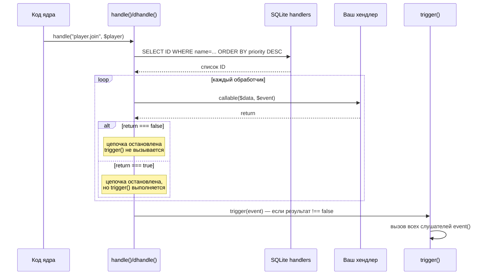
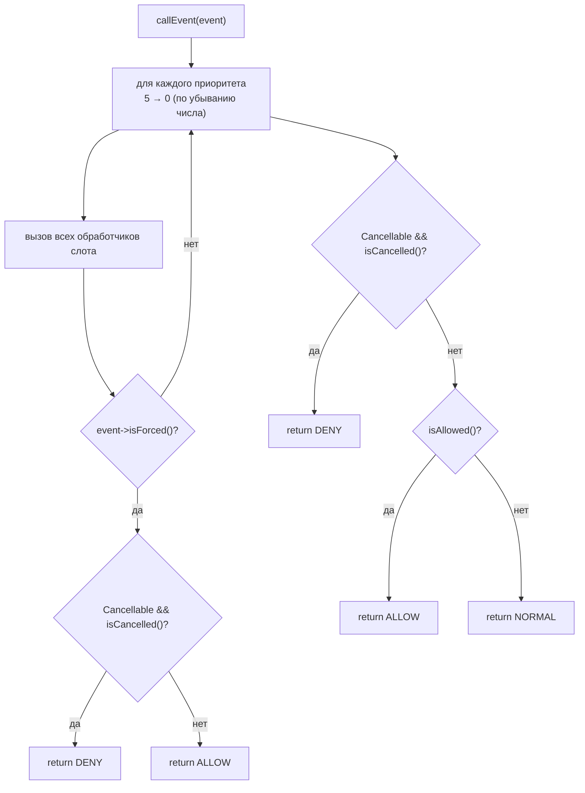
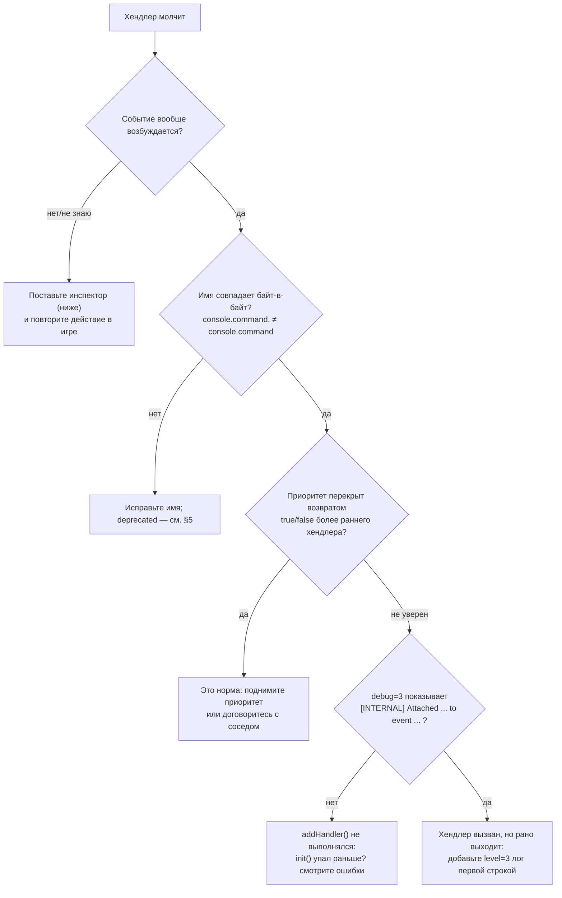

# WorldPECore Plugin API

# Часть 4 — События, Хуки и Расширения

> В ядре сосуществуют **две** событийные системы. Обе доступны плагинам одновременно.
>
> | | Legacy («хуки») | OOP (`BaseEvent`) |
> |---|---|---|
> | Регистрация | `$api->addHandler("имя", cb, prio)` | `Событие::register(cb, EventPriority::…)` |
> | Payload | массив / объект по ссылке | объект события |
> | Отмена | возврат `false` из хендлера | `$event->setCancelled()` |
> | Где используется | вся игровая логика (~60 событий) | сетевые пакеты (4 события) |

## Содержание части

- [1. Legacy-система: механика](#1-legacy-система-механика)
- [2. Каталог legacy-событий](#2-каталог-legacy-событий)
  - [2.1. Сервер](#21-сервер) · [2.2. Команды](#22-команды) · [2.3. Игрок](#23-игрок)
  - [2.4. Сущности](#24-сущности) · [2.5. Мир, тайлы, предметы](#25-мир-тайлы-предметы)
- [3. OOP-система: BaseEvent](#3-oop-система-baseevent)
- [4. Пакетные события](#4-пакетные-события)
- [5. Устаревшие события](#5-устаревшие-события)
- [6. Какую систему выбрать](#6-какую-систему-выбрать)

---

## 1. Legacy-система: механика



Ключевые правила:

1. **Приоритет** — целое число, сортировка `ORDER BY priority DESC`: *больше = раньше*. Ядро использует `1` для критичных проверок прав (BanAPI); дефолт `5`; типичное значение для плагинов-наблюдателей — `15`.
2. **`false` — вето**: действие отменяется, последующие хендлеры не вызываются, слушатели не уведомляются. Возврат `true` подтверждает действие и тоже останавливает обход (более поздние хендлеры пропускаются).
3. **Мутации payload**: `handle()` передаёт данные по ссылке — изменённые значения видны ядру после цепочки (например, `player.invisible` читает обратно `status`). Используйте `dhandle()` для копии.
4. **Два способа подписки**:
   - `addHandler($name, callable, $priority)` → участие в решении (может отменять);
   - `$server->event($name, callable)` → только уведомление после решения; ID для отписки `deleteEvent($id)`.
5. **Снятие хендлера не предусмотрено**; слушатель снимается `deleteEvent($id)`.
6. Некаллибельные записи в `trigger()` молча удаляются.

Второй аргумент хендлера — имя события (`$eventName`) — полезен, когда один метод слушает несколько имён (как инспектор в §7.1) или когда шедулер передаёт вашу метку из `schedule(..., "myplugin.tick")`.

Подписка:

```php
public function init(){
    // как метод объекта:
    $this->api->addHandler("player.block.break", [$this, "onBreak"], 5);
    // замыканием:
    $this->api->addHandler("player.join", function(Player $p){
        $p->sendChat("Привет!");
    }, 15);
}
// Сигнатура хендлера всегда: ($data, string $eventName)
```

Слушатель через `event()` (без права вето, с возможностью отписки):

```php
$evid = ServerAPI::request()->event("player.join", [$this, "notifyStats"]);
// ...в любой момент:
ServerAPI::request()->deleteEvent($evid);
```

Разница на пальцах — один и тот же сценарий, два стиля:

| Ситуация | `addHandler` (prio 15) | `event()` |
|---|---|---|
| Другой плагин запретил действие (`false` раньше) | **не вызывается** | не вызывается (trigger пропущен) |
| Действие разрешено | вызывается | вызывается |
| Хочу отменить | могу (`false`) | не могу |
| Снять подписку | нельзя | `deleteEvent($id)` |

#### 1.1. Сквозной трассировщик: два плагина на одном событии

Разберём `player.block.place` при приоритетах A=15 и B=5:

| Шаг | Кто | Действие | Результат цепочки |
|---|---|---|---|
| 1 | SQL | выборка: A(15) раньше B(5) | порядок зафиксирован |
| 2 | A | логирует установку, возвращает `null` | продолжаем |
| 3a | B | запрещает в чужом регионе → `return false` | **цепочка прервана**, блок не поставлен, слушатели не уведомлены |
| 3b | B *(вариант)* | подтверждает → `return true` | цепочка прервана, но блок ставится и `trigger()` выполняется |

Выводы для дизайна: наблюдатель никогда не возвращает `true/false`; запретитель ставит высокий приоритет (раньше всех решает); логгер — низкий или средний и всегда `null`.


---

## 2. Каталог legacy-событий

Обозначения колонок: **payload** — что приходит первым аргументом; **`false`** — эффект возврата false хендлером; **`true`** — эффект возврата true. «—» означает отсутствие специальной семантики.

> Соглашения об именах: префикс = домен (`player.`/`entity.`/`tile.`/`console.`/`server.`/`api.`), суффиксы-модификаторы через точку (`.bypass`, `.invalid`, `.spawn`) — это *отдельные* события, а не флаги. Payload бывает массивом, объектом (`Player`/`Container`/`Tile`) или скаляром — всегда сверяйтесь с таблицей группы.

### 2.1. Сервер

| Событие | Payload | Возбуждается | `false` | `true` |
|---|---|---|---|---|
| `server.start` | `float` — microtime старта | конец `PocketMinecraftServer::init()` | — | — |
| `server.close` | `string` — причина остановки | `close()` | — | — |
| `server.chat` | `Container` (mutable: текст/фильтры) | каждое сообщение через `ChatAPI::send()` | доставка всем игрокам отменена | — |
| `server.debug` | `array &$info` — статистика (mutable) | `debugInfo()` | — | — |
| `server.noauthpacket.<pid>` | `Packet` | пакет от неизвестной сессии (handshake) | обработка пакета прервана | — |
| `async.curl.get` | `[ "response" => string ]` | завершение async HTTP | — | — |
| `mcinterface.read` | `[ "buffer", "source", "port" ]` | каждая принятая датаграмма | — | — |
| `query.update` | `null` | обновление query-данных | — | — |
| `server.schedule` | данные задачи шедулера | вызов каждой задачи (метка `$eventName`) | задача снимается | — |

#### 2.1.0. Пример: свои метрики в `/status`

```php
public function init(){
    // server.debug прогоняет массив статистики через хендлеры:
    $this->api->addHandler("server.debug", [$this, "metrics"], 10);
}

public function metrics(&$info){          // mutable!
    $info["myplugin.queue"]     = count($this->queue);
    $info["myplugin.pendingDB"] = count($this->pending);
}
```

После этого `status` (алиас `tps`) покажет ваши счётчики рядом с памятью и TPS.

⚠️ `server.start` и `server.close` возбуждаются через `trigger()` — подписывайтесь именно методом `event()`, а не `addHandler()` (хендлеры на эти имена вызваны не будут).

```php
public function init(){
    ServerAPI::request()->event("server.start", [$this, "onStart"]);
    ServerAPI::request()->event("server.close", [$this, "onClose"]);
}

public function onStart($startTimeFloat){
    // миры загружены, можно ставить задачи и трогать уровни:
    $this->api->schedule(20, [$this, "minuteTick"], [], true);
}

public function onClose($reason){
    // чат ещё жив; сеть уже будет закрыта следом:
    $this->flushLogs();          // свои файлы — да
    // $this->api->chat->... — допустимо, но бесполезно игрокам
}
```

#### 2.1.1. Пример: фильтр чата (мутируем Container)

```php
private array $badWords = ["дурак", "читер"];

public function init(){
    $this->api->addHandler("server.chat", [$this, "filter"], 10);
}

public function filter($container){
    $msg = $container->get()["message"];            // payload: ["player"=>..,"message"=>..]
    foreach($this->badWords as $w){
        if(stripos($msg, $w) !== false){
            return false;                            // никто не получит сообщение
        }
    }
    // мягкая замена — мутируем нельзя напрямую: пересоберите отправку:
    // (Container не имеет setter'ов, поэтому «замена» = запрет+повторная отправка)
    return null;
}
```

Поскольку `Container` read-only (`get()/check()`), стратегии фильтра две: **запрет** (`false`) или **переотправка очищенного текста** своим каналом с последующим `false`.

### 2.2. Команды

Payload всех командных событий одинаков:

```php
[ "cmd" => string, "parameters" => array, "issuer" => Player|"console"|RCON, "alias" => string|false ]
```

| Событие | Когда | `false` | `true` |
|---|---|---|---|
| `console.command.<cmd>` | до общего события, per-command | команда запрещена → *"You don't have permissions"* (если существует) либо *"Command doesn't exist!"* | пропуск команды без сообщений |
| `console.command` | после per-command | то же | то же |
| `console.check` | из проверки прав BanAPI (`isOp`-альтернатива для команд) | — | исполнителю разрешена команда без OP |
| `console.command.unknown` | команда не зарегистрирована (ключ `"params"`!) | стандартная обработка подавлена (молча) | — |

Порядок раскрытия селекторов `@player/@world/@all/@random` происходит **до** событий — параметры приходят уже подставленными.

```php
// Запрет команды всем, кроме своего тира:
$this->api->addHandler("console.command.warp", function($data){
    if(!in_array($data["issuer"]->iusername ?? "", $this->allowed)) return false;
});
```

#### 2.2.1. Пример: ранги без правки ops.txt

```php
// ranks: guest < vip < admin
private array $ranks = ["notch" => "admin", "steve" => "vip"];

public function init(){
    // console.check: true => исполнителю разрешена ЛЮБАЯ команда (аналог OP)
    $this->api->addHandler("console.check", [$this, "grant"], 10);
}

public function grant($data){
    $who = strtolower($data["issuer"]->iusername ?? (string)$data["issuer"]);
    return ($this->ranks[$who] ?? "") === "admin" ? true : null;
}
```

#### 2.2.2. Пример: своя реакция на неизвестную команду

```php
public function init(){
    $this->api->addHandler("console.command.unknown", [$this, "unknown"], 5);
}
public function unknown($data){
    if($data["issuer"] instanceof Player){
        $data["issuer"]->sendChat("Нет такой команды. Ближайшая: /help");
        return true;   // подавить стандартное "Command doesn't exist!"
    }
    return null;
}
```

#### 2.2.3. Пример: три уровня прав на подкоманды одной команды

```php
// ranks: member < moderator < admin
private function rankOf($issuer): string{
    if(!($issuer instanceof Player)) return "admin";          // консоль = admin
    $u = $issuer->iusername;
    if($this->admins[$u] ?? false) return "admin";
    if($this->api->ban->isOp($u))   return "moderator";
    return "member";
}

public function init(){
    // Пер-командный хук срабатывает ДО общего — идеален для своих команд:
    $this->api->addHandler("console.command.warpadmin", [$this, "gate"], 12);
}

public function gate($data){
    $need = ["warp set" => "moderator", "warp delete" => "admin"];
    $line  = $data["cmd"]." ".strtolower(implode(" ", array_slice($data["parameters"], 0, 1)));
    foreach($need as $sub => $min){
        if(str_starts_with($line, $sub)
           && $this->rankLevel($this->rankOf($data["issuer"])) < $this->rankLevel($min)){
            return false;                                     // запрет конкретной подкоманды
        }
    }
    return null;
}
```

### 2.3. Игрок

> Особенность группы: событие `player.connect/join/quit` передают **сам объект `Player`**, а не массив — проверяйте тип и используйте поля напрямую (`$p->iusername`, `$p->entity`).

| Событие | Payload | Когда | `false` |
|---|---|---|---|
| `player.connect` | `Player` | валидация ника пройдена, до whitelist/бан-проверок | kick *"Unknown reason"* |
| `player.join` | `Player` | профиль загружен (`PlayerAPI::add()`), до выдачи инвентаря | kick *"join cancelled"* |
| `player.quit` | `Player` | начало `close()`, до сохранения профиля | — |
| `player.death` | `[ "player" => Player, "cause" => string ]` | смерть аватара (после `entity.death`) | — |
| `player.teleport` | `[ "player" => Player, "target" => Vector3 ]` | любой телепорт внутри мира | телепорт отменён |
| `player.teleport.level` | `[ "player", "origin" => Level, "target" => Position ]` | переход между мирами | переход отменён |
| `player.gamemode.change` | `[ "player", "gamemode" => int ]` | `setGamemode()` | смена отменена |
| `player.pickup` | `[ "eid", "player", "entity" => ItemEntity, "block" => id:int, "meta", "target" => eid ]` | подбор предмета-сущности | предмет остался лежать |
| `player.invisible` | `&[ "target" => Player, "for" => Player, "status" => bool ]` (mutable!) | изменение видимости | — |
| `player.checkspawnpos` | `[ "player" ]` | проверка точки возрождения при входе/респавне | проверка пропущена |
| `player.offline.get` | `Config &$data` профиля | загрузка офлайн-профиля | — (мутируйте конфиг) |
| `player.offline.save` | `Config &$data` | сохранение профиля | — |
| `player.armor` | `[ "slots" => Item[] ]` | рассылка брони без конкретного адресата | — |
| `player.flying` | *(объявлено, ядром не возбуждается)* | зарезервировано; подписка безопасна | — |

#### Блоки игрока

| Событие | Payload | Когда | `false` | `true` |
|---|---|---|---|---|
| `player.block.touch` | break: `[ "type"=>"break", "player", "target"=>Block, "item"=>Item ]`<br>place: `[ "type"=>"place", "player", "block", "target", "item" ]` | любое касание блока (первое в конвейере) | ломание/установка отменены | — |
| `player.block.break` | `[ "player", "target" => Block, "item" ]` | финальное ломание | блок не сломан | подтверждение |
| `player.block.break.bypass` | тот же | если основной хук запретил | — | игнорировать запрет |
| `player.block.break.invalid` | тот же | блок неразрушим (`isBreakable=false`) | — | разрешить сломать «неразрушимое» |
| `player.block.break.spawn` | тот же | не-OP в радиусе `spawn-protection` | — | обойти защиту спавна |
| `player.block.place` | `[ "player", "block" => Block(ставится), "target" => Block(куда), "item" ]` | финальная установка | установка отменена | подтверждение |
| `player.block.place.bypass` / `.invalid` / `.spawn` | тот же | аналогично break-* | — | обход соответствующего запрета |
| `player.block.activate` | `[ "player", "block", "target", "item" ]` | ПКМ по интерактивному блоку | активация блока отменена | — |

Порядок конвейера ломания: `touch(break)` → `break` → [`bypass`] → дроп → `blockUpdateAround`. Для установки: `touch(place)` → `place.invalid` (если воздух/нельзя) → [`bypass`] → `activate` → `place`.

#### 2.3.1. Мини-плагин RegionProtect (полный листинг)

Защита куба 50×50 вокруг точки спавна мира `world`:

```php
class RegionProtect implements Plugin{
    private $api;
    public function __construct(ServerAPI $api, $server = false){ $this->api = $api; }

    public function init(){
        // Высокий приоритет: решаем раньше логгеров.
        $this->api->addHandler("player.block.touch", [$this, "guard"], 12);
        // Разрешаем OP обходить даже чужие плагины:
        $this->api->addHandler("player.block.break.bypass", [$this, "opBypass"], 14);
        $this->api->addHandler("player.block.place.bypass", [$this, "opBypass"], 14);
    }

    private function protectedArea(Position $p): bool{
        if(strtolower($p->level->getName()) !== "world") return false;
        $s = ServerAPI::request()->spawn;
        return abs($p->x - $s->x) <= 25 && abs($p->z - $s->z) <= 25
            && $p->y > max(0, $s->y - 10);
    }

    public function guard($data){
        $player = $data["player"] ?? null;
        $pos = $data["type"] === "break" ? ($data["target"] ?? null) : ($data["target"] ?? $data["block"] ?? null);
        if(!$player instanceof Player || !$pos instanceof Vector3) return null;
        if($this->api->ban->isOp($player->iusername)) return null;      // OP — можно
        return $this->protectedArea(new Position($pos->x,$pos->y,$pos->z,$player->level))
            ? false   // запрет: и touch, и последующий break/place отменятся сами
            : null;
    }

    public function opBypass($data){
        // если кто-то ниже нас запретил — OP всё равно ломает:
        return isset($data["player"]) && $this->api->ban->isOp($data["player"]->iusername)
            ? true : null;
    }
}
```

Обратите внимание на связку: запрет в `touch` уже отменяет действие; `.bypass`-хуки нужны, когда запрет пришёл от *другого* плагина позже по приоритету.

#### 2.3.2. WelcomeGuard: join/quit/death

```php
public function init(){
    $this->api->addHandler("player.join", [$this, "join"], 15);
    $this->api->addHandler("player.quit", [$this, "quit"], 15);
    $this->api->addHandler("player.death", [$this, "death"], 15);
}

public function join($p){
    if(!$p instanceof Player) return null;
    $first = !$p->data->exists("myplugin.seen");
    if($first){ $p->data->set("myplugin.seen", time()); $this->api->player->saveOffline($p->data); }
    $this->api->chat->broadcast(FORMAT_AQUA . $p->username . ($first ? " впервые здесь!" : " зашёл."));
    return null;
}

public function quit($p){ /* payload — сам Player */ }

public function death($d){          // ["player" => Player, "cause" => string]
    $msgs = [
        "fall" => "%s разбился",
        "lava" => "%s решил искупаться в лаве",
        "generic" => "%s погиб",
    ];
    $this->api->chat->broadcast(sprintf($msgs[$d["cause"]] ?? $msgs["generic"], $d["player"]->username));
    return null;
}
```

#### 2.3.3. Телепорт-страж (запрет выхода из арены)

```php
$this->api->addHandler("player.teleport.level", [$this, "gate"], 12);

public function gate($d){
    $inArena = strtolower($d["origin"]->getName()) === self::ARENA;
    $toArena = strtolower($d["target"]->level->getName()) === self::ARENA;
    if($inArena && !$toArena && !$this->inLobby[$d["player"]->iusername] ?? false){
        $d["player"]->sendChat("Из арены только /arena leave");
        return false;                       // переход между мирами отменён
    }
    return null;
}
```

#### 2.3.4. Контроль подбора (двойной дроп, VIP-лут)

```php
public function init(){
    $this->api->addHandler("player.pickup", [$this, "pickup"], 12);
}

public function pickup($d){
    // payload: eid, player(Player), entity(ItemEntity), block(id), meta, target(eid)
    if($d["block"] === Item::DIAMOND && !$this->api->ban->isOp($d["player"]->iusername)){
        $extra = BlockAPI::getItem(Item::DIAMOND, 0, 1);
        $this->api->entity->drop($d["player"]->entity->round(), $extra); // бонус VIP-ранга позже
    }
    return null;   // false — игрок НЕ подберёт предмет (останется лежать)
}
```

#### 2.3.5. Миграция офлайн-профилей (offline.get/save)

```php
public function init(){
    $this->api->addHandler("player.offline.get", [$this, "migrate"], 10);
}

public function migrate(&$cfg){          // Config профиля по ссылке!
    if(!$cfg->exists("myplugin.v2")){
        // одноразовая миграция старых данных при первом входе:
        $old = $cfg->get("myplugin.oldcoins", 0);
        $cfg->set("money", $old * 100);
        $cfg->set("myplugin.v2", true);
        // сохранение произойдёт автоматически при загрузке нового профиля
    }
    return null;
}
```

#### 2.3.6. Видимость: мутируемый payload player.invisible

Единственное частое событие, где ядро **читает обратно** изменённые данные — образцовый случай легальной мутации:

```php
public function init(){
    $this->api->addHandler("player.invisible", [$this, "spy"], 10);
}

public function invisible(&$d){          // &[target, for, status]
    // скрываем админов от обычных игроков всегда:
    if($this->api->ban->isOp($d["target"]->iusername)
       && !$this->api->ban->isOp($d["for"]->iusername)){
        $d["status"] = true;             // ядро применит это значение
    }
}
```


### 2.4. Сущности

| Событие | Payload | Когда | `false` |
|---|---|---|---|
| `entity.add` | `Entity` | регистрация сущности (`addRaw`) | — |
| `entity.remove` | `Entity` | удаление (перед вычисткой индексов) | — |
| `entity.move` | `Entity` (игрок) | сменилась позиция аватара | сервер телепортирует игрока назад — **точка античита** |
| `entity.motion` | `Entity` (предмет после дропа и др.) | рассылка импульса движения | — |
| `entity.metadata` | `Entity` | обновление метаданных | — |
| `entity.link` | `[ "rider" => eid, "riding" => eid, "type" => 0 ]` | посадка верхом | — |
| `entity.health.change` | `[ "entity" => Entity, "eid", "health" => int, "cause" => string ]` | каждое изменение здоровья (`setHealth`) | изменение отменено (кроме `$force=true`) |
| `entity.death` | `[ "entity", "cause" ]` | здоровье ≤ 0, до дропа и анимации | смерть отменена полностью |
| `entity.explosion` | `[ "level" => Level, "source" => Position, "size" => float ]` | перед расчётом взрыва | взрыв отменён |
| `entity.animal.breed` | `[ "parent" => Animal, "parent2" => Animal ]` | размножение животных | — |

#### 2.4.1. Пример: запрет ТНТ в мире, кастомные «взрывы»

```php
public function init(){
    $this->api->addHandler("entity.explosion", [$this, "boom"], 10);
}
public function boom($d){
    if(strtolower($d["level"]->getName()) === "spawn") return false;   // на спавне тихо
    if($d["size"] > 6){ $this->log("big boom @ " . $d["source"]); }
    return null;
}
```

#### 2.4.2. Пример: кастомные сообщения смерти мобов + статистика

`player.death` и `entity.death` — разные события: первое для аватаров игроков (после второго), второе — для всех сущностей. Логгер убийств мобов ставится на `entity.death`, но payload не содержит атакующего — причину (`cause`) формирует ядро/стрелявший код. Для точной атрибуции перехватывайте более ранние точки: `INTERACT_PACKET` через OOP-событие или `harm()`-вызовы ваших собственных механик.

#### 2.4.3. Пример: «вторая жизнь» моба (отмена смерти + респавн)

```php
public function init(){
    $this->api->addHandler("entity.death", [$this, "bossLife"], 12);
}

public function death($d){
    $e = $d["entity"];
    // наш босс определён по метке в данных сущности:
    if(($e->data["boss"] ?? false) === true && ($this->lives[$e->eid] ?? 1) > 0){
        --$this->lives[$e->eid];
        return false;   // смерть отменена: дропа не будет, HP уже ≤0!
    }
    return null;
}
```

⚠️ Тонкость: отмена `entity.death` НЕ восстанавливает `$health` — она лишь прерывает обработку (`makeDead`). Сразу после отмены поднимите здоровье: `$e->setHealth(20, "revive", true);` иначе сущность останется «мёртвой» и умрёт при следующем уроне.


### 2.5. Мир, тайлы, предметы

| Событие | Payload | Когда | `false` |
|---|---|---|---|
| `item.drop` | `&[ "x","y","z", "level" => Level, "speedX/Y/Z", "item" => Item, "itemID" => int ]` | выброс предмета-сущности | дроп не создаётся |
| `tile.update` | `Tile` | изменение содержимого/парного сундука/текста таблички | — |
| `tile.container.slot` | `&[ "tile" => Tile, "slot" => int, "offset" => int, "slotdata" => Item ]` (mutable!) | любое изменение слота контейнера | — |
| `tile.remove` | `Tile` | удаление тайла | — |
| `time.change` | `[ "level" => Level, "time" => int ]` | каждый сетевой тик времени в `Level::setTime`-конвейере | рассылка времени клиентам прервана |
| `achievement.grant` | `[ "player" => Player, "achievementId" => string ]` | выдача достижения (после проверки предков) | достижение не выдано |
| `achievement.broadcast` | тот же | объявление о достижении | — ; `true` подавляет стандартное сообщение чата |
| `op.check` | `string $username` | каждая проверка прав BanAPI | — ; `true` ⇒ игрок OP |
| `api.ban.check` | `string $username` (lowercase) | проверка бана ника | `false` ⇒ игрок считается забаненным |
| `api.ban.ip.check` | `string $ip` | проверка бана IP | `false` ⇒ IP забанен |
| `api.ban.whitelist.check` | `string $username` | проверка whitelist | `false` ⇒ игрок в whitelist |

> ⚠️ Обратите внимание на инверсию: в ban/whitelist хуках `false` означает положительный вердикт «забанен/в списке», а не отмену.

События из колонки «рассылочные» (`entity.motion/animate/event/metadata/link`, `player.equipment.change`, `tile.update`, `server.chat`) дополнительно слушаются самим ядром через `event()` для доставки пакетов игрокам — поэтому их отмена через `handle()` имеет наблюдаемые эффекты (см. таблицы выше).

#### 2.5.1. Пример: no-drop зона (запрет выброса предметов)

```php
$this->api->addHandler("item.drop", [$this, "noDrop"], 12);

public function noDrop($d){   // &[x,y,z,level,item,itemID,...]
    if(strtolower($d["level"]->getName()) === "lobby"){
        return false;         // предмет не появится в мире
    }
    return null;
}
```

#### 2.5.2. Пример: логгер содержимого сундуков (анти-взлом)

```php
public function init(){
    $this->api->addHandler("tile.container.slot", [$this, "slotLog"], 15);
}

public function slotLog(&$d){     // &[tile, slot, offset, slotdata]
    $t = $d["tile"];
    $item = $d["slotdata"];
    if(!$item instanceof Item || $item->getID() === 0) return null;
    $this->db->query("INSERT INTO slots VALUES (NULL,"
        . "'".$this->db->escapeString(strtolower($t->level->getName()))."',"
        . (int)$t->x.",".(int)$t->y.",".(int)$t->z.","
        . (int)$d["slot"].",".(int)$item->getID().",".(int)$item->getMetadata().","
        . (int)$item->count.");");
    return null;                  // никогда не мешаем игре
}
```

#### 2.5.3. Пример: остановка времени на ночь (time.change)

```php
public function init(){
    $this->api->addHandler("time.change", [$this, "freeze"], 10);
}
public function freeze($d){
    // ядро шлёт время каждые 5 тиков; false = клиентам не отправлять
    // здесь — просто наблюдение и принудительная коррекция:
    $lv = $d["level"];
    if(isset($this->frozen[strtolower($lv->getName())])){
        if($this->api->time->get(true, $lv) > TimeAPI::$phases["sunset"] + 200){
            $this->api->time->set(TimeAPI::$phases["sunset"], $lv); // откатываем назад
        }
    }
    return null;
}
```


---

## 3. OOP-система: BaseEvent

Классы: `src/BaseEvent.php`, `src/event/EventHandler.php`, `src/event/EventPriority.php`, интерфейс `src/event/CancellableEvent.php`.

### 3.1. Статический API события

Каждое конкретное событие обязано объявить статические реестры:

```php
class MyEvent extends ServerEvent implements CancellableEvent{
    public static $handlers;
    public static $handlerPriority;

    private $payload;
    public function __construct($payload){ $this->payload = $payload; }
    public function getPayload(){ return $this->payload; }
}
```

| Метод | Сигнатура → возврат | Описание |
|---|---|---|
| `register` | `MyEvent::register(callable $handler, int $priority = EventPriority::NORMAL): bool` | Подписка; `false` если приоритет вне диапазона или handler уже подписан (дедупликация по идентификатору callable) |
| `unregister` | `MyEvent::unregister(callable $handler): bool` | Отписка |
| `getHandlerList` / `getPriorityList` | static | Инспекция подписок |
| `unregisterAll` | static | Полная очистка (вызывается ядром при перезапуске API) |

### 3.2. Приоритеты (`EventPriority`)

| Константа | Значение | Смысл |
|---|---|---|
| `LOWEST` | 5 | Выполняется первым; может изменить исход |
| `LOW` | 4 | |
| `NORMAL` | 3 | По умолчанию |
| `HIGH` | 2 | |
| `HIGHEST` | 1 | Последнее слово среди обычных обработчиков |
| `MONITOR` | 0 | Только наблюдение; изменения запрещены этикетом |

Порядок выполнения — по убыванию числа (как в Bukkit).

### 3.3. Состояние события

Внутренний статус — битовая маска:

```php
BaseEvent::ALLOW   = 0;      // разрешено
BaseEvent::DENY    = 1;      // отменено
BaseEvent::NORMAL  = 2;      // нейтрально
BaseEvent::FORCE   = 0x80000000; // флаг принудительного решения
```

| Метод объекта | Описание |
|---|---|
| `isCancelled(): bool` / `setCancelled(bool $forceCancel = false)` | Отмена работает только при реализации `CancellableEvent`; `$force = true` ставит бит FORCE |
| `isAllowed(): bool` / `setAllowed(bool $forceAllow = false)` | Явное разрешение (редко нужно: достаточно не отменять) |
| `isNormal()` / `setNormal()` | Нейтральное состояние — стартовое у каждого события |
| `isForced(): bool` | Было ли форсированное решение |
| `getEventName()` / `getPrioritySlot()/setPrioritySlot(int)` | Имя класса / текущий слот приоритета (служебное) |

Семантика FORCE на примере: если в любом приоритете вызвать `$ev->setCancelled(true)` (с `force=true`), то `EventHandler::callEvent()` завершится **сразу после этого слота** с вердиктом `DENY` — поздние приоритеты уже не выполнятся. Это инструмент «окончательного решения», а не обычная отмена; без force обход продолжается до конца списка.

### 3.4. Алгоритм `EventHandler::callEvent(BaseEvent $event)`



Вызывающий код сравнивает результат с `BaseEvent::DENY` и решает, продолжать действие:

```php
// src/Player.php:
if(EventHandler::callEvent(new DataPacketSendEvent($this, $packet)) === BaseEvent::DENY){
    return; // пакет не отправлен
}
```

### 3.5. Своё OOP-событие: полный пример

Плагины могут пользоваться той же механикой для внутренних расширяемых точек:

```php
// 1) Объявляем событие (один раз, в своём файле):
class JobDoneEvent extends ServerEvent implements CancellableEvent{
    public static $handlers;
    public static $handlerPriority;

    private $who;
    private $result;
    public function __construct(string $who, array $result){
        $this->who = $who; $this->result = $result;
    }
    public function getWho(): string{ return $this->who; }
    public function getResult(): array{ return $this->result; }
    public function setResult(array $r): void{ $this->result = $r; }
}

// 2) Возбуждение в вашем коде:
$status = EventHandler::callEvent(new JobDoneEvent($worker, $data));
if($status === BaseEvent::DENY){ /* подписчики отменили — не публикуем */ }

// 3) Подписка другого плагина:
JobDoneEvent::register(function(JobDoneEvent $ev){
    console($ev->getWho() . " закончил: " . count($ev->getResult()));
}, EventPriority::NORMAL);
```

Требования к классу события: наследование `ServerEvent` (или `BaseEvent`), **обязательные** статические `$handlers/$handlerPriority` (иначе `register()` не сработает), геттеры payload. Отмена имеет смысл только при `implements CancellableEvent`.

### 3.6. Этикет приоритетов и MONITOR

```php
// ❌ ПЛОХО: изменение события на MONITOR
DataPacketReceiveEvent::register(function(DataPacketReceiveEvent $ev){
    $ev->setCancelled();            // ломает контракт для всех
}, EventPriority::MONITOR);

// ✅ ХОРОШО: MONITOR только читает
DataPacketSendEvent::register(function(DataPacketSendEvent $ev){
    $this->stats[$ev->getPacket()->pid()] = ($this->stats[$ev->getPacket()->pid()] ?? 0) + 1;
}, EventPriority::MONITOR);
```

Смысл уровней: LOWEST/HIGH — «подготовить/скорректировать решение», HIGHEST — «последнее слово», MONITOR — «только смотреть». В legacy-системе аналогичную роль играют высокие числа без возвратов.

### 3.7. handle() против dhandle(): когда что

```php
// handle(): данные ПО ССЫЛКЕ — хендлеры могут мутировать, ядро увидит изменения
$this->server->api->handle("player.invisible", $data);   // ядро читает $data["status"] после

// dhandle(): по значению — безопасно для «просто уведомить»
$result = $this->server->api->dhandle("op.check", $username);
```

Плагину почти всегда нужен только `dhandle()` (через `$api`) при возбуждении собственных событий; `handle()` с ссылкой — инструмент ядра.

---

## 4. Пакетные события

Единственная группа, переведённая на OOP-механику. Все четыре класса — `CancellableEvent`.

| Класс | Конструктор | Уровень | Геттеры |
|---|---|---|---|
| `PacketReceiveEvent` | `(Packet $packet)` | сырая датаграмма до распознавания (`MinecraftInterface::readPacket`) | `getPacket()` |
| `PacketSendEvent` | `(Packet $packet)` | сырая датаграмма перед записью в сокет | `getPacket()` |
| `DataPacketReceiveEvent` | `(Player $player, RakNetDataPacket $packet)` | игровой пакет после маршрутизации в сессию | `getPlayer()`, `getPacket()` |
| `DataPacketSendEvent` | `(Player $player, RakNetDataPacket $packet)` | перед каждой отправкой игрового пакета | `getPlayer()`, `getPacket()` |

У объектов пакетов на этом уровне уже заполнены `ip`/`port` (адресат/источник) — удобно для логов и IP-фильтров без разбора payload.

Подписка и типовой обработчик:

```php
public function init(){
    DataPacketReceiveEvent::register([$this, "onReceive"], EventPriority::NORMAL);
}

public function onReceive(DataPacketReceiveEvent $event){
    $player = $event->getPlayer();
    $pk     = $event->getPacket();

    switch(true){
        case $pk->pid() === ProtocolInfo::CONTAINER_CLOSE_PACKET:
            // ...своя логика закрытия окна...
            break;
        case $pk->pid() === ProtocolInfo::USE_ITEM_PACKET:
            if(/* запрещено */ false){
                $event->setCancelled();     // пакет отброшен, ядро его не увидит
            }
            break;
    }
}
```

Отмена на уровнях:

| `PacketReceiveEvent::DENY` — датаграмма вообще игнорируется (до RakNet-разбора);
- `DataPacketReceiveEvent::DENY` — пакет доходит до сессии, но игровой обработке не подлежит;
- `DataPacketSendEvent::DENY` / `PacketSendEvent::DENY` — исходящий пакет не покидает сервер.

Отмена на уровне `Packet*` экономит CPU ядра (нет разбора), но лишает контекста; на уровне `DataPacket*` у вас есть `$player` для персональных решений.

⚠️ Перехватывайте минимально необходимое: `DataPacketSendEvent` вызывается для **каждого** пакета каждого игрока — тяжёлый код здесь напрямую съедает TPS.

Куда именно вплетены события отправки (проверенные точки ядра):

| Точка отправки | Проходит `DataPacketSendEvent`? |
|---|---|
| `$player->dataPacket($pk)` | ✅ |
| `$player->directDataPacket($pk)` | ✅ |
| `$player->sendChatMessagePacket($pk)` — чат-батчи | ✅ |
| `$player->entityQueueDataPacket($pk)` | ❌ (минуя OOP-событие) |
| `$player->send(RakNetPacket)` — сырой RakNet | ❌ |
| `$server->send($packet)` | только `PacketSendEvent` (уровень интерфейса) |

То есть «скрыть пакет от игрока» через OOP-событие работает не для всех путей отправки — entityQueue и raw-send идут мимо. Учитывайте это при фильтрации.

### 4.1. Примеры

#### Быстрый выход по `pid()` (switch без создания объектов)

```php
public function onReceive(DataPacketReceiveEvent $ev){
    switch(true){
        case $ev->getPacket()->pid() === ProtocolInfo::USE_ITEM_PACKET:
            $p = $ev->getPlayer();
            if(strtolower($p->level->getName()) === "lobby"){
                $ev->setCancelled();          // в лобби нельзя «использовать»
            }
            return;
        case $ev->getPacket()->pid() === ProtocolInfo::CONTAINER_CLOSE_PACKET:
            $this->onWindowClose($ev->getPlayer(), $ev->getPacket());
            return;
    }
}
```

#### Очистка GUI-сундуков при закрытии окна (продолжение паттерна 5.4 из Части 2)

```php
private function onWindowClose(Player $p, RakNetDataPacket $pk){
    $tile = $this->menus[$p->iusername] ?? null;
    if($tile instanceof Tile && (!is_object($p->windows[$pk->windowid] ?? null)
        || ($p->windows[$pk->windowid]->class ?? "") === TILE_CHEST)){
        // игрок закрыл именно наш сундук — убираем тайл и подсвечиваем блок
        $this->api->schedule(5, [$tile, "close"], []);
        unset($this->menus[$p->iusername]);
    }
}
```

### 4.2. Матрица отмены (шпаргалка)

| Хочу запретить | Система | Точка | Как |
|---|---|---|---|
| Ломание блока | legacy | `player.block.touch(break)` / `.break` | `return false` |
| Установку блока | legacy | `touch(place)` / `.place` | `false`; обход чужого запрета — `.bypass` с `true` |
| Действие в спавн-зоне ядра | legacy | `.break.spawn`/`.place.spawn` | `true` = обойти защиту |
| Команду | legacy | `console.command[.<cmd>]` | `false` (или `true` = тихий пропуск) |
| Сообщение чата | legacy | `server.chat` | `false` |
| Телепорт между мирами | legacy | `player.teleport.level` | `false` |
| Урон | legacy | `entity.health.change` | `false` (мимо `$force`) |
| Дроп предмета | legacy | `item.drop` | `false` |
| Взрыв | legacy | `entity.explosion` | `false` |
| Выдачу достижения | legacy | `achievement.grant` | `false` |
| Вход игрока | legacy | `player.connect` / `.join` | `false` → кик с разной причиной |
| Любой пакет клиента | OOP | `DataPacketReceiveEvent` | `setCancelled()` |
| Исходящий пакет | OOP | `DataPacketSendEvent` / `PacketSendEvent` | `setCancelled()` |
| Сырую датаграмму до RakNet | OOP | `PacketReceiveEvent` | `setCancelled()` |

> Грабли, которые стоит знать: `Container` не имеет setter'ов (только запрет/переотправка); приоритет — просто число, «15» не гарантирует последний слот; payload бывает массивом или объектом в зависимости от события (см. таблицы §2); `register()` у своего BaseEvent вернёт `false`, если не объявлены статические `$handlers/$handlerPriority`.

---

## 7. Диагностика: «почему хендлер не вызывается»



#### 7.1. Инспектор событий (отладочный плагин)

```php
class EventInspector implements Plugin{
    private $api; private array $log = [];
    public function __construct(ServerAPI $a, $s = false){ $this->api = $a; }

    public function init(){
        // Подписка на самые частые события одним методом:
        foreach([
            "player.join","player.quit","player.connect","player.death",
            "player.block.break","player.block.place","player.block.touch",
            "player.pickup","item.drop","entity.death","entity.explosion",
            "server.chat","time.change","tile.container.slot",
        ] as $name){
            $this->api->addHandler($name, function($data) use ($name){
                $this->log[] = sprintf("[%s] %s", $name,
                    is_object($data) ? get_class($data) : substr(json_encode($data), 0, 120));
                console("[Inspect] $name", true, true, 3);   // только при DEBUG>=3
            }, 15);
        }
        // Дамп последних 30 записей по команде:
        $this->api->console->register("inspect", "", function(){
            return implode("\n", array_slice($this->log, -30)) . "\n";
        });
    }
}
```

Польза: мгновенно видно, какие события реально летают на вашем сервере, их порядок и payload-форму (`json_encode` первых 120 символов). В продакшн не оставляйте — пишет много.

#### 7.2. Чеклист поиска

- [ ] Имя события скопировано из этой документации, а не набрано по памяти.
- [ ] Подписка стоит в `init()`, а `init()` точно выполнился (`console(...,0)` маркер).
- [ ] Для `server.start/close` используется `event()`, для остальных — `addHandler()`.
- [ ] При `debug=3` видно `[INTERNAL] Attached <Class>::<method> to event <name>`.
- [ ] Ни один более ранний хендлер не возвращает `true/false` (проверьте свои же модули).
- [ ] Инспектор (§7.1) подтверждает возбуждение события.

---

## 5. Устаревшие события

Карта `Deprecation::$events` (`src/Deprecation.php`). Подписка на старое имя печатает `[ERROR] Event "..." has been deprecated. Substitute "..." found.` и указывает замену:

| Устаревшее | Замена |
|---|---|
| `server.tick` | `ServerAPI::schedule()` |
| `server.time` | `time.change` |
| `world.block.change` | `block.change` |
| `block.drop` | `item.drop` |
| `api.op.check` | `op.check` |
| `api.player.offline.get` | `player.offline.get` |
| `api.player.offline.save` | `player.offline.save` |

### 5.1. Как читать предупреждения Deprecation

При подписке на устаревшее имя ядро печатает:

```text
[ERROR] Event "block.drop" has been deprecated. Substitute "item.drop" found. [Adding handle to MyPlugin::onDrop]
```

Разбор строки: старое имя → найденная замена → **где именно** вы подписались (класс::метод или function). Хендлер при этом регистрируется и работает — но это маркер техдолга. Возбуждение устаревшего имени (ваш `dhandle("server.tick")`) даёт ту же ошибку с пометкой `[Trigger]`.

Типовое исправление:

```diff
- $this->api->addHandler("block.drop", [$this, "onDrop"], 15);
+ $this->api->addHandler("item.drop",  [$this, "onDrop"], 15);
```

Имена меняются точечно; payload замен, как правило, идентичен старому — карта составлялась парами «то же событие, новое имя».


---

## 6. Какую систему выбрать

```mermaid
flowchart TD
    A{"Что перехватываю?"} -->|"сырой пакет клиента/сервера"| OOP1["DataPacket*Event<br/>setCancelled()"]
    A -->|"датаграмму до RakNet-разбора"| OOP2["Packet*Event"]
    A -->|"игровое действие (блоки, вход, урон…)"| L1["addHandler(name, cb, prio)"]
    A -->|"старт/остановка сервера"| L2['event("server.start/close")']
    A -->|"своё внутреннее событие"| CUST["своё имя + handle()/trigger()<br/>или свой BaseEvent-класс"]
    L1 --> D{"Нужно отменять?"}
    D -- да --> P1["высокий приоритет + return false"]
    D -- "наблюдаю" --> P2["приоритет 15 + всегда null"]
```

| Задача | Решение |
|---|---|
| Реагировать на игровые действия (блоки, вход, урон) | legacy `addHandler` |
| Запретить/разрешить действие с условиями | legacy + возврат `false` (или bypass-хуки `.bypass/.invalid/.spawn` с `true`) |
| Фильтрация чата | legacy `server.chat` (запрет или переотправка — Container read-only) |
| Перехват сырых пакетов клиента | `DataPacketReceiveEvent::register()` |
| Блокировка исходящих пакетов | `DataPacketSendEvent` / `PacketSendEvent` |
| Подписка на старт/остановку сервера | `event("server.start"/"server.close")` |
| Наблюдение без вмешательства | приоритет `MONITOR` (OOP) или высокий legacy-приоритет без возвратов |
| Свои метрики в `/status` | хендлер `server.debug` (mutable `$info`) |
| Ранги/права поверх OP | `op.check` (`true` ⇒ OP) и `console.check` (`true` ⇒ все команды) |
| Логирование контейнеров | `tile.container.slot` (mutable, всегда `null`) |

Правило выбора простое: **сырой байт → OOP; игровой смысл → legacy; собственная архитектура → свои имена или свой `BaseEvent`.**

При сомнении начинайте с legacy-хука: он выше уровнем (стабильнее к изменениям протокола), а спуск на уровень пакетов оставьте для случаев, когда игрового события не существует. И наоборот — не эмулируйте пакетную логику через игровые события, если нужна точность байта.

Полные payload-таблицы обеих систем — в разделах выше; шпаргалка отмены — §4.2.

⬅️ [Часть 3 — Core API Reference](03-core-api-reference.md) | ➡️ **Часть 5 — Best Practices & Security**

