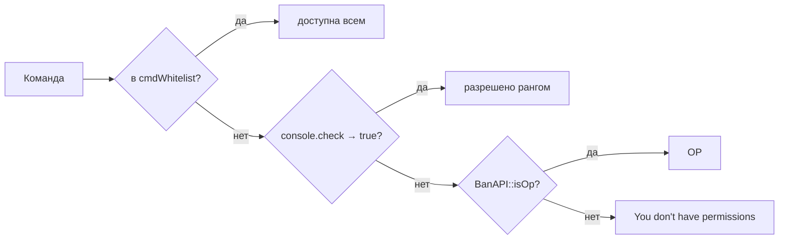
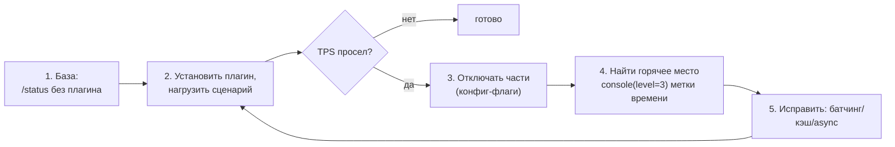

# WorldPECore Plugin API

# Часть 5 — Лучшие практики и безопасность

> Проверенные паттерны работы с однопоточным ядром WorldPECore. Все утверждения основаны на поведении исходного кода.

## Содержание части

- [1. Модель потоков и главный поток](#1-модель-потоков-и-главный-поток)
- [2. Асинхронность](#2-асинхронность)
- [3. Память и ресурсы](#3-память-и-ресурсы)
- [4. Безопасность](#4-безопасность)
- [5. Обработка ошибок](#5-обработка-ошибок)
- [6. Антипаттерны: чего НЕ делать](#6-антипаттерны-чего-не-делать)
- [7. Производительность: чеклист](#7-производительность-чеклист)

---

## 1. Модель потоков и главный поток

Игровая логика — **строго один поток** (PHP main): тиклуп, все хендлеры, шедулер, команды. Бюджет кадра — 50 мс; каждая миллисекунда вашего кода вычитается из TPS всех игроков.

#### 1.0.1. Симптомы блокирующего плагина

| Симптом в консоли/игре | Диагноз |
|---|---|
| Периодическое `Can't keep up!` при заходе игрока | тяжёлая работа на `player.join` |
| TPS падает «волнами» раз в N секунд | задача шедулера делает слишком много за раз |
| Задержки только при чате | фильтр в `server.chat` делает файловые/сетевые операции |
| Лаги при открытии сундука | логгер `tile.container.slot` пишет синхронно без батча |
| Растёт память между матчами арены | не чистятся кэши на `player.quit`/не закрываются GUI-тайлы |

#### 1.0.2. Плохо/хорошо: обработка массива

```php
// ❌ ПЛОХО: всё за один тик
public function cleanup(){
    foreach($this->api->entity->getAll() as $e){ /* проверка+удаление */ }
}

// ✅ ХОРОШО: порции по 50 сущностей за тик
private array $queue = []; private int $cursor = 0;
public function startCleanup(){ $this->queue = $this->api->entity->getAll(); $this->cursor = 0; }
public function step(){ // schedule(1, step, [], true)
    $n = 0;
    while($n < 50 && $this->cursor < count($this->queue)){
        $e = $this->queue[$this->cursor++];
        /* ... */ ++$n;
    }
    if($this->cursor >= count($this->queue)) return false;
}
```

Что выполняется в побочных потоках:

| Поток | Код | Ваша точка входа |
|---|---|---|
| Консольный ввод | `ConsoleLoop` | строки приходят в главный поток сами |
| cURL worker | `AsyncMultipleQueue` | `asyncOperation(ASYNC_CURL_*, ...)` |
| Одноразовые задачи | `Async` (pthreads) | `$api->async(callable)` |
| RCON-приёмники | `RCON` (если включён) | недоступно плагинам напрямую |

Правила главного потока:

1. **Никаких блокирующих вызовов**: `sleep`, синхронные `curl_exec`, долгие `exec()`, тяжёлые файловые операции по сети.
2. Ожидание реализуйте состоянием: сохраните метку времени и проверяйте её в задаче шедулера.
3. Разбиение работы: обрабатывайте N элементов за тик (`schedule(..., repeat=true)`) вместо всего массива сразу.
4. Не копируйте большие структуры без нужды: payload событий уже содержит живые объекты — фильтруйте ссылками, а не пересобирайте массивы.
5. Результат `Async` обрабатывайте порциями: даже готовые данные большого размера лучше применять частями по тикам.

```php
// ПЛОХО: блокировка на 3 секунды
public function onJoin($player){ $data = file_get_contents("http://slow-api/..."); }

// ХОРОШО: async HTTP + колбэк на следующем тике
public function onJoin($player){
    $this->api->asyncOperation(ASYNC_CURL_GET,
        ["url" => "https://api.example.com/profile?name=" . urlencode($player->username)],
        function($result, $type, $id){ /* $result["response"] */ });
}
```

---

## 2. Асинхронность

### asyncOperation (cURL вне потока)

```php
$ID = $server->asyncOperation(ASYNC_CURL_POST, [
    "url"     => "https://discord.com/api/webhooks/…",
    "timeout" => 10,
    "data"    => ["content" => "Игрок вошёл"],
], function($result, $type, $ID){
    // выполняется в ГЛАВНОМ потоке на следующем тике;
    // $result["response"] — тело ответа строкой
});
// Возврат: ID операции или false при NO_THREADS/неизвестном типе
```

Дополнительно возбуждается событие `async.curl.get`. Результаты разбираются в `asyncOperationChecker()` раз в секунду (шедулер ядра).

#### 2.0.1. Кейс: Discord-логгер чата

```php
public function init(){
    $this->url = $this->cfg->get("webhook");
    if($this->url === "none") return;
    $this->api->addHandler("server.chat", [$this, "toDiscord"], 15);
}

public function toDiscord($container){
    $msg = TextFormat::clean((string)$container);          // снять §-коды
    $this->api->asyncOperation(ASYNC_CURL_POST, [
        "url"  => $this->url,
        "data" => [                                            // form-encoded — Discord принимает
            "content" => mb_substr($msg, 0, 1900),
            "username" => "WorldPE Logger",
        ],
    ]);
    return null;   // не вмешиваемся в доставку
}
```

> Примечание: `ASYNC_CURL_POST` шлёт поля обычной формой (`application/x-www-form-urlencoded`) — Discord-webhook принимает такой формат (`content=…`), отдельный JSON не нужен.


Батчинг вместо флуда (одно сообщение в 5 секунд):

```php
private array $buffer = [];
private function queue(string $m){
    $this->buffer[] = $m;
    if(count($this->buffer) >= 10){ $this->flush(); }
}
private function flush(){
    if(!$this->buffer) return;
    $this->api->asyncOperation(ASYNC_CURL_POST, [
        "url" => $this->url,
        "data" => ["content" => mb_substr(implode("\n", $this->buffer), 0, 1900)],
    ]);
    $this->buffer = [];
}
// + $this->api->schedule(100, [$this, "flush"], [], true);
```

#### 2.0.2. Кейс: батч-логгер блоков на SQLite

Запись каждого блока отдельным INSERT убьёт TPS при застройке. Батчим:

```php
private array $pending = [];

public function init(){
    $path = $this->api->plugin->configPath($this)."logs.db";
    $isNew = !file_exists($path);
    $this->db = new SQLite3($path);
    if($isNew){
        $this->db->query("CREATE TABLE bl(id INTEGER PRIMARY KEY, name TEXT, act INT,
                          x INT,y INT,z INT, id INT, meta INT, ts TEXT)");
    }
    $this->db->query("PRAGMA journal_mode=OFF; PRAGMA synchronous=OFF;");
    $this->api->addHandler("player.block.touch", [$this, "log"], 15);
    $this->api->schedule(40, [$this, "flush"], [], true);       // раз в 2 сек
}

public function log(&$d){
    $t = $d["type"] === "break" ? ($d["target"] ?? null) : ($d["target"] ?? null);
    if(!$t instanceof Vector3 || !$d["player"] instanceof Player) return null;
    $this->pending[] = [$d["player"]->iusername, $d["type"], $t->x, $t->y, $t->z, time()];
    return null;
}

public function flush(){
    if(!$this->pending) return;
    $st = $this->db->prepare("INSERT INTO bl(name,act,x,y,z,ts)
                              VALUES (?,?,?,?,?,?);");
    foreach($this->pending as [$n,$a,$x,$y,$z,$ts]){
        $st->bindValue(1, $n, SQLITE3_TEXT);
        $st->bindValue(2, $a, SQLITE3_TEXT);
        $st->bindValue(3, $x, SQLITE3_INTEGER);
        $st->bindValue(4, $y, SQLITE3_INTEGER);
        $st->bindValue(5, $z, SQLITE3_INTEGER);
        $st->bindValue(6, date("c", $ts), SQLITE3_TEXT);
        $st->execute();
    }
    $this->pending = [];
}

public function __destruct(){ $this->flush(); $this->db->close(); }
```

#### 2.0.2.1. Webhook с повторами и backoff

`asyncOperation` не ретраит. Обёртка с экспоненциальной задержкой:

```php
private function sendWebhook(string $content, int $attempt = 0){
    $this->api->asyncOperation(ASYNC_CURL_POST, [
        "url" => $this->url, "timeout" => 5,
        "data" => ["content" => mb_substr($content, 0, 1900)],
    ], function($result, $type, $id) use ($content, $attempt){
        $ok = isset($result["response"]) && $result["response"] !== "";
        if($ok || $attempt >= 3) return;
        $delay = 20 * (2 ** $attempt);                 // 1с → 2с → 4с (в тиках)
        $this->api->schedule($delay, function() use ($content, $attempt){
            $this->sendWebhook($content, $attempt + 1);
            return false;                              // одноразовая задача-ретрай
        }, [], false);
    });
}
```

Паттерн универсален для любых внешних API.

#### 2.0.3. Частые однострочники (cookbook)

```php
// Количество авторизованных игроков:
$n = count($this->api->player->online());          // online() — массив ников!

// Цветной broadcast:
$this->api->chat->broadcast(FORMAT_GOLD."Событие!".FORMAT_RESET);

// Выдать предмет:
$p->addItem(Item::DIAMOND, 0, 5);

// Телепорт в мир:
$lv = $this->api->level->get("arena"); $s = $lv->getSafeSpawn(false);
$p->teleport(new Position($s->x, $s->y, $s->z, $lv));

// Проверки прав/бана:
$this->api->ban->isOp($p->iusername);
$this->api->ban->isBanned("nick");

// Закат в мире игрока:
$this->api->time->set(TimeAPI::$phases["sunset"], $p->level);

// Сундук с лутом одной рассылкой:
$t = $this->api->tile->add($level,"Chest",$x,$y,$z);
$t->setSlot(0, BlockAPI::getItem(Item::BREAD,0,5), false);
$this->api->tile->spawnToAll($t);

// Зомби у точки (type из EntityAPI::commandHandler):
$this->api->entity->summon(new Position($x,$y,$z,$level), ENTITY_MOB, 32);
```

### Async (pthreads)

`$api->async(callable, params)` порождает поток. Помните:

- Внутри callable **нельзя** трогать игровые объекты (`Player`, `Level`, API) — они принадлежат главному потоку.
- Обмен только через простые значения в `$params`.
- Без pthreads (`NO_THREADS`) механизм деградирует безопасно.

#### 2.1.1. Кейс: тяжёлое вычисление в Async

Генерация сложного ландшафта/расчёт пути — кандидаты в поток:

```php
public function generateAsync(Player $p, string $seedKey){
    $this->api->async(function(array $params){
        // ВНИМАНИЕ: внутри потока нельзя трогать Player/Level/API!
        $grid = [];
        for($x = 0; $x < 256; ++$x){
            for($z = 0; $z < 256; ++$z){
                $grid[$x][$z] = $this->noiseLike($params["seed"], $x, $z);
            }
        }
        return $grid;                       // результат вернёт Async::run()
    }, ["seed" => $seedKey]);
}
```

Правила pthreads-потоков в этом ядре:

1. Никаких обращений к игровым объектам и сервисам `ServerAPI` — они привязаны к главному потоку.
2. Обмен — только скаляры/массивы в `$params` и возвращаемое значение.
3. Исключения внутри потока не всплывут в главный — оборачивайте сами и возвращайте статус.
4. Долгий поток не блокирует сервер, но результат всё равно обрабатывайте порционно (см. §1.2).

#### 2.1.2. Что НЕ выносить в поток

| Задача | Почему нет |
|---|---|
| Отправка пакетов игрокам | пакеты шлёт только главный поток (`dataPacket`) |
| Чтение блоков мира | `Level` не потокобезопасен; копируйте данные заранее |
| Discord-webhook | уже решено `asyncOperation()` (cURL worker) |
| Логи | `console()/logg()` пишут из главного потока; из потока возвращайте текст |

### Шедулер как планировщик

Интервалы — в тиках: `20 = 1 сек`, `1200 = минута`, `18000 = 15 мин` (так ядро ставит автосейв). Повторяющаяся задача снимается возвратом `false`:

```php
private $left = 10;
public function countdown(){
    if(--$this->left <= 0){
        $this->api->chat->broadcast("Старт!");
        return false;              // задача снята
    }
    $this->api->chat->broadcast("До старта: " . $this->left);
}
```

Альтернатива без постоянной задачи: цепочка одноразовых `schedule(N, cb)` — так ядро реализует кик (`BanAPI::kick` → `schedule(60, [$player,"close"], $reason)`).

#### 1.1. Цена операций главного потока (интуитивные порядки)

| Операция | Относительная стоимость | Вывод |
|---|---|---|
| Проверка поля объекта | 1 | фильтруйте ранними `return null` |
| Prepared SQL SELECT/INSERT | ~100 | батчите записи, кэшируйте чтения |
| Локальный файл | ~200 | не в хендлерах |
| Синхронный cURL | 50 000+ | только `asyncOperation()` |
| Генерация мира | сотни тысяч | заранее, не on-demand |

Бюджет тика — **50 мс**. Один синхронный HTTP на 300 мс = ~6 потерянных тиков для всех игроков.

#### 1.2. Полный пример: кулдаун без блокировок

```php
class Cooldown {
    private array $until = [];

    public function ready(string $key, int $ms): bool{
        $now = (int) round(microtime(true) * 1000);
        if(($this->until[$key] ?? 0) > $now) return false;
        $this->until[$key] = $now + $ms;
        return true;
    }
}

// в хендлере команды:
if($issuer instanceof Player && !$this->cd->ready("warp.".$issuer->iusername, 5000)){
    return "Подождите 5 секунд.\n";
}
```

---

## 3. Память и ресурсы

1. **Чанки.** По умолчанию загруженные чанки удерживаются в памяти (`KEEP_CHUNKS_LOADED=true`). Для арен/мини-игр после матча освобождайте ссылки игроков: `$level->freeAllChunks($player)`.
2. **Сущности.** Удаляйте свои временные сущности явно: `$this->api->entity->remove($eid)` — иначе item-сущности живут до деспавна (300 с для предметов).
3. **Тайлы.** Закрывайте через `$tile->close()`; не оставляйте «фантомные» сундуки в выгружаемых мирах.
4. **Статика.** Статические свойства переживают перезагрузку миров; чистите их при `server.close`/`player.quit`.
5. **Диагностика.** `$server->debugInfo()` даёт `memory_usage/peak/garbage`; хук `server.debug` позволяет добавить собственные счётчики в эту статистику.
6. **Ссылки из payload.** `handle()` передаёт объекты по значению-обёртке, но вложенные объекты — те же экземпляры. Не накапливайте `Player`/`Entity` в статических массивах дольше жизни сессии (проверяйте `$p->connected`, `$e->closed`).
7. **Окна контейнеров.** Закрытие окна игроком не закрывает ваш тайл автоматически — ловите `CONTAINER_CLOSE_PACKET` (Часть 4 §4) и вызывайте `$tile->close()`, иначе «фантомный сундук» останется в мире и в памяти.

#### 3.0.1. Оценка памяти типовых сущностей

| Что занимает память | Порядок | Управление |
|---|---|---|
| Загруженный чанк (16×128×16) | ~64 КБ + индексы | `freeAllChunks()`, `KEEP_CHUNKS_LOADED=false` для арен |
| Item-сущность | сотни байт, TTL 300 с | не спавнить пачками; `entity->remove()` |
| Моб (Living) | килобайты + AI-путь | лимит `mobs-amount`, `despawn-mobs` |
| Открытое окно контейнера | ссылка на Tile | закрывать тайл при quit |

#### 3.0.2. Чеклист утечек

- [ ] На `player.quit` очищены все записи вида `[iusername => ...]` во всех ваших массивах.
- [ ] GUI-тайлы закрыты (`close()`), окна убраны из `$player->windows`.
- [ ] Временные сущности матча удалены при его завершении.
- [ ] Статические кэши имеют верхнюю границу размера (или чистятся по таймеру).
- [ ] `/status` после часа работы: `garbage` стабилен, `entities` не растёт монотонно.

#### 3.0.3. Санитарная обработка выхода игрока

```php
public function init(){
    $this->api->addHandler("player.quit", [$this, "cleanup"], 5);
}

public function cleanup($p){
    if(!$p instanceof Player) return null;
    $u = $p->iusername;
    unset($this->menus[$u], $this->cooldown[$u], $this->inArena[$u]);
    $tile = $this->guiTiles[$u] ?? null;
    if($tile instanceof Tile){ $tile->close(); unset($this->guiTiles[$u]); }
    return null;
}
```

---

## 4. Безопасность

### Валидация исполнителя команд

`$issuer` бывает трёх видов. Всегда начинайте обработчик команды с матрицы:

```php
public function cmd($cmd, $params, $issuer, $alias){
    if($issuer instanceof Player){
        if(!$this->api->ban->isOp($issuer->iusername)){
            return "Недостаточно прав.\n";
        }
        // $issuer->entity может быть false до полного входа!
    }elseif($issuer === "console" || $issuer === "rcon"){
        // консольное/RCON исполнение (проверка именно строкой — так делает BanAPI)
    }else{
        return "\n"; // неизвестный issuer — тихо отказать
    }
}
```

Права команд решаются **до** вашего callback'а (хендлер BanAPI приоритета 1 на `console.command`). Сделать команду общедоступной — только `cmdWhitelist()`, а не собственные проверки в `console.command`.

### 4.0.1. SQL-инъекции: плохо/хорошо

```php
// ❌ ПЛОХО: $nick приходит от игрока
$this->db->query("SELECT * FROM homes WHERE owner = '".$nick."';");
// ввод:  x'; DROP TABLE homes;--

// ✅ ХОРОШО:
$st = $this->db->prepare("SELECT * FROM homes WHERE owner = :o;");
$st->bindValue(":o", strtolower($nick), SQLITE3_TEXT);
$st->execute();
```

Ядро экранирует кавычки только в собственных запросах (`addHandler`, реестр players) — ваши запросы целиком ваша ответственность. Для имён используйте `$iusername` (нижний регистр) и `SQLite3::escapeString` при вынужденной конкатенации.

### 4.0.2. Пути файлов: traversal

```php
// ❌ ПЛОХО: имя из чата
file_get_contents(DATA_PATH."schematics/".$name.".schem");

// ✅ ХОРОШО: жёсткий whitelist символов + basename
if(!preg_match('#^[a-zA-Z0-9_-]{1,32}$#', $name)) return "Недопустимое имя.";
$path = realpath(DATA_PATH."schematics/".$name.".schem");
if($path === false || !str_starts_with($path, realpath(DATA_PATH."schematics"))) return "Нет файла.";
```

### 4.0.3. Доверие к пакетам

Что клиент контролирует в каждом перехватываемом пакете — и что обязательно перепроверять:

| Пакет | Клиент присылает | Проверка ядра | Ваша обязанность |
|---|---|---|---|
| `PLACE_BLOCK/REMOVE_BLOCK` | координаты, id/meta | скорость ломания, права спавна | свои регионы, границы мира |
| `USE_ITEM_PACKET` | позиция/направление | базовые лимиты | запреты зон, кулдауны |
| `PLAYER_ACTION` | тип действия | частичные | логика мини-игр |
| `MESSAGE_PACKET` | текст | эмодзи-фильтр (`disable-emojis-in-chat`) | антиспам, мат-фильтр |
| `LOGIN_PACKET` | username, protocol | регэксп `[a-zA-Z0-9_]`, длина ≤16, blacklist | ничего дополнительно не доверять |

Никогда не стройте механику на «клиент прислал X — значит правда»: все значимые решения дублируйте серверным состоянием.

### 4.0.4. Модель прав: три уровня



Порядок фиксирован кодом `permissionsCheck` — вставить свою проверку «поверх whitelist, но до OP» можно только хендлером на `console.command.<cmd>` с приоритетом **меньше 1** (например, 0).

Расширяйте модель хуками `op.check` / `console.check` (см. Часть 4 §2.2), но не подменяйте файлы ops/banned напрямую из плагина — ядро кэширует их в `Config`.

### 4.0.5. Чеклист безопасности (быстрый)

- [ ] Ни одной конкатенации пользовательских строк в SQL.
- [ ] Пути файлов: whitelist `[a-zA-Z0-9_-]` + `realpath()`-проверка корня.
- [ ] Каждая команда начинается с issuer-матрицы; `Player` дополнительно проверяет `$entity instanceof Entity`.
- [ ] Пакетные данные не используются как истина без серверной перепроверки.
- [ ] Логи не содержат паролей (`getProperties()` маскировать) и личных данных игроков сверх необходимого.
- [ ] Свои события/команды названы с префиксом — нет перехвата чужих.

### Входные данные

- Любое значение из payload событий приходит от клиента: координаты, ID предметов, ники. Валидируйте диапазоны перед записью в мир/БД.
- SQL: используйте prepared statements (SQLite3). Ядро экранирует кавычки только в собственных запросах (`addHandler`, реестр players) — ваши запросы — ваша ответственность.
- Пути файлов: никогда не собирайте пути из пользовательских строк без basename/preg-фильтра.

### Перехват пакетов

`DataPacketReceiveEvent` даёт доступ к сырым полям пакета. Не доверяйте им больше, чем доверяет ядро: серверные конвейеры (BlockAPI, инвентарь) уже содержат проверки скорости ломания (`min-block-breaking-progress`), дальности и прав — ваш хук должен *сужать* права, а не обходить ядро в обход проверок.

### Приоритеты и этикет

- Права/запреты — приоритет `1..2` (как у BanAPI), обычная логика — `5`, логгеры-наблюдатели — `15`.
- На OOP-приоритете `MONITOR` изменения события запрещены этикетом Bukkit-style.
- Никогда не возвращайте `true` из наблюдателя: это остановит цепочку раньше остальных плагинов.

### Чувствительные данные

`getProperties()` содержит `rcon.password` — маскируйте при выводе (ядро делает это в error-dump). Логи Discord уходят наружу: не отправляйте туда данные игроков без нужды (`send2Discord` сам вырезает `@`).

---

## 5. Обработка ошибок

Глобальный контур ядра:

1. `error_handler()` (`functions.php`) ловит все ошибки PHP → консоль/лог.
2. Подавление через `@` уважается: при `error_reporting() === 0` хендлер сразу выходит — но не злоупотребляйте, реальные проблемы станут невидимыми.
3. При фатальной ошибке `dumpError()` создаёт `Error_Dump_*.log`: backtrace, код вокруг ошибки, список загруженных плагинов. Если путь ошибки содержит `plugin`, дамп прямо пишет: **«THIS ERROR WAS CAUSED BY A PLUGIN»** — репутация ваших плагинов зависит от чистоты стектрейса.
4. Исключения внутри хендлеров **не перехватываются** — они убивают главный цикл. Единственное место с try/catch — шедулер (`TypeError` → логирование и снятие задачи).

#### 5.0.0. Анатомия error-dump

При фатальной ошибке `dumpError()` пишет файл `Error_Dump_<дата>.log`, содержащий:

| Секция дампа | Что там | Что важно плагинисту |
|---|---|---|
| Error: var_export(error_get_last) | тип (E_*), сообщение, файл, строка | ваш файл = ваша вина |
| **THIS ERROR WAS CAUSED BY A PLUGIN** | появляется, если путь ошибки содержит `plugin` | ядро прямо указывает виновника |
| Code: ±10 строк вокруг места | исходник | сверьте версию файла у пользователя |
| Backtrace (`getTrace()`) | цепочка вызовов с аргументами | ищите первый свой класс в стеке |
| Version/commit/PHP/uname | окружение | просите у пользователей полный дамп |
| Loaded plugins | список с версиями | конфликт соседей виден сразу |
| server.properties | настройки (rcon.password замаскирован) | воспроизведение бага |

Практика: прикладывайте к ответу на issue просьбу прислать именно этот лог — он самодостаточен.

Практика:

```php
public function riskyHandler($data){
    try{
        // внешние библиотеки, парсинг, сеть
    }catch(Throwable $e){
        console("[MyPlugin] " . get_class($e) . ": " . $e->getMessage());
        // НЕ глотайте молча — логируйте; НЕ ретранслируйте наверх
        return null; // не вмешиваемся в цепочку события
    }
}
```

#### 5.0.1. Хелпер safe() для массового применения

```php
private function safe(callable $fn, string $ctx = ""){
    try{
        return $fn();
    }catch(Throwable $e){
        console("[MyPlugin][$ctx] " . get_class($e) . ": " . $e->getMessage()
            . " @ " . ($e->getFile()) . ":" . $e->getLine());
        logg($e->getTraceAsString(), "MyPlugin-errors");
        return null;
    }
}

// использование:
public function onJoin($p){
    $this->safe(function() use ($p){ /* рискованная логика */ }, "join");
}
```

#### 5.0.2. Уровневое логирование

```php
private function dbg(string $m){ console("[MyPlugin] ".$m, true, true, 3); } // DEBUG>=3
private function info(string $m){ console("[MyPlugin] ".$m, true, true, 1); }
private function err(string $m){ console("[ERROR][MyPlugin] ".$m, true, true, 0); } // всегда
```

Префикс `[ERROR]` даст цветную подсветку и попадание в error-дамп-лог (см. `console()` в `functions.php`). Не используйте `@`-подавление вокруг собственного кода: глобальный `error_handler` пропускает такие ошибки молча (`error_reporting()===0`), и вы потеряете диагностику.

- Логируйте уровнями: `console($msg, true, true, 1)` — всегда; `level=3` — только при DEBUG ≥ 3.
- Для длительных логов — `logg($msg, "MyPlugin")` пишет в отдельный файл.
- В `__destruct()` не бросайте исключений и не обращайтесь к мирам — порядок разрушения объектов не гарантирован (ядро само страхуется от двойного вызова).

---

## 6. Антипаттерны: чего НЕ делать

| ❌ Антипаттерн | Почему больно | ✅ Как правильно |
|---|---|---|
| Тяжёлая работа в хендлере высокочастотного события (`entity.motion`, `DataPacketSendEvent`) | События вызываются десятки раз за тик | Кэшируйте, фильтруйте ранним `return null` |
| Возврат `true` «для успеха» из legacy-хендлера | Останавливает цепочку других плагинов | Возвращайте `null`; `true/false` — только осознанно |
| Логика в конструкторе плагина | Миры/игроки ещё не готовы; случайные падения загрузки | Всё в `init()` |
| Полагаться на порядок `init()` других плагинов | Порядок алфавитно-файловый, зависимости не сортируются | Интерфейс `OtherPluginRequirement` + поздняя связка через хендлеры |
| Использовать deprecated-события (`server.tick`, `block.drop`…) | `[ERROR]` в логах, риск удаления | Замены из карты `Deprecation::$events` (Часть 4 §5) |
| Запись файлов в корень `DATA_PATH` | Конфликты между плагинами | Только `configPath($this)` |
| Ручной `__destruct` чужих объектов / вызовы `__destruct` ядра | Двойное освобождение | Собственный деструктор — только для своих ресурсов |
| `sleep()`/блокирующий HTTP в главном потоке | Заморозка всех игроков | `asyncOperation()` / `Async` |
| Мутация payload без понимания ссылок | Непредсказуемые эффекты для ядра | Мутируйте только документированные ключи (`player.invisible.status`, `tile.container.slot.slotdata`, конфиги offline) |
| Своя регистрация `addHandler("server.start", …)` | Хендлеры на trigger-события не вызываются | `event("server.start", cb)` |
| Хранение объектов `Player`/`Entity` в статике надолго | Утечка сессий после выхода | Ключи-строки (`iusername`/`eid`) + проверка `$p->connected` |
| Доверие `$player->entity !== false` без проверки | Фатал у ещё входящих игроков | `if($p->entity instanceof Entity)` |
| Тяжёлая логика в OOP-приоритете `MONITOR` | MONITOR — для наблюдения; ломает контракт Bukkit-style | Логика в NORMAL/HIGH |
| Игнорирование мультипротокола при ручных пакетах | Клиенты 0.3.x упадут на новых полях | Задавайте только общие поля, отправляйте через `dataPacket()` ядра (он ставит PROTOCOL) |
| Пересоздание шедулер-задачи из самой задачи | Накопление задач при лагах | Повторяющаяся задача + возврат `false` по условию |
| `getAll()` в горячем цикле | O(n) копий массивов каждый вызов | `getRadius()`/`getEntitiesInAABBOfType()` |
| Проверка `$player->op` (такого поля нет) | всегда null → логика молча не работает | `BanAPI::isOp($p->iusername)` |
| Сравнение ников без lowercasing | «Notch» ≠ «notch» в ваших кэшах | ключи только `$iusername` |

---

## 7. Производительность: чеклист

Бюджет кадра при 20 TPS — **50 мс**. Формула самоконтроля:

```text
допустимая цена хендлера ≈ 50 мс × доля_события_в_тике
высокочастотное событие (каждый тик, каждый пакет): цель < 0.5 мс
редкое (join/quit/death): до 5 мс допустимо
```

### 7.0.1. Профилировочный цикл (workflow)

Пример реального замера:

```text
/status без плагина:            TPS 19.8
после установки BlockLogger:    TPS 17.2  ← просадка
debug=3 + таймеры в log():
  [BlockLogger] onSlot: 3.8 ms  ← горячая точка: INSERT на каждый слот
исправление: батч 40 тиков
итог:                           TPS 19.6  ✓
```

### 7.0.1. Профилировочный цикл (workflow)



Замеряйте на **целевом** сценарии (20 игроков строят), а не на пустом сервере: горячие места проявляются только под нагрузкой.

Микро-приём: временные метки вокруг подозрительного кода

```php
$t = microtime(true);
/* ...код... */
$this->dbg(sprintf("onJoin: %.2f ms", (microtime(true)-$t)*1000));
```

Добавьте свои счётчики в стандартную статистику:

```php
public function init(){
    $this->api->addHandler("server.debug", function(&$info){
        $info["myplugin.pending"] = count($this->pending);   // появится в /status
    }, 10);
}
```

### 7.0.2. Чеклист релиза

Перед выпуском версии прогоните чеклист по четырём осям — функциональность, безопасность, производительность, стабильность. Пункт считается закрытым только после проверки на чистом сервере без соседних плагинов.

**Функционально**
- [ ] Метаданные: `name/version/author/class`, `apiversion=12.2`
- [ ] Конструктор пуст; вся логика в `init()`
- [ ] Команды зарегистрированы + whitelist где нужно; справка возвращается строкой с `\n`
- [ ] Все хендлеры возвращают `null` кроме осознанных решений
- [ ] Свои ресурсы: конфиг в `configPath()`, SQLite закрыт в `__destruct()`

**Безопасно**
- [ ] issuer-матрица в каждой команде (`Player`/`"console"`/`"rcon"`/иное)
- [ ] Prepared statements везде; имена через `$iusername`
- [ ] Пути файлов через whitelist-регэксп
- [ ] Пакетные обработчики не доверяют клиентским полям

**Производительно**
- [ ] Нет блокирующих вызовов; сеть через `asyncOperation()`
- [ ] Частые события отсекаются первой проверкой
- [ ] Поиск сущностей — `getRadius()/getEntitiesInAABB()`
- [ ] SQLite: journal/synchronous OFF для логов, батчинг ≥1 сек
- [ ] `/status` под целевой нагрузкой: TPS ≥ 18 с вашим плагином

**Стабильно**
- [ ] try/catch в рискованных местах + `[MyPlugin]`-префиксы логов
- [ ] Поведение при отсутствии зависимостей деградирует мягко
- [ ] Проверено на чистом сервере и с типичным набором соседних плагинов

---

## 8. Совместимость и версионирование

| Аспект | Правило |
|---|---|
| `apiversion` | указывайте ровно `12.2`; список CSV — если поддерживаете старые ядра, но тестируйте каждое |
| PHP-синтаксис | ядро требует ≥8.0 — можно использовать match/named args/enum |
| Протоколы клиентов | при `multiprotocol=true` приходят клиенты 0.3.0–0.8.1: не полагайтесь на поля, появившиеся позже |
| Соседние плагины | не занимайте чужие имена команд; свои события префиксуйте (`myplugin.`) |
| Обновления ядра | держитесь документированного API (Часть 3); внутренние классы (`Player::handleDataPacket`) меняются без предупреждения |
| pthreads-сборки | берите совместимую сборку PHP из комплекта ядра; сторонние сборки часто ломают AsyncMultipleQueue |
| Формат конфигов | не переключайте формат существующего файла у пользователей (properties→yaml потеряет данные) |
| Пиновать PHP | используйте сборку из комплекта ядра; свежие minor-версии PHP ломали pthreads |

### 8.1. Мультипротокол на практике

```php
public function onJoin($p){
    if(!$p instanceof Player) return null;
    switch(true){
        case $p->getProtocol() >= 8:    // 0.8.x — полный функционал
            break;
        case $p->getProtocol() >= 5:    // 0.6.x — без части пакетов
            $this->legacyMode[$p->iusername] = true;
            break;
        default:                        // 0.3–0.5 — минимальный набор
            // избегайте отправки новых пакетов вручную
            break;
    }
}
```

При ручной сборке пакетов заполняйте только поля, существующие в протоколе самого старого клиента, которому адресуете пакет; `dataPacket()` ядра сам подставит `PROTOCOL` сессии.

---

⬅️ [Часть 4 — Events, Hooks & Extensions](04-events-hooks.md)

---

## Приложение B. Сквозной кейс: плагин «ArenaPvP»

Финальная демонстрация всех практик в одном плагине: арена-мир, очередь, матч 1×1, статистика.

```php
<?php
/*
__PocketMine Plugin__
name=ArenaPvP
description=Матчи 1x1 на отдельной арене
version=1.0.0
author=YourName
class=ArenaPvP
apiversion=12.2
*/

class ArenaPvP implements Plugin{
    const ARENA = "arena_pvp";
    private $api, $cfg, $db;
    private $queue = [];        // [iusername => Player]
    private $match  = [];       // [iusername => Player opponent]
    private $spawnA, $spawnB;

    public function __construct(ServerAPI $api, $server = false){ $this->api = $api; }

    /* ---------- ЖИЗНЕННЫЙ ЦИКЛ ---------- */

    public function init(){
        $path = $this->api->plugin->configPath($this);
        // Конфиг с комментариями (Часть 2 §6.3.1):
        $this->cfg = new Config($path."config.yml", CONFIG_YAML, [
            "countdown-seconds" => 5,
        ], $correct, ["countdown-seconds" => ["Отсчёт до боя"]]);
        if($correct === false) console("[ArenaPvP] config повреждён, дефолты");

        // База статистики: PRAGMA + prepared (§4.0.1, §7.0.2):
        $newDb = !file_exists($path."stats.db");
        $this->db = new SQLite3($path."stats.db");
        if($newDb) $this->db->query("CREATE TABLE w(l TEXT PRIMARY KEY, wins INT, losses INT)");
        $this->db->query("PRAGMA journal_mode=OFF; PRAGMA synchronous=OFF;");

        $this->api->console->register("duel", "<join|leave|stats>", [$this, "cmd"]);
        $this->api->ban->cmdWhitelist("duel");

        // События: trigger → event(); handle → addHandler() (Часть 4 §6):
        ServerAPI::request()->event("server.start", [$this, "boot"]);
        $this->api->addHandler("player.quit",          [$this, "onQuit"], 12);
        $this->api->addHandler("player.death",         [$this, "onDeath"], 12);
        $this->api->addHandler("player.teleport.level",[$this, "gate"],   12);

        console("[ArenaPvP] init ok", true, true, 0);      // маркер загрузки (§8.1 Ч.2)
    }

    public function boot($t){
        // Мир ПОСЛЕ server.start (Часть 2 §3.2 матрица доступности):
        if(!$this->api->level->levelExists(self::ARENA)){
            $this->api->level->generateLevel(self::ARENA, 777, "FLAT");
        }
        if($this->api->level->get(self::ARENA) === false){
            $this->api->level->loadLevel(self::ARENA);
        }
        $lv = $this->api->level->get(self::ARENA);
        $s = $lv->getSafeSpawn(false);
        $this->spawnA = new Position($s->x - 8, $s->y, $s->z, $lv);
        $this->spawnB = new Position($s->x + 8, $s->y, $s->z, $lv);
    }

    public function __destruct(){                    // только свои ресурсы (§5)
        if(isset($this->db)) $this->db->close();
    }

    /* ---------- КОМАНДЫ (issuer-матрица §4) ---------- */

    public function cmd($cmd, array $a, $issuer, $alias){
        if(!($issuer instanceof Player)) return "Только в игре.\n";
        switch(strtolower($a[0] ?? "")){
            case "join":  return $this->join($issuer);
            case "leave": return $this->leave($issuer);
            case "stats": return $this->statsCmd($issuer);
            default:      return "/$cmd <join|leave|stats>\n";
        }
    }

    /* ---------- ОЧЕРЕДЬ И МАТЧ ---------- */

    private function join(Player $p){
        if(strtolower($p->level->getName()) === self::ARENA) return "Вы уже на арене.\n";
        if(!$p->entity instanceof Entity) return "Подождите загрузки.\n";

        if(empty($this->queue)){
            $this->queue[$p->iusername] = $p;
            $p->sendChat(FORMAT_YELLOW."В очереди…");
            return "\n";
        }
        $opp = array_shift($this->queue);
        unset($this->queue[$opp->iusername]);
        if(!$opp instanceof Player || !$opp->connected){   // соперник вышел
            return $this->join($p);
        }
        $this->startMatch($opp, $p);
        return "\n";
    }

    private function startMatch(Player $a, Player $b){
        $this->match[$a->iusername] = $b;
        $this->match[$b->iusername] = $a;
        foreach([$a, $b] as $pl){
            $pl->teleport($pl === $a ? $this->spawnA : $this->spawnB);
            $pl->setGamemode(SURVIVAL);
            $pl->sendChat(FORMAT_GREEN."Противник: ".($pl === $a ? $b : $a)->username);
        }
        // Отсчёт задачей с состоянием (Часть 2 §5.6):
        $left = (int)$this->cfg->get("countdown-seconds");
        $pair = [$a->iusername, $b->iusername];
        $this->api->schedule(20, function() use (&$left, $pair){
            foreach($pair as $u){
                $p = $this->api->player->get($u);
                if($p !== false && $left > 0) $p->sendChat("Бой через: ".$left);
            }
            return (--$left >= 0);              // false снимает задачу
        }, [], true);
    }

    private function finish(string $winnerU, string $loserU){
        unset($this->match[$winnerU], $this->match[$loserU]);
        foreach([[$winnerU,true],[$loserU,false]] as [$u,$won]){
            $p = $this->api->player->get($u);
            if(!$p instanceof Player) continue;
            // Offline-экономика без блокировок (Часть 3 §3.6):
            $off = $this->api->player->getOffline($u);
            $key = $won ? "arenapvp.wins" : "arenapvp.losses";
            $off->set($key, $off->get($key, 0) + 1);
            $this->api->player->saveOffline($off);

            $p->teleport(ServerAPI::request()->spawn);
            $p->sendChat($won ? FORMAT_GREEN."Победа!" : FORMAT_RED."Поражение.");
        }
        $this->bumpStat($winnerU, true);
        $this->bumpStat($loserU,  false);
    }

    private function bumpStat(string $u, bool $win){
        $col = $win ? "wins" : "losses";
        $st = $this->db->prepare("INSERT INTO w(l,$col) VALUES(:u,1)
                                  ON CONFLICT(l) DO UPDATE SET $col=$col+1;");
        $st->bindValue(":u", strtolower($u), SQLITE3_TEXT);
        $st->execute();
    }

    /* ---------- СОБЫТИЯ ---------- */

    public function onQuit($p){                     // санитария кэшей (§3.0.3)
        if(!$p instanceof Player) return null;
        $u = $p->iusername;
        unset($this->queue[$u]);
        if(isset($this->match[$u]) && $this->match[$u] instanceof Player){
            $this->finish($this->match[$u]->iusername, $u);
        }
        return null;
    }

    public function onDeath($d){                    // [player, cause]
        $u = strtolower($d["player"]->iusername ?? "");
        if(isset($this->match[$u]) && $this->match[$u] instanceof Player){
            $this->finish($this->match[$u]->iusername, $u);
        }
        return null;
    }

    public function gate($d){                       // запрет ухода посреди боя
        if(strtolower($d["origin"]->getName()) === self::ARENA
           && isset($this->match[strtolower($d["player"]->iusername)])){
            $d["player"]->sendChat("Бой не окончен!");
            return false;                           // отмена перехода миров
        }
        return null;
    }

    private function leave(Player $p){
        unset($this->queue[$p->iusername]);
        return isset($this->match[$p->iusername])
            ? "Матч идёт — дождитесь конца.\n" : "Вы покинули очередь.\n";
    }

    private function statsCmd(Player $p){
        $st = $this->db->prepare("SELECT wins,losses FROM w WHERE l=:u;");
        $st->bindValue(":u", $p->iusername, SQLITE3_TEXT);
        $r = $st->execute()->fetchArray(SQLITE3_ASSOC) ?: ["wins"=>0,"losses"=>0];
        $t = $r["wins"] + $r["losses"];
        return "Победы: {$r["wins"]}, поражения: {$r["losses"]}"
             .($t ? " (".round(100*$r["wins"]/$t)."%)":"")."\n";
    }
}
```

Карта «практика → место в коде кейса»:

| Практика | Где |
|---|---|
| Пустой конструктор / всё в `init()` | `__construct` vs `init` |
| Мир после `server.start` | `boot()` |
| issuer-матрица команды | `cmd()` |
| PRAGMA + prepared + закрытие БД | `init/bumpStat/__destruct` |
| Задача с состоянием и снятием | отсчёт в `startMatch()` |
| Санитария кэшей на quit | `onQuit()` |
| Отмена телепорта между мирами | `gate()` |
| Offline-экономика | `finish()` |

---

## Приложение A. Быстрая шпаргалка

```php
class MyPlugin implements Plugin, OtherPluginRequirement{
    private $api;

    public function __construct(ServerAPI $api, $server = false){ $this->api = $api; }

    public function getRequiredPlugins(){ return []; } // RequiredPluginEntry[]

    public function init(){
        $path = $this->api->plugin->configPath($this);            // приватная папка
        $cfg  = new Config($path."config.yml", CONFIG_YAML, ["enabled" => true]);

        $this->api->console->register("my", "", [$this, "cmd"]);   // команда
        $this->api->ban->cmdWhitelist("my");                       // всем игрокам

        $this->api->addHandler("player.join", [$this, "onJoin"]);  // legacy-хук
        DataPacketReceiveEvent::register([$this, "onPk"], EventPriority::NORMAL);

        ServerAPI::request()->event("server.start", [$this, "boot"]);
        $this->api->schedule(20, [$this, "tick"], [], true);       // каждую секунду
    }

    public function boot($t){ /* мир готов */ }
    public function onJoin(Player $p){ $p->sendChat(FORMAT_GREEN."Welcome!"); }
    public function onPk(DataPacketReceiveEvent $ev){ /* $ev->setCancelled(); */ }
    public function tick(){ if(mt_rand(1,100) === 1) return false; }
    public function cmd($c,$a,$i,$x){ return "OK\n"; }
    public function __destruct(){ /* закрыть ресурсы */ }
}
```

### Антипаттерны одной строкой

- `sleep()` в хендлере → заморозка сервера.
- `return true` «на всякий случай» в legacy-хендлере → чужие плагины не получат событие.
- Логика в конструкторе → падения загрузки на первом старте.
- `$player->op` → поля не существует; только `BanAPI::isOp()`.
- SQL-конкатенация ника из чата → инъекция.
- Файлы вне `configPath($this)` → конфликт соседей.
- `getAll()` каждый тик по всем сущностям → O(n) на ровном месте.
- Ручная отправка пакетов без учёта `getProtocol()` → краши старых клиентов.

### Профилирование одной строкой

Временно оберните подозрительный вызов:

```php
$_t = microtime(true);
heavyCall();
console(sprintf("[Prof] heavyCall: %.2f ms", (microtime(true)-$_t)*1000), true, true, 0);
```

Уровень `0` гарантирует вывод даже на проде; уберите после замера.

### Телепорт «в мир» одной строкой

```php
$lv = $this->api->level->get($name) ?: ($this->api->level->loadLevel($name) ?: false);
if($lv !== false){ $s = $lv->getSafeSpawn(false); $p->teleport(new Position($s->x,$s->y,$s->z,$lv)); }
```

⬅️ [Часть 4 — Events, Hooks & Extensions](04-events-hooks.md)
