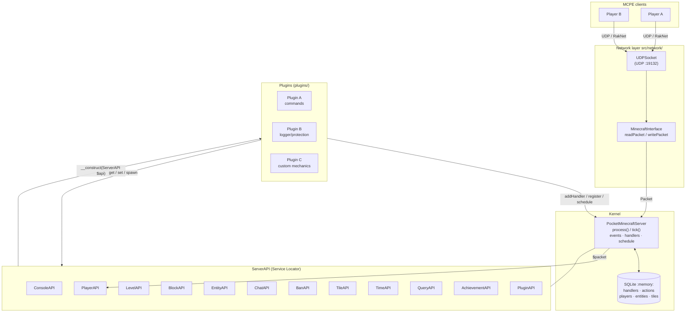
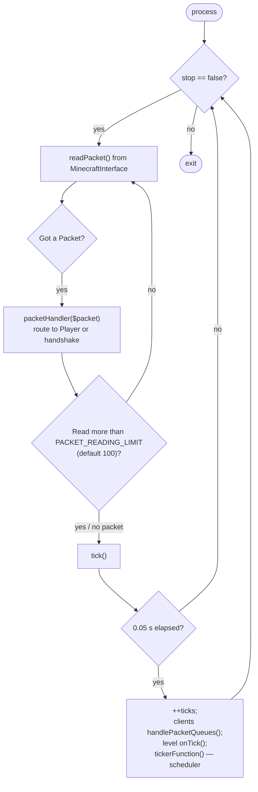
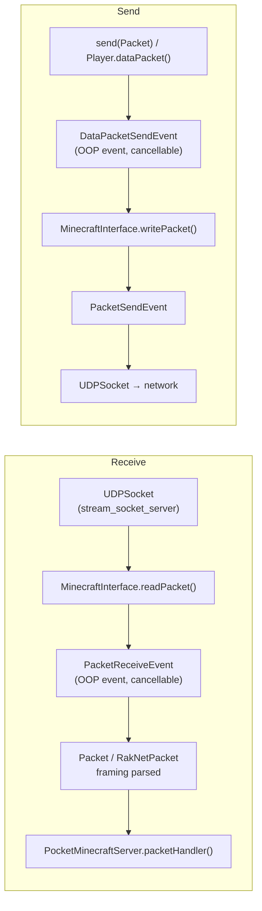
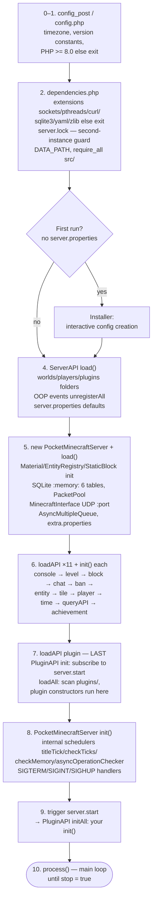
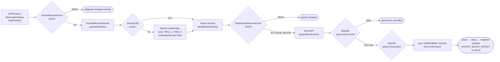
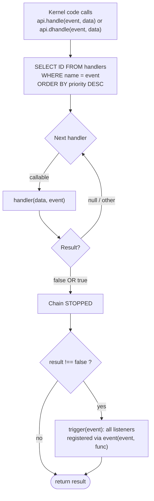
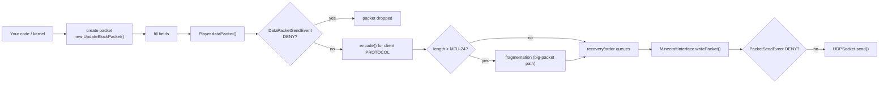
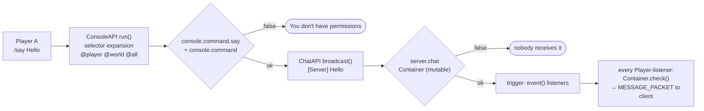
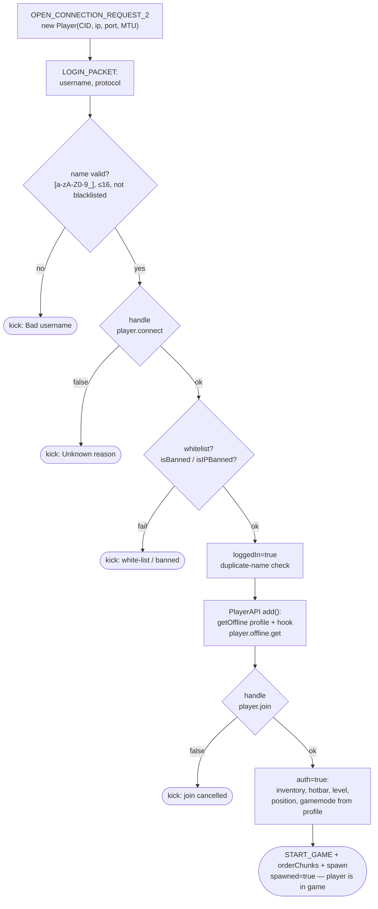

# WorldPECore Plugin API

# Part 1 — Introduction & Architecture

> **Kernel:** WorldPECore (codename **WorldPE**)
> **Target client:** Minecraft: Pocket Edition `v0.8.1 alpha` (protocols 0.3.0–0.8.1 with multiprotocol enabled)
> **Plugin API version:** `12.2`
> **Environment:** PHP ≥ 8.0, CLI SAPI
> **Kernel license:** LGPL v3

## Contents

- [1. System overview](#1-system-overview)
  - [1.1. What is WorldPECore](#11-what-is-worldpecore)
  - [1.2. Key characteristics](#12-key-characteristics)
  - [1.3. The role of plugins](#13-the-role-of-plugins)
  - [1.4. What the kernel ships with](#14-what-the-kernel-ships-with)
- [2. Kernel architecture](#2-kernel-architecture)
  - [2.1. Component diagram](#21-component-diagram)
  - [2.2. ServerAPI — the service locator](#22-serverapi--the-service-locator)
  - [2.3. The main server loop (tick loop)](#23-the-main-server-loop-tick-loop)
  - [2.4. Network stack: UDP and RakNet](#24-network-stack-udp-and-raknet)
  - [2.5. Internal state storage (SQLite)](#25-internal-state-storage-sqlite)
  - [2.6. Threading and async operations](#26-threading-and-async-operations)
  - [2.7. Boot sequence](#27-boot-sequence)
- [3. Data flow](#3-data-flow)
  - [3.1. Path of an incoming packet](#31-path-of-an-incoming-packet)
  - [3.2. Event propagation](#32-event-propagation)
  - [3.3. Outgoing packets and chat](#33-outgoing-packets-and-chat-message-lifecycle)
  - [3.4. Player session lifecycle](#34-player-session-lifecycle)
  - [3.5. RakNet handshake: before `player.connect`](#35-raknet-handshake-before-playerconnect)
  - [3.6. Walkthrough: tracing a block placement in code](#36-walkthrough-tracing-a-block-placement-in-code)
- [4. Concepts and terminology](#4-concepts-and-terminology)
- [5. Map of `src/`](#5-map-of-src)
- [6. Requirements, DEBUG levels and constants](#6-requirements-debug-levels-and-constants)

---

## 1. System overview

### 1.1. What is WorldPECore

**WorldPECore** is a monolithic, single-threaded server kernel for Minecraft: Pocket Edition, built on the classic PocketMine-MP architecture (Alpha era) and extended with modern capabilities (PHP 8.x support, Discord-webhook logger, multiprotocol, chunk lighting system).

The kernel covers the full server cycle:

| Subsystem | Code | Purpose |
|---|---|---|
| Network | `src/network/` (`UDPSocket`, `MinecraftInterface`, `Packet`, RakNet classes) | Receiving/sending UDP datagrams, RakNet framing |
| Player sessions | `src/Player.php` | One `Player` object per connected client (CID) |
| Worlds | `src/world/Level.php`, `PMFLevel` | Chunks, blocks, light, time of day, spawn |
| Entities | `src/entity/Entity.php` + hierarchy | Mobs, items, minecarts, arrows |
| Materials | `src/material/Block.php`, `Item.php` | Block/item registry (`Material::init()`) |
| World generation | `src/world/generator/` | FLAT / DEFAULT / VANILLA generators, populators |
| Plugins | `src/API/PluginAPI.php`, `src/plugin/` | Loading, initializing, configuring plugins |
| Events | `PocketMinecraftServer::handle()/trigger()` + `src/event/` | Dual event system (see Part 4) |

The public entry point for plugin developers is the **`ServerAPI`** object passed to every plugin constructor.

### 1.2. Key characteristics

```text
MAJOR_VERSION            = <kernel version, see src/config_post.php>
CODENAME                 = "WorldPE"
CURRENT_MINECRAFT_VERSION= "v0.8.1 alpha"
CURRENT_API_VERSION      = "12.2"
CURRENT_PHP_VERSION      = "8.0"
```

*Defined in `src/config_post.php`. `CURRENT_API_VERSION` is what `PluginAPI` checks against your plugin’s `apiversion` field.*

Architecture facts to know up front:

1. **Single-threaded game logic.** All game code (plugins, events, worlds) runs on the main PHP thread. The only side threads are `AsyncMultipleQueue` (cURL) and RCON.
2. **SQLite in-memory as the handler registry.** The `handlers` table stores legacy event subscriptions; selection happens via a prepared statement on every `handle()` call (§2.5).
3. **Two coexisting event systems**: legacy string hooks (`player.block.place`) and modern OOP events (`DataPacketReceiveEvent`). Both are available to plugins at the same time.
4. **No class autoloading.** The kernel loads through explicit `require_once` (`src/dependencies.php` → `require_all()`); plugins are loaded manually by `PluginAPI`.
5. **Multiprotocol.** With `multiprotocol=true`, clients 0.3.0–0.8.1 can join — `$player->getProtocol()` distinguishes them; handcrafted packets must respect the oldest supported version.
6. **Multiple worlds are supported** (`LevelAPI::loadLevel/generateLevel`) with player transitions; the default world comes from `level-name`.
7. **Achievements are built in** (`AchievementAPI`, the `/achievements` command) and stored in the player profile.

#### 1.2.1. Target platform limits (MCPE 0.8.x)

Knowing client boundaries saves you from impossible ideas:

| Limitation | Value / consequence |
|---|---|
| Survival inventory | 36 slots (`PLAYER_SURVIVAL_SLOTS`); hotbar configurable 5–9 (`/hotbar`) |
| Creative inventory | 112 slots (`PLAYER_CREATIVE_SLOTS`), registry `BlockAPI::$creative` |
| GUI | no settings/inventory screens — interfaces are built from chests and signs |
| Protocol | no offhand, no offline auth modes; name `[a-zA-Z0-9_]{1,16}` |
| World | fixed chunk height 128 (Y 0–127), PMF format |

### 1.3. The role of plugins

Plugins are the sanctioned way to extend the server. They:

- register console commands (`ConsoleAPI::register()`);
- subscribe to gameplay events (blocks, players, entities, packets);
- create custom tiles (chests, furnaces), entities and worlds via the respective APIs;
- get a private configuration folder `plugins/<Name>/`.

Plugins access every subsystem above through a single facade, `ServerAPI` — from command registration down to raw packet interception. Typical scenarios: land protection, economy, custom workbenches and portals, action loggers, minigames.

### 1.4. What the kernel ships with

A plugin does not need to reinvent basic commands — the services already register them. Verified list:

| Service | Commands | Notes |
|---|---|---|
| ConsoleAPI | `help`/`?`, `status` (alias `tps`), `difficulty <0-3>`, `stop`, `defaultgamemode <mode>` | help/status whitelisted |
| PlayerAPI | `spawnpoint [player] [x y z]`, `hotbar <5-9>`, `spawn`, `ping [player]`, `gamemode <m> [player]`, `tp [from] <to/x y z>`, `kill|suicide [player]`, `list`, `loc [player]` | someone else’s ping/loc — OP only; tp supports `w:world` and `~coords` |
| ChatAPI | `say`, `me`, `tell`/`msg`, `reply`/`r` | tell/reply remember conversation pairs (`ChatAPI::$lastTells`) |
| BanAPI | `sudo <p> <cmd…>`, `op/deop`, `kick <p> [reason]`, `ban add/remove/list/reload`, `banip …`, `whitelist on/off/add/remove/list/reload` | sudo runs a command as the player |
| LevelAPI | `setwspawn`, `save-all`, `save-on/off`, `seed [world]` | save-all warns players about lag |
| TimeAPI | `time check/set/add/day/night/sunset/sunrise [value] [w:<world>]` | set accepts a phase name or number |
| EntityAPI | `summon|spawnmob <mob> [amount] [baby]`, `despawn all/mobs/objects/items/fallings/minecarts`, `entcnt` | mobs: chicken/cow/pig/sheep/zombie/creeper/skeleton/spider/pigman or numeric type 10–36 |
| BlockAPI | `give <player> <item[:damage]> [amount]`, `setblock <x y z> [level] <block[:damage]>`, `id` | coordinates accept `~`; item parsed by string via `BlockAPI::fromString()` |
| AchievementAPI | `/achievements` | lists achievements for the player |

So a typical plugin adds *new* commands rather than duplicating these. A conflicting name in `register()` silently overwrites the builtin handler — avoid collisions.

---

## 2. Kernel architecture

### 2.1. Component diagram



**Key relationships:**

- Every connecting client gets a `Player` instance (`$server->clients[CID]`) which routes its packets.
- All sub-APIs are created inside `ServerAPI::load()` and reachable via properties (`$api->player`, `$api->level`, …).
- A plugin receives the `ServerAPI` reference in its constructor and works only through it afterwards.

### 2.2. ServerAPI — the service locator

`src/API/ServerAPI.php` is the facade of the whole kernel. It contains no game logic; it only:

1. reads `server.properties` (`getProperty()` / `setProperty()`);
2. creates the `PocketMinecraftServer`;
3. instantiates the sub-APIs in a fixed order and calls their `init()`;

```php
// Snippet from ServerAPI::load() — the order matters:
$this->loadAPI("console", "ConsoleAPI");
$this->loadAPI("level",   "LevelAPI");
$this->loadAPI("block",   "BlockAPI");
$this->loadAPI("chat",    "ChatAPI");
$this->loadAPI("ban",     "BanAPI");
$this->loadAPI("entity",  "EntityAPI");
$this->loadAPI("tile",    "TileAPI");
$this->loadAPI("player",  "PlayerAPI");
$this->loadAPI("time",    "TimeAPI");
$this->loadAPI("queryAPI","QueryAPI");
$this->loadAPI("achievement", "AchievementAPI");
// ...after init() on each:
$this->loadAPI("plugin", "PluginAPI"); // plugins load LAST
$this->plugin->init();
```

The static `ServerAPI::request()` returns the current `PocketMinecraftServer` from anywhere — the standard way to reach the kernel without `$api`.

> ⚠️ **Ordering note.** `PluginAPI` is created *after* all other services, so your plugin constructor sees every service ready. However, other plugins’ `init()` has not run yet and worlds may not be loaded. Cross-plugin dependencies go through `OtherPluginRequirement` (Part 2, §7).

#### 2.2.1. Extension point: registering your own service via loadAPI()

`ServerAPI::loadAPI(string $name, string $class, string|false $dir = false)` is public. A plugin can register its own “service” exactly like the kernel does:

```php
// src/API/ is the default lookup folder; you may pass your own:
$this->api->loadAPI("economy", "MyEconomy", $this->api->plugin->configPath($this));

// afterwards, in any plugin:
$money = ServerAPI::request()->economy->get($player->iusername);
```

Semantics: if the property name is taken → `false`; class not loaded yet → `require <dir>/<class>.php`; a successful object joins `apiList` and receives `init()` on the next initialization pass. This is how both the kernel’s pluggable APIs and library-plugins (EconomyAPI etc.) hook in.

### 2.3. The main server loop (tick loop)

The game loop lives in `PocketMinecraftServer::process()` (`src/PocketMinecraftServer.php`). Target rate — **20 TPS** (one tick = 50 ms, gated by `$this->lastTick <= $time - 0.05`).

Three modes (`ticking-mode` in `server.properties`):

| Mode | Constant | Behavior |
|---|---|---|
| `legacy` *(default)* | `TICK_LEGACY = 0` | `usleep()` between socket polls; low CPU, unstable TPS on Windows (~16) |
| `nodelay` | `TICK_F20TPS = 1` | No pauses; max TPS at the cost of 100% CPU |
| `netwait` | `TICK_NETWAIT = 2` | Idle time is spent waiting for packets |



What happens inside one tick:

1. **Client packet queues** — `$client->handlePacketQueues()`.
2. **World ticks** — `Level::onTick($server, $time)` for each loaded world: growth, lighting, time of day, mob spawning.
3. **Scheduler** — `tickerFunction()` selects rows from the SQLite `actions` table where `last <= now - interval`, invokes their callbacks and deletes non-repeating ones. This is where `schedule()` tasks run.

TPS is measured over a ring buffer of the last 40 ticks (`PocketMinecraftServer::getTPS()`); below 12 TPS the console warns *"Can't keep up!"*.

> 💡 **Consequence for plugins:** heavy code inside an event handler or scheduler task directly eats into everyone’s TPS. Push long work to the async mechanisms (§2.6).

#### 2.3.1. Anatomy of one tick

Sequence inside `tick()` (after the “≥ 0.05 s” gate):

1. `++$ticks` — global counter; timestamp pushed to `tickMeasure[]` (ring of 40).
2. Every **1200** ticks — cleanup of `customTimes/custom` (anti-flood state for MOTD pings).
3. Per session: `$client->handlePacketQueues()` — process queued gameplay packets (`Player::handleDataPacket`), flush movement/data queues.
4. Per loaded world: `Level::onTick($server, $time)` — inside: time of day (`checkTime` → broadcast `SET_TIME`), world logic (`checkThings`: fire, falling gravel…), mob spawn/despawn (`MobSpawner::handle`, limit `mobs-amount`), light updates when `enable-light-updates`.
5. `tickerFunction($time)` — the scheduler: SELECT from `actions`, invoke callbacks, drop finished tasks.

Separately from this flow, `BlockAPI::blockUpdateTick()` runs (scheduled by the kernel every 2 ticks): executes the `blockUpdates` table.

> 💡 From this you can see where plugin work is “cheap”: the rarer the event, the safer heavy logic becomes. The most expensive spot is `handlePacketQueues` (every packet of every player).

### 2.4. Network stack: UDP and RakNet



- Before a session exists, the kernel handles the RakNet handshake itself (`UNCONNECTED_PING`, `OPEN_CONNECTION_REQUEST_1/2`) — see `packetHandler()`.
- Unauthenticated packets pass through the `server.noauthpacket.<pid>` hook — returning `false` blocks further processing.
- After session creation (`new Player(...)`), all client datagrams are routed to `Player::handlePacket()`.

### 2.5. Internal state storage (SQLite)

`PocketMinecraftServer::startDatabase()` opens an **in-memory SQLite3 database** used as a fast index for internal subsystems:

| Table | Purpose |
|---|---|
| `players` | CID ↔ EID ↔ name ↔ ip:port mapping |
| `entities` | entity position/health cache |
| `tiles` | tile coordinates (chests, furnaces, signs) |
| `actions` | scheduler tasks: `interval`, `last`, `repeat` |
| `handlers` | legacy event subscribers: event name + priority |
| `blockUpdates` | scheduled block updates — executed by `BlockAPI::blockUpdateTick()` |

Prepared statements (`$this->preparedSQL`) power the hot paths: handler selection in `handle()`, task selection in `tickerFunction()`, entity positioning.

| Prepared statement | SQL essence | Called from |
|---|---|---|
| `selectHandlers` | `SELECT DISTINCT ID FROM handlers WHERE name=:name ORDER BY priority DESC` | `handle()` — every event |
| `selectActions` | `SELECT ID,code,repeat FROM actions WHERE last<=(:time-interval)` | `tickerFunction()` — every tick |
| `updateAction` | `UPDATE actions SET last=:time WHERE ID=:id` | same |
| `entity->setPosition` | UPDATE entity coordinates | movement |
| `entity->setLevel` | UPDATE entity level | world transitions |
| `player->deleteCID/getEq/getLike` | player delete/search | join/quit, `PlayerAPI::get()` |

Reading kernel config from a plugin:

```php
$extra = ServerAPI::request()->extraprops;          // extra.properties
if($extra->get("enable-explosions")){ /* ... */ }

$props = $this->api->getProperty("spawn-protection"); // server.properties
```

> 📌 **Practical takeaway:** a subscription made via `addHandler()` survives across `handle()` calls because the registry lives in the DB while callables live in `$this->handlers`. Removing an individual handler is **not possible** — no public API exists; only soft listeners can be unsubscribed via `deleteEvent($id)`. Treat subscriptions as permanent for the plugin’s lifetime.

### 2.6. Threading and async operations

| Mechanism | Code | When to use |
|---|---|---|
| `AsyncMultipleQueue` | `src/utils/AsyncMultipleQueue.php` | worker thread running cURL GET/POST off the main thread |
| `asyncOperation(ASYNC_CURL_GET/POST, $data, callable)` | `PocketMinecraftServer` | queue an HTTP request; result arrives in your callback next tick + event `async.curl.get` |
| `Async` (pthreads) | `ServerAPI::async(callable, params)` | one-shot thread with arbitrary code |
| RCON threads | `src/network/RCON.php` | only if `enable-rcon` |

Without pthreads (or with the `NO_THREADS` build flag) async mechanisms degrade safely:

| Mechanism | Behavior without threads |
|---|---|
| `asyncOperation()` | returns `false`, callback never invoked |
| `$api->async()` | creates a `DummyAsync` stub |
| Console input | synchronous path (`ConsoleLoop` is not created) |
| RCON | not started |

A plugin only needs to check for the `false` return — the server keeps running single-threaded.

#### 2.6.1. Wire format of AsyncMultipleQueue

The main thread and the worker exchange binary strings (`$input` / `$output`). Record layout:

```text
Request (main → worker):
[Int32 ID][Int16 type] + type-specific payload

ASYNC_CURL_GET payload:
[Int16 lenUrl][url][Int16 timeout=10][Int16 lenHeaders][headers-json]

ASYNC_CURL_POST payload:
[Int16 lenUrl][url][Int16 timeout]
[Int16 count]{ [Int16 lenKey][key][Int32 lenValue][value] }×count

Response (worker → main):
[Int32 ID][Int16 type][Int32 lenBody][body]
```

Read/write helpers — `Utils::readShort/readInt/writeShort/writeInt`. Your callback runs on the main thread when the response is parsed; the `async.curl.get` event fires in parallel. Knowing the format lets you read/write the queues manually, but new *operation types* cannot be added without patching the kernel: their parsing is hardwired in two `switch` blocks (`asyncOperation()` and the worker) with no public extension point.

### 2.7. Boot sequence

Understanding startup explains *why* less is available in a plugin constructor than in `init()`.



Key steps in code terms:

| Step | Method | What matters for plugin devs |
|---|---|---|
| 0 | `config_post.php` | timezone autodetection (Windows: via registry), `gc_enable()`, `FILE_PATH` |
| 1 | `src/config.php` | PHP < 8.0 — immediate exit |
| 2 | `src/dependencies.php` | missing extension or foreign `server.lock` — exit; `DATA_PATH` defined here |
| 3 | `ServerAPI::load()` | `server.properties` defaults apply **before** the kernel exists; `get_declared_classes()` resets all OOP events |
| 4 | `PocketMinecraftServer::__construct/load()` | material/entity registries ready before plugins load |
| 5 | `loadAPI(...)` × 11 | each service registers its commands (`help`, `time`, `ban`…) |
| 5b | `Installer` (first run) | interactive wizard when `server.properties` is absent and no `--no-wizard` |
| 6 | `PluginAPI` | your constructors execute here |
| 7 | `PocketMinecraftServer::init()` | internal schedulers (`titleTick`, `checkTicks`, `checkMemory`, `asyncOperationChecker`), signal handlers |
| 8 | `trigger("server.start", microtime(true))` | your `init()` calls |
| 9 | `process()` | endless loop; exits on `$stop` |

---

## 3. Data flow

### 3.1. Path of an incoming packet

The path of a gameplay packet from the NIC to your plugin (block placement example), left to right:



Two interception levels give different degrees of control:

- **OOP packet events** (`PacketReceiveEvent`, `DataPacketReceiveEvent`) work at the *raw datagram* level — any packet can be cancelled or modified.
- **Legacy hooks** (`player.block.*`) work at the *gameplay action* level — you receive already-parsed data: player, block, item.

Distinguish the two datagram classes in the network layer: `Packet` is the raw UDP wrapper (buffer + ip/port) while `RakNetDataPacket` is a recognized gameplay packet with typed fields and `encode()/decode()`. The `Packet*` events carry the former, `DataPacket*` — the latter.

### 3.2. Event propagation

The legacy mechanism has three stages; their order is critical:



**Rules to memorize:**

1. **Handlers** (`addHandler`) can *veto*: returning `false` stops the whole chain and cancels the action. Returning `true` confirms and also ends traversal (later handlers are skipped).
2. **Listeners** (`event()`) run *after* handlers via `trigger()` and decide nothing — they are only notified (e.g., `Player` listens to `entity.motion` to relay movement).
3. Priority is an integer; `ORDER BY priority DESC` means **higher runs first**. The kernel uses `1` for critical permission checks (BanAPI); default is `5`; typical plugin observers use `15`.

Mini-trace to make it stick — two plugins on `player.join`:

```text
PluginLogger (addHandler, prio 15)  → logs “X joined”        return null
WelcomeMsg   (addHandler, prio 5)   → sendChat greeting      return null
→ chain reaches the end (all null) → trigger("player.join")
→ event()-listeners fire (if any)

If WelcomeMsg returns false:
→ chain stops, trigger NOT executed,
  BUT PluginLogger(15) already ran earlier by priority.
```

OOP events work differently: priorities come from `EventPriority` (`LOWEST=5 … MONITOR=0`, descending execution order) and cancellation happens via `setCancelled()` on the event object. Full details in Part 4.

### 3.3. Outgoing packets and chat message lifecycle

Outgoing traffic mirrors incoming, with one crucial detail: **every** gameplay packet send passes through a cancellable OOP event.



Full lifecycle of one chat message — both event systems in a single scenario:



Practical rule: **chat filtering belongs in `server.chat`** (one choke point for all sources: `/say`, `/me`, `broadcast()`), not in `MESSAGE_PACKET` interception.

### 3.4. Player session lifecycle

Joining is the most event-dense scenario; knowing the exact sequence tells you which data exists inside each handler:



Data availability per handler:

| Point | `$entity` | `$auth` | Profile `$data` | Can kick |
|---|---|---|---|---|
| `player.connect` | false | false | no | yes (`false`) |
| `player.join` | false→created next | false | **yes** | yes (`false`) |
| after spawn | Entity | true | yes | via `close()` |
| `player.quit` | still alive | true | yes (saved after) | — |

Leaving mirrors joining: `close(reason)` → `player.quit` → profile `save()` → DisconnectPacket → chunk release → `PlayerAPI::remove()` (offline save, avatar removal, SQL) → broadcast “left the game”.

Step by step on exit:

1. `$p->close($reason)` — double-call guard via `$connected`.
2. Unsubscribe all session event IDs (`$this->evid`).
3. If authorized: **`player.quit`** hook → `save()`.
4. Client gets kick message and `DisconnectPacket`; buffers cleared.
5. `level->freeAllChunks()`, `loggedIn=false`, queues/windows/inventory cleared.
6. `PlayerAPI::remove(CID)`: guarded `close()` re-entry, offline save, SQL DELETE, `entity->remove()` of the avatar, `$level->players` cleanup.
7. Broadcast “_X_ left the game!” (if spawned).

### 3.5. RakNet handshake: before `player.connect`

| Packet | Direction | Kernel logic (`packetHandler()`) |
|---|---|---|
| `UNCONNECTED_PING(_OPEN_CONNECTIONS)` | client → server | Reply `UNCONNECTED_PONG`: serverID + MOTD line `MCCPP;Demo;<name> [online/max] <scrolling description>`; shortened when `$server->invisible=true` |
| `OPEN_CONNECTION_REQUEST_1` | client → server | Wrong structure → `INCOMPATIBLE_PROTOCOL_VERSION`; correct → `OPEN_CONNECTION_REPLY_1` with MTU from request length |
| `OPEN_CONNECTION_REQUEST_2` | client → server | Limits: `maxClients+32`, ≤8 clients per IP; MTU clamped to [512..2048]; session created via `new Player(...)` |

```php
// Exact clamps from packetHandler():
if($packet->mtuSize > 2048)  $packet->mtuSize = 2048;
if($packet->mtuSize <= 512)  $packet->mtuSize = 512;
// per-address session limit:
foreach($this->clients as $session){ if($session->ip === $packet->ip && ++$sameIP >= 8) break; }
```

Before a session exists, every packet passes the `server.noauthpacket.<pid>` hook — returning `false` from a handler stops normal processing (extension point for custom protocol handlers).

### 3.6. Walkthrough: tracing a block placement in code

Reading route for one action — the best way to learn the architecture:

| Step | File::method | What happens |
|---|---|---|
| 1 | `Player::handleDataPacket` | `PLACE_BLOCK_PACKET` arrives → basic session checks |
| 2 | same | calls `BlockAPI::playerBlockAction(...)` |
| 3 | `BlockAPI::playerBlockAction` | `dhandle("player.block.touch", [type=place,…])` |
| 4 | `PocketMinecraftServer::handle` | SQL handler selection, priority traversal |
| 5 | your plugins | `guard()/logger()` etc.; possible `false` |
| 6 | `BlockAPI` | `place.invalid` → `.bypass` → `.spawn` (BanAPI prio 1) |
| 7 | target block | `$block->place(...)` / `onActivate(...)` |
| 8 | `Level::setBlock` | chunk write, light update (`updateLight*`) |
| 9 | `Level` | `updateNeighborsAt` → neighbor physics |
| 10 | broadcast | `addBlockToSendQueue` → `UPDATE_BLOCK_PACKET` to viewers |

Read these ten points once and any block-related task becomes predictable. Similar routes: item pickup (`Entity::environmentUpdate` → `player.pickup` → `TAKE_ITEM_ENTITY_PACKET`), player join (§3.4).

---

## 4. Concepts and terminology

| Term | Definition | Where in code |
|---|---|---|
| **Tick** | Smallest simulation step, 50 ms (20 TPS). Scheduler time is in *ticks*: `schedule(20, ...)` = once per second | `PocketMinecraftServer::tick()` |
| **CID (Client ID)** | Session id: `crc32(ip.port) ^ crc32(port.ip.BOOTUP_RANDOM)` | `PocketMinecraftServer::clientID()` |
| **EID (Entity ID)** | Numeric entity id from the `eidCnt` counter | `EntityAPI::getNextEID()` |
| **Handler** | Legacy event subscriber with veto power. Registered via `ServerAPI::addHandler(name, callable, priority)` | SQLite `handlers` |
| **Listener (event)** | “Soft” subscriber via `ServerAPI::event()`; notified but cannot cancel | `$server->events[]` |
| **BaseEvent** | OOP event class with a static handler registry; cancelled via `CancellableEvent` | `src/BaseEvent.php` |
| **Priority** | Integer call order. Legacy: higher = earlier (1…15+). OOP: `EventPriority` constants (5=LOWEST … 0=MONITOR, higher = earlier) | `src/event/EventPriority.php` |
| **Plugin Identifier** | Plugin key: `sha1(name) XOR sha1(author) XOR nonce(session)` — stable within one server run | `PluginAPI::getIdentifier()` |
| **Tile** | Stateful block container (chest, furnace, sign). `Tile` subclasses, registry — `TileAPI` | `src/world/Tile.php` |
| **Level** | World instance. Stored in `$api->level->levels[name]`; default — `$api->level->getDefault()` | `src/world/Level.php` |
| **DATA_PATH** | Data root (worlds, players, `plugins/`). Defaults to the kernel folder; overridden by `--data-path` | `src/dependencies.php` |
| **Payload** | Array or object passed as the first handler argument. Composition documented per event in Part 4 | — |
| **PHAR / PMF** | Plugin packaging formats. PHAR requires `plugin.cfg` with `classLoader`, `CLClass`, `mainFile` keys | `src/plugin/phar/PharUtils.php` |
| **Container** | Chat message wrapper: payload + whitelist/blacklist of recipients; travels through `server.chat` | `src/utils/Container.php` |
| **windowid** | Per-player open-container window number (`$player->windows[id]`); 0x78 reserved for armor window | `src/Player.php` |
| **StaticBlock** | Static per-block property table (hardness, transparency, bbox) without object creation | `src/material/` |
| **Material** | Block material registry (water, lava, ice…), initialized before plugins | `Material::init()` |
| **PMF** | Binary map/plugin format from the PocketMine Alpha era (header + gzip sections) | `src/pmf/` |
| **Query / RCON** | Side admin protocols: GameSpy4 stats and remote console | `network/query/`, `network/RCON.php` |
| **AsyncMultipleQueue** | cURL worker thread; binary exchange with main thread via `$input/$output` strings | `src/utils/AsyncMultipleQueue.php` |
| **Creative registry** | `BlockAPI::$creative` array — reference creative inventory granted in mode 1 | `BlockAPI.php` |
| **PacketPool** | pid → packet class registry; initialized before plugins (`PacketPool::init()`) | `network/Packet.php` |
| **QueryHandler** | GameSpy4 request processor; created when `enable-query=true` | `network/query/` |
| **ARQ / recovery queue** | RakNet reliable-delivery queues per session; lengths visible in OP `/ping` | `src/Player.php` |

### 4.1. Navigation: “where does X happen in the kernel”

| I want to understand/change | Go to |
|---|---|
| Block place/break rules, item drops | `BlockAPI::playerBlockAction/playerBlockBreak` |
| Breaking speed & anti-cheat | `PocketMinecraftServer::$BLOCK_BREAKING_PROGRESS`, `Player::handleDataPacket` (PLAYER_ACTION) |
| What a player sees on join (login packets) | `Player::handleDataPacket` LOGIN branch → `processLogin`; inventory granted there |
| Movement and position anti-cheat | `Entity::updateMovement()` — `entity.move` hook |
| Relaying movement to other players | `Player::$entityMovementQueue` + `sendEntityMovementUpdateQueue()` |
| Opening inventories/chests | `Tile::openInventory()`, windows `$player->windows` |
| Crafting recipes | `recipes/CraftingRecipes.php` (static table) |
| Mob spawn/despawn | `world/MobSpawner.php`, `despawn-mobs` flags |
| Light and updates | `Level::updateLight*()`, `enable-light-updates` flag |
| Pathfinding for mobs | `astarnavigator/TileNavigator.php` (A*) |
| World generation | `world/generator/*` (FLAT/DEFAULT/VANILLA) |
| Player achievements | `players/*.yml` profile key `achievements` + `AchievementAPI` |
| Discord integration | `PocketMinecraftServer::send2Discord()` |
| Where crafting recipes live | `recipes/CraftingRecipes.php` (static table) |
| Kernel self-tests | `src/tests/ServerSuiteTest.php` (mini harness `testCase`) |

---

## 5. Map of `src/`

Knowing this map saves you from wandering:

```text
src/
├── config.php / config_post.php   # PHP >= 8.0 check, version constants, timezone, SOURCE_SHA1SUM
├── dependencies.php                # extension checks, server.lock, require_all() of the whole codebase
├── functions.php                   # global functions: console(), arg(), nullsafe(), logg()...
├── PocketMinecraftServer.php       # CORE: loop, legacy events, scheduler, Discord, error dump
├── Player.php                      # player session: packets, inventory windows, movement, chunk round-robin (~4000 lines)
├── BaseEvent.php                   # base class of OOP events (register/unregister/cancel)
├── Deprecation.php                 # deprecated event -> replacement map
├── API/                            # ServerAPI and 12 services (see Part 3)
│   ├── ServerAPI.php               #   facade + getProperty/loadAPI/schedule delegates
│   ├── PluginAPI.php               #   plugin loader (+RequiredPluginEntry at end of file)
│   └── *.php                       #   remaining services — one class per file
├── plugin/
│   ├── Plugin.php                  # plugin interface (the only mandatory API)
│   ├── DummyPlugin.php             # stub for class=none
│   ├── OtherPluginRequirement.php  # dependency declaration interface
│   └── phar/
│       ├── IClassLoader.php        # interface { loadAll($pharPath); }
│       └── PharUtils.php           # plugin.cfg parser for .phar
├── event/                          # OOP events
│   ├── ServerEvent / PluginEvent   #   BaseEvent subclasses
│   ├── EventHandler.php            #   callEvent(): priority traversal
│   ├── EventPriority.php           #   LOWEST..MONITOR
│   ├── CancellableEvent.php        #   marker interface
│   └── server/Packet*Event.php     #   4 packet events
├── world/                          # Level, Tile, Position, Explosion, MobSpawner
│   └── generator/                  # WorldGenerator + FLAT/VANILLA/Temporal, biome/, populator/
├── entity/                         # Entity, Living, Creature, Animal (+Ageable/Breedable/Rideable)
│   └── object/                     # Arrow, Minecart, PrimedTNT, Painting...
├── material/                       # Block, Item, StaticBlock, Material; block//item/ subfolders
├── network/
│   ├── UDPSocket.php               # stream_socket_server + send/receive
│   ├── MinecraftInterface.php      # Packet <-> RakNet, PacketSend/ReceiveEvent
│   ├── Packet.php / RakNet*        # datagram wrappers, PacketPool::init()
│   ├── protocol/                   # ProtocolInfo + ~60 packet classes
│   ├── query/QueryHandler.php      # GameSpy4
│   └── RCON.php                    # remote console (pthreads)
├── pmf/                            # PMF.php base + PMFLevel + PMFPlugin
├── recipes/CraftingRecipes.php     # static recipe table
├── astarnavigator/                 # mob pathfinding
├── utils/                          # Config, TextFormat, NBT, Random*, AsyncMultipleQueue,
│                                   # Container, Utils, UPnP, StopMessageThread, LightUtils
└── constants/                      # ItemIDs, BlockIDs, EntityIDs, GeneralConstants
```

**Kernel reading order for a fast start** (simple to complex):

1. `plugin/Plugin.php` → `DummyPlugin.php` — the entire mandatory contract.
2. `API/PluginAPI.php` — how you get loaded (metadata, initAll).
3. `API/ConsoleAPI.php` — command mechanics.
4. `PocketMinecraftServer.php` — `handle/trigger/event/schedule` (event core).
5. `BaseEvent.php` + `event/EventHandler.php` — the second system.
6. `Player.php` — as needed: `handleDataPacket` doubles as a protocol map.

---

## 6. Requirements, DEBUG levels and constants

### 6.1. Environment requirements

| Requirement | Value | Verified by |
|---|---|---|
| PHP | ≥ 8.0.0 | `src/config.php` |
| SAPI | CLI (web execution denied) | `src/dependencies.php` |
| Extensions | `sockets`, `pthreads ≥ 0.1.0`, `curl`, `sqlite3`, `yaml`, `zlib` | `src/dependencies.php` |
| FS permissions | read/write `DATA_PATH/server.lock` (mutex against second instance) | `src/dependencies.php` |

### 6.2. Logging levels (DEBUG)

Global `DEBUG` (the `debug` key in server.properties) gates both `console()` and `logg()`:

| DEBUG | Visible output |
|---|---|
| `0` | critical only (`level=0`): SQL errors, `[SEVERE]`, fatal messages |
| `1` *(default)* | standard `[INFO]/[WARNING]/[ERROR]` from plugins and kernel |
| `2` | plus `[NOTICE]`, autosave messages, part of session debug |
| `3+` | plus `[INTERNAL]/[DEBUG]`: API/handler registration, packet tracing |

Recommendation: informational plugin messages — `level=1`; diagnostics — `3`, so production consoles stay clean.

### 6.3. Constants available to plugins

| Constant | Type | Description |
|---|---|---|
| `DATA_PATH` | string | data root (with trailing slash): `worlds/`, `players/`, `plugins/`, `extra.properties` live here |
| `FILE_PATH` | string | kernel installation folder |
| `CURRENT_API_VERSION` | `"12.2"` | checked against your plugin’s `apiversion` field |
| `MAJOR_VERSION`, `CODENAME` | string | kernel version and codename |
| `CURRENT_MINECRAFT_VERSION` | string | supported client version |
| `DEBUG` | int | log verbosity (`debug` in server.properties) |
| `CONFIG_YAML`, `CONFIG_PROPERTIES`, `CONFIG_DETECT` | int | config types for `utils\Config` |
| `SURVIVAL=0`, `CREATIVE=1`, `ADVENTURE=2`, `VIEW=SPECTATOR=3` | int | game modes (`GeneralConstants.php`). The `& 0x01` bit separates survival/creative across the kernel |
| `SIDE_DOWN=0 … SIDE_XPOS=5` | int | block face numbering (`$face` parameter in block events) |
| `PLAYER_SURVIVAL_SLOTS=36`, `PLAYER_CREATIVE_SLOTS=112` | int | inventory sizes |
| `BLOCK_UPDATE_NORMAL/RANDOM/SCHEDULED/WEAK/TOUCH` | int | block update types (1–5) for BlockAPI |
| `ENTITY_PLAYER/ENTITY_ITEM/ENTITY_MOB/…` | string/int | entity classes for `getRadius($class)` and `$e->class` comparisons (`EntityIDs.php`) |
| `TimeAPI::$phases` | array | `day/sunset/night/sunrise` ⇒ ticks — single source of truth, do not duplicate numbers |

Any `server.properties` key can be overridden without editing the file:

```bash
./pocketmine-mp.php --server-port=20000 --max-players=50 --debug=3
# priority: CLI > server.properties > kernel defaults
```

Full block/item id lists — `src/constants/ItemIDs.php`, `src/constants/BlockIDs.php`; entity ids — `EntityIDs.php`. Constants are defined via `define()` and globally visible.

---

➡️ **Part 2 — Plugin Lifecycle & Quickstart**: the `Plugin` interface, metadata format, lifecycle diagram, minimal boilerplate and practical patterns.


