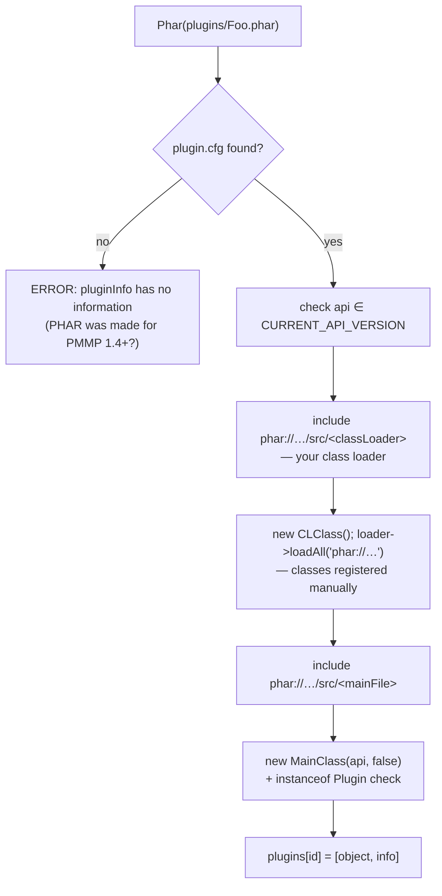
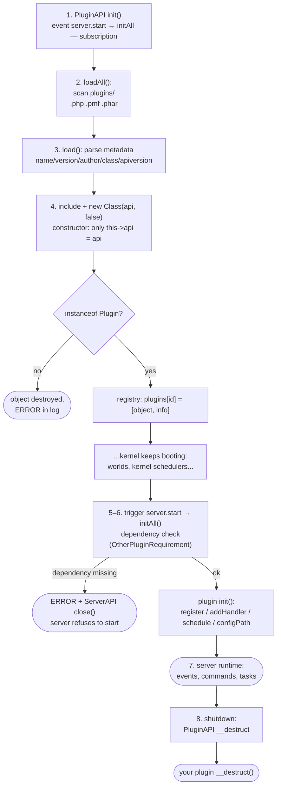
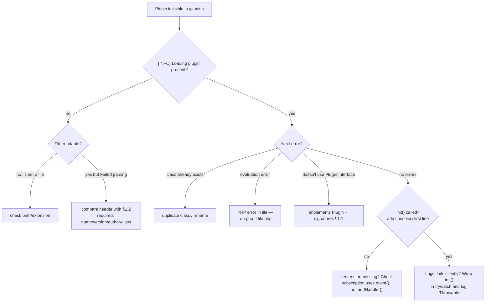
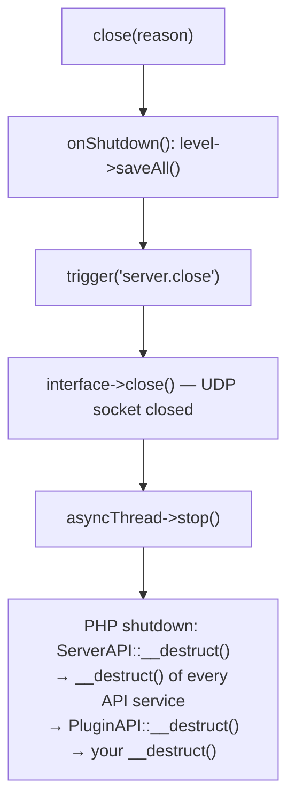

# WorldPECore Plugin API

# Part 2 — Plugin Lifecycle & Quickstart

> **Prerequisite:** read [Part 1 — Introduction & Architecture](01-introduction.md).
> All code samples were written for this documentation and verified against the kernel sources.

## Contents

- [1. Anatomy of a plugin](#1-anatomy-of-a-plugin)
  - [1.1. The contract: `Plugin` interface](#11-the-contract-plugin-interface)
  - [1.2. Metadata header](#12-metadata-header)
  - [1.3. Class requirements](#13-class-requirements)
  - [1.4. Load error messages](#14-load-error-messages)
- [2. Distribution formats](#2-distribution-formats)
  - [2.1. Single `.php`](#21-single-php)
  - [2.2. Legacy `.pmf`](#22-legacy-pmf)
  - [2.3. `.phar` archive](#23-phar-archive)
- [3. Plugin lifecycle](#3-plugin-lifecycle)
  - [3.1. Lifecycle diagram](#31-lifecycle-diagram)
  - [3.2. Constructor vs `init()`](#32-constructor-vs-init)
  - [3.3. Shutdown and destructor](#33-shutdown-and-destructor)
- [4. Quickstart: minimal boilerplate](#4-quickstart-minimal-boilerplate)
- [5. Practical patterns](#5-practical-patterns)
- [6. Plugin configuration](#6-plugin-configuration)
- [7. Plugin dependencies](#7-plugin-dependencies)
- [8. Publishing checklist & diagnostics](#8-publishing-checklist--diagnostics)
- [9. Known kernel quirks](#9-known-kernel-quirks)

---

## 1. Anatomy of a plugin

### 1.1. The contract: `Plugin` interface

The complete interface — file `src/plugin/Plugin.php`:

```php
interface Plugin{

    public function __construct(ServerAPI $api, $server = false);

    public function init();
}
```

The contract is tiny but **both methods are mandatory**:

| Method | When called | Purpose |
|---|---|---|
| `__construct(ServerAPI $api, $server = false)` | When the kernel loads your file (`PluginAPI::load()` / `loadAll()`) | Store the API reference. Logic here is forbidden — see §3.2 |
| `init()` | After the `server.start` event, for all plugins in turn (`PluginAPI::initAll()`) | Real initialization: commands, handlers, tasks |
| `__destruct()` *(optional)* | On server shutdown (`PluginAPI::__destruct`) | Resource cleanup (close DB, files) |

A class may also implement a second kernel interface:

```php
// src/plugin/OtherPluginRequirement.php
interface OtherPluginRequirement{
    public function getRequiredPlugins(); // array of RequiredPluginEntry
}
```

### 1.2. Metadata header

For a single PHP file the kernel reads metadata from the comment **up to the first `*/`**. The parser (`PluginAPI::load()`, regex `([a-zA-Z0-9\-_]*)=([^\r\n]*)`) demands an exact format:

```php
<?php
/*
__PocketMine Plugin__
name=MyPlugin
description=What the plugin does
version=1.0
author=YourName
class=MyPlugin
apiversion=12.2
*/
```

| Field | Required | Type | Description |
|---|---|---|---|
| `name` | ✅ | string | Display name. Used in the identifier and config path |
| `version` | ✅ | string | Plugin version (free-form) |
| `author` | ✅ | string | Author. Part of the plugin identifier |
| `class` | ✅ | string | Main class name. Special value `none` — code-less plugin (creates a `DummyPlugin`). Kernel lowercases it when checking existing classes |
| `description` | ❌ | string | Parsed into `$info["description"]` but never displayed by kernel commands (`plugins`, `version`) — use for your own tooling |
| `apiversion` | ❌ | string / CSV | Compatible API versions comma-separated, e.g. `12.1,12.2`. Mismatch with `CURRENT_API_VERSION` (`12.2`) prints a warning and **continues loading** |

Parsing rules:

- Values `on/off`, `true/false`, `yes/no` are auto-cast to `bool` — this applies to **any** field including `name` and `class`! So `class=true` turns the field into a boolean and breaks loading.
- Everything before the closing `*/` is treated as metadata; code after it executes as normal PHP.
- Any missing required field, or zero regex matches, aborts loading with `[ERROR] Failed parsing of <file>`.
- `apiversion` parses as CSV (`explode(",", ...)` + `floatval` comparison) — write clean versions (`12.2`, not `v12.2 `).
- Whitespace around values is not trimmed by the legacy parser — keep strict `key=value`.

#### Correct header examples

Minimal (required only):

```php
/*
__PocketMine Plugin__
name=Tiny
version=0.1
author=Dev
class=Tiny
*/
```

Extended (compatible with two API versions):

```php
/*
__PocketMine Plugin__
name=Shop
description=Item shop
version=2.4.1
author=DevTeam
class=ShopPlugin
apiversion=12.1,12.2
*/
```

### 1.3. Class requirements

1. The main class must implement `Plugin`. Otherwise the object is destroyed and you get:
   `[ERROR] Plugin "<name>" doesn't use the Plugin Interface`.
2. The constructor must accept `(ServerAPI $api, $server = false)` — the kernel calls exactly `new $className($this->server->api, false)`.
3. The class name must be unique within the process: if the class already exists, loading fails with `[ERROR] Failed loading plugin: class exists`.
4. Namespaces: a PHAR plugin gets its main class derived automatically from the `mainFile` path (`PharUtils::getNameSpaceClass`, `src/plugin/phar/PharUtils.php`: `/` → `\`, `.php` stripped). A single `.php` has no such mechanism — write the full `\`-qualified name into `class=` yourself; the kernel has no autoloader.

### 1.4. Load error messages

Exact reference — what the kernel prints per problem (`PluginAPI::load()/loadAll()`):

| Console message | Cause | Fix |
|---|---|---|
| `[ERROR] <file> is not a file` | path is a link/directory/missing | check the filename in `plugins/` |
| `[ERROR] Failed parsing of <file>` | no `key=value` lines before `*/`, or missing one of `name/version/class/author` | compare header with §1.2 template |
| `[INFO] Loading plugin "X" … by Y` | successful parse (not an error) | — |
| `[ERROR] Failed loading plugin: class already exists` | class from `class=` already declared (duplicate or conflict) | rename the class |
| `[ERROR] Failed loading <name>: evaluation error` | PHP error during `include` / PMF `eval` | read the trace above in the log |
| `[WARNING] Plugin "X" may not be compatible with the API (...)! It can crash or corrupt the server!` | `apiversion` lacks `12.2` | update the field; loading continues |
| `[ERROR] Plugin "X" doesn't use the Plugin Interface` | class does not implement `Plugin`; object destroyed | add `implements Plugin` |
| `[WARNING] API is not the same as Core(...)` (PHAR) | apiversion-check equivalent for `plugin.cfg` | update `api=` |
| `[ERROR] Failed to load PHAR plugin from ...: pluginInfo has no information(PHAR was made for PMMP 1.4+?)` | no `plugin.cfg` inside `.phar` | build the archive per §2.3 |
| `[ERROR] Plugin "X" needed by "Y" is not found.` → **server stops** | `OtherPluginRequirement` dependency unmet | install the dependency |

Diagnostic algorithm “plugin not visible in `/plugins`”: find the first message above in the startup log → fix → restart.

---

## 2. Distribution formats

`PluginAPI` scans `DATA_PATH/plugins/` and recognizes three formats by extension.

### 2.1. Single `.php`

The simplest format — one file with metadata (§1.2). Best for small plugins; connect via `include`, then the class from `class` is instantiated.

### 2.2. Legacy `.pmf`

`PMFPlugin` (`src/pmf/PMFPlugin.php`) — a binary PocketMine-Alpha-era container (format version `PMF_CURRENT_PLUGIN_VERSION = 0x02`):

```text
[PMF header][name][version][author][apiversion][class][identifier]
[gzip(deflate)-compressed extra section][gzip-compressed plugin PHP code]
```

Metadata comes from `getPluginInfo()`; code runs through `eval()`. Kept for backward compatibility only — **do not use for new plugins**.

### 2.3. `.phar` archive

PHAR is the “modern” plugin format (PMMP 1.4+ packer). The loader `PluginAPI::loadAll()` expects a **`plugin.cfg`** file inside the archive:

```ini
name=MyPlugin
description=Custom Crafting system
version=3.1.4
author=ArkQuark
mainFile=IWmain.php
api=12.2
classLoader=src/loader.php
```

PHAR loading pipeline:



Details:

- `CLClass` derives from the `classLoader` path by replacing `/` with `\` (`PharUtils::getNameSpaceClass()`) — i.e. the loader must be a namespaced class mirroring directory structure.
- The class registry is implemented by your class implementing `IClassLoader` (`src/plugin/phar/ICClassLoader.php`, single method):

```php
interface IClassLoader{
    public function loadAll($pharPath);
}
```

- Namespaces are allowed because the main class is derived the same way (`mainFile=src/Npc/Main.php` → class `Npc\Main`).

#### Full PHAR build example

Source layout:

```text
build-src/
├── plugin.cfg
└── src/
    ├── loader.php          # class MyPlugin\Loader
    └── Npc/
        └── Main.php        # class MyPlugin\Npc\Main implements Plugin
```

`plugin.cfg`:

```ini
name=NpcPlugin
description=NPC spawn and control
version=1.0.0
author=YourName
mainFile=src/Npc/Main.php
api=12.2
classLoader=src/loader.php
```

`src/loader.php`:

```php
<?php
namespace MyPlugin;

class Loader implements \IClassLoader{
    public function loadAll($pharPath){
        // $pharPath = "phar://<file>.phar/"
        require_once($pharPath . "src/Npc/Main.php");
        // require every needed class explicitly — there is no autoloader
    }
}
```

Build script (`build-phar.php`, run with the same PHP):

```php
<?php
$out = __DIR__ . "/NpcPlugin.phar";
@unlink($out);
$phar = new Phar($out);
$phar->buildFromDirectory(__DIR__ . "/build-src");
// plugin.cfg must sit at the archive ROOT:
$phar->addFile(__DIR__ . "/plugin.cfg", "plugin.cfg");
echo "Built: $out\n";
```

Pre-publication check: drop the `.phar` into `plugins/`, restart; the log should show `[INFO] Loading PHAR plugin "NpcPlugin" 1.0.0 by YourName` without API warnings.

Common build problems:

| Symptom | Cause |
|---|---|
| `pluginInfo has no information` | `plugin.cfg` not at archive root or key casing differs (case-sensitive!) |
| Class not found after load | `loadAll()` did not include the file, or `mainFile` path mismatch vs actual (`src/…`) |
| Fatal on `new $pluginName(...)` | `mainFile=src/Npc/Main.php` implies class `\Npc\Main` — namespace mirrors folders |
| Other plugins can’t see your classes | classes loaded only within the phar stream — expose public APIs via a separate plain `.php` plugin |

---

## 3. Plugin lifecycle

### 3.1. Lifecycle diagram



Stages in code terms:

| Stage | Kernel method | What happens |
|---|---|---|
| 1. Subscription | `PluginAPI::init()` | Subscribes `initAll()` to `server.start`; starts `loadAll()` |
| 2. Scanning | `loadAll()` | Walk `plugins/`; `.php`/`.pmf` → `load()`, `.phar` → inline logic |
| 3. Parsing | `load($file)` | Metadata parsing, `include`, `instanceof Plugin` check, `apiversion` check |
| 4. Instantiation | `new $class($api, false)` | Constructor. Object stored: `plugins[identifier] = [object, info]` |
| 5. Dependencies | `initAll()` | For `OtherPluginRequirement`: missing dependency **stops the server** (`ServerAPI::request()->close()`) |
| 6. Initialization | `initAll()` → `$p[0]->init()` | Full plugin logic registration |
| 7. Runtime | events/commands/scheduler | The main lifetime |
| 8. Unload | `PluginAPI::__destruct()` | Calls each plugin’s `__destruct()` |

> ⚠️ Known quirk: between stage 4 and stage 6 the rest of the boot happens (worlds, “null” player objects). The kernel comment says it outright: *“ARGHHH!!! Plugin loading randomly fails!!”* — rely on nothing but `$api` inside the constructor.

### 3.2. Constructor vs `init()`

| Allowed in `__construct` | Allowed in `init()` |
|---|---|
| `$this->api = $api;` | `$api->console->register(...)` — commands |
| Simple field initialization | `$api->addHandler(...)` / `BaseEvent::register(...)` — subscriptions |
| — | `$api->schedule(...)` — tasks |
| — | `$api->plugin->configPath()/createConfig()` — files |
| — | World, entity, tile access |

Reason: plugin constructors run from `PluginAPI::loadAll()`, and `PluginAPI` is created **last** among services inside `ServerAPI::load()` — by then every other API is instantiated with `init()` done, and commands `plugins`/`version` are registered. But other plugins’ `init()` has not run yet, and worlds may be absent on first boot. The kernel comment says it outright: *“ARGHHH!!! Plugin loading randomly fails!!”* — so the only safe constructor action is `$this->api = $api`.

#### Availability matrix per stage

| Resource | `__construct` | `init()` | runtime | `__destruct` |
|---|---|---|---|---|
| `$this->api` (all 12 services) | ✅ | ✅ | ✅ | ⚠️ services still alive |
| Commands (`console->register`) | ⚠️ technically possible | ✅ | ✅ | ❌ |
| Handlers / OOP events | ❌ pointless | ✅ | ✅ | ❌ |
| Worlds (`level->getDefault()`, `get()`) | ⚠️ default may be missing on first boot | ✅ (after `server.start`) | ✅ | ⚠️ already saved/closed |
| Online players | ❌ none yet | ⚠️ usually none | ✅ | ❌ |
| Files in `configPath($this)` | ❌ registry not filled yet | ✅ | ✅ | ✅ |
| Scheduler `schedule()` | ❌ loop not running | ✅ | ✅ | ❌ task never fires |

Rule of thumb: constructor = store the reference; everything else — `init()`.

### 3.3. Shutdown and destructor

The kernel invokes your `__destruct()` explicitly from `PluginAPI::__destruct()`:

```php
// src/API/PluginAPI.php
public function __destruct(){
    foreach($this->plugins as $p){
        if(method_exists($p[0], "__destruct")) $p[0]->__destruct();
    }
}
```

Guidelines:

- Close SQLite connections/files, stop external processes.
- **Do not** run gameplay logic — worlds may already be saved/unloaded.
- Remember the destructor is called manually, so it may fire twice on unload errors (the kernel guards itself with the `PluginAPI::$plugins is null` warning).

---

## 4. Quickstart: minimal boilerplate

Ready-to-copy skeleton — save to `plugins/MyFirst/MyFirst.php`:

```php
<?php
/*
__PocketMine Plugin__
name=MyFirst
description=My first plugin
version=0.0.1
author=YourName
class=MyFirst
apiversion=12.2          ← current kernel API; warning if different
*/

class MyFirst implements Plugin{                    // 1. Plugin contract

    private $api;

    public function __construct(ServerAPI $api, $server = false){
        $this->api = $api;                          // 2. ONLY store the reference
    }

    public function init(){                         // 3. all logic lives here
        // /hello command: callback receives ($cmd, $params, $issuer, $alias)
        $this->api->console->register("hello", "Say hello", [$this, "cmdHello"]);
        // allow the command for everyone (otherwise OP/console only):
        $this->api->ban->cmdWhitelist("hello");

        // event hook: returning false cancels the action
        $this->api->addHandler("player.join", [$this, "onJoin"], 15);

        // repeating task every 20 ticks (1 sec):
        $this->api->schedule(20, [$this, "onTick"], [], true);
    }

    public function cmdHello($cmd, $params, $issuer, $alias){
        return "Hello, world!\n";                   // text goes back to the sender
    }

    public function onJoin($data){                  // $data === Player object
        if($data instanceof Player){
            $this->api->chat->broadcast("Welcome, " . $data->iusername . "!");
        }
        // return false; — would block further processing of the event
    }

    public function onTick($data, $event){
        // periodic logic
    }

    public function __destruct(){
        // resource cleanup
    }
}
```

After a restart verify installation with `pl` (alias of `plugins`) — your plugin should appear with version and author.

#### 4.1. Iteration 2: growing the boilerplate into a real plugin

Extend `MyFirst` into a welcome plugin with config, scheduler and clean shutdown:

```php
<?php
/*
__PocketMine Plugin__
name=MyFirst
description=Greetings and auto-broadcasts
version=0.2.0
author=YourName
class=MyFirst
apiversion=12.2
*/

class MyFirst implements Plugin{
    private $api, $cfg;
    private $adIndex = 0;

    public function __construct(ServerAPI $api, $server = false){
        $this->api = $api;
    }

    public function init(){
        // --- commented config ---
        $path = $this->api->plugin->configPath($this);
        $this->cfg = new Config($path."config.yml", CONFIG_YAML, [
            "welcome" => "Welcome to the server!",
            "ads" => ["Vote for us!", "Rules: /help"],
            "ad-interval-seconds" => 60,
        ]);

        // --- events ---
        $this->api->addHandler("player.join", [$this, "onJoin"], 15);
        ServerAPI::request()->event("server.start", [$this, "onStart"]);

        // --- task: auto announcements ---
        $sec = (int) $this->cfg->get("ad-interval-seconds", 60);
        if($sec > 0){
            $this->api->schedule($sec * 20, [$this, "showAd"], [], true);
        }
    }

    public function onStart($time){ /* worlds ready — safe to touch levels */ }

    public function onJoin($player){
        if(!$player instanceof Player) return null;
        $first = !$player->data->exists("myplugin.seen");
        if($first){ $player->data->set("myplugin.seen", time()); $this->api->player->saveOffline($player->data); }
        $player->sendChat(FORMAT_GREEN . $this->cfg->get("welcome"));
    }

    public function showAd(){
        $ads = (array) $this->cfg->get("ads");
        if(count($ads) === 0) return;
        $this->api->chat->broadcast(FORMAT_YELLOW . $ads[$this->adIndex++ % count($ads)]);
    }

    public function __destruct(){
        // nothing to close
    }
}
```

What iteration 2 demonstrates: reading config in `init()` (not the constructor!), subscribing to a trigger-event via `event()`, cyclic scheduler with internal state, formatting via `FORMAT_*`.

#### 4.2. Reacting to server shutdown

```php
public function init(){
    ServerAPI::request()->event("server.close", [$this, "onClose"]);
}
public function onClose($reason){
    // last chance to persist something; worlds already saved by the kernel
    file_put_contents($this->api->plugin->configPath($this)."last-run.txt",
        date(DATE_ATOM)." reason: ".$reason);
}
```

Shutdown order: `close()` → world save → `trigger("server.close")` → socket close → API destruction → your `__destruct()`. Chat still works in `server.close` (`send()`); in `__destruct()` it does not.

---

## 5. Practical patterns

Three canonical skeletons covering most plugin tasks. Code uses only the public kernel API.

### 5.1. “Command + schedule” pattern

Registering a command and a periodic task — the base frame of any service plugin (cleanup, backups, auto-announcements):

```php
class MyService implements Plugin {

    public function __construct(ServerAPI $api, $server = false) {
        $this->api = $api;
    }

    public function init() {
        // 1) /cleanup command: handler gets ($cmd, $params, $issuer, $alias)
        $this->api->console->register("cleanup",
            "Run cleanup manually", [$this, "commandCleanup"]);

        // 2) task every 6000 ticks (5 minutes), repeat=true
        $this->api->schedule(6000, [$this, "tickCleanup"], [], true);
    }

    public function commandCleanup($cmd, $params, $issuer, $alias){
        $this->tickCleanup();
        // $issuer may be a Player OR console/RCON — always type-check!
        return "[MyService] Cleanup started.\n";   // text goes to sender
    }

    public function tickCleanup($data = [], $event = "server.schedule"){
        foreach($this->api->entity->getAll() as $eid => $e){ /* ... */ }
    }
}
```

Key rules:

- Scheduler interval is in **ticks**: `20 ticks = 1 second`.
- `$issuer` is polymorphic (`Player` | string `"console"` | RCON) — always `instanceof Player` before calling player methods.
- Task callback receives `(array $data, string $eventName)`; returning `false` removes even a repeating task.
- Heavy work (archiving, external HTTP) must not run on the main thread: use an external process or kernel async (`asyncOperation()`).

### 5.2. “Blocks, packets, config” pattern

Gameplay interaction via legacy hooks + low-level packet interception via OOP events:

```php
public function init(){
    $this->path = $this->api->plugin->configPath($this);      // private folder
    $cfg = new Config($this->path."config.yml", CONFIG_YAML,
                      ["protected-levels" => ["world"]]);     // defaults

    $this->api->addHandler("player.block.touch",              // any block touch:
        [$this, "onBlockTouch"]);                             // type=break|place|activate

    DataPacketReceiveEvent::register(                         // NEW style:
        [$this, "onPacket"], EventPriority::NORMAL);          // raw client packet
}

// Legacy hook: payload is an array
public function onBlockTouch($data){
    if(in_array($data["player"]->level->getName(),
                (array) $cfg->get("protected-levels"))){
        return false;   // veto: chain stopped, action cancelled
    }
}

// OOP subscriber: payload is an event object
public function onPacket(DataPacketReceiveEvent $event){
    $player = $event->getPlayer();
    $pk     = $event->getPacket();
    if($pk->pid() === ProtocolInfo::USE_ITEM_PACKET /* example */){
        // parse packet; to cancel: $event->setCancelled()
    }
}
```

Key rules:

- Both systems mix freely: hooks for gameplay actions, `BaseEvent` classes for raw datagrams.
- Payloads differ fundamentally: legacy hooks get arrays (`$data["player"]`, `$data["target"]`), OOP events get objects with getters (`$event->getPlayer()`).
- A handler returning `false` cancels; an observer must return `null`.
- Containers opened by a player live in `$player->windows[$windowid]`: value is the open `Tile` object (or non-Tile for system windows); cleared on `CONTAINER_CLOSE_PACKET` and on quit.

### 5.3. “Own database” pattern

Storing plugin data in SQLite inside its private folder:

```php
private $db;

public function init(){
    // private folder auto-created: DATA_PATH/plugins/MyPlugin/
    $path = $this->api->plugin->configPath($this)."data.db";
    $isNew = !file_exists($path);

    $this->db = new SQLite3($path);
    if($isNew){
        $this->db->query("CREATE TABLE logs (
            id INTEGER PRIMARY KEY, name TEXT, action NUMERIC,
            x NUMERIC, y NUMERIC, z NUMERIC, time TEXT);");
    }
    // write-heavy log store: speed over crash-safety
    $this->db->query("PRAGMA journal_mode = OFF;");
    $this->db->query("PRAGMA synchronous = OFF;");

    $this->api->addHandler("player.block.break", [$this, "logBreak"], 15);
}

public function logBreak($data){
    $st = $this->db->prepare("INSERT INTO logs VALUES (NULL, ?, ?, ?, ?, ?, ?);");
    $t = $data["target"];
    $st->bindValue(1, $data["player"]->iusername, SQLITE3_TEXT);
    $st->bindValue(2, "break", SQLITE3_TEXT);
    $st->bindValue(3, $t->x, SQLITE3_FLOAT);
    $st->bindValue(4, $t->y, SQLITE3_FLOAT);
    $st->bindValue(5, $t->z, SQLITE3_FLOAT);
    $st->bindValue(6, date(DATE_ATOM), SQLITE3_TEXT);
    $st->execute();
}

public function __destruct(){
    if(isset($this->db)) $this->db->close();   // release on unload
}
```

Key rules:

- `configPath($this)` is the only correct way to get the private folder (auto-created).
- Priority `15` suits observer-loggers: they run early and **never** return `false`, so gameplay never breaks.
- Always prepared statements: payload strings come from players and can carry SQL injection.
- Close the connection in `__destruct()`.

### 5.4. “Chest GUI” pattern (custom menu)

Classic MCPE 0.8.x trick — interfaces without client GUIs: a real chest tile as a button grid.

```php
public function openMenu(Player $p){
    $pos = $p->entity->round();
    // chest above player's head — out of world-click reach
    $tile = $this->api->tile->add($p->level, "Chest", $pos->x, $pos->y + 3, $pos->z);
    $menus[$p->iusername] = $tile;

    $items = [
        11 => BlockAPI::getItem(Item::DIAMOND_SWORD),  // “PvP”
        13 => Block::get(Block::GRASS),                // “Survival”
        15 => BlockAPI::getItem(Item::COMPASS),        // “Spawn”
    ];
    foreach($items as $slot => $item){
        $tile->setSlot($slot, $item);                  // each setSlot → tile.container.slot
    }
    $tile->openInventory($p);                          // window opens client-side
}

// Slot clicks arrive via the legacy hook:
public function onSlot($data){
    if($data["tile"] !== ($this->menus[$data["player"]->iusername] ?? null)) return null;
    $this->api->schedule(10, [$data["player"], "close"], ""); // close window in 0.5 s
    switch($data["slot"]){
        case 11: /* PvP */ break;
        case 13: /* Survival */ break;
        case 15: $data["player"]->teleport(ServerAPI::request()->spawn); break;
    }
    return false;   // cancel actual item transfer into inventory
}
```

Mandatory hygiene for this pattern:

- keep the player→tile map and remove entries on `player.quit` and on window close (`CONTAINER_CLOSE_PACKET` via `DataPacketReceiveEvent` — Part 4 §4);
- after closing, revert/remove the tile (`$tile->close()`) or an invisible chest stays in the world;
- returning `false` from `tile.container.slot` does not visually remove the item — resync manually with `$player->sendInventory()` or another `setSlot`.

### 5.5. “Arena in a separate world” pattern

```php
const ARENA = "arena1";

public function ensureArena(){
    if(!$this->api->level->levelExists(self::ARENA)){
        $this->api->level->generateLevel(self::ARENA, 12345, "FLAT");
    }
    if($this->api->level->get(self::ARENA) === false){
        $this->api->level->loadLevel(self::ARENA);
    }
}

public function joinArena(Player $p){
    $lv = $this->api->level->get(self::ARENA);
    $safe = $lv->getSafeSpawn(false);
    $p->teleport(new Position($safe->x, $safe->y, $safe->z, $lv));
}

public function resetArena(){
    $lv = $this->api->level->get(self::ARENA);
    if(!$lv) return;
    // kick players out
    foreach($lv->players as $p){ $p->teleport(ServerAPI::request()->spawn); }
    // clean match entities & tiles
    foreach($this->api->entity->getAll($lv) as $e){ if(!$e->isPlayer()) $e->close(); }
    foreach($this->api->tile->getAll($lv) as $t){ $t->close(); }
}
```

Rules: generate the arena ahead of time (generation is heavy — never inside a join handler); never unload while `$lv->players` is non-empty; for a pristine respawn snapshot chunks via `Level::getMiniChunk()/getOrderedMiniChunk()` before the match and restore with `setMiniChunk()` afterwards — the data format is internal, so use it strictly as snapshot → restore without hand-parsing.

### 5.6. “Stateful task” pattern (countdown)

The scheduler passes only `(data, eventName)` — keep counters in object properties:

```php
private $countdown = [];

public function startCountdown(string $key, int $seconds, callable $onZero){
    $this->countdown[$key] = ["left" => $seconds, "cb" => $onZero];
}

public function init(){ $this->api->schedule(20, [$this, "tickCountdowns"], [], true); }

public function tickCountdowns(){
    foreach($this->countdown as $k => &$cd){
        if(--$cd["left"] > 0){
            $this->api->chat->broadcast("$k: {$cd["left"]}…");
            continue;
        }
        ($cd["cb"])();
        unset($this->countdown[$k]);
    }
}
```

Alternative without a permanent task: chain one-shot `schedule(N, cb)` steps — that is how the kernel kicks (`BanAPI::kick` schedules `schedule(60, [$player,"close"], $reason)`).

### 5.7. “Subcommands” pattern

Single entry point + dispatcher — the most readable way to hold a dozen subcommands:

```php
public function init(){
    $this->api->console->register("warp", "<set|del|go> [name]", [$this, "cmdWarp"]);
    $this->api->ban->cmdWhitelist("warp");
}

public function cmdWarp($cmd, array $args, $issuer, $alias){
    if(!($issuer instanceof Player)) return "In-game only.\n";
    $sub = strtolower($args[0] ?? "");

    switch($sub){
        case "set":
            if(!$this->api->ban->isOp($issuer->iusername)) return "OP only.\n";
            $name = strtolower($args[1] ?? "");
            if($name === "") return "/$cmd set <name>\n";
            $this->warps[$name] = $issuer->entity->round(); // Position
            return "Warp $name created.\n";

        case "del":
            /* ... */ break;

        case "go":
            $name = strtolower($args[1] ?? "");
            $pos = $this->warps[$name] ?? false;
            if($pos === false) return "No such warp.\n";
            $issuer->teleport($pos);
            return "Teleporting...\n";

        default:
            return "Usage: /$cmd <set|del|go> [name]\n";
    }
    return "\n";
}
```

Note: help text returns as a string — delivered to console and players alike; permissions checked inside (command whitelisted, but `set/del` are OP-only).

### 5.8. “Custom events between modules” pattern

The legacy mechanism is not limited to built-in names: `handle()`/`trigger()` accept any string. That makes a convenient internal bus for larger plugins:

```php
const MY_EV_JOB_DONE = "myplugin.job.done";

// Publishing deep inside your code (e.g., from a scheduler task):
private function finishJob(string $who){
    $payload = ["who" => $who, "at" => microtime(true)];
    $this->api->dhandle(self::MY_EV_JOB_DONE, $payload);
}

// Subscription from another module of the same plugin:
public function init(){
    $this->api->addHandler(self::MY_EV_JOB_DONE, [$this->stats, "onJobDone"]);
}
```

Naming rules: prefix your events (`myplugin.`) so you never collide with future kernel names; keep payloads as documented arrays. For trigger-only notifications prefer the `event()`/`trigger()` pair — cheaper (no priority SQL lookup).

---

## 6. Plugin configuration

### 6.1. Private folder: `configPath()`

```php
public function configPath(Plugin $plugin)  // → string path with trailing slash
```

- Returns `DATA_PATH/plugins/<Name>/` (name from metadata, no transliteration).
- Directory created recursively with `0777`; the path is also stored in plugin metadata (`info["path"]`).
- ⚠️ Known defect: the method computes `getIdentifier()` **before** checking `get()`, so calling it for an unregistered plugin fatals (index access on `false`) instead of returning `false`. Call it only for `$this` after the kernel loaded you.

### 6.2. Auto-generation: `createConfig()`

```php
public function createConfig(Plugin $plugin, array $default = [])  // → string|false
```

Creates `<configPath>/config.yml` from defaults (`CONFIG_YAML`) and saves immediately. Returns the **folder path** (not the file!) or `false` if the plugin is not registered. Then read the file yourself: `new Config($path."config.yml")`.

Helpers on the same class:

```php
PluginAPI::readYAML($file)        // → mixed; YAML parsing with key auto-quoting
PluginAPI::writeYAML($file, $data)// → int|false; UTF-8 YAML write
```

### 6.3. The `utils\Config` class: formats and methods

`Config` (`src/utils/Config.php`) — universal settings storage. Format comes from extension or explicit constant:

| Constant | Extensions | Note |
|---|---|---|
| `CONFIG_DETECT` | — | Default: detect by extension |
| `CONFIG_PROPERTIES` | `.properties`, `.cnf`, `.conf`, `.config` | Flat `key=value` (kernel uses for server.properties) |
| `CONFIG_JSON` | `.json`, `.js` | |
| `CONFIG_YAML` | `.yml`, `.yaml` | Needs the yaml extension; kernel comment support |
| `CONFIG_SERIALIZED` | `.sl` | `serialize()`/`unserialize()` |
| `CONFIG_LIST` | `.txt`, `.list` | one entry per line |

Core methods (full reference — Part 3):

```php
$cfg = new Config($file, CONFIG_PROPERTIES, $defaultArray, &$correct, $comments);
$cfg->get($k, $default = false)   // read
$cfg->set($k, $v)                 // write to memory
$cfg->getAll()                    // whole array
$cfg->exists($k)                  // key presence
$cfg->remove($k)                  // remove key
$cfg->save()                      // flush to disk
$cfg->reload()                    // re-read file
```

The constructor applies `$defaultArray` for missing keys (same as `fillDefaults`), so “create → read → get defaults” works without manual saving.

#### 6.3.1. Full working example: config with comments and reload

```php
private $cfg;

public function init(){
    $path = $this->api->plugin->configPath($this);
    $this->cfg = new Config($path."config.yml", CONFIG_YAML, [
        "max-homes"      => 3,
        "teleport-delay" => 5,
        "blocked-worlds" => [],
    ], $correct, [
        // comments land in the file above matching keys:
        "max-homes"      => ["How many homes a player may set"],
        "teleport-delay" => ["Teleport delay in seconds", "0 — instant"],
    ]);
    if($correct === false){
        console("[MyPlugin] config.yml corrupted, defaults in use");
    }

    $this->api->console->register("myreload", "", [$this, "cmdReload"]);
}

public function cmdReload($cmd, $params, $issuer, $alias){
    $this->cfg->reload();
    return "max-homes=" . var_export($this->cfg->get("max-homes"), true) . "\n";
}
```

Format nuances:

- **CONFIG_PROPERTIES** holds scalars only (`key=value`); nested arrays are not supported by the format.
- **CONFIG_YAML**: the kernel’s `readYAML()` pre-quotes bare keys via regex, but still quote values containing colons.
- Defaults rebuild recursively: a new key in code automatically patches users’ old files (on `save()`/`createConfig()`).
- Fifth constructor parameter by reference (`$correct`) — `false` means the file failed to parse.

---

## 7. Plugin dependencies

If plugin B requires plugin A:

```php
class MyPlugin implements Plugin, OtherPluginRequirement {

    public function getRequiredPlugins(): array{
        // version=false => any version accepted
        return [new RequiredPluginEntry("EconomyAPI"),
                new RequiredPluginEntry("WorldGuard", "1.2.3")];
    }
}

// src/API/PluginAPI.php (class next to PluginAPI):
class RequiredPluginEntry{
    public $pluginName;
    public $version;
    public function __construct($name, $version = false){ /* ... */ }
}
```

Check runs in `PluginAPI::initAll()` **before** all `init()` calls:

| Situation | Kernel reaction |
|---|---|
| Dependency missing | `[ERROR] Plugin "X" needed by "Y" is not found.` → **server shuts down** (`ServerAPI::request()->close()`) |
| Version mismatch (and `version !== false`) | `[WARNING] ... is incorrect version.` — loading continues |

Limitations: version comparison is exact string (`in_array($required->version, $versions)`); no ranges/operators (`>=`, `~`); load order is alphabetical-by-file and independent of dependencies, so constructors must not rely on dependency classes — touch them only from `init()` when everything is loaded.

#### 7.1. Soft integration without hard dependency

When a dependency is optional (e.g., economy), probe at runtime:

```php
public function init(){
    $this->hasEco = false;
    foreach($this->api->plugin->getList() as $info){
        if(strtolower($info["name"]) === "economyapi"){ $this->hasEco = true; break; }
    }
}

private function pay(Player $p, int $amount){
    if(!$this->hasEco) return true; // feature degrades silently
    foreach($this->api->plugin->getAll() as [$obj, $info]){
        if(strtolower($info["name"]) === "economyapi"
           && method_exists($obj, "pay")){
            return $obj->pay($p->iusername, $amount) !== false;
        }
    }
    return false;
}
```

This style (`method_exists` + `getAll()` registry) never crashes when the neighbour is absent.

---

## 8. Publishing checklist & diagnostics

- [ ] Metadata contains `name`, `version`, `author`, `class`, `apiversion=12.2`
- [ ] Class implements `Plugin`; constructor signature exactly `(ServerAPI $api, $server = false)`
- [ ] All logic in `init()`; constructor empty except `$this->api = $api`
- [ ] Every command has `console->register()` + `ban->cmdWhitelist()` where needed
- [ ] Handlers never return `true/false` without intent to stop the chain
- [ ] Files written only inside `configPath($this)`
- [ ] `__destruct()` releases resources and never saves worlds
- [ ] Verified on a clean server: file in `plugins/`, no `[ERROR] Failed parsing/loading`

### 8.1. Diagnosing “the plugin does not work”

Localization sequence:



Useful tricks:

- `php -l plugins/My.php` — syntax check without starting the server.
- Put `console("[MyPlugin] init ok", true, true, 0);` first in `init()` — level `0` guarantees output even in production.
- Temporarily raise `debug=3` in `server.properties`: you will see `[INTERNAL] Attached ... to event ...` for each of your subscriptions.

---

## 9. Known kernel quirks

Non-obvious facts worth keeping in mind:

1. **`PluginAPI::configPath()`** touches metadata before checking registration — fatal on foreign objects (§6.1).
2. **Handlers cannot be removed** — design subscriptions as permanent; listeners are removable via `deleteEvent($id)`.
3. **Scheduler tasks cannot be cancelled by ID** — only by returning `false` from within.
4. **Metadata `description` is never displayed** by the kernel.
5. **`initAll()` order = file load order** (as returned by `dir()`); dependencies are not sorted.
6. On shutdown `PluginAPI::__destruct()` calls your `__destruct()` manually and guards against double invocation.
7. The kernel comment *“ARGHHH!!! Plugin loading randomly fails!!”* beside `$p[0]->init()` is a reminder that one plugin’s crashing `init()` can cascade into others — wrap your own logic in try/catch.

### 9.1. Shutdown destruction order

Exact sequence (tells you what is still available in your destructor):



Takeaway: network and chat are unavailable in `__destruct()`; file operations are fine; touching `$this->api->level` may hit an already-destroyed service — do not.

---

⬅️ [Part 1 — Introduction & Architecture](01-introduction.md) | ➡️ **Part 3 — Core API Reference**


