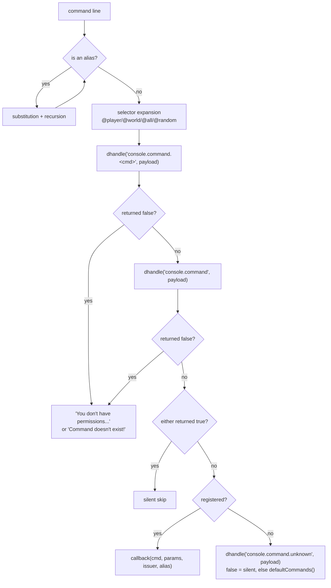

# WorldPECore Plugin API

# Part 3 — Core API Reference

> Reference of the **WorldPECore** kernel public interfaces (Plugin API `12.2`).
> All signatures and return types are taken verbatim from the sources.
> Kernel error convention: methods report failure by returning `false`/`null` and logging — no exceptions are thrown (only `TypeError` inside the scheduler is caught).

## Contents

**Facade and kernel**
- [3.1. ServerAPI](#31-serverapi)
- [3.2. PocketMinecraftServer](#32-pocketminecraftserver)

**Services (`$api->…`)**
- [3.3. PluginAPI](#33-pluginapi) · [3.4. ConsoleAPI](#34-consoleapi) · [3.5. ChatAPI](#35-chatapi)
- [3.6. PlayerAPI](#36-playerapi) · [3.7. LevelAPI](#37-levelapi) · [3.8. BlockAPI](#38-blockapi)
- [3.9. EntityAPI](#39-entityapi) · [3.10. TileAPI](#310-tileapi) · [3.11. BanAPI](#311-banapi)
- [3.12. TimeAPI](#312-timeapi) · [3.13. AchievementAPI](#313-achievementapi) · [3.14. QueryAPI](#314-queryapi)

**Game objects**
- [3.15. Level](#315-level) · [3.16. Player](#316-player) · [3.17. Entity](#317-entity)
- [3.18. Block and Item](#318-block-and-item)

**Utilities and network**
- [3.19. Config](#319-config) · [3.20. TextFormat and global functions](#320-textformat-and-global-functions)
- [3.21. Packets: RakNetDataPacket and ProtocolInfo](#321-packets-raknetdatapacket-and-protocolinfo)
- [3.22. Recipes (cookbook)](#322-recipes-cookbook)
- [3.23. Async and AsyncMultipleQueue](#323-async-and-asyncmultiplequeue)

---

## 3.1. ServerAPI

**File:** `src/API/ServerAPI.php` · **Access:** passed to your plugin constructor; static getter from anywhere.

### Service properties

| Property | Class | Purpose |
|---|---|---|
| `$console` | ConsoleAPI | console/player commands |
| `$level` | LevelAPI | world load/unload |
| `$block` | BlockAPI | block breaking/placing, updates |
| `$chat` | ChatAPI | chat and broadcast |
| `$ban` | BanAPI | bans, OP, whitelist |
| `$entity` | EntityAPI | entity registry |
| `$tile` | TileAPI | tile registry |
| `$player` | PlayerAPI | player registry, offline data |
| `$time` | TimeAPI | time of day |
| `$queryAPI` | QueryAPI | Query protocol data |
| `$achievement` | AchievementAPI | achievements |
| `$plugin` | PluginAPI | plugins |

### Methods

#### `request(): PocketMinecraftServer` *(static)*
Returns the current kernel instance. `false` before loading completes.

```php
$server = ServerAPI::request();
$online = count($server->clients);
```

#### `getProperty(string $name, mixed $default = false): mixed`
Reads `server.properties`. Source priority: CLI argument → file → `$default`. Values `on/off/true/false/yes/no` cast to `bool`; keys `gamemode`, `max-players`, `server-port`, `debug`, `difficulty`, `time-per-second` cast to `int`.

#### `setProperty(string $name, mixed $value, bool $save = true): void`
Writes a property; with `$save = true` flushes the file and re-applies settings (`loadProperties()`).

#### `getProperties(): array`
Whole settings array. ⚠️ Never log it raw — it contains `rcon.password`.

#### Kernel delegates

| ServerAPI method | Kernel equivalent (§3.2) |
|---|---|
| `schedule($t, $c, $d, $r = false, $e = "server.schedule")` | `schedule()` |
| `addHandler($e, $c, $p = 5)` | `addHandler()` |
| `handle($e, &$d)` / `dhandle($e, $d)` | `handle()` |
| `trigger($e, $d)` / `event($e, callable)` / `deleteEvent($id)` | same names |
| `asyncOperation($type, $data, $callable = null)` | `asyncOperation()` |

⚠️ `ServerAPI::handle()` takes payload **by reference** — handlers may mutate data for subsequent handlers.

#### `async(callable $callable, array $params = [], bool $remove = false): int|Async`
Creates a pthreads `Async` task (`src/utils/AsyncMultipleQueue.php`). Returns an integer ID by default; the object itself when `$remove = true`.
#### `getAsync(int $id): Async|false`
Fetches the task by ID (a second call returns `false`).

#### `autoSave(): void` / `getList(): object[]`
Save all worlds; list of loaded API objects in initialization order.

---

## 3.2. PocketMinecraftServer

**File:** `src/PocketMinecraftServer.php` · **Access:** `ServerAPI::request()`.

### Public fields

| Field | Type | Description |
|---|---|---|
| `$clients` | Player[] | active sessions by CID (including pre-auth) |
| `$schedule` | array[] | scheduler callbacks `[callback, data, eventName]` by ID |
| `$gamemode`, `$difficulty`, `$maxClients`, `$motd`, `$name`, `$port`, `$whitelist`, `$description` | mixed | server settings (refreshed by `ServerAPI::loadProperties()`) |
| `$spawn` | Position\|false | default world spawn point |
| `$stop` | bool | main-loop stop flag |
| `$saveEnabled` | bool | world save permission (`save-on/off` commands) |
| `$extraprops` | Config | `extra.properties` settings |
| `$database` | SQLite3 | in-memory DB (Part 1 §2.5) |
| `$ticks` | int | tick counter |
| `$seed`, `$serverID`, `$serverip`, `$invisible` | mixed | server identity |

Static flags: `$KEEP_CHUNKS_LOADED`, `$PACKET_READING_LIMIT = 100`, `$BLOCK_BREAKING_PROGRESS = 0.8`, `$ENABLE_LIGHT_UPDATES`, `$MULTIPROTOCOL`, `$SAVE_PLAYER_DATA`. Values come from configs at startup; runtime changes work but behavior is not guaranteed.

### Lifecycle methods

#### `close(string $reason = "server stop"): void`
Graceful shutdown: `onShutdown()` (world save), chat/Discord message, `trigger("server.close", $reason)`, socket and async-thread close. Also invoked by SIGTERM/SIGINT/SIGHUP and via `register_shutdown_function`.

#### `onShutdown(): void`
World save only (`$this->api->level->saveAll()`).

#### `getTPS(): float`
Average TPS over the last 40-tick ring buffer; `0` if not enough data.

#### `checkTicks(): void`
Prints *“Can't keep up!”* when TPS < 12 (runs on an internal schedule).

#### `debugInfo(bool $console = false): array`
Snapshot: `tps`, `memory_usage`, `memory_peak_usage`, `entities`, `players`, `events`, `handlers`, `actions`, `garbage`. The array passes through the **`server.debug`** hook before returning. With `$console = true` prints a summary line.

#### `send2Discord(string $msg): void`
Async Discord webhook (if enabled). Strips `@`; with `discord-ru-smiles` replaces Cyrillic Ы/Ь/Ъ/Ё with emoji.

### Events & scheduling

#### `addHandler(string $event, callable $callable, int $priority = 5): int|false`
Registers a legacy event handler. The ID is duplicated into the SQLite `handlers` table (quotes escaped). Returns a unique handler ID or `false` for invalid callables. Deprecated event names (`Deprecation::$events`) print `[ERROR] ... has been deprecated` but still register. There is no per-handler removal API.

```php
$this->api->addHandler("player.block.place", [$this, "onPlace"], 5);
```

#### `handle(string $event, &$data): mixed`
Full event pass: handler selection from DB → invocation descending by priority until first `true`/`false` → then `trigger()`. Returns the last callback result or `null`.
#### `dhandle(string $event, mixed $data): mixed`
Same but pass-by-value.
#### `trigger(string $event, mixed $data = "")`
Invokes only “listeners” added via `event()`. Non-callable entries are silently removed.
#### `event(string $event, callable $func): int|false`
Registers a notification listener; returns an ID for `deleteEvent(int $id)`.

#### `schedule(int $ticks, callable $callback, array $data = [], bool $repeat = false, string $eventName = "server.schedule"): int|false`

| Parameter | Type | Description |
|---|---|---|
| `$ticks` | int | delay in ticks (20 = 1 sec) |
| `$callback` | callable | receives `($data, $eventName)` |
| `$data` | array | data passed to callback |
| `$repeat` | bool | repeat; task removed when callback returns `false` |
| `$eventName` | string | label passed as second callback argument |

Returns task ID or `false`. No public cancel-by-ID exists — cancel by returning `false` from within the task.

```php
// Every 5 seconds:
$this->api->schedule(100, function($data, $ev){
    foreach(ServerAPI::request()->clients as $p){ /* ... */ }
}, [], true);
```

### Misc

#### `query(string $sql, bool $fetch = false): SQLite3Result|array|null`
Direct SQL against the internal DB. Errors print to console (`[ERROR] [SQL Error]`), exceptions are not thrown.

#### `clientID(string $ip, int $port): int` *(static)*
Session CID: `crc32(ip.port) ^ crc32(port.ip.BOOTUP_RANDOM)`. Find a `Player`: `$server->clients[$cid] ?? null`.

#### `asyncOperation(int $type, array $data, ?callable $callable = null): int|false`
Off-thread HTTP:

| `$type` | `$data` keys | Callback receives |
|---|---|---|
| `ASYNC_CURL_GET` | `url`; opt. `timeout` (sec, def. 10); opt. `headers` (array) | `($result["response"], $type, $ID)` — body string |
| `ASYNC_CURL_POST` | `url`; opt. `timeout`; `data` (assoc form fields) | same |

`false` under `NO_THREADS` or unknown type. Also fires `async.curl.get`.

#### `setType(string $type = "normal"): void`
Query response type: `normal|demo` → `MCCPP;Demo;`, `minecon` → `MCCPP;MINECON;`.

---

## 3.3. PluginAPI

**File:** `src/API/PluginAPI.php` · **Access:** `$this->api->plugin`
Registry: `$plugins[identifier] = [$object, $info]`; after first config access `info` gains a `path` key.

| Method | Signature → return | Description |
|---|---|---|
| `getList` | `getList(): array` | array of every plugin’s `$info` |
| `getAll` | `getAll(): array` | raw registry `[id => [object, info]]` |
| `get` | `get(Plugin\|string $identifier): array\|false` | entry by object or identifier |
| `pluginsPath` | `pluginsPath(): string` | `DATA_PATH/plugins/` (creates) |
| `configPath` | `configPath(Plugin $p): string` | private folder (see caveat in Part 2 §6.1) |
| `createConfig` | `createConfig(Plugin $p, array $default = []): string\|false` | creates `config.yml`; returns folder path; `false` if unregistered |
| `readYAML` | `readYAML(string $file): mixed` | YAML parsing (auto-quotes keys) |
| `writeYAML` | `writeYAML(string $file, array $data): int\|false` | UTF-8 YAML write |
| `load` | `load(string $file): bool` | loads `.php`/`.pmf` |
| `initAll` | `initAll(): void` | dependencies + `init()` of all plugins |
| `getIdentifier` | `getIdentifier(string $name, string $author): binary(20)` | sha1(name) XOR sha1(author) XOR session nonce |

```php
foreach($this->api->plugin->getList() as $info){
    console($info["name"] . " v" . $info["version"] . " by " . $info["author"]);
}
```

**`RequiredPluginEntry`**: `__construct(string $name, string|false $version = false)` — dependency list element (Part 2 §7).

---

## 3.4. ConsoleAPI

**File:** `src/API/ConsoleAPI.php` · **Access:** `$this->api->console`

#### `register(string $cmd, string $help, callable $callback): void|false`
Registers a command (lowercased). Callback receives:

| Argument | Type | Value |
|---|---|---|
| `$cmd` | string | command name after alias expansion |
| `$params` | array | line arguments split on space (empties dropped) |
| `$issuer` | Player\|string\|RCONSession | executor: player object, `"console"`, or RCON session |
| `$alias` | string\|false | alias used |

Re-registering the same name **overwrites** the handler. A string return is printed to the sender (`\n` customary); for players it is duplicated via `sendChat()`.

#### Full execution pipeline (`run()`)



Parameter selectors: `@player|@u|@username` — issuer name; `@world|@w` — issuer world; `@all|@a` — expand to all players (**OP only**); `@random|@r` — random player; escape with double `@@`.

#### `alias(string $alias, string $cmd): true`
Alias; supports built-in substitution args: `$this->api->console->alias("mypos1", "mypos 1");`

#### `cmdWhitelist(string $cmd): void`
Allows the command to everyone (otherwise OP/console only). The actual check runs in BanAPI’s priority-1 handler on `console.command`.

#### `run(string $line = "", string $issuer = "console", string|false $alias = false): string`
Programmatic command-line execution with the full pipeline above:

```php
$this->api->console->run("say Restarting in a minute", "console");
```

Built-in commands (`defaultCommands`) and behavior:

| Command | Behavior per code |
|---|---|
| `help [page\|cmd]` | prints the `$help` registry; text comes from your `register()` second arg |
| `status` | TPS, memory, entities/events/handlers/actions/garbage counters (as `debugInfo(true)`) |
| `difficulty <0-3>` | changes `$server->difficulty` live |
| `stop` | server shutdown |
| `defaultgamemode <mode>` | names: `survival/s/c`, `creative/c`, `adventure/a`, `view/viewer/spectator/v` or a number |

---

## 3.5. ChatAPI

**File:** `src/API/ChatAPI.php` · **Access:** `$this->api->chat`

#### `broadcast(string $message): void`
Everyone + console + Discord webhook (if enabled).

```php
$this->api->chat->broadcast(TextFormat::YELLOW . "Restarting!");
```

#### `send(Player|string|false $owner, string $text, array|false $whitelist = false, array|false $blacklist = false)`
Core delivery:

| `$owner` | Effect |
|---|---|
| `Player` | message to the player + console echo under their name |
| `string` | as if sent by that name |
| `false` | system broadcast |

`$whitelist`/`$blacklist` — recipient lists (Player objects or names). The message wraps into a `Container` and passes the **`server.chat`** hook: handlers may mutate the container; returning `false` blocks delivery to everyone.

#### `sendTo(string $owner, string $text, Player|string $player): void`
Private message to one recipient (a `send()` wrapper with whitelist).

Service commands and semantics:

| Command | Semantics |
|---|---|
| `say <msg>` | broadcast prefixed `[Server]` (or `[<Issuer>]` via RCON); emoji filter applies when `disable-emojis-in-chat` |
| `me <action>` | broadcast `* Nick action`; same filter |
| `tell <player> <msg>` (alias `msg`) | private via `sendTo(false, "… whispers to you: …", $target)`; targets `server/console/rcon` map to Console; cannot message yourself |
| `reply <msg>` (alias `r`) | replies to last partner from `$lastTells[name]`; offline → refusal |

All four are whitelisted. Every message passes `server.chat` (Part 4 §2.1) so plugin filters apply automatically.

**`Container`** (`src/utils/Container.php`) in full:

```php
class Container{
    public function __construct($payload = "", $whitelist = false, $blacklist = false);
    public function get();          // → array payload ["player" => ..., "message" => ...]
    public function check($target); // → bool: does target pass filters
    public function __toString();   // payload as string
}
```

`check()` is strict: `in_array(..., true)` — put the same types into whitelist/blacklist that arrive in dispatch (Player objects or name strings).

---

## 3.6. PlayerAPI

**File:** `src/API/PlayerAPI.php` · **Access:** `$this->api->player`

| Method | Signature → return | Description |
|---|---|---|
| `get` | `get(string $name, bool $alike = true, bool $multiple = false): Player\|Player[]\|false` | SQL registry search: exact (case-insensitive), then `LIKE name%` when `$alike`. With `$multiple = true` — all matches |
| `getAll` | `getAll(?Level $level = null): Player[]` | all online (`$server->clients`) or per-world (`$level->players`) |
| `getByEID` | `getByEID(int $eid): Player\|false` | player by avatar EID (SQL ip:port → CID) |
| `online` | `online(): string[]` | ⚠️ returns the **array of authenticated player names** (`$p->auth === true`), not a count. Count: `count($this->api->player->online())` |
| `add` | `add(int $CID): void` | loads offline profile into session (gamemode, level, position); kernel uses on join |
| `remove` | `remove(int $CID): void` | closes session: `close()`, profile save, avatar removal, SQL cleanup |
| `getOffline` | `getOffline(string $name, bool $create = true): Config` | offline profile `players/<name>.yml` (CONFIG_YAML). Default structure: `caseusername`, `position{level,x,y,z}`, `spawn{…}`, `inventory[36][id,meta,count]`, `armor[4][id,meta]`, `hotbar`, `gamemode`, `health`, `achievements`, `slot-count`, `bed-position`. Passes hook `player.offline.get`; new profiles save immediately |
| `saveOffline` | `saveOffline(Config $data): void` | saves the profile; passes hook `player.offline.save`; ignored when `SAVE_PLAYER_DATA = false` |
| `teleport` | `teleport(&$name, &$target): bool` | `/tp`: by-reference strings; `$target` may be `"w:<world>"`. Names normalize to exact nicks |
| `tppos` | `tppos(&$name, &$x, &$y, &$z): bool` | coordinate `/tp`; supports relative `~`/`~N` |
| `broadcastPacket` | `broadcastPacket(array $players, RakNetDataPacket $packet): void` | sends a packet clone to each listed player |
| `spawnAllPlayers` / `spawnToAllPlayers` | `(Player $player): void` | mutual visibility on join |
| `decodeProtocol` | `(static) decodeProtocol(string $ip, int $port): int\|null` | client protocol by address (multiprotocol) |

Built-in service commands (from `commandHandler()`):

| Command | Semantics |
|---|---|
| `/spawnpoint [player] [x y z]` | respawn point; without coords — executor position |
| `/hotbar <5-9>` | hotbar size (`$issuer->setSlotCount`) or view current |
| `/spawn` | teleport to `$server->spawn` |
| `/ping [player]` | ping, loss %, KB/s, chunks 0–256; others’ ping (and ARQ/RQ queues) — OP only |
| `/gamemode <mode> [player]` / `[player] <mode>` | names like ConsoleAPI’s |
| `/tp [from] <to>` · `<x y z>` | delegates `teleport()/tppos()`: supports `w:world` and relative `~N` |
| `/kill [player]` · `/suicide` | forced damage: `$entity->harm(PHP_INT_MAX, "console", true)` |
| `/list` | `online/maxPlayers:` + comma-separated names |
| `/loc [player]` | X/Y/Z (+chunk), world, compass direction, brightness |

```php
$p = $this->api->player->get($nick);
if($p !== false){
    $p->teleport(new Vector3(128, 20, 128));
}

// Offline economy:
$off = $this->api->player->getOffline("Notch");
if($off !== false && $off->exists("money")){
    $off->set("money", $off->get("money") + 100);
    $this->api->player->saveOffline($off);
}
```

---

## 3.7. LevelAPI

**File:** `src/API/LevelAPI.php` · **Access:** `$this->api->level`

| Method | Signature → return | Description |
|---|---|---|
| `getDefault` | `getDefault(): Level` | main world (`level-name`) |
| `get` | `get(string $name): Level\|false` | loaded world by name |
| `getAll` | `getAll(): Level[]` | all loaded worlds `[name => Level]` |
| `loadLevel` | `loadLevel(string $name): bool\|Level` | loads a PMF-format world from disk |
| `generateLevel` | `generateLevel(string $name, int\|false $seed = false, string\|false $generator = false): bool` | generates a new world; type `"FLAT"` / `"DEFAULT"` / `"VANILLA"` (from `level-type` when `false`) |
| `unloadLevel` | `unloadLevel(Level $level, bool $force = false): void` | unloads; `$force` ignores players present |
| `saveAll` | `saveAll(): void` | saves all worlds |
| `levelExists` | `levelExists(string $name): bool` | world exists on disk |
| `getSpawn` | `getSpawn(): Position\|false` | default world spawn |
| `loadMap` | `loadMap(): void` | loads `maps/*.png` |

Service built-ins: `setwspawn`, `save-all`, `save-on`, `save-off`, `seed [world]`.

```php
if(!$this->api->level->levelExists("arena")){
    $this->api->level->generateLevel("arena", time(), "FLAT");
}
$this->api->level->loadLevel("arena");
$arena = $this->api->level->get("arena");
```

---

## 3.8. BlockAPI

**File:** `src/API/BlockAPI.php` · **Access:** `$this->api->block`

#### `getItem(int $id, int $meta = 0, int $count = 1): Item` *(static)*
Item factory (the whole kernel prefers this over `new Item`).

#### Gameplay pipelines

| Method | Signature → return | Description |
|---|---|---|
| `playerBlockBreak` | `playerBlockBreak(Player $player, Vector3 $vector): bool` | full break pipeline: hooks `touch/break(.bypass/.invalid/.spawn)`, item drops, neighbor updates |
| `playerBlockAction` | `playerBlockAction(Player $p, Vector3 $vector, int $face, float $fx, float $fy, float $fz): bool` | right-click pipeline: activation (`onActivate`, hook `player.block.activate`) or placement (`place*`) |

#### Block updates

| Method | Signature → return | Description |
|---|---|---|
| `blockUpdate` | `blockUpdate(Position $pos, int $type = BLOCK_UPDATE_NORMAL)` | immediate update (growth/physics) |
| `blockUpdateAround` | `blockUpdateAround(Position $pos, int $type = BLOCK_UPDATE_NORMAL, int\|false $delay = false)` | update 6 neighbors |
| `scheduleBlockUpdateXYZ` | `scheduleBlockUpdateXYZ(Level $level, int $x, int $y, int $z, int $type = BLOCK_UPDATE_SCHEDULED, int\|false $delay = false): bool` | deferred update (`blockUpdates` table) |
| `scheduleBlockUpdate` | `scheduleBlockUpdate(Position $pos, int $delay, int $type = BLOCK_UPDATE_SCHEDULED): bool` | same via Position; delay in ticks |
| `removeAllBlockUpdates` | `removeAllBlockUpdates(Level $level): void` | cancel world updates |
| `nextRandomUpdate` | `nextRandomUpdate(Position $pos): bool` | random tick (plant growth) |

Update types (`GeneralConstants.php`): `BLOCK_UPDATE_NORMAL=1`, `_RANDOM=2`, `_SCHEDULED=3`, `_WEAK=4`, `_TOUCH=5`.

```php
// Deferred update in 40 ticks:
$this->api->block->scheduleBlockUpdate(new Position($x, $y, $z, $level), 40);
```

Built-in commands: `/give <player> <item[:damage]> [amount]`, `/setblock <x y z> [level] <block[:damage]>` (coordinates support `~`), `/id` — held item (whitelisted). Item string parsing via `BlockAPI::fromString("35:14")`.

---

## 3.9. EntityAPI

**File:** `src/API/EntityAPI.php` · **Access:** `$this->api->entity`

| Method | Signature → return | Description |
|---|---|---|
| `add` | `add(Level $level, string\|int $class, int $type = 0, array $data = []): Entity` | entity creation; `$data` requires `x`,`y`,`z`. Class resolved via `EntityRegistry`. Fires `entity.add` |
| `summon` | `summon(Position $pos, $class, int $type, array $data = []): Entity` | `add` + show to everyone |
| `addRaw` | `addRaw(Entity $e): Entity` | registers a ready object (level indexes + `entity.add`) |
| `get` | `get(int $eid): Entity\|false` | by EID |
| `getAll` | `getAll(?Level $level = null): Entity[]` | all entities (per world) |
| `getRadius` | `getRadius(Position $center, float $radius = 15, int\|string\|false $class = false): Entity[]` | radius search via chunk index `entityListPositioned` — fast |
| `updateRadius` | `updateRadius(Position $center, float $radius = 15, $class = false): Entity[]` | `getRadius` + motion broadcast to watchers |
| `remove` | `remove(int $eid): void` | Remove* packets to viewers, `entity.remove`, index cleanup |
| `harm` | `harm(int $eid, int $attack, string $cause, bool $force = false)` | damage; reduces to `Entity::setHealth()` → hook `entity.health.change` |
| `heal` | `heal(int $eid, int $heal, string $cause)` | heal (negative `harm`) |
| `drop` | `drop(Position $pos, Item $item, int $pickupDelay = 10): void` | item-entity drop: hook `item.drop` (false cancels), stack split by `getMaxStackSize()`, each piece gets `entity.motion`; position gets ±0.2 random offset |
| `dropRawPos` | `dropRawPos(Level $level, $x, $y, $z, Item $item, $speedX, $speedY, $speedZ): void` | drop without offset, explicit velocity |
| `getNextEID` | `getNextEID(): int` | next EID from the counter |
| `spawnToAll` / `spawnAll` | — | show entities to players |

```php
foreach($this->api->entity->getRadius(new Position($x,$y,$z,$level), 5) as $e){
    if($e instanceof Living){
        $this->api->entity->harm($e->eid, 6, "explosion");
    }
}
```

Built-in commands:

| Command | Semantics |
|---|---|
| `/summon <mob> [amount] [baby]` (alias `spawnmob`) | mob by name or type: `chicken=10 cow=11 pig=12 sheep=13 zombie=32 creeper=33 skeleton=34 spider=35 pigman=36`; amount ≤ 1000; `baby` — peaceful only (10–13) |
| `/despawn all\|mobs\|objects\|items\|fallings\|minecarts` | mass `$entity->close()` by class/type |
| `/entcnt` | `count($this->entities)` |

---

## 3.10. TileAPI

**File:** `src/API/TileAPI.php` · **Access:** `$this->api->tile`

| Method | Signature → return | Description |
|---|---|---|
| `add` | `add(Level $level, string $class, int $x, int $y, int $z, array $data = []): Tile` | tile; classes: `"Chest"`, `"Furnace"`, `"Sign"`, … |
| `addSign` | `addSign(Level $level, int $x, int $y, int $z, array $lines = ["","","",""]): Tile` | sign with text |
| `get` / `getXYZ` | `get(Position $pos)` / `getXYZ(Level, x, y, z)` → `Tile\|false` | tile at coordinate |
| `getByID` | `getByID(int $id): Tile\|false` | by internal id |
| `getAll` | `getAll(?Level $level = null): Tile[]` | all tiles (per world); `$level = null` — all worlds |
| `remove` | `remove(int $id): void` | removes; fires `tile.remove` |
| `invalidateAll` | `invalidateAll(Level $level, int $x, int $y, int $z): void` | drops tile cache for coordinate |
| `spawnToAll` / `spawnAll` | — | spawn-packet broadcast |

Key `Tile` object methods (`src/world/Tile.php`):

```php
$t = $this->api->tile->add($level, "Chest", $x, $y, $z);
$t->setSlot(0, BlockAPI::getItem(Item::DIAMOND, 0, 5)); // setSlot(int $slot, Item $item, bool $update = true, int $offset = 0)
$item = $t->getSlot(0);                         // → Item|AIR-Item
$t->pairWith($otherChest);                      // double chest; isPaired(), unpair(), getPair()
$t->setText("Line1", "", "", "");               // signs
$t->openInventory($player);                     // open window (windowid auto-assigned)
$t->close();                                    // proper removal
```

Every `setSlot()` fires the **`tile.container.slot`** hook with payload `[tile, slot, offset, slotdata]`.

---

## 3.11. BanAPI

**File:** `src/API/BanAPI.php` · **Access:** `$this->api->ban`
Kernel permission mechanism: own priority-1 handlers on `console.command`, `player.block.break/place` (spawn protection within `spawn-protection` radius), `player.flying`.

| Method | Return | Exact semantics |
|---|---|---|
| `ban(string $username)` | void | nick ban (delegates to `/ban add`) |
| `pardon(string $username)` | void | unban |
| `banIP(string $ip)` / `pardonIP(string $ip)` | void | IP ban/unban |
| `kick(string $username, string $reason = "No Reason")` | void | delegates to `kick` command |
| `isBanned(string $username)` | bool | hook **`api.ban.check`**: returning `false` means banned; else checks `banned.txt` |
| `isIPBanned(string $ip)` | bool | hook **`api.ban.ip.check`**: `false` ⇒ banned; else file check |
| `inWhitelist(string $username)` | bool | OPs always pass; hook **`api.ban.whitelist.check`**: `false` ⇒ whitelisted; else whitelist file |
| `isOp(string $username)` | bool | hook **`op.check`**: `true` ⇒ OP; else ops.txt (lowercase) |
| `reload()` | void | re-reads ban/banip/whitelist files |
| `cmdWhitelist(string $cmd)` | void | delegates to `ConsoleAPI::cmdWhitelist()` |

> ⚠️ Inverted semantics: in ban/whitelist hooks **`false` means “yes, banned/listed”**, while in `op.check` **`true` means OP**. Any other value defers to the built-in file check.

```php
$this->api->ban->cmdWhitelist("shop");

// Grant OP rights on top of the file:
$this->api->addHandler("op.check", function($username){
    return strtolower((string)$username) === "vip_admin" ? true : null;
});
```

Built-in commands in detail:

| Command | Semantics |
|---|---|
| `/op <p>` · `/deop <p>` | writes to `ops.txt` (Config LIST); online players get notified |
| `/kick <p> [reason]` | blocks player and schedules `schedule(60, [$player,"close"], reason)`; broadcast includes moderator name |
| `/ban add\|remove\|list\|reload <p>` | `banned.txt`; add also kicks and broadcasts |
| `/banip add\|remove\|list\|reload <ip\|player>` | resolves IP from session when given a nick and closes it |
| `/whitelist on\|off\|add\|remove\|list\|reload` | toggles via `setProperty("white-list", …)` |
| `/sudo <player> <cmd…>` | runs a command **as** the player: `console->run($line, $player)` |

Service files: `ops.txt`, `banned.txt`, `banned-ips.txt`, `white-list.txt` — all `CONFIG_LIST` under `DATA_PATH`.

---

## 3.12. TimeAPI

**File:** `src/API/TimeAPI.php` · **Access:** `$this->api->time`
A day = **19200 ticks**. Phases (`TimeAPI::$phases`): `day=0`, `sunset=9500`, `night=10900`, `sunrise=17800`.

| Method | Signature → return | Description |
|---|---|---|
| `get` | `get(bool $raw = false, Level\|false $level = false): int` | current time; `raw=true` — as-is, else `% 19200` |
| `getDate` | `getDate(int\|Level\|false $time = false): string` | game clock `HH:MM` |
| `getPhase` | `getPhase(int\|Level\|false $time = false): string` | `day/sunset/night/sunrise` |
| `set` | `set(int\|string $time, Level\|false $level = false): int` | number or phase name; passes `time.change`; returns new time |
| `add` | `add(int $time, Level\|false $level = false): void` | add ticks |
| `day()/night()/sunrise()/sunset()` | `→ int` | shortcuts for the default world |

In all methods `$level = false` means the default world.

Service command: `/time <check|set|add|day|night|sunset|sunrise> [value] [w:<world>]`.

```php
$this->api->time->set("night", $this->api->level->get("arena"));
if($this->api->time->getPhase($player->level) === "night"){ /* ... */ }
```

---

## 3.13. AchievementAPI

**File:** `src/API/AchievementAPI.php` · **Access:** static methods.

| Method | Signature → return | Description |
|---|---|---|
| `addAchievement` | `addAchievement(string $id, string $name, array $requires = []): bool` *(static)* | declare achievement; `$requires` — prerequisite ids that must be granted first |
| `grantAchievement` | `grantAchievement(Player $p, string $id): bool` *(static)* | verifies prerequisites; hook **`achievement.grant`** (`false` denies); sets `$player->achievements[id]=true`, then broadcast |
| `hasAchievement` | `hasAchievement(Player $p, string $id): bool` *(static)* | presence check |
| `broadcastAchievement` | `broadcastAchievement(Player $p, string $id): bool` *(static)* | hook **`achievement.broadcast`**: returning `true` suppresses the default chat announcement; otherwise broadcasts (or private message when `announce-player-achievements=false`) |
| `removeAchievement` | `removeAchievement(Player $p, string $id)` *(static)* | sets `achievements[id]=false` |

```php
AchievementAPI::addAchievement("myFirstKill", "First Blood");
if(!AchievementAPI::hasAchievement($player, "myFirstKill")){
    AchievementAPI::grantAchievement($player, "myFirstKill");
}
```

The `/achievements` command lists them for the player.

---

## 3.14. QueryAPI

**File:** `src/API/QueryAPI.php` · **Access:** `$this->api->queryAPI`

| Method | Signature | Description |
|---|---|---|
| `updateQueryData` | `updateQueryData(string $name, mixed $value): void` | GameSpy4 response field |
| `addToQuery` | `addToQuery(string $name): void` | adds plugin name to the `plugins` list |
| `getQueryData` | `getQueryData(): array` | current response fields |

The kernel handler fires `query.update` on every refresh.

---

## 3.15. Level

**File:** `src/world/Level.php` · **Access:** `$this->api->level->get($name)`, `$player->level`, `$entity->level`.
Public fields: `$players` (Player[] by CID), `$entities`, `$entityList`, `$entityListPositioned["cx cz" => eid]`, `$tiles`, `$server`, `$time`, `$seed`, `$stopTime`.

### Blocks

#### `getBlock(Vector3 $pos): Block`
Block at coordinate (auto floor).
#### `getBlockWithoutVector(int $x, int $y, int $z, bool $positionfy = true): Block`
Without Vector3.
#### `setBlock(Vector3 $pos, Block $block, bool $update = true, bool $tiles = false, bool $direct = false): bool`

| Parameter | Effect |
|---|---|
| `$update` | neighbor updates + physics |
| `$tiles` | remove tiles inside the replaced block |
| `$direct` | immediate send to client bypassing queues |

#### Other block operations

| Method | Purpose |
|---|---|
| `setBlockRaw(Vector3 $pos, Block $b, bool $direct = true, bool $send = true)` | write without events/updates |
| `fastSetBlockUpdate(int $x,$y,$z, int $id, int $meta, bool $around=false, bool $tiles=false)` | fast id/meta replacement |
| `fastSetBlockUpdateMeta(int $x,$y,$z, int $meta, bool $updateBlock=false)` | metadata only |
| `getBlockRaw(Vector3 $pos)` | raw id/meta read |
| `updateNeighborsAt(int $x,$y,$z, int $oldID)` | neighbor updates after change |
| `addBlockToSendQueue(int $x,$y,$z, int $id, int $meta)` | queue for sending |

### Chunks

`loadChunk(X,Z)`, `unloadChunk(X,Z,$force=false)`, `useChunk(X,Z,Player)` (load bound to player), `freeChunk(...)/freeAllChunks(Player)`, `isSpawnChunk(X,Z)`. Retention strategy — flag `PocketMinecraftServer::$KEEP_CHUNKS_LOADED`. Serialization helpers: `getMiniChunk/getOrderedMiniChunk/getOrderedChunk`.

### Search & collisions

| Method | Return | Description |
|---|---|---|
| `getEntitiesInAABB(AxisAlignedBB $bb)` | Entity[] | entities inside volume |
| `getEntitiesInAABBOfType(AxisAlignedBB $bb, $class)` | Entity[] | of a specific class |
| `rayTraceBlocks(Vector3 $start, Vector3 $end)` | MovingObjectPosition\|null | ray (crosshair) |
| `getCubes(Entity $e, AxisAlignedBB $aabb)` | AxisAlignedBB[] | collision intersections |
| `getSafeSpawn(bool\|Position $spawn = false)` | Position | safe point (lifts to air) |

### Time, light, misc

`getTime()/setTime(t)` (via `time.change`), `stopTime()/startTime()/isTimeStopped()`, `isDay()/isNight()`, `checkTime()`, `getSkyLight(x,y,z)`, `getRawBrightness(x,y,z)` (need `enable-light-updates`), `getName()`, `getSeed()/setSeed()`, `getSpawn()/setSpawn(Vector3)`, `save($force=false,$entities=true,$tiles=true,$blockupdates=true)`, `close()`.

```php
$level = $player->level;
$level->setBlock(new Vector3($x, $y, $z), Block::get(Block::STONE));
$safe = $level->getSafeSpawn(false);
$player->teleport(new Vector3($safe->x, $safe->y, $safe->z));
```

---

## 3.16. Player

**File:** `src/Player.php` (~4000 lines) — one object per connection; stored in `$server->clients[CID]`.

### Key public fields

| Field | Type | Description |
|---|---|---|
| `$username` / `$iusername` | string | nick / lowercase nick (array and file keys) |
| `$CID`, `$ip`, `$port`, `$MTU` | mixed | network identity |
| `$entity` | Entity\|false | world avatar; **`false` until fully joined** — always check |
| `$level` | Level | current world (assigned in `PlayerAPI::add()`) |
| `$gamemode` | int | 0 SURVIVAL / 1 CREATIVE / 2 ADVENTURE / 3 VIEW |
| `$auth` | bool | completed join cycle (`true` after profile load) |
| `$connected` | bool | network session alive |
| `$spawned` | bool | received spawn chunks, ready to play |
| `$blocked` | bool | input/actions locked (death, loading) |
| `$data` | Config\|null | profile reference (`getOffline()`), available after `add()` |
| `$inventory`, `$hotbar`, `$curHotbarIndex`, `$slot`, `$armor` | mixed | inventory `[slot => Item]`; armor — 4 slots |
| `$windows` | array | open containers `[windowid => Tile]`; cleared on window close/quit |
| `$achievements` | array[] | `[id => bool]` |
| `$spawnPosition`, `$bedPosition` | Position\|null | respawn points |
| `$eid` | int | avatar EID (valid together with `$entity`) |

OP status is **not** stored on the object — use `BanAPI::isOp($player->iusername)`.

### Methods

#### Messages
- `sendChat(string $message, string $author = "")` — private message.
- `sendChatBuffer()` — flush queued chat.

#### Teleport & modes
- `teleport(Vector3 $pos, float|false $yaw = false, float|false $pitch = false, bool $terrain = true, bool $force = true): bool` — passes hooks `player.teleport` / `player.teleport.level`.
- `setGamemode(int $gm): bool` — mode change (hook `player.gamemode.change`, profile save, inventory handling).
- `getGamemode(): string` — `"survival"|"creative"|"adventure"|"view"`.

#### Inventory
- `addItem(int $type, int $damage, int $count, bool $send = true, bool $addexpected = true, bool $drop = true)` — grant items; overflow drops to ground when `$drop`.
- `removeItem(int $type, int $damage, int $count, bool $send = true, bool $addexpected = true)` — take items.
- `hasSpace(int $type, int $damage, int $count): bool` — room for a stack?
- `sendInventory()` / `sendInventorySlot(int $s)` — client sync.

#### Packets
- `dataPacket(RakNetDataPacket $packet)` — standard send queue (passes `DataPacketSendEvent`).
- `directDataPacket(RakNetDataPacket $packet, $reliability = 0, $recover = true)` — immediate.
- `entityQueueDataPacket(RakNetDataPacket $pk)` — entity queue (for entity packets).
- `send(RakNetPacket $packet)` — raw RakNet (no gameplay events).
- `getProtocol(): int` — client protocol (multiprotocol).

> ⚠️ **Send channels:** block packets (`UPDATE_BLOCK_PACKET`) and tile packets must go through `$player->blockQueueDataPacket($pk)` — a separate ordered channel (`BLOCKUPDATE_ORDER_CHANNEL`, docblock: *“tileentity data, chunk data, updateblock packets”*). Plain `dataPacket()` uses a different channel and breaks block/chunk/tile ordering relative to each other.

#### Visibility & misc
- `setInvisibleFor(Player $observer, bool $invisible, bool $send = true)` / `isInvisibleFor(Player): bool` / `makeInvisibleForAllPlayers()` — visibility control (`player.invisible` hook).
- `checkSpawnPosition()` — spawn point validation (`player.checkspawnpos` hook).
- `sendSettings(bool $nametags = true)`, `orderChunks()`, `save()` (profile write), `close(string $reason = "", bool $msg = true)`.

```php
// Grant a reward on join:
if($player->auth === true && !isset($player->achievements["welcome"])){
    $player->addItem(Item::DIAMOND, 0, 3);
    $player->achievements["welcome"] = true;
}
```

---

## 3.17. Entity

**File:** `src/entity/Entity.php` · **Access:** `$this->api->entity->get($eid)`.
Subclasses: `Living` → `Creature` → `Animal` (+`Ageable`/`Breedable`/`Rideable` interfaces); objects: `Arrow`, `Minecart`, `PrimedTNT`, `Painting`, item entities.

### Key public fields

`$eid`, `$class` (string class: `ENTITY_PLAYER`, `ENTITY_ITEM`, …), `$type`, `$level`, `$x/$y/$z/$yaw/$pitch/$headYaw`, `$health`, `$dead`, `$closed`, `$player` (Player|null — avatar), `$speedX/Y/Z`, `$width/$height/$radius`, `$boundingBox`, `$riding/$rider`, `$data` (metadata).

### Health

```php
public function getHealth()
public function setHealth(int $health, string $cause = "generic",
                          bool $force = false, bool $allowHarm = true)
public function harm(int $dmg, string $cause = "generic", bool $force = false)
public function heal(int $health, string $cause = "generic")
```

`setHealth()` semantics:

1. Damage reduction passes an “immunity” gate: at most once per 0.5 s or when the new damage exceeds the previous one (anti damage-spam); otherwise returns `false`.
2. Hook **`entity.health.change`** payload `[entity, eid, health, cause]`: returning `false` cancels (unless `$force = true`).
3. Client receives damage animation (`EntityEventPacket::ENTITY_DAMAGE`) and avatars receive `SetHealthPacket`.
4. At `health <= 0`, calls `makeDead($cause)`.

### Death

`makeDead($cause)`: hook **`entity.death`** `[entity, cause]` (`false` prevents death entirely including drops) → `spawnDrops()` → state reset → vanish packets. For avatars additionally: `$player->blocked = true` and hook **`player.death`** `[player, cause]`; with `hardcore=1` the player is auto-banned.

### Misc

`spawn(Player)` — show entity to player; `updateMovement()` (hook `entity.move` for players: `false` teleports back — anti-cheat point), `sendMoveUpdate()`, `link(Entity)` (hook `entity.link [rider, riding, type]`), `getMetadata()/updateMetadata()`, `setSize(w,h)`, `knockBack(dx,dz)`, `close()`.

---

## 3.18. Block and Item

**Files:** `src/material/Block.php`, `src/material/Item.php`

```php
$b = Block::get(Block::STONE, $meta = 0);          // Block by ID/meta
$i = BlockAPI::getItem(Item::DIAMOND_SWORD, 0, 1); // Item: id, meta, count
```

| Class | Method | Description |
|---|---|---|
| `Item` | `getID(): int` / `getMetadata(): int` | id and meta |
| `Item` | `count` *(field)* + `getCount()/setCount(int)` | stack size |
| `Item` | `getMaxStackSize(): int` | stack limit (used by drop logic) |
| `Item` | `getName(): string` | human-readable name |
| `Item` | `place(...)`, `onActivate(...)` | placement/use behavior |
| `Block` | `getID()/getMeta()/getName()` | same as Item |
| `Block` | `isBreakable(Item $item, Player $p): bool` | breakability with this tool |
| `Block` | `place(...)`, `onActivate(Item $item, Player $player = null): bool` | placement / right-click reaction |
| `Block` | `setMetadata(int)/getMetadata()` | block metadata |

Static registries: `BlockAPI::$creative` (creative inventory), `BlockAPI::$creativeHotbarSlots`. ID constants are global: `Item::*`, `Block::*` (`src/constants/ItemIDs.php`, `BlockIDs.php`). The material registry initializes in `Material::init()` before plugins load.

---

## 3.19. Config

**File:** `src/utils/Config.php` · formats described in [Part 2 §6.3](02-plugin-lifecycle.md#63-the-utilsconfig-class-formats-and-methods).

```php
public function __construct(string $file, int $type = CONFIG_DETECT,
                            array $default = [], &$correct = null, array $comments = [])
```

| Method | Signature → return | Description |
|---|---|---|
| `get` | `get(string $k, mixed $default = false): mixed` | key value |
| `set` | `set(string $k, mixed $v = true): void` | memory write (not disk!) |
| `setAll` | `setAll(array $v): void` | replace whole array |
| `getAll` | `getAll(bool $keys = false): array` | all contents (or keys only) |
| `exists` | `exists(string $k, bool $lowercase = false): bool` | key presence |
| `remove` | `remove(string $k): void` | remove key |
| `save` | `save(): void` | write to disk |
| `reload` | `reload(): void` | re-read file |
| `check` | `check(): bool` | file integrity |

Magic: `$cfg->key = value` ≡ `set()`, `isset($cfg->key)` ≡ `exists()`, `unset($cfg->key)` ≡ `remove()`.

The constructor’s `$comments` parameter (array “key → lines”) writes comments above keys — how the kernel documents its own `server.properties`. Defaults apply recursively (`fillDefaults`): missing branches are rebuilt; user values survive.

---

## 3.20. TextFormat and global functions

### TextFormat (`src/utils/TextFormat.php`)

Color constants (MCPE § codes):

```php
FORMAT_BLACK §0 · FORMAT_DARK_BLUE §1 · FORMAT_DARK_GREEN §2 · FORMAT_DARK_AQUA §3
FORMAT_DARK_RED §4 · FORMAT_DARK_PURPLE §5 · FORMAT_GOLD §6 · FORMAT_GRAY §7
FORMAT_DARK_GRAY §8 · FORMAT_BLUE §9 · FORMAT_GREEN §a · FORMAT_AQUA §b
FORMAT_RED §c · FORMAT_LIGHT_PURPLE §d · FORMAT_YELLOW §e · FORMAT_WHITE §f
FORMAT_OBFUSCATED §k · FORMAT_BOLD §l · FORMAT_STRIKETHROUGH §m
FORMAT_UNDERLINE §n · FORMAT_ITALIC §o · FORMAT_RESET §r
```

Static methods:

| Method | Description |
|---|---|
| `tokenize(string): array` | splits a string into format codes and text |
| `clean(string): string` | strips all § codes |
| `toHTML(string|array): string` | to HTML `<span>` (obfuscated skipped) |
| `toANSI(string|array): string` | to ANSI escapes for console |
| `discordEscape(string): string` | `clean()` + Markdown escaping for Discord |

Global `FORMAT_*` constants are the same § strings (defined beside the class).

### Global functions (`src/functions.php`)

| Function | Signature | Purpose |
|---|---|---|
| `console()` | `console(string $message, bool $EOL = true, bool $log = true, int $level = 1)` | console+log; printed only when `DEBUG >= $level` |
| `logg()` | `logg(string $message, string $name, bool $EOL = true, int $level = 2, bool $close = false)` | writes `<name>.log` |
| `arg()` | `arg(string $name, mixed $default = false): mixed` | server CLI argument |
| `arguments()` | `arguments(array $args): array` | kernel CLI parser |
| `nullsafe()` | `nullsafe(mixed &$a, mixed $null)` | safe chain read |
| `safe_var_dump()` | `safe_var_dump(mixed $var, int $cnt = 0)` | typed debug dump |
| `kill()` | `kill(int $pid)` | kill process (POSIX) |
| `require_all()` | `require_all(string $path, &$count = 0)` | recursive PHP include |

```php
console("[MyPlugin] Loaded: " . count($items)); // visible at DEBUG >= 1
console("[MyPlugin] Fine debugging", true, true, 3); // only DEBUG >= 3
```

---

## 3.21. Packets: RakNetDataPacket and ProtocolInfo

All gameplay packets extend `RakNetDataPacket` (`src/network/protocol/`). Base properties of every packet: `ip`, `port` (filled by the interface), `buffer` (encoded body), `PROTOCOL` (client version), `reliability`/`orderChannel`/`orderIndex` (set on send). Method `pid(): int` returns the packet ID; `encode()`/`decode()` serialize the body.

Sending: `$player->dataPacket($pk)` (queue + `DataPacketSendEvent`), `$player->directDataPacket($pk)` (immediate), `$player->entityQueueDataPacket($pk)` (entity queue). Reception is intercepted by subscribing to `DataPacketReceiveEvent` (Part 4).

Main packets (`ProtocolInfo`, hex IDs):

| ID | Constant | Purpose |
|---|---|---|
| 0x82 | `LOGIN_PACKET` | login: username, protocol1/2 |
| 0x83 | `LOGIN_STATUS_PACKET` | login status |
| 0x84 | `READY_PACKET` | readiness (spawn/drop etc.) |
| 0x85 | `MESSAGE_PACKET` | chat |
| 0x86 | `SET_TIME_PACKET` | time of day |
| 0x87 | `START_GAME_PACKET` | game start (coords, seed) |
| 0x88 | `ADD_MOB_PACKET` | mob spawn |
| 0x89 | `ADD_PLAYER_PACKET` | player spawn |
| 0x8a | `REMOVE_PLAYER_PACKET` | player removal |
| 0x8c | `ADD_ENTITY_PACKET` | entity spawn |
| 0x8d | `REMOVE_ENTITY_PACKET` | entity removal |
| 0x8e | `ADD_ITEM_ENTITY_PACKET` | item entity |
| 0x8f | `TAKE_ITEM_ENTITY_PACKET` | pickup |
| 0x90/0x93 | `MOVE_ENTITY_PACKET[_POSROT]` | entity movement |
| 0x94 | `ROTATE_HEAD_PACKET` | head rotation |
| 0x95 | `MOVE_PLAYER_PACKET` | player movement (and hiding via -256) |
| 0x96 | `PLACE_BLOCK_PACKET` | client block placement |
| 0x97 | `REMOVE_BLOCK_PACKET` | client block break |
| 0x98 | `UPDATE_BLOCK_PACKET` | server block update |
| 0x99 | `ADD_PAINTING_PACKET` | painting |
| 0x9a | `EXPLODE_PACKET` | explosion |
| 0x9b | `LEVEL_EVENT_PACKET` | level events (sounds, particles…) |
| 0x9c | `TILE_EVENT_PACKET` | tile events |
| 0x9d | `ENTITY_EVENT_PACKET` | entity events (damage, death) |
| 0x9e | `REQUEST_CHUNK_PACKET` | chunk request |
| 0x9f | `CHUNK_DATA_PACKET` | chunk data |
| 0xa0 | `PLAYER_EQUIPMENT_PACKET` | slot/item selection |
| 0xa1 | `PLAYER_ARMOR_EQUIPMENT_PACKET` | armor |
| 0xa2 | `INTERACT_PACKET` | interaction (hit, entity use) |
| 0xa3 | `USE_ITEM_PACKET` | item use variants |
| 0xa4 | `PLAYER_ACTION_PACKET` | actions (start dig, sleep…) |
| 0xa6 | `HURT_ARMOR_PACKET` | armor damage |
| 0xa7 | `SET_ENTITY_DATA_PACKET` | entity metadata |
| 0xa8 | `SET_ENTITY_MOTION_PACKET` | motion impulse |
| 0xa9 | `SET_ENTITY_LINK_PACKET` | riding |
| 0xaa | `SET_HEALTH_PACKET` | avatar health |
| 0xab | `SET_SPAWN_POSITION_PACKET` | spawn point |
| 0x15 | `DISCONNECT_PACKET` | disconnect (RakNet) |

Full list — `src/network/protocol/ProtocolInfo.php`; container packets (`ContainerSet*`, `ContainerClose` etc.) are declared there too.

---

## 3.22. Recipes (cookbook)

Ready “how do I X” patterns from verified kernel calls.

#### Give items to a player
```php
$player->addItem(Item::DIAMOND, 0, 5);          // overflow drops to ground
$this->api->entity->drop($player->entity->round(),
                         BlockAPI::getItem(Item::GOLD_INGOT, 0, 3)); // direct drop
```

#### Teleport into another world
```php
$lv = $this->api->level->get("arena") ?: ($this->api->level->loadLevel("arena") ?: false);
if($lv !== false){
    $s = $lv->getSafeSpawn(false);
    $player->teleport(new Position($s->x, $s->y, $s->z, $lv));
}
```

#### Damage with cause bypassing immunity
```php
$this->api->entity->harm($eid, 6, "plugin.mytrap");        // cancellable via hook
$entity->setHealth(1, "kill", true);                        // $force = true skips immunity
```

#### Loot chest in the world
```php
$t = $this->api->tile->add($level, "Chest", $x, $y, $z);
foreach([0 => [Item::IRON_SWORD, 0, 1], 1 => [Item::BREAD, 0, 5]] as $slot => [$id,$m,$c]){
    $t->setSlot($slot, BlockAPI::getItem($id, $m, $c), false); // no broadcast per slot
}
$this->api->tile->spawnToAll($t);   // one broadcast after filling
```

#### Freeze night on an arena
```php
// once per second:
public function tick(){
    $lv = $this->api->level->get("arena");
    if($lv instanceof Level && $this->api->time->getPhase($lv) === "night"){
        if(abs($this->api->time->get(true, $lv) - TimeAPI::$phases["night"]) > 40){
            $this->api->time->set(TimeAPI::$phases["night"], $lv);
        }
    }
}
```

#### Custom ranks over OP (no file edits)
```php
private array $vip = ["notch", "herobrine"];

public function init(){
    // op.check: true => treated as OP by all kernel checks
    $this->api->addHandler("op.check", function($username){
        return in_array(strtolower((string)$username), $this->vip, true) ? true : null;
    }, 15);
    // and deny breaking in spawn even for VIP:
    $this->api->addHandler("player.block.break.spawn", fn($d) =>
        in_array($d["player"]->iusername, $this->vip, true) ? null : true);
}
```

#### “Players near a point” check
```php
$center = new Position($x, $y, $z, $level);
$near = $this->api->entity->getRadius($center, 10, ENTITY_PLAYER)
     ?: [];
$players = [];
foreach($near as $e){ if($e->player instanceof Player) $players[] = $e->player; }
```

---

## 3.23. Async and AsyncMultipleQueue

**File:** `src/utils/AsyncMultipleQueue.php` — three classes in one file.

#### `AsyncMultipleQueue`
cURL worker thread (extends pthreads `Thread`). Public buffer fields:

| Field | Writer | Format |
|---|---|---|
| `$input` | main thread | concatenated binary requests (wire format — Part 1 §2.6) |
| `$output` | worker | concatenated binary responses `[ID][type][len][body]` |
| `$stop` | main thread | `true` + `notify()` → exit |

`run()` — worker loop: wait for data, parse request, run cURL, write response to `$output`. The main thread parses output in `PocketMinecraftServer::asyncOperationChecker()` (scheduled every 20 ticks), invoking your callback **on the main thread**.

#### `Async`
One-shot pthreads thread:

```php
// __construct(callable $method, array $params = [])
$async = new Async(function(array $p){
    return array_sum($p["numbers"]);   // own data only — no Player/Level!
}, ["numbers" => [1, 2, 3]]);
$async->run();
```

Use for CPU-bound work; exchange data via `$params` only.

#### `DummyAsync`
Same-interface stub for builds without pthreads (`NO_THREADS`) — methods do nothing.

---

⬅️ [Part 2 — Plugin Lifecycle](02-plugin-lifecycle.md) | ➡️ **Part 4 — Events, Hooks & Extensions**


