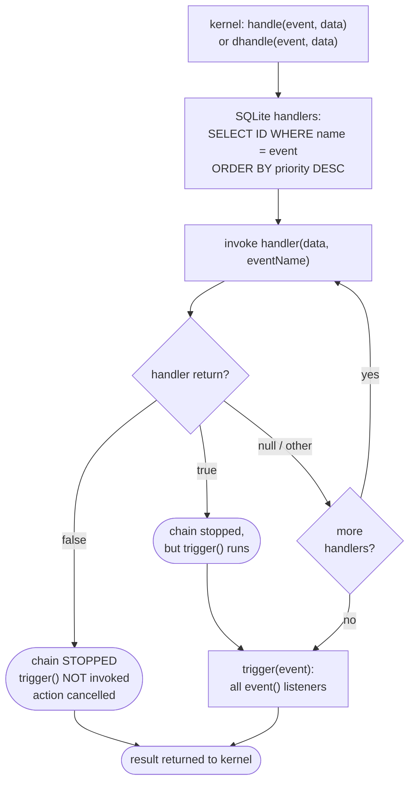
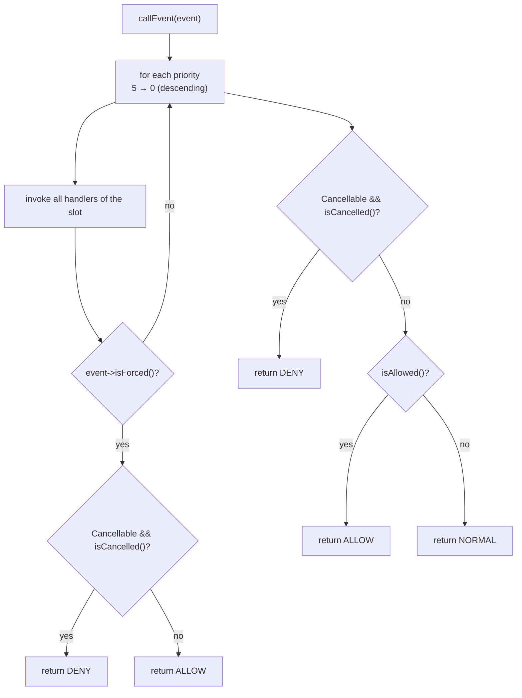
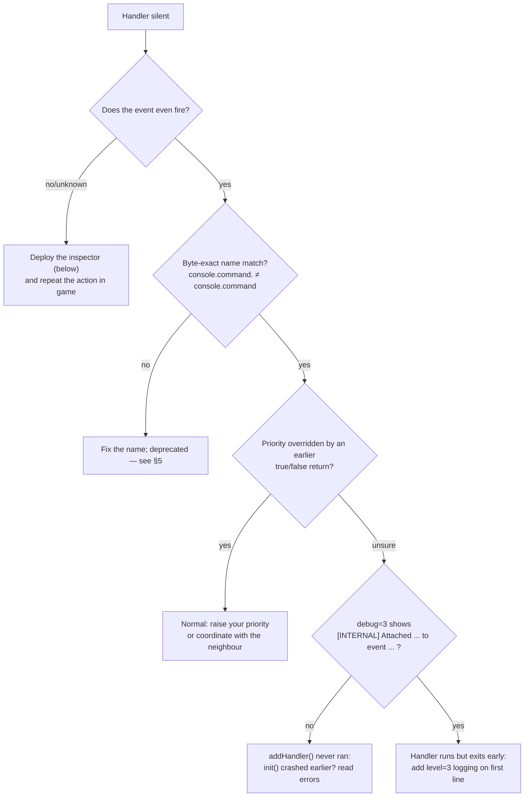

# WorldPECore Plugin API

# Part 4 — Events, Hooks & Extensions

> The kernel hosts **two** event systems. Both are available to plugins simultaneously.
>
> | | Legacy (“hooks”) | OOP (`BaseEvent`) |
> |---|---|---|
> | Subscription | `$api->addHandler("name", cb, prio)` | `Event::register(cb, EventPriority::…)` |
> | Payload | array / object by reference | event object |
> | Cancellation | handler returns `false` | `$event->setCancelled()` |
> | Used for | all gameplay logic (~60 events) | network packets (4 events) |

## Contents

- [1. Legacy system: mechanics](#1-legacy-system-mechanics)
- [2. Legacy event catalog](#2-legacy-event-catalog)
  - [2.1. Server](#21-server) · [2.2. Commands](#22-commands) · [2.3. Player](#23-player)
  - [2.4. Entities](#24-entities) · [2.5. World, tiles, items](#25-world-tiles-items)
- [3. OOP system: BaseEvent](#3-oop-system-baseevent)
- [4. Packet events](#4-packet-events)
- [5. Deprecated events](#5-deprecated-events)
- [6. Which system to choose](#6-which-system-to-choose)
- [7. Diagnostics: why is my handler silent](#7-diagnostics-why-is-my-handler-silent)

---

## 1. Legacy system: mechanics



Key rules:

1. **Priority** — an integer; sorted `ORDER BY priority DESC`: *higher = earlier*. The kernel uses `1` for critical permission checks (BanAPI); default `5`; typical plugin observers use `15`.
2. **`false` = veto**: the action cancels, later handlers are skipped, listeners are not notified. Returning `true` confirms and also ends traversal.
3. **Payload mutations**: `handle()` passes by reference — mutated values are visible to the kernel afterwards (e.g., `player.invisible` reads back `status`). Use `dhandle()` for copies.
4. **Two subscription styles**:
   - `addHandler($name, callable, $priority)` → decision participant (may cancel);
   - `$server->event($name, callable)` → notification only after the decision; ID for unsubscribing via `deleteEvent($id)`.
5. **Handlers cannot be removed**; listeners via `deleteEvent($id)`.
6. Non-callable entries in `trigger()` are silently removed.

The handler’s second argument — the event name (`$eventName`) — helps when one method listens to several names (like the inspector in §7.1) or when the scheduler passes your label from `schedule(..., "myplugin.tick")`.

Subscription:

```php
public function init(){
    // object method:
    $this->api->addHandler("player.block.break", [$this, "onBreak"], 5);
    // closure:
    $this->api->addHandler("player.join", function(Player $p){
        $p->sendChat("Hi!");
    }, 15);
}
// Handler signature is always: ($data, string $eventName)
```

A listener via `event()` (no veto, removable):

```php
$evid = ServerAPI::request()->event("player.join", [$this, "notifyStats"]);
// ...any time later:
ServerAPI::request()->deleteEvent($evid);
```

Same scenario, two styles side by side:

| Situation | `addHandler` (prio 15) | `event()` |
|---|---|---|
| Another plugin vetoed (`false` earlier) | **not called** | not called (trigger skipped) |
| Action allowed | called | called |
| Want to cancel | can (`false`) | cannot |
| Unsubscribe | impossible | `deleteEvent($id)` |

#### 1.1. End-to-end trace: two plugins on one event

`player.block.place`, priorities A=15 and B=5:

| Step | Who | Action | Chain result |
|---|---|---|---|
| 1 | SQL | selection: A(15) before B(5) | order fixed |
| 2 | A | logs placement, returns `null` | continue |
| 3a | B | denies in a foreign region → `return false` | **chain stopped**, block not placed, listeners not notified |
| 3b | B *(variant)* | confirms → `return true` | chain stopped but placement proceeds and trigger() fires |

Design takeaway: observers never return `true/false`; deniers take high priority (decide first); loggers take low/medium and always return `null`.

---

## 2. Legacy event catalog

Column legend: **payload** — first handler argument; **`false`** — effect of returning false; **`true`** — effect of returning true. “—” means no special semantics.

> Naming conventions: prefix = domain (`player.`/`entity.`/`tile.`/`console.`/`server.`/`api.`); dot-suffixed modifiers (`.bypass`, `.invalid`, `.spawn`) are *separate* events, not flags. Payload may be an array, an object (`Player`/`Container`/`Tile`) or a scalar — always check the group table.

### 2.1. Server

| Event | Payload | Fired when | `false` | `true` |
|---|---|---|---|---|
| `server.start` | `float` — boot microtime | end of `PocketMinecraftServer::init()` | — | — |
| `server.close` | `string` — stop reason | `close()` | — | — |
| `server.chat` | `Container` (mutable: text/filters) | every message via `ChatAPI::send()` | delivery to all players cancelled | — |
| `server.debug` | `array &$info` — statistics (mutable) | `debugInfo()` | — | — |
| `server.noauthpacket.<pid>` | `Packet` | packet from unknown session (handshake) | packet processing aborted | — |
| `async.curl.get` | `[ "response" => string ]` | async HTTP completion | — | — |
| `mcinterface.read` | `[ "buffer", "source", "port" ]` | every received datagram | — | — |
| `query.update` | `null` | query-data refresh | — | — |
| `server.schedule` | task payload | each task invocation (the `$eventName` label) | task removed | — |

⚠️ `server.start` and `server.close` fire through `trigger()` — subscribe with the `event()` method, not `addHandler()` (handlers on those names never run).

```php
public function init(){
    ServerAPI::request()->event("server.start", [$this, "onStart"]);
    ServerAPI::request()->event("server.close", [$this, "onClose"]);
}

public function onStart($startTimeFloat){
    // worlds loaded — safe to schedule and touch levels:
    $this->api->schedule(20, [$this, "minuteTick"], [], true);
}

public function onClose($reason){
    // chat still alive; network closes right after:
    $this->flushLogs();          // own files — fine
}
```

#### 2.1.0. Example: custom metrics inside `/status`

```php
public function init(){
    // server.debug passes the stats array through handlers:
    $this->api->addHandler("server.debug", [$this, "metrics"], 10);
}

public function metrics(&$info){          // mutable!
    $info["myplugin.queue"]     = count($this->queue);
    $info["myplugin.pendingDB"] = count($this->pending);
}
```

After this, `status` (alias `tps`) shows your counters next to memory and TPS.

#### 2.1.1. Example: chat filter (mutating Container)

```php
private array $badWords = ["spam", "cheater"];

public function init(){
    $this->api->addHandler("server.chat", [$this, "filter"], 10);
}

public function filter($container){
    $msg = $container->get()["message"];            // payload: ["player"=>..,"message"=>..]
    foreach($this->badWords as $w){
        if(stripos($msg, $w) !== false){
            return false;                            // nobody receives it
        }
    }
    return null;
}
```

Since `Container` is read-only (`get()/check()` only), filtering strategies are two: **deny** (`false`) or **re-send cleaned text** yourself followed by `false`.

### 2.2. Commands

All command events share one payload:

```php
[ "cmd" => string, "parameters" => array, "issuer" => Player|"console"|RCON, "alias" => string|false ]
```

| Event | When | `false` | `true` |
|---|---|---|---|
| `console.command.<cmd>` | before the generic event, per-command | command denied → *“You don't have permissions”* (if exists) or *“Command doesn't exist!”* | silent skip |
| `console.command` | after the per-command one | same | same |
| `console.check` | from BanAPI permission check (an `isOp` alternative for commands) | — | executor allowed without OP |
| `console.command.unknown` | unregistered command (key is `"params"`!) | default handling suppressed (silent) | — |

Selectors `@player/@world/@all/@random` expand **before** the events — parameters arrive already substituted.

```php
// Deny a command to everyone except your tier:
$this->api->addHandler("console.command.warp", function($data){
    if(!in_array($data["issuer"]->iusername ?? "", $this->allowed)) return false;
});
```

#### 2.2.1. Example: ranks without touching ops.txt

```php
// ranks: guest < vip < admin
private array $ranks = ["notch" => "admin", "steve" => "vip"];

public function init(){
    // console.check: true => executor allowed ANY command (OP equivalent)
    $this->api->addHandler("console.check", [$this, "grant"], 10);
}

public function grant($data){
    $who = strtolower($data["issuer"]->iusername ?? (string)$data["issuer"]);
    return ($this->ranks[$who] ?? "") === "admin" ? true : null;
}
```

#### 2.2.2. Example: custom unknown-command reaction

```php
public function init(){
    $this->api->addHandler("console.command.unknown", [$this, "unknown"], 5);
}
public function unknown($data){
    if($data["issuer"] instanceof Player){
        $data["issuer"]->sendChat("No such command. Closest: /help");
        return true;   // suppress the default “Command doesn't exist!”
    }
    return null;
}
```

#### 2.2.3. Example: three permission tiers on one command’s subcommands

```php
// ranks: member < moderator < admin
private function rankOf($issuer): string{
    if(!($issuer instanceof Player)) return "admin";          // console = admin
    $u = $issuer->iusername;
    if($this->admins[$u] ?? false) return "admin";
    if($this->api->ban->isOp($u))   return "moderator";
    return "member";
}

public function init(){
    // The per-command hook fires BEFORE the generic one — ideal for your commands:
    $this->api->addHandler("console.command.warpadmin", [$this, "gate"], 12);
}

public function gate($data){
    $need = ["warp set" => "moderator", "warp delete" => "admin"];
    $line  = $data["cmd"]." ".strtolower(implode(" ", array_slice($data["parameters"], 0, 1)));
    foreach($need as $sub => $min){
        if(str_starts_with($line, $sub)
           && $this->rankLevel($this->rankOf($data["issuer"])) < $this->rankLevel($min)){
            return false;                                     // deny this subcommand
        }
    }
    return null;
}
```

### 2.3. Player

> Group quirk: `player.connect/join/quit` deliver **the `Player` object itself**, not an array — type-check and read fields directly (`$p->iusername`, `$p->entity`).

| Event | Payload | When | `false` |
|---|---|---|---|
| `player.connect` | `Player` | name validated, before whitelist/ban checks | kick *“Unknown reason”* |
| `player.join` | `Player` | profile loaded (`PlayerAPI::add()`), before inventory grant | kick *“join cancelled”* |
| `player.quit` | `Player` | start of `close()`, before profile save | — |
| `player.death` | `[ "player" => Player, "cause" => string ]` | avatar death (after `entity.death`) | — |
| `player.teleport` | `[ "player" => Player, "target" => Vector3 ]` | any teleport within a world | teleport cancelled |
| `player.teleport.level` | `[ "player", "origin" => Level, "target" => Position ]` | cross-world transition | transition cancelled |
| `player.gamemode.change` | `[ "player", "gamemode" => int ]` | `setGamemode()` | change cancelled |
| `player.pickup` | `[ "eid", "player", "entity" => ItemEntity, "block" => id:int, "meta", "target" => eid ]` | item-entity pickup | item stays on ground |
| `player.invisible` | `&[ "target" => Player, "for" => Player, "status" => bool ]` (mutable!) | visibility change | — |
| `player.checkspawnpos` | `[ "player" ]` | respawn point validation on join/respawn | check skipped |
| `player.offline.get` | `Config &$data` — profile | offline profile load | — (mutate the config) |
| `player.offline.save` | `Config &$data` | profile save | — |
| `player.armor` | `[ "slots" => Item[] ]` | armor broadcast without a specific recipient | — |
| `player.flying` | *(declared, never fired by this kernel)* | reserved; subscribing is harmless | — |

#### Block events

| Event | Payload | When | `false` | `true` |
|---|---|---|---|---|
| `player.block.touch` | break: `[ "type"=>"break", "player", "target"=>Block, "item"=>Item ]`<br>place: `[ "type"=>"place", "player", "block", "target", "item" ]` | first stage of any block touch | break/placement cancelled | — |
| `player.block.break` | `[ "player", "target" => Block, "item" ]` | final break | block survives | confirmation |
| `player.block.break.bypass` | same | when the main hook denied | — | ignore denial |
| `player.block.break.invalid` | same | unbreakable target (`isBreakable=false`) | — | allow breaking the “unbreakable” |
| `player.block.break.spawn` | same | non-OP within `spawn-protection` | — | bypass spawn protection |
| `player.block.place` | `[ "player", "block" => Block(placed), "target" => Block(against), "item" ]` | final placement | placement denied | confirmation |
| `player.block.place.bypass` / `.invalid` / `.spawn` | same as break-variants | analogous to break-* | — | bypass corresponding denial |
| `player.block.activate` | `[ "player", "block", "target", "item" ]` | right-click on interactive block | activation cancelled | — |

Break pipeline order: `touch(break)` → `break` → [`bypass`] → drops → `blockUpdateAround`. Placement: `touch(place)` → `place.invalid` (air/not allowed) → [`bypass`] → `activate` → `place`.

#### 2.3.1. Mini-plugin RegionProtect (full listing)

Protecting a 50×50 cube around the spawn of world `world`:

```php
class RegionProtect implements Plugin{
    private $api;
    public function __construct(ServerAPI $api, $server = false){ $this->api = $api; }

    public function init(){
        // High priority: we decide before loggers.
        $this->api->addHandler("player.block.touch", [$this, "guard"], 12);
        // Let OPs override even other plugins:
        $this->api->addHandler("player.block.break.bypass", [$this, "opBypass"], 14);
        $this->api->addHandler("player.block.place.bypass", [$this, "opBypass"], 14);
    }

    private function protectedArea(Position $p): bool{
        if(strtolower($p->level->getName()) !== "world") return false;
        $s = ServerAPI::request()->spawn;
        return abs($p->x - $s->x) <= 25 && abs($p->z - $s->z) <= 25
            && $p->y > max(0, $s->y - 10);
    }

    public function guard($data){
        $player = $data["player"] ?? null;
        $pos = $data["type"] === "break" ? ($data["target"] ?? null) : ($data["target"] ?? $data["block"] ?? null);
        if(!$player instanceof Player || !$pos instanceof Vector3) return null;
        if($this->api->ban->isOp($player->iusername)) return null;      // OP allowed
        return $this->protectedArea(new Position($pos->x,$pos->y,$pos->z,$player->level))
            ? false   // veto: both touch and later break/place cancel themselves
            : null;
    }

    public function opBypass($data){
        // if someone below us denied — OP still breaks:
        return isset($data["player"]) && $this->api->ban->isOp($data["player"]->iusername)
            ? true : null;
    }
}
```

Note the interplay: a veto in `touch` already cancels; `.bypass` hooks matter when the denial came from *another* plugin later in priority.

#### 2.3.2. WelcomeGuard: join/quit/death

```php
public function init(){
    $this->api->addHandler("player.join", [$this, "join"], 15);
    $this->api->addHandler("player.quit", [$this, "quit"], 15);
    $this->api->addHandler("player.death", [$this, "death"], 15);
}

public function join($p){
    if(!$p instanceof Player) return null;
    $first = !$p->data->exists("myplugin.seen");
    if($first){ $p->data->set("myplugin.seen", time()); $this->api->player->saveOffline($p->data); }
    $this->api->chat->broadcast(FORMAT_AQUA . $p->username . ($first ? " joined for the first time!" : " joined."));
    return null;
}

public function quit($p){ /* payload is the Player itself */ }

public function death($d){          // ["player" => Player, "cause" => string]
    $msgs = [
        "fall" => "%s hit the ground too hard",
        "lava" => "%s tried to swim in lava",
        "generic" => "%s died",
    ];
    $this->api->chat->broadcast(sprintf($msgs[$d["cause"]] ?? $msgs["generic"], $d["player"]->username));
    return null;
}
```

#### 2.3.3. Teleport guard (no leaving the arena)

```php
$this->api->addHandler("player.teleport.level", [$this, "gate"], 12);

public function gate($d){
    $inArena = strtolower($d["origin"]->getName()) === self::ARENA;
    $toArena = strtolower($d["target"]->level->getName()) === self::ARENA;
    if($inArena && !$toArena && !($this->inLobby[$d["player"]->iusername] ?? false)){
        $d["player"]->sendChat("Use /arena leave to exit");
        return false;                       // cross-world transition cancelled
    }
    return null;
}
```

#### 2.3.4. Pickup control (double drops, VIP loot)

```php
public function init(){
    $this->api->addHandler("player.pickup", [$this, "pickup"], 12);
}

public function pickup($d){
    // payload: eid, player(Player), entity(ItemEntity), block(id), meta, target(eid)
    if($d["block"] === Item::DIAMOND && !$this->api->ban->isOp($d["player"]->iusername)){
        $extra = BlockAPI::getItem(Item::DIAMOND, 0, 1);
        $this->api->entity->drop($d["player"]->entity->round(), $extra); // bonus
    }
    return null;   // false — the player will NOT pick up (item stays)
}
```

#### 2.3.5. Offline profile migration (offline.get/save)

```php
public function init(){
    $this->api->addHandler("player.offline.get", [$this, "migrate"], 10);
}

public function migrate(&$cfg){          // profile Config by reference!
    if(!$cfg->exists("myplugin.v2")){
        // one-time migration on first join:
        $old = $cfg->get("myplugin.oldcoins", 0);
        $cfg->set("money", $old * 100);
        $cfg->set("myplugin.v2", true);
        // saving happens automatically for new profiles
    }
    return null;
}
```

#### 2.3.6. Visibility: mutable payload player.invisible

The only frequent event where the kernel **reads back** mutated data — a model case of legal mutation:

```php
public function init(){
    $this->api->addHandler("player.invisible", [$this, "spy"], 10);
}

public function invisible(&$d){          // &[target, for, status]
    // always hide admins from regular players:
    if($this->api->ban->isOp($d["target"]->iusername)
       && !$this->api->ban->isOp($d["for"]->iusername)){
        $d["status"] = true;             // kernel applies this value
    }
}
```

### 2.4. Entities

| Event | Payload | When | `false` |
|---|---|---|---|
| `entity.add` | `Entity` | entity registration (`addRaw`) | — |
| `entity.remove` | `Entity` | removal (before index cleanup) | — |
| `entity.move` | `Entity` (player) | avatar position changed | server teleports player back — **anti-cheat point** |
| `entity.motion` | `Entity` (dropped item etc.) | motion impulse broadcast | — |
| `entity.metadata` | `Entity` | metadata update | — |
| `entity.link` | `[ "rider" => eid, "riding" => eid, "type" => 0 ]` | mounting | — |
| `entity.health.change` | `[ "entity" => Entity, "eid", "health" => int, "cause" => string ]` | every health change (`setHealth`) | change cancelled (unless `$force=true`) |
| `entity.death` | `[ "entity", "cause" ]` | health ≤ 0, before drops and animation | death fully cancelled |
| `entity.explosion` | `[ "level" => Level, "source" => Position, "size" => float ]` | before explosion math | explosion cancelled |
| `entity.animal.breed` | `[ "parent" => Animal, "parent2" => Animal ]` | breeding | — |

#### 2.4.1. Example: no TNT in spawn world, custom “booms”

```php
public function init(){
    $this->api->addHandler("entity.explosion", [$this, "boom"], 10);
}
public function boom($d){
    if(strtolower($d["level"]->getName()) === "spawn") return false;   // silent at spawn
    if($d["size"] > 6){ $this->log("big boom @ " . $d["source"]); }
    return null;
}
```

#### 2.4.2. Death messages & stats caveat

`player.death` and `entity.death` are different events: the former is for player avatars (after the latter), the latter for all entities. A mob-kill logger hooks `entity.death`, but its payload lacks the attacker — the `cause` string comes from kernel/shooter code. For precise attribution intercept earlier points: `INTERACT_PACKET` via an OOP event or your own `harm()` calls.

#### 2.4.3. Example: mob “second life” (deny + respawn)

```php
public function init(){
    $this->api->addHandler("entity.death", [$this, "bossLife"], 12);
}

public function bossLife($d){
    $e = $d["entity"];
    // our boss marked in entity data:
    if(($e->data["boss"] ?? false) === true && ($this->lives[$e->eid] ?? 1) > 0){
        --$this->lives[$e->eid];
        return false;   // death cancelled: no drops!
    }
    return null;
}
```

⚠️ Nuance: denying `entity.death` does NOT restore `$health` — it only interrupts processing (`makeDead`). Right after denial raise health yourself: `$e->setHealth(20, "revive", true);` otherwise the entity stays “dead” and dies to the next hit.

### 2.5. World, tiles, items

| Event | Payload | When | `false` |
|---|---|---|---|
| `item.drop` | `&[ "x","y","z", "level" => Level, "speedX/Y/Z", "item" => Item, "itemID" => int ]` | item-entity drop | no drop created |
| `tile.update` | `Tile` | content change / chest pairing / sign text | — |
| `tile.container.slot` | `&[ "tile" => Tile, "slot" => int, "offset" => int, "slotdata" => Item ]` (mutable!) | any container slot change | — |
| `tile.remove` | `Tile` | tile removal | — |
| `time.change` | `[ "level" => Level, "time" => int ]` | every time broadcast tick in the `Level::setTime` path | time packet to clients suppressed |
| `achievement.grant` | `[ "player" => Player, "achievementId" => string ]` | granting (after prerequisite check) | achievement denied |
| `achievement.broadcast` | same | announcement | — ; `true` suppresses default chat message |
| `op.check` | `string $username` | every BanAPI permission check | — ; `true` ⇒ player is OP |
| `api.ban.check` | `string $username` (lowercase) | nick ban check | `false` ⇒ considered banned |
| `api.ban.ip.check` | `string $ip` | IP ban check | `false` ⇒ IP banned |
| `api.ban.whitelist.check` | `string $username` | whitelist check | `false` ⇒ in whitelist |

> ⚠️ Inversion reminder: in ban/whitelist hooks `false` is a positive verdict (“banned/listed”), not a cancellation.

“Dispatch” events (`entity.motion/animate/event/metadata/link`, `player.equipment.change`, `tile.update`, `server.chat`) are additionally consumed by the kernel itself via `event()` for packet delivery — so cancelling them through `handle()` has observable effects (see tables above).

#### 2.5.1. Example: no-drop zone

```php
$this->api->addHandler("item.drop", [$this, "noDrop"], 12);

public function noDrop($d){   // &[x,y,z,level,item,itemID,...]
    if(strtolower($d["level"]->getName()) === "lobby"){
        return false;         // item never appears
    }
    return null;
}
```

#### 2.5.2. Example: chest contents logger (anti-theft)

```php
public function init(){
    $this->api->addHandler("tile.container.slot", [$this, "slotLog"], 15);
}

public function slotLog(&$d){     // &[tile, slot, offset, slotdata]
    $t = $d["tile"];
    $item = $d["slotdata"];
    if(!$item instanceof Item || $item->getID() === 0) return null;
    $this->db->query("INSERT INTO slots VALUES (NULL,"
        . "'".$this->db->escapeString(strtolower($t->level->getName()))."',"
        . (int)$t->x.",".(int)$t->y.",".(int)$t->z.","
        . (int)$d["slot"].",".(int)$item->getID().",".(int)$item->getMetadata().","
        . (int)$item->count.");");
    return null;                  // never interfere with gameplay
}
```

#### 2.5.3. Example: frozen night (time.change)

```php
public function init(){
    $this->api->addHandler("time.change", [$this, "freeze"], 10);
}
public function freeze($d){
    // kernel sends time every 5 ticks; false = suppress client sync
    $lv = $d["level"];
    if(isset($this->frozen[strtolower($lv->getName())])){
        if($this->api->time->get(true, $lv) > TimeAPI::$phases["sunset"] + 200){
            $this->api->time->set(TimeAPI::$phases["sunset"], $lv); // roll back
        }
    }
    return null;
}
```

---

## 3. OOP system: BaseEvent

Classes: `src/BaseEvent.php`, `src/event/EventHandler.php`, `src/event/EventPriority.php`, interface `src/event/CancellableEvent.php`.

### 3.1. Static event API

Every concrete event must declare static registries:

```php
class MyEvent extends ServerEvent implements CancellableEvent{
    public static $handlers;
    public static $handlerPriority;

    private $payload;
    public function __construct($payload){ $this->payload = $payload; }
    public function getPayload(){ return $this->payload; }
}
```

| Method | Signature → return | Description |
|---|---|---|
| `register` | `MyEvent::register(callable $handler, int $priority = EventPriority::NORMAL): bool` | subscribe; `false` when priority out of range or callable already subscribed (dedup by callable identifier) |
| `unregister` | `MyEvent::unregister(callable $handler): bool` | unsubscribe |
| `getHandlerList` / `getPriorityList` | static | inspect subscriptions |
| `unregisterAll` | static | full wipe (kernel calls it on API reload) |

### 3.2. Priorities (`EventPriority`)

| Constant | Value | Meaning |
|---|---|---|
| `LOWEST` | 5 | runs first; may alter the outcome |
| `LOW` | 4 | |
| `NORMAL` | 3 | default |
| `HIGH` | 2 | |
| `HIGHEST` | 1 | last word among regular handlers |
| `MONITOR` | 0 | observation only; changes forbidden by etiquette |

Execution order — descending value (Bukkit-style).

### 3.3. Event state

Internal status is a bitmask:

```php
BaseEvent::ALLOW   = 0;      // allowed
BaseEvent::DENY    = 1;      // cancelled
BaseEvent::NORMAL  = 2;      // neutral
BaseEvent::FORCE   = 0x80000000; // forced-decision flag
```

| Object method | Description |
|---|---|
| `isCancelled(): bool` / `setCancelled(bool $forceCancel = false)` | cancellation works only with `CancellableEvent`; `$force = true` sets FORCE |
| `isAllowed(): bool` / `setAllowed(bool $forceAllow = false)` | explicit allow (rarely needed: not cancelling is enough) |
| `isNormal()` / `setNormal()` | neutral state — every event starts here |
| `isForced(): bool` | was a forced decision made |
| `getEventName()` / `getPrioritySlot()/setPrioritySlot(int)` | class name / current priority slot (internal) |

FORCE semantics example: calling `$ev->setCancelled(true)` (with force) in any slot makes `EventHandler::callEvent()` **return immediately after that slot** with `DENY` — later priorities never run. That is a “final verdict” tool, unlike a plain cancel.

### 3.4. Algorithm: `EventHandler::callEvent(BaseEvent $event)`



The caller compares the result to `BaseEvent::DENY` and decides whether to proceed:

```php
// src/Player.php:
if(EventHandler::callEvent(new DataPacketSendEvent($this, $packet)) === BaseEvent::DENY){
    return; // packet not sent
}
```

### 3.5. Your own OOP event: full example

Plugins can reuse the same machinery for internal extension points:

```php
// 1) Declare the event once in your file:
class JobDoneEvent extends ServerEvent implements CancellableEvent{
    public static $handlers;
    public static $handlerPriority;

    private $who;
    private $result;
    public function __construct(string $who, array $result){
        $this->who = $who; $this->result = $result;
    }
    public function getWho(): string{ return $this->who; }
    public function getResult(): array{ return $this->result; }
    public function setResult(array $r): void{ $this->result = $r; }
}

// 2) Fire from your code:
$status = EventHandler::callEvent(new JobDoneEvent($worker, $data));
if($status === BaseEvent::DENY){ /* subscribers vetoed — skip publishing */ }

// 3) Subscription from another plugin:
JobDoneEvent::register(function(JobDoneEvent $ev){
    console($ev->getWho() . " finished: " . count($ev->getResult()));
}, EventPriority::NORMAL);
```

Class requirements: extend `ServerEvent` (or `BaseEvent`), mandatory static `$handlers/$handlerPriority` (otherwise `register()` fails), payload getters. Cancellation only makes sense with `implements CancellableEvent`.

### 3.6. Priority etiquette and MONITOR

```php
// ❌ BAD: mutating at MONITOR
DataPacketReceiveEvent::register(function(DataPacketReceiveEvent $ev){
    $ev->setCancelled();            // breaks everyone’s contract
}, EventPriority::MONITOR);

// ✅ GOOD: MONITOR only reads
DataPacketSendEvent::register(function(DataPacketSendEvent $ev){
    $this->stats[$ev->getPacket()->pid()] = ($this->stats[$ev->getPacket()->pid()] ?? 0) + 1;
}, EventPriority::MONITOR);
```

Tier meanings: LOWEST/HIGH — “adjust the outcome”, HIGHEST — “last word”, MONITOR — “watch only”. The legacy analogue is high numeric priorities without returns.

### 3.7. handle() vs dhandle()

```php
// handle(): BY REFERENCE — handlers may mutate; kernel sees changes
$this->server->api->handle("player.invisible", $data);   // kernel reads back $data["status"]

// dhandle(): by value — safe for “just notify”
$result = $this->server->api->dhandle("op.check", $username);
```

A plugin almost always needs only `dhandle()` (via `$api`) when firing its own events; reference-based `handle()` is a kernel tool.

---

## 4. Packet events

The only group migrated to the OOP mechanics. All four classes are `CancellableEvent`.

| Class | Constructor | Level | Getters |
|---|---|---|---|
| `PacketReceiveEvent` | `(Packet $packet)` | raw datagram before recognition (`MinecraftInterface::readPacket`) | `getPacket()` |
| `PacketSendEvent` | `(Packet $packet)` | raw datagram before socket write | `getPacket()` |
| `DataPacketReceiveEvent` | `(Player $player, RakNetDataPacket $packet)` | gameplay packet after routing into session | `getPlayer()`, `getPacket()` |
| `DataPacketSendEvent` | `(Player $player, RakNetDataPacket $packet)` | before every outgoing gameplay packet | `getPlayer()`, `getPacket()` |

Packet objects at these levels already carry `ip`/`port` — handy for logging and IP filters without payload parsing.

Subscription and a typical handler:

```php
public function init(){
    DataPacketReceiveEvent::register([$this, "onReceive"], EventPriority::NORMAL);
}

public function onReceive(DataPacketReceiveEvent $event){
    $player = $event->getPlayer();
    $pk     = $event->getPacket();

    switch(true){
        case $pk->pid() === ProtocolInfo::CONTAINER_CLOSE_PACKET:
            // ...custom window-close logic...
            break;
        case $pk->pid() === ProtocolInfo::USE_ITEM_PACKET:
            if(/* forbidden */ false){
                $event->setCancelled();     // packet dropped, kernel never sees it
            }
            break;
    }
}
```

Cancellation levels:

- `PacketReceiveEvent::DENY` — datagram ignored entirely (before RakNet parsing);
- `DataPacketReceiveEvent::DENY` — packet reaches the session but is not processed;
- `DataPacketSendEvent::DENY` / `PacketSendEvent::DENY` — outgoing packet never leaves.

Where send events are wired (verified kernel points):

| Send path | Passes `DataPacketSendEvent`? |
|---|---|
| `$player->dataPacket($pk)` | ✅ |
| `$player->directDataPacket($pk)` | ✅ |
| `$player->sendChatMessagePacket($pk)` — chat batching | ✅ |
| `$player->entityQueueDataPacket($pk)` | ❌ (bypasses OOP event) |
| `$player->send(RakNetPacket)` — raw RakNet | ❌ |
| `$server->send($packet)` | only `PacketSendEvent` (interface level) |

So “hide this packet from the player” via OOP events does not work for every send path — entityQueue and raw-send go around. Keep that in mind when filtering.

⚠️ Intercept minimally: `DataPacketSendEvent` fires for **every** packet of **every** player — heavy code here directly burns TPS.

### 4.1. Examples

#### Fast dispatch by `pid()` (switch without object churn)

```php
public function onReceive(DataPacketReceiveEvent $ev){
    switch(true){
        case $ev->getPacket()->pid() === ProtocolInfo::USE_ITEM_PACKET:
            $p = $ev->getPlayer();
            if(strtolower($p->level->getName()) === "lobby"){
                $ev->setCancelled();          // no item use in lobby
            }
            return;
        case $ev->getPacket()->pid() === ProtocolInfo::CONTAINER_CLOSE_PACKET:
            $this->onWindowClose($ev->getPlayer(), $ev->getPacket());
            return;
    }
}
```

#### Cleaning GUI chests on window close (Part 2 pattern 5.4 continued)

```php
private function onWindowClose(Player $p, RakNetDataPacket $pk){
    $tile = $this->menus[$p->iusername] ?? null;
    if($tile instanceof Tile && (!is_object($p->windows[$pk->windowid] ?? null)
        || ($p->windows[$pk->windowid]->class ?? "") === TILE_CHEST)){
        // player closed our chest — remove tile and highlight block
        $this->api->schedule(5, [$tile, "close"], []);
        unset($this->menus[$p->iusername]);
    }
}
```

### 4.2. Cancellation matrix (cheat sheet)

| I want to deny | System | Point | How |
|---|---|---|---|
| Block breaking | legacy | `player.block.touch(break)` / `.break` | `return false` |
| Block placement | legacy | `touch(place)` / `.place` | `false`; override someone else’s denial — `.bypass` with `true` |
| Kernel spawn-zone action | legacy | `.break.spawn`/`.place.spawn` | `true` = bypass protection |
| A command | legacy | `console.command[.<cmd>]` | `false` (or `true` = silent skip) |
| Chat message | legacy | `server.chat` | `false` |
| Cross-world teleport | legacy | `player.teleport.level` | `false` |
| Damage | legacy | `entity.health.change` | `false` (skipped by `$force`) |
| Item drop | legacy | `item.drop` | `false` |
| Explosion | legacy | `entity.explosion` | `false` |
| Achievement grant | legacy | `achievement.grant` | `false` |
| Player join | legacy | `player.connect` / `.join` | `false` → kick with different reasons |
| Any client packet | OOP | `DataPacketReceiveEvent` | `setCancelled()` |
| Outgoing packet | OOP | `DataPacketSendEvent` / `PacketSendEvent` | `setCancelled()` |
| Raw datagram pre-RakNet | OOP | `PacketReceiveEvent` | `setCancelled()` |

---

## 5. Deprecated events

The map `Deprecation::$events` (`src/Deprecation.php`). Subscribing to an old name prints `[ERROR] Event "..." has been deprecated. Substitute "..." found.` with the replacement:

| Deprecated | Replacement |
|---|---|
| `server.tick` | `ServerAPI::schedule()` |
| `server.time` | `time.change` |
| `world.block.change` | `block.change` |
| `block.drop` | `item.drop` |
| `api.op.check` | `op.check` |
| `api.player.offline.get` | `player.offline.get` |
| `api.player.offline.save` | `player.offline.save` |

Do not use the left column in new code. Typical fix:

```diff
- $this->api->addHandler("block.drop", [$this, "onDrop"], 15);
+ $this->api->addHandler("item.drop",  [$this, "onDrop"], 15);
```

Names change one-to-one; payloads of replacements generally match the old ones.

### 5.1. Reading Deprecation warnings

Subscribing to an old name prints:

```text
[ERROR] Event "block.drop" has been deprecated. Substitute "item.drop" found. [Adding handle to MyPlugin::onDrop]
```

Breakdown: old name → found replacement → **exactly where** you subscribed (Class::method or closure). The handler still registers and works — but it marks tech debt. Firing an old name yourself (`dhandle("server.tick")`) produces the same error tagged `[Trigger]`.

---

## 6. Which system to choose

```mermaid
flowchart TD
    A{"What am I intercepting?"} -->|"raw client/server packet"| OOP1["DataPacket*Event<br/>setCancelled()"]
    A -->|"datagram before RakNet parse"| OOP2["Packet*Event"]
    A -->|"gameplay action (blocks, join, damage…)"| L1["addHandler(name, cb, prio)"]
    A -->|"server start/stop"| L2['event("server.start/close")']
    A -->|"own internal event"| CUST["own name + handle()/trigger()<br/>or own BaseEvent class"]
    L1 --> D{"Need to cancel?"}
    D -- "yes" --> P1["high priority + return false"]
    D -- "observing" --> P2["priority 15 + always null"]
```

| Task | Solution |
|---|---|
| React to gameplay actions (blocks, join, damage) | legacy `addHandler` |
| Conditionally allow/deny an action | legacy + `false` (or bypass hooks `.bypass/.invalid/.spawn` with `true`) |
| Chat filtering | legacy `server.chat` (deny or re-send — Container is read-only) |
| Raw client packet interception | `DataPacketReceiveEvent::register()` |
| Blocking outgoing packets | `DataPacketSendEvent` / `PacketSendEvent` |
| Server start/stop subscription | `event("server.start"/"server.close")` |
| Observe without interfering | `MONITOR` priority (OOP) or high legacy priority without returns |
| Own metrics inside `/status` | handler on `server.debug` (mutable `$info`) |
| Ranks over OP | `op.check` (`true` ⇒ OP) and `console.check` (`true` ⇒ all commands) |
| Container logging | `tile.container.slot` (mutable, always `null`) |

Rule of thumb: **raw byte → OOP; gameplay meaning → legacy; own architecture → own names or your `BaseEvent`.**

When in doubt start with a legacy hook: it sits higher (more stable across protocol changes); drop to packet level only when no gameplay event exists — never emulate byte-level logic through gameplay events.

---

## 7. Diagnostics: why is my handler silent



#### 7.1. Event inspector (debug plugin)

```php
class EventInspector implements Plugin{
    private $api; private array $log = [];
    public function __construct(ServerAPI $a, $s = false){ $this->api = $a; }

    public function init(){
        // Subscribe to the most frequent events with one method:
        foreach([
            "player.join","player.quit","player.connect","player.death",
            "player.block.break","player.block.place","player.block.touch",
            "player.pickup","item.drop","entity.death","entity.explosion",
            "server.chat","time.change","tile.container.slot",
        ] as $name){
            $this->api->addHandler($name, function($data) use ($name){
                $this->log[] = sprintf("[%s] %s", $name,
                    is_object($data) ? get_class($data) : substr(json_encode($data), 0, 120));
                console("[Inspect] $name", true, true, 3);   // only at DEBUG>=3
            }, 15);
        }
        // Dump last 30 entries on demand:
        $this->api->console->register("inspect", "", function(){
            return implode("\n", array_slice($this->log, -30)) . "\n";
        });
    }
}
```

Value: instantly see which events actually fly on your server, their order and payload shape (`json_encode` of the first 120 chars). Do not keep it in production — it is chatty.

#### 7.2. Search checklist

- [ ] Event name copied from this documentation, not typed from memory.
- [ ] Subscription lives in `init()` and `init()` definitely ran (`console(...,0)` marker).
- [ ] `server.start/close` uses `event()`; everything else uses `addHandler()`.
- [ ] With `debug=3` you see `[INTERNAL] Attached <Class>::<method> to event <name>`.
- [ ] No earlier handler returns `true/false` (check your own modules too).
- [ ] The inspector (§7.1) confirms the event fires.

⬅️ [Part 3 — Core API Reference](03-core-api-reference.md) | ➡️ **Part 5 — Best Practices & Security**


