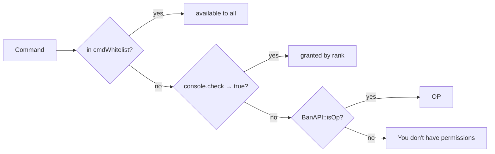
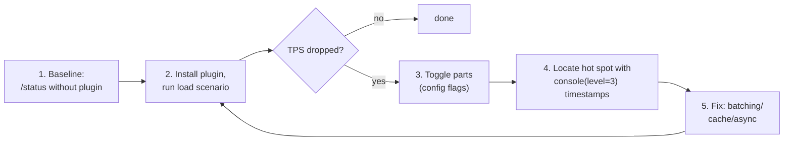

# WorldPECore Plugin API

# Part 5 — Best Practices & Security

> Proven patterns for the single-threaded WorldPECore kernel. Every claim reflects actual source behavior.

## Contents

- [1. Threading model and the main thread](#1-threading-model-and-the-main-thread)
- [2. Asynchronous work](#2-asynchronous-work)
- [3. Memory and resources](#3-memory-and-resources)
- [4. Security](#4-security)
- [5. Error handling](#5-error-handling)
- [6. Anti-patterns: what NOT to do](#6-anti-patterns-what-not-to-do)
- [7. Performance: checklists](#7-performance-checklists)
- [8. Compatibility and versioning](#8-compatibility-and-versioning)

---

## 1. Threading model and the main thread

Game logic runs on **one thread** (PHP main): tick loop, all handlers, scheduler, commands. Frame budget — 50 ms; every millisecond of your code is subtracted from everyone’s TPS.

#### 1.0.1. Symptoms of a blocking plugin

| Console/game symptom | Diagnosis |
|---|---|
| Periodic `Can't keep up!` when a player joins | heavy work on `player.join` |
| TPS dips “in waves” every N seconds | a scheduler task does too much per run |
| Lag only when chatting | filter in `server.chat` performs file/network ops |
| Lag on chest open | `tile.container.slot` logger writes synchronously without batching |
| Memory grows between arena matches | caches not cleared on `player.quit` / GUI tiles not closed |

#### 1.0.2. Bad/good: array processing

```php
// ❌ BAD: everything in one tick
public function cleanup(){
    foreach($this->api->entity->getAll() as $e){ /* check+delete */ }
}

// ✅ GOOD: batches of 50 entities per tick
private array $queue = []; private int $cursor = 0;
public function startCleanup(){ $this->queue = $this->api->entity->getAll(); $this->cursor = 0; }
public function step(){ // schedule(1, step, [], true)
    $n = 0;
    while($n < 50 && $this->cursor < count($this->queue)){
        $e = $this->queue[$this->cursor++];
        /* ... */ ++$n;
    }
    if($this->cursor >= count($this->queue)) return false;
}
```

Side threads:

| Thread | Code | Your entry point |
|---|---|---|
| Console input | `ConsoleLoop` | lines arrive on the main thread by themselves |
| cURL worker | `AsyncMultipleQueue` | `asyncOperation(ASYNC_CURL_*, ...)` |
| One-shot tasks | `Async` (pthreads) | `$api->async(callable)` |
| RCON receivers | `RCON` (if enabled) | not directly reachable by plugins |

Main-thread rules:

1. **No blocking calls**: `sleep`, synchronous `curl_exec`, long `exec()`, heavy network file operations.
2. Implement waiting as state: store a timestamp and check it from a scheduler task.
3. Split work: process N items per tick (`schedule(..., repeat=true)`) instead of whole arrays at once.
4. Do not copy large structures needlessly: event payloads already contain live objects — filter by reference instead of rebuilding arrays.
5. Process `Async` results in portions too: even ready bulk data should apply across ticks.

```php
// BAD: blocks for 3 seconds
public function onJoin($player){ $data = file_get_contents("http://slow-api/..."); }

// GOOD: async HTTP + callback next tick
public function onJoin($player){
    $this->api->asyncOperation(ASYNC_CURL_GET,
        ["url" => "https://api.example.com/profile?name=" . urlencode($player->username)],
        function($result, $type, $id){ /* $result["response"] */ });
}
```

---

## 2. Asynchronous work

### asyncOperation (cURL off-thread)

```php
$ID = $server->asyncOperation(ASYNC_CURL_POST, [
    "url"     => "https://discord.com/api/webhooks/…",
    "timeout" => 10,
    "data"    => ["content" => "Player joined"],
], function($result, $type, $id){
    // runs on the MAIN thread next tick;
    // $result["response"] — response body string
});
// Returns: operation ID or false under NO_THREADS/unknown type
```

Results parse in `asyncOperationChecker()` once per second (kernel schedule). The `async.curl.get` event also fires.

#### 2.0.1. Case study: Discord chat logger

```php
public function init(){
    $this->url = $this->cfg->get("webhook");
    if($this->url === "none") return;
    $this->api->addHandler("server.chat", [$this, "toDiscord"], 15);
}

public function toDiscord($container){
    $msg = TextFormat::clean((string)$container);          // strip § codes
    $this->api->asyncOperation(ASYNC_CURL_POST, [
        "url"  => $this->url,
        "data" => [                                            // form-encoded — Discord accepts it
            "content" => mb_substr($msg, 0, 1900),
            "username" => "WorldPE Logger",
        ],
    ]);
    return null;   // do not interfere with delivery
}
```

Batching instead of flooding (one message per 5 seconds):

```php
private array $buffer = [];
private function queue(string $m){
    $this->buffer[] = $m;
    if(count($this->buffer) >= 10){ $this->flush(); }
}
private function flush(){
    if(!$this->buffer) return;
    $this->api->asyncOperation(ASYNC_CURL_POST, [
        "url" => $this->url,
        "data" => ["content" => mb_substr(implode("\n", $this->buffer), 0, 1900)],
    ]);
    $this->buffer = [];
}
// + $this->api->schedule(100, [$this, "flush"], [], true);
```

> Note: `ASYNC_CURL_POST` sends fields as a regular form (`application/x-www-form-urlencoded`) — Discord webhooks accept that format (`content=…`); no JSON needed.

#### 2.0.1.1. Webhook with retries and backoff

`asyncOperation` does not retry. Wrapper with exponential delay:

```php
private function sendWebhook(string $content, int $attempt = 0){
    $this->api->asyncOperation(ASYNC_CURL_POST, [
        "url" => $this->url, "timeout" => 5,
        "data" => ["content" => mb_substr($content, 0, 1900)],
    ], function($result, $type, $id) use ($content, $attempt){
        $ok = isset($result["response"]) && $result["response"] !== "";
        if($ok || $attempt >= 3) return;
        $delay = 20 * (2 ** $attempt);                 // 1s → 2s → 4s (in ticks)
        $this->api->schedule($delay, function() use ($content, $attempt){
            $this->sendWebhook($content, $attempt + 1);
            return false;                              // one-shot retry task
        }, [], false);
    });
}
```

The pattern fits any external API.

#### 2.0.2. Case study: batched SQLite block logger

Per-block INSERTs kill TPS during construction sprees. Batch:

```php
private array $pending = [];

public function init(){
    $path = $this->api->plugin->configPath($this)."logs.db";
    $isNew = !file_exists($path);
    $this->db = new SQLite3($path);
    if($isNew){
        $this->db->query("CREATE TABLE bl(id INTEGER PRIMARY KEY, name TEXT, act INT,
                          x INT,y INT,z INT, ts TEXT)");
    }
    $this->db->query("PRAGMA journal_mode=OFF; PRAGMA synchronous=OFF;");
    $this->api->addHandler("player.block.touch", [$this, "log"], 15);
    $this->api->schedule(40, [$this, "flush"], [], true);       // every 2 sec
}

public function log(&$d){
    $t = $d["target"] ?? null;
    if(!$t instanceof Vector3 || !$d["player"] instanceof Player) return null;
    $this->pending[] = [$d["player"]->iusername, $d["type"], $t->x, $t->y, $t->z, time()];
    return null;
}

public function flush(){
    if(!$this->pending) return;
    $st = $this->db->prepare("INSERT INTO bl(name,act,x,y,z,ts)
                              VALUES (?,?,?,?,?,?);");
    foreach($this->pending as [$n,$a,$x,$y,$z,$ts]){
        $st->bindValue(1, $n, SQLITE3_TEXT);
        $st->bindValue(2, $a, SQLITE3_TEXT);
        $st->bindValue(3, $x, SQLITE3_INTEGER);
        $st->bindValue(4, $y, SQLITE3_INTEGER);
        $st->bindValue(5, $z, SQLITE3_INTEGER);
        $st->bindValue(6, date("c", $ts), SQLITE3_TEXT);
        $st->execute();
    }
    $this->pending = [];
}

public function __destruct(){ $this->flush(); $this->db->close(); }
```

- Without pthreads (`NO_THREADS`) it degrades safely.

#### 2.1.1. Case study: heavy computation in Async

Terrain generation / pathfinding are Async candidates:

```php
public function generateAsync(Player $p, string $seedKey){
    $this->api->async(function(array $params){
        // WARNING: no Player/Level/API access inside the thread!
        $grid = [];
        for($x = 0; $x < 256; ++$x){
            for($z = 0; $z < 256; ++$z){
                $grid[$x][$z] = $this->noiseLike($params["seed"], $x, $z);
            }
        }
        return $grid;                       // Async::run() returns this
    }, ["seed" => $seedKey]);
}
```

pthreads rules in this kernel:

1. Never touch gameplay objects or `ServerAPI` services — they belong to the main thread.
2. Exchange only scalars/arrays via `$params`.
3. Exceptions inside a thread do not surface — wrap and return status yourself.
4. A long thread does not block the server, but still apply results in portions (§1.2).

#### 2.1.2. What NOT to move to a thread

| Task | Why not |
|---|---|
| Sending packets to players | only the main thread sends (`dataPacket`) |
| Reading world blocks | `Level` is not thread-safe; copy data beforehand |
| Discord webhook | already solved by `asyncOperation()` (cURL worker) |
| Logging | `console()/logg()` write from the main thread; return text from the thread instead |

### Scheduler as planner

Intervals in ticks: `20 = 1 sec`, `1200 = minute`, `18000 = 15 min` (the kernel’s autosave). Repeating tasks remove themselves by returning `false`:

```php
private $left = 10;
public function countdown(){
    if(--$this->left <= 0){
        $this->api->chat->broadcast("Go!");
        return false;              // task removed
    }
    $this->api->chat->broadcast("Starting in: " . $this->left);
}
```

Alternative without a permanent task: chain one-shot `schedule(N, cb)` steps — that is how the kernel kicks (`BanAPI::kick` → `schedule(60, [$player,"close"], $reason)`).

#### 1.1. Cost of main-thread operations (order-of-magnitude intuition)

| Operation | Relative cost | Takeaway |
|---|---|---|
| Field access | 1 | early-return filters |
| Prepared SQL SELECT/INSERT | ~100 | batch writes, cache reads |
| Local file read | ~200 | never inside handlers |
| Synchronous cURL | 50 000+ | `asyncOperation()` only |
| World generation | hundreds of thousands | ahead of time, not on demand |

Tick budget is **50 ms**. One synchronous HTTP at 300 ms ≈ 6 lost ticks for every player.

#### 1.2. Full example: lock-free cooldown

```php
class Cooldown {
    private array $until = [];

    public function ready(string $key, int $ms): bool{
        $now = (int) round(microtime(true) * 1000);
        if(($this->until[$key] ?? 0) > $now) return false;
        $this->until[$key] = $now + $ms;
        return true;
    }
}

// inside a command handler:
if($issuer instanceof Player && !$this->cd->ready("warp.".$issuer->iusername, 5000)){
    return "Wait 5 seconds.\n";
}
```

---

## 3. Memory and resources

1. **Chunks.** Loaded chunks stay resident by default (`KEEP_CHUNKS_LOADED=true`). For arenas/minigames free player references after a match: `$level->freeAllChunks($player)`.
2. **Entities.** Remove your temp entities explicitly: `$this->api->entity->remove($eid)` — otherwise item entities live until despawn (300 s).
3. **Tiles.** Close with `$tile->close()`; do not leave phantom chests in unloadable worlds.
4. **Statics.** Static properties survive world reloads; clear them on `server.close`/`player.quit`.
5. **Diagnostics.** `$server->debugInfo()` exposes `memory_usage/peak/garbage`; hook `server.debug` to add your own counters into the same stats.
6. **Payload references.** `handle()` passes wrappers by value, but nested objects are the same instances. Do not keep `Player`/`Entity` in static arrays longer than the session (check `$p->connected`, `$e->closed`).
7. **Container windows.** Player closing a window does not close your tile automatically — catch `CONTAINER_CLOSE_PACKET` (Part 4 §4) and call `$tile->close()`, otherwise a phantom chest remains in world and memory.

#### 3.0.1. Memory footprint of typical objects

| Consumer | Order of size | Control |
|---|---|---|
| Loaded chunk (16×128×16) | ~64 KB + indexes | `freeAllChunks()`, `KEEP_CHUNKS_LOADED=false` for arenas |
| Item entity | hundreds of bytes, TTL 300 s | avoid mass spawns; `entity->remove()` |
| Mob (Living) | kilobytes + AI path | limit `mobs-amount`, `despawn-mobs` |
| Open container window | reference to Tile | close tile on quit |

#### 3.0.2. Leak checklist

- [ ] On `player.quit` every `[iusername => ...]` entry across all your arrays is removed.
- [ ] GUI tiles closed (`close()`), windows removed from `$player->windows`.
- [ ] Temporary match entities deleted at match end.
- [ ] Static caches have an upper bound (or periodic cleanup).
- [ ] `/status` after an hour: `garbage` stable, `entities` not monotonically growing.

#### 3.0.3. Sanitary player-quit handling

```php
public function init(){
    $this->api->addHandler("player.quit", [$this, "cleanup"], 5);
}

public function cleanup($p){
    if(!$p instanceof Player) return null;
    $u = $p->iusername;
    unset($this->menus[$u], $this->cooldown[$u], $this->inArena[$u]);
    $tile = $this->guiTiles[$u] ?? null;
    if($tile instanceof Tile){ $tile->close(); unset($this->guiTiles[$u]); }
    return null;
}
```

---

## 4. Security

### Issuer validation for commands

`$issuer` comes in three flavors. Start every command handler with this matrix:

```php
public function cmd($cmd, $params, $issuer, $alias){
    if($issuer instanceof Player){
        if(!$this->api->ban->isOp($issuer->iusername)){
            return "Insufficient permissions.\n";
        }
        // $issuer->entity may be false before full join!
    }elseif($issuer === "console" || $issuer === "rcon"){
        // console/RCON execution (string comparison — exactly like BanAPI)
    }else{
        return "\n"; // unknown issuer — silently refuse
    }
}
```

Command permissions resolve **before** your callback (BanAPI’s priority-1 handler on `console.command`). Making a command public is done only via `cmdWhitelist()`, not by custom checks inside `console.command`.

### 4.0.1. SQL injection: bad/good

```php
// ❌ BAD: $nick arrives from a player
$this->db->query("SELECT * FROM homes WHERE owner = '".$nick."';");
// input:  x'; DROP TABLE homes;--

// ✅ GOOD:
$st = $this->db->prepare("SELECT * FROM homes WHERE owner = :o;");
$st->bindValue(":o", strtolower($nick), SQLITE3_TEXT);
$st->execute();
```

The kernel escapes quotes only in its own queries (`addHandler`, player registry) — your queries are fully your responsibility. For names use `$iusername` (lowercase) and `SQLite3::escapeString` when concatenation is unavoidable.

### 4.0.2. File paths: traversal

```php
// ❌ BAD: name from chat
file_get_contents(DATA_PATH."schematics/".$name.".schem");

// ✅ GOOD: strict whitelist + basename
if(!preg_match('#^[a-zA-Z0-9_-]{1,32}$#', $name)) return "Invalid name.";
$path = realpath(DATA_PATH."schematics/".$name.".schem");
if($path === false || !str_starts_with($path, realpath(DATA_PATH."schematics"))) return "Not found.";
```

### 4.0.3. Trusting packets

What the client controls per intercepted packet — and what must be revalidated:

| Packet | Client sends | Kernel checks | Your duty |
|---|---|---|---|
| `PLACE_BLOCK/REMOVE_BLOCK` | coordinates, id/meta | breaking speed, spawn rights | own regions, world borders |
| `USE_ITEM_PACKET` | position/direction | basic limits | zone bans, cooldowns |
| `PLAYER_ACTION` | action type | partial | minigame logic |
| `MESSAGE_PACKET` | text | emoji filter (`disable-emojis-in-chat`) | anti-spam, profanity |
| `LOGIN_PACKET` | username, protocol | regex `[a-zA-Z0-9_]`, length ≤16, blacklist | trust nothing extra |

Never build mechanics on “the client said X so it is true”: duplicate meaningful decisions with server-side state.

### 4.0.4. Permission model: three tiers



The order is fixed in `permissionsCheck` — inserting your check “above the whitelist but before OP” requires a handler on `console.command.<cmd>` with priority **below 1** (e.g., 0). Extend the model via `op.check` / `console.check` hooks (Part 4 §2.2), but do not rewrite ops/banned files from plugins — the kernel caches them in `Config`.

### 4.0.5. Security quick checklist

- [ ] No user-string concatenation into SQL anywhere.
- [ ] File paths: `[a-zA-Z0-9_-]` whitelist + `realpath()` root check.
- [ ] Every command starts with the issuer matrix; `Player` additionally checks `$entity instanceof Entity`.
- [ ] Packet data never trusted without server-side revalidation.
- [ ] Logs contain no passwords (`getProperties()` masked) or excessive player data.
- [ ] Your events/commands are prefixed — no hijacking of others’.

### Priorities & etiquette

- Permissions/denials — priority `1..2` (like BanAPI); regular logic — `5`; observer-loggers — `15`.
- At OOP priority `MONITOR`, mutating the event is forbidden by Bukkit-style etiquette.
- Never return `true` from an observer: it halts the chain ahead of other plugins.

### Sensitive data

`getProperties()` contains `rcon.password` — mask before printing (the kernel does this in error dumps). Discord logs leave the machine: do not send player data without need (`send2Discord` strips `@` itself).

---

## 5. Error handling

Kernel-wide context:

1. `error_handler()` (`functions.php`) catches all PHP errors → console/log.
2. `@`-suppression is respected: when `error_reporting() === 0` the handler exits immediately — but avoid abusing it; real problems become invisible.
3. On a fatal error `dumpError()` writes an `Error_Dump_*.log`: backtrace, code around the error, loaded plugin list. If the error path contains `plugin`, the dump states outright: **“THIS ERROR WAS CAUSED BY A PLUGIN”** — your plugin’s reputation lives in that stack trace.
4. Exceptions inside handlers are **not caught** — they kill the main loop. The only try/catch site is the scheduler (`TypeError` → logged, task removed).

#### 5.0.0. Error-dump anatomy

On fatal error `dumpError()` writes `Error_Dump_<date>.log` containing:

| Dump section | Contents | Why it matters to you |
|---|---|---|
| Error: var_export(error_get_last) | type (E_*), message, file, line | your file = your fault |
| **THIS ERROR WAS CAUSED BY A PLUGIN** | appears when path contains `plugin` | kernel names the culprit directly |
| Code: ±10 lines around the site | source | verify the user’s file version |
| Backtrace (`getTrace()`) | call chain with args | find the first frame of your class |
| Version/commit/PHP/uname | environment | ask users for the full dump |
| Loaded plugins | list with versions | neighbour conflicts visible immediately |
| server.properties | settings (rcon.password masked) | bug reproduction |

Practice: when answering issues, request this exact log — it is self-sufficient.

Practices:

```php
public function riskyHandler($data){
    try{
        // external libraries, parsing, network
    }catch(Throwable $e){
        console("[MyPlugin] " . get_class($e) . ": " . $e->getMessage());
        // do NOT swallow silently — log; do NOT rethrow upward
        return null; // stay neutral in the chain
    }
}
```

#### 5.0.1. safe() helper for wide adoption

```php
private function safe(callable $fn, string $ctx = ""){
    try{
        return $fn();
    }catch(Throwable $e){
        console("[MyPlugin][$ctx] " . get_class($e) . ": " . $e->getMessage()
            . " @ " . ($e->getFile()) . ":" . $e->getLine());
        logg($e->getTraceAsString(), "MyPlugin-errors");
        return null;
    }
}

// usage:
public function onJoin($p){
    $this->safe(function() use ($p){ /* risky logic */ }, "join");
}
```

#### 5.0.2. Leveled logging

```php
private function dbg(string $m){ console("[MyPlugin] ".$m, true, true, 3); } // DEBUG>=3
private function info(string $m){ console("[MyPlugin] ".$m, true, true, 1); }
private function err(string $m){ console("[ERROR][MyPlugin] ".$m, true, true, 0); } // always
```

The `[ERROR]` prefix gives colored output and lands in error logs (see `console()` in `functions.php`). Do not use `@` suppression around your own code: the global `error_handler` skips such errors silently (`error_reporting()===0`) and you lose diagnostics.

- Log in levels: `console($msg, true, true, 1)` — always; `level=3` — only at DEBUG ≥ 3.
- Long-lived logs — `logg($msg, "MyPlugin")` writes to a separate file.
- In `__destruct()` never throw and never touch worlds — destruction order is not guaranteed (the kernel guards itself against double calls).

---

## 6. Anti-patterns: what NOT to do

| ❌ Anti-pattern | Why it hurts | ✅ Do instead |
|---|---|---|
| Heavy work inside a high-frequency event handler (`entity.motion`, `DataPacketSendEvent`) | fires dozens of times per tick | cache, filter with early `return null` |
| Returning `true` “for success” from a legacy handler | stops the chain ahead of other plugins | return `null`; reserve `true/false` for intent |
| Logic in the plugin constructor | worlds/players not ready; random boot failures | everything in `init()` |
| Relying on other plugins’ `init()` order | order is alphabetical-by-file, dependencies unsorted | `OtherPluginRequirement` + late binding via handlers |
| Using deprecated events (`server.tick`, `block.drop`…) | `[ERROR]` spam, removal risk | replacements from `Deprecation::$events` (Part 4 §5) |
| Writing files into `DATA_PATH` root | conflicts between plugins | only `configPath($this)` |
| Manually invoking foreign `__destruct()` / kernel destructors | double release | own destructor — own resources only |
| `sleep()`/blocking HTTP on the main thread | freezes all players | `asyncOperation()` / `Async` |
| Mutating payload without understanding references | unpredictable kernel effects | mutate only documented keys (`player.invisible.status`, `tile.container.slot.slotdata`, offline configs) |
| Registering `addHandler("server.start", …)` | handlers never fire on trigger-events | `event("server.start", cb)` |
| Keeping `Player`/`Entity` objects in statics forever | session leaks after quit | string keys (`iusername`/`eid`) + check `$p->connected` |
| Checking `$player->op` (field does not exist) | always null → logic silently dead | `BanAPI::isOp($p->iusername)` |
| Comparing nicks without lowercasing | “Notch” ≠ “notch” in your caches | keys only as `$iusername` |
| `getAll()` in hot loops | O(n) array copies every call | `getRadius()`/`getEntitiesInAABBOfType()` |
| Recreating a scheduler task from within itself | task pile-up under lag | repeating task + `return false` condition |

---

## 7. Performance: checklists

Tick budget at 20 TPS is **50 ms**. Self-control formula:

```text
allowed handler cost ≈ 50 ms × event_share_of_tick
high-frequency event (every tick/packet): aim < 0.5 ms
rare (join/quit/death): up to 5 ms acceptable
```

### 7.0.1. Profiling loop (workflow)



Measure on the **target** scenario (20 players building), not an empty server: hot spots appear only under load.

Example of a real measurement:

```text
/status without plugin:          TPS 19.8
after installing BlockLogger:    TPS 17.2  ← regression
debug=3 + timers via log():
  [BlockLogger] onSlot: 3.8 ms   ← hot spot: INSERT per slot
fix: batch every 40 ticks
result:                          TPS 19.6  ✓
```

Micro-trick — wrap a suspect call:

```php
$t = microtime(true);
/* ...code... */
$this->dbg(sprintf("onJoin: %.2f ms", (microtime(true)-$t)*1000));
```

Add your counters to standard stats:

```php
public function init(){
    $this->api->addHandler("server.debug", function(&$info){
        $info["myplugin.pending"] = count($this->pending);   // shows up in /status
    }, 10);
}
```

### 7.0.2. Release checklist

Before publishing, walk four axes — functionality, security, performance, stability. A checkbox counts only after verification on a clean server without neighbours.

**Functionality**
- [ ] Metadata: `name/version/author/class`, `apiversion=12.2`
- [ ] Constructor empty; all logic in `init()`
- [ ] Commands registered + whitelisted where needed; help returned as string with `\n`
- [ ] All handlers return `null` except deliberate decisions
- [ ] Own resources: config in `configPath()`, SQLite closed in `__destruct()`

**Security**
- [ ] issuer matrix in every command (`Player`/`"console"`/`"rcon"`/other)
- [ ] Prepared statements everywhere; names via `$iusername`
- [ ] File paths through regex whitelist
- [ ] Packet handlers never trust client fields

**Performance**
- [ ] No blocking calls; network via `asyncOperation()`
- [ ] Frequent events cut by first-line checks
- [ ] Entity search uses `getRadius()/getEntitiesInAABB()`
- [ ] SQLite: journal/synchronous OFF for logs, batching ≥1 sec
- [ ] `/status` under target load: TPS ≥ 18 with your plugin

**Stability**
- [ ] try/catch in risky spots + `[MyPlugin]` log prefixes
- [ ] Behaviour degrades gracefully when dependencies are absent
- [ ] Verified on clean server and with a typical neighbour set

---

## 8. Compatibility and versioning

| Aspect | Rule |
|---|---|
| `apiversion` | state exactly `12.2`; CSV list if you support older kernels — but test each |
| PHP syntax | kernel requires ≥8.0 — match/named args/enum are fine |
| Client protocols | with `multiprotocol=true`, clients 0.3.0–0.8.1 join: do not rely on later fields |
| Neighbour plugins | do not squat others’ command names; prefix your events (`myplugin.`) |
| Kernel updates | stick to documented API (Part 3); internal classes (`Player::handleDataPacket`) change without notice |
| pthreads builds | use the PHP bundle shipped with the kernel; random newer builds have broken AsyncMultipleQueue before |
| Config formats | never switch an existing user file’s format (properties→yaml loses data) |

### 8.1. Multiprotocol in practice

```php
public function onJoin($p){
    if(!$p instanceof Player) return null;
    switch(true){
        case $p->getProtocol() >= 8:    // 0.8.x — full feature set
            break;
        case $p->getProtocol() >= 5:    // 0.6.x — some packets missing
            $this->legacyMode[$p->iusername] = true;
            break;
        default:                        // 0.3–0.5 — minimal set
            // avoid sending newer packets manually
            break;
    }
}
```

When handcrafting packets fill only fields that exist in the oldest targeted client protocol; kernel `dataPacket()` stamps `PROTOCOL` per session itself.

Closing thought for this part: the main thread is sacred (50 ms), everything external goes through `asyncOperation()`/`Async`, memory is managed per-session and per-match, security means prepared statements + issuer matrix + zero trust in the client. Everything else you can now locate in the sources yourself.

---

## Appendix A. Cheat sheet

```php
class MyPlugin implements Plugin, OtherPluginRequirement{
    private $api;

    public function __construct(ServerAPI $api, $server = false){ $this->api = $api; }

    public function getRequiredPlugins(){ return []; } // RequiredPluginEntry[]

    public function init(){
        $path = $this->api->plugin->configPath($this);            // private folder
        $cfg  = new Config($path."config.yml", CONFIG_YAML, ["enabled" => true]);

        $this->api->console->register("my", "", [$this, "cmd"]);   // command
        $this->api->ban->cmdWhitelist("my");                       // for everyone

        $this->api->addHandler("player.join", [$this, "onJoin"]);  // legacy hook
        DataPacketReceiveEvent::register([$this, "onPk"], EventPriority::NORMAL);

        ServerAPI::request()->event("server.start", [$this, "boot"]);
        $this->api->schedule(20, [$this, "tick"], [], true);       // every second
    }

    public function boot($t){ /* world ready */ }
    public function onJoin(Player $p){ $p->sendChat(FORMAT_GREEN."Welcome!"); }
    public function onPk(DataPacketReceiveEvent $ev){ /* $ev->setCancelled(); */ }
    public function tick(){ if(mt_rand(1,100) === 1) return false; }
    public function cmd($c,$a,$i,$x){ return "OK\n"; }
    public function __destruct(){ /* close resources */ }
}
```

### Anti-patterns in one line

- `sleep()` inside a handler → server freeze.
- `return true` “just in case” in a legacy handler → other plugins lose the event.
- Logic in the constructor → boot failures on first run.
- `$player->op` → field does not exist; use `BanAPI::isOp()`.
- SQL concatenation of a chat-provided nick → injection.
- Files outside `configPath($this)` → neighbour conflicts.
- `getAll()` every tick across all entities → O(n) out of thin air.
- Handcrafted packets ignoring `getProtocol()` → crashes on old clients.

### One-line profiling

Temporarily wrap a suspect call:

```php
$_t = microtime(true);
heavyCall();
console(sprintf("[Prof] heavyCall: %.2f ms", (microtime(true)-$_t)*1000), true, true, 0);
```

Level `0` guarantees output even in production; remove after measuring.

### Teleport “into a world” one-liner

```php
$lv = $this->api->level->get($name) ?: ($this->api->level->loadLevel($name) ?: false);
if($lv !== false){ $s = $lv->getSafeSpawn(false); $p->teleport(new Position($s->x,$s->y,$s->z,$lv)); }
```

⬅️ [Part 4 — Events, Hooks & Extensions](04-events-hooks.md)


